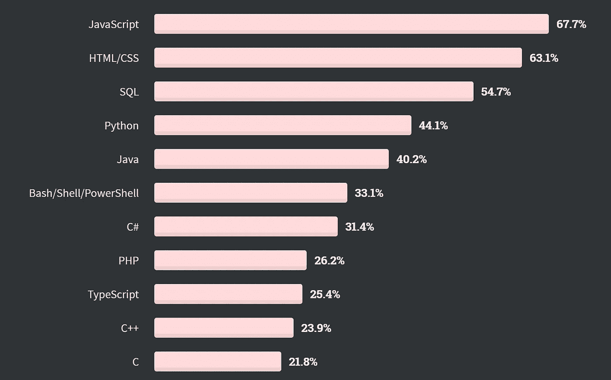
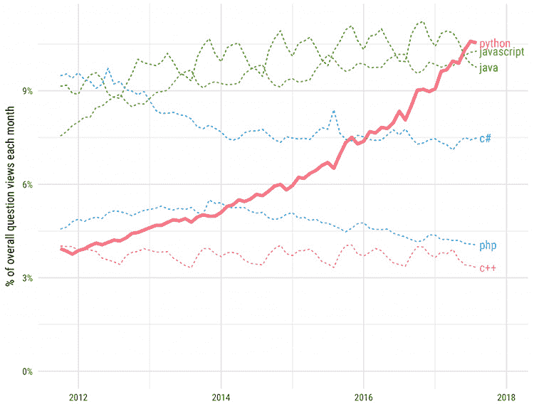

# Python 简介

> 原文：<https://towardsdatascience.com/introduction-to-python-c43e17aaa78b?source=collection_archive---------18----------------------->

## Python 是谁，是什么，为什么

所以你已经决定开始编程，并且可能已经听说 Python 是一种流行的语言。在深入研究之前，了解这门语言的内容是很重要的。在本文中，我们将带您了解什么是 Python，它可以用来做什么，您将会对 Python 的工作原理有所了解。

## 你将学到什么

1.  为了能够理解 python 如何适应编程语言的环境
2.  当你使用 python 而不是其他编程语言时
3.  你能用 Python 做什么
4.  Python 项目的潜在弱点

# python 为什么这么受欢迎？

你可能听说过 Python，以及有多少人在使用它。很难给出一个完整的答案来解释为什么有些东西如此受欢迎，但是我们可以尝试给你一个理解，我们认为 python 在过去的 10 年里已经起飞了。

首先是 python 的可读性，python 作为一门编程语言就应该是可读的。也就是说，你使用的代码不需要读者太多的努力就能理解。当你有一个捆绑了 100，000 行代码的软件时，这变得非常重要，有一些可以遵循的东西降低了想要学习它的人的门槛。

使用 python，开始使用 python 编写代码的学习曲线非常短！这使得它非常适合作为第一语言来学习。

作为一种编程语言，它是编程范式不可知的，我们的意思是有不同的编程方式，python 给了你这种灵活性。你可能听说过诸如函数式和面向目标的编程之类的术语，如果没有，不要担心！不用说，python 并不专注于你如何编程。

生产率是 Python 的另一个亮点，用其他语言如 C++和 Java 编写的程序通常要大得多(有时大 3 倍！)并需要中间步骤来运行程序。相比之下，Python 程序会立即运行。这意味着用 Python 制作原型只需要很少的时间。Python 也可以在所有操作系统上运行，所以无论你喜欢什么，你都可以开始编码。

Python 也有许多直接有用的内置函数，通常可以使编写代码的体验更加容易。这可能不是你马上想到的细节，或者在短期内有很大的影响，但是你使用一种语言越多，你就越能理解编写程序的好处和坏处。当你理解在其他语言中做同样的功能是多么困难的时候，你就会开始喜欢 python 的内置函数。

基于流行的 StackOverflow 论坛，他们的调查显示，在接受采访的 44，000 名程序员中，44.1%在他们的日常活动中使用 python。你还可以看到，在 6 年的时间里，StackOverflow 论坛上的 python 问题数量呈指数级增长，这通常是有多少人在学习这种语言的标志。



【2020 年 StackOverFlow 调查



【2012 年至 2018 年的 StackOverflow 问题数量

# Python 是什么？

现在了解了 Python 流行的原因，我们可以开始理解它是什么了。Python 语言是 Guido Van Rossum 在 1985 年到 1990 年间创造的，Guido 以 Monty Python 命名了这种语言！圭多显然是个粉丝！Python 是一种通用编程语言，它有几个独特的属性，下面将对其进行概述。

```
{ 
  name: 'Aaron'
 }
```

## 1.面向对象

python 代码中的一切都是对象，这就是所谓的编程范式。总的来说，对象是表示数据和数据间关系的一种方式。Python 是隐式基于对象的，这意味着有特定的方法来表示数据之间的关系以及如何操作这些数据。对象也是一种将程序组织成功能盒子的清晰方式，并且能够以可伸缩的方式与这些盒子进行交互。

## 2.Python 是一种解释型语言。

要知道这意味着什么，我们必须先从 python 向外扩展一下。编程语言可以分为两种不同的类型，需要编译的语言和需要解释的语言。

编译语言接受编写的代码，并要求将其转换成硬件可以使用的代码。这种转换后的代码被称为机器码，它使你的程序能够在实际运行之前被计算机硬件运行。

像 Python 这样的解释型语言逐行读取代码，并动态地评估和转换这些代码为机器代码。这种转换发生在引擎盖下，你不必去想它。因此，代码开发时间比在运行程序之前必须先将代码转换成机器可读的东西要短。

## 3.Python 是动态类型的。

这意味着对象在代码运行时保存在内存中，不像其他语言那样，在运行程序之前不需要声明使用什么数据类型。这是 C++和 Java 程序比 python 大得多的部分原因。然而，这也意味着错误信息不会出现，直到你开始运行你的程序。如果你不小心你的代码，这会导致一些麻烦！

## 4.Python 是强类型的，

这意味着它强制您使用什么类型的数据，所以您不能混合不同数据类型的操作。如果您试图这样做，Python 将抛出一个错误。另一种选择是，您必须像在其他语言中一样定义您的数据类型。这可能会大大增加您编写代码的时间。

现在你知道 python 是基于对象的，它是一种动态的、强类型的解释语言。有点拗口，但当你记住这个词汇时，你就可以开始看到其他语言的不同了。

# 你能用 Python 做什么？

了解 python 是什么以及它为什么受欢迎是很重要的，但是实际上你能用它做什么呢？！

我们提到 python 是一种通用编程语言。这里有一个不太完整的列表，列出了适合 python 的任务和一些用于创建程序的库。

1.  自动化任务，即重命名文件、更新电子表格(内置模块)
2.  网络开发([烧瓶](https://flask.palletsprojects.com/)， [django](https://www.djangoproject.com/)
3.  数据科学与数据库编程([熊猫](https://pandas.pydata.org/))
4.  机器学习( [TensorFlow](https://www.tensorflow.org/) 、 [Keras](https://keras.io/) 、 [Scikit-learn](http://scikit-learn.org/) )
5.  生物信息学( [Biopython](https://biopython.org/)
6.  网络编程
7.  机器人和硬件编程(Arduino)
8.  金融
9.  数值和科学编程( [Numpy](https://numpy.org/) ， [SciPy](https://www.scipy.org/) )

你可能会问这一切是怎么做到的？！嗯，Python 有非常丰富的支持系统。有许多程序员帮助开发了可以与 python 一起使用的模块，以完成各种不同类型的工作，从机器人学、生物信息学到人工智能。如果你对 python 能做的各种事情感兴趣，请参考这里的链接[获取 python 可用库的详细列表。](https://github.com/vinta/awesome-python)

在数据科学领域，python 得到了大量的支持，它是进行这类研究的主要编程语言。因此，如果您对数据科学领域感兴趣，那么 python 是您应该考虑学习的语言。

除了上面列出的 python 可用的库，下面列出了目前使用 python 的公司提供的少量库。这表明 python 作为一门语言是多么有效，以及为什么它值得你花时间去理解它！

# Python 的弱点

在这篇文章中，我们描绘了 python 是一种每个人都应该学习的奇妙语言。然而，它并不适用于所有场合，并且确实有一些限制。

## 1.移动开发

Python 没有强大的移动开发能力，目前也缺乏第三方库支持！两个流行的框架是 [Kivy](https://kivy.org/) 和 [Beeware](https://pybee.org/) ，但是它们目前仍然没有针对大量用户使用进行优化。Python 是消耗内存的，目前使用 python 的应用程序消耗电池的速度比用 Java 开发的移动应用程序要快得多。

记住这两点，Python 的移动应用程序开发还没有起步，但是这是一个将会随着时间而改变的领域。

## 2.Python 很慢

Python 速度慢有很多原因，但总的来说，主要是因为它的动态特性和编程范式的多样性。

不幸的是，Python 一次只运行一个操作，这被称为全局解释器锁(GIL)。大多数现代应用程序同时运行多个进程，这意味着 python 很难扩展应用程序的规模。在 python 中，全局解释器锁的概念是一个详细的主题，除了知道它的存在，你不需要知道细节。

另一个原因与语言本身的解释部分有关，它在运行时自动转换代码，这需要时间，不像编译语言。是的，对于编译语言，你必须转换代码，但是一旦代码被转换，速度会很快。

## 3.内存消耗

所有的程序都必须管理内存，也就是说我们如何在运行程序的时候存储代码来使用它？现在，因为 python 中的一切都是对象，所以用它来运行程序实际上是非常消耗资源的。每个对象都消耗内存。如果您的脚本很小并且程序不是关键任务，这可能没什么关系，但是如果您的项目雄心勃勃并且变得越来越大，它可能会在以后引起真正的问题。当您的应用程序被许多用户使用，并且应用程序的需求变得更大时，这是一个需要考虑的问题

## 3.处理错误

我们提到 python 是动态类型的，这意味着只有当我们运行程序时才会出现错误。这与编译过的程序相比，编译过的程序一旦被正确编译，就会一直运行。这种动态输入意味着如果不小心的话，一遍又一遍地做小的改动会很烦人！当您第一次开始 python 之旅时，请记住这一点。

# 你什么时候不会使用 Python

我们已经讨论了 python 的原型是多么的快速和简单，它的通用性质意味着它非常适合许多任务。

你可以想象 python 可以从性能的角度进行优化，但是如果性能是绝对关键的，Python 可能不是应该使用的语言！然而，它非常适合快速构建应用程序原型，并在用户群中进行测试，这就是它在初创企业群体中如此受重视的原因。

Python 适用于小型图形用户界面(GUI)程序，但是如果您正在开发的任何程序严重依赖于能够与 GUI 交互的需求，那么 python 可能不是您的首选语言。就此而言，在速度是绝对必要的时候，尝试创建一个基于 python 的操作系统是不明智的。

注意到上面所说的，你可以想象任何涉及硬件的事情都会被依赖，依赖 python 可能不是你最感兴趣的。

# 摘要

综上所述，Python 是一种通用编程语言，拥有巨大的第三方库支持。它可以用来自动完成任务，为人工智能研究创建神经网络。它很灵活，可读性很强，学习曲线很短，并且在学习的同时很容易开始创建真正的脚本。

它的主要缺点是性能速度，所以任务关键的程序，你可以想象，如果你计划维护大型项目，这可能不是使用的语言。

这对于原型创意和轻松启动项目非常有用，这也是为什么有很多初创公司使用 python 来启动他们的项目。

# 测试你知识的问题

解释语言和编译语言的区别是什么？

动态类型化是什么意思？

强类型是什么意思？

Python 有哪些弱点？

你什么时候会考虑使用 Python 之外的另一种语言？

# 放弃

本文首发于 CodeMD，[此处](https://codemd.co.uk/2021/03/03/whats-python-all-about/)。我们 CodeMD 热衷于将 Python 带给医疗专业人员。如果你对医疗保健和 Python 感兴趣，请加入我们。

<https://codemd.co.uk/2021/03/03/starting-your-python-journey-with-ease/>  

# 关于作者

我是一名执业医师和教育家，也是一名网站开发者。

请看[这里](http://www.coding-medic.com/)关于我在我的博客和其他帖子上关于项目的更多细节。更多技术/编码相关内容，请点击这里订阅我的简讯

我将非常感谢任何评论，或者如果你想与 python 合作或需要帮助，请联系我。如果你想和我联系，请在这里 asmith53@ed.ac.uk 或在 twitter 上联系。