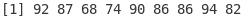
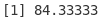
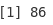
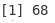
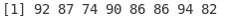
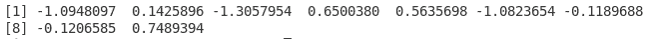
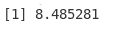
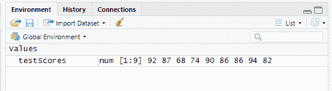
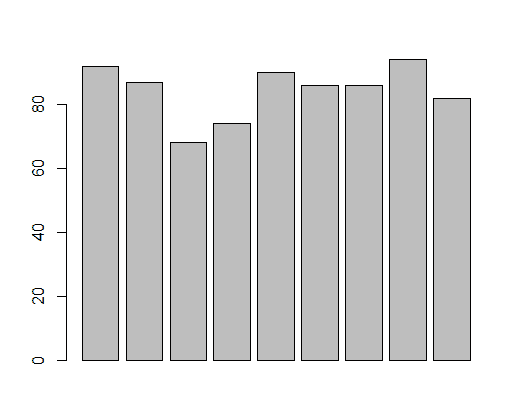

# R 简介

> 原文：<https://towardsdatascience.com/introduction-to-r-318ca6dcb56?source=collection_archive---------43----------------------->

## R 语言适合我吗？


克里斯·利维拉尼在 [Unsplash](https://unsplash.com?utm_source=medium&utm_medium=referral) 上的照片

有时，我喜欢浏览我所在地区的工作机会。它不仅有助于寻找新的机会，而且还提供了一个关于哪些技能是有前途的视角。尽早知道学习哪种语言对找工作至关重要。这就是我在大学的个人研究课程中创建了一个关于覆盆子 Pis 的 Kubernetes 集群的原因。这也是为什么我正在做更多 Kubernetes 的工作，现在转向虚拟机。如果你想了解更多关于这个项目的信息，我在 Kubernetes 上还有另外一个系列，你可以点击这里查看。

在挖掘各种工作时，我开始注意到，对于一些后端开发人员的工作，雇主希望至少有一点熟悉 r。因为雇主希望有一点熟悉，我认为这可能是一个不错的做法。不要深究，但让我们了解一下 R 的皮毛，了解它是什么，它是为谁制造的，为什么是 R，以及一些基本功能。

# R 是什么？

r 是一种为创建图形和统计计算而构建的语言。然而，R 能做的不仅仅是计算。还有 CRAN(Comprehensive R Archive Network)，它同时托管 FTP 和 web 服务器。

不仅如此，R 还可以深入机器学习。r 还可以处理数据库，连接其他语言(比如 rJava)，甚至有一个 markdown 框架。

最重要的一点是，R 是一种简单易学的语言，这也是它主要面向商业领域的原因。任何技能的用户都可以学习如何创建数据的可视化表示。

r 也是多平台的。它可以在 Unix、Windows 或 macOS 上运行。

# R 代表谁？

r 可以用于许多不同类型的用户。一个这样的用户是数据挖掘者。另一个是统计学家。但是 R 也可以被商业用户使用。虽然 PowerBI 变得越来越受欢迎，但 R 有更容易的学习曲线，也有更多的功能。特别是有了许多不同图表的功能，任何人都需要图表和数据的可视化表示。

# 为什么是 R？

如前所述，R 比许多其他数据分析工具更容易学习，同时在商业数据科学方面仍然具有广泛的能力。也提到了，R 拥有广泛的能力，不仅仅局限于分析，比如机器学习和 CRAN。

关于 r 的讨论已经够多了，是时候了解一点语法了。

# 数据的基本图形表示

为了安装运行 R 所需的组件，我首先必须通过命令行在我的 Ubuntu 16.04 服务器上安装一个软件包。这是为了确保我能够在 VS 代码中从终端运行命令。首先，我在终端上安装了 r base 核心包:

```
sudo apt-get install r-base-core
```

这是我让 R 在我的 Ubuntu 服务器上工作所需的唯一一行代码。现在来看 VS 代码。

首先，我安装了“R”、“R LSP Client”和“r-vscode-tools”扩展。

下载完扩展后，我创建了一个名为“rTutorial”的文件。r”。确保扩展名 R 是大写的。我们现在可以开始编码了。需要注意的是，对于我完成的每一段代码，因为需要执行 R 文件，所以我会在终端中使用以下命令:

```
Rscript rTutorial.R
```

这确保了 R 文件将执行并显示结果。我不会在每次运行代码时都使用这一行，因为都是一样的。

如前所述，我们今天不会深入研究 R。只是一些基本功能的简要概述。为了进行计算，首先，我们需要声明一个变量:

```
testScores <- c(92,87,58,74,90,86,86,94,82)
```

查看很像 Python，只需要一个 print 语句。

```
print(testScores)
```



测试分数输出。

第一个基本计算将是数据集的平均值。变量中可以有句点，我们将用它来描述下一个变量:

```
mean.testScores <- mean(testScores)
print(mean.testScores)
```



测试分数的平均值。

中值在语法上非常相似。我们可以简单地调用变量中的函数，然后显示输出:

```
median.testScores <- median(testScores)
print(median.testScores)
```



测试分数的中位数。

模式稍微难一点。这是因为它不仅可以计算整数/十进制值，还可以计算字符串值。因此，我们需要创建一个函数来查找唯一的模式值:

```
findMode <= function(x) {
     uniqv <- unique(x)
     uniqv[which.max(tabulate(match(x, uniqv)))]
}
```

现在，您可以返回正常通话:

```
mode.testScores <- findMode(testScores)
print(mode.testScores)
```


考试成绩模式。

R 的另一个有用的工具是能够容易地定位任何异常值。为此，只需查看箱线图版本并找到超出范围的值。当然，变量可以表示该值:

```
outVals = boxplot(testScores)$out
print(outVals)
```



考试分数的异常值。

您也可以选择简单地查看没有任何异常值的数据集:

```
testScores[ !(testScores %in% outVals) ]
```



没有异常值的数据集。

接下来可以快速完成的计算是正态分布。尽管通常需要更多的数学计算，R 可以简单地用一个函数来计算:

```
norm <- rnorm(testScores)
print(norm)
```



正态分布。

R 的另一个非常基本的用途是找到数据集的标准偏差。同样，不需要数学。r 也有一个函数来处理这个问题:

```
standDev = sd(testScores)
print(standDev)
```



标准差。

我们没有学到的一个重要功能是图形方面。这是因为目前我们使用命令行来执行代码，因为所有的 R 代码都在命令行中。r 文件。因为命令行中没有显示图形，所以我们没有显示这段代码。不过，我可以让你开始。对于基本柱状图，只需对数据集使用函数:

```
barplot(testScores)
```

当然，还有许多其他类型的图形、图表、直方图等等。一个方便的选择是使用 RStudio，它是一个有用户界面的程序。这不仅可以让你不断地查看变量，还可以查看任何想要的图形。例如，如果我打开 windows 桌面上已安装的 RStudio 版本，首先声明数据集:



RStudio 数据集。

现在我们可以使用柱状图功能:



测试分数柱状图。

图表的选项范围很广。您可以操作颜色、方向、添加标签等。现在，我们已经很好地开始了 R 学习，并学到了一些新东西。

# 结论

虽然我们没有在 R 上花太多时间，但是我们学到了很多关于它能做什么。我们了解到它主要是为统计和图形计算而构建的，并看到了它们各自的示例。我们还了解到，虽然 R 可以用于深度机器学习和数据挖掘，但它也可以成为需要数据清晰表示的业务用户的强大工具。

我希望你和我一样喜欢学习更多关于 R 的知识。下次见，干杯！

**|** *报名加入我的邮件列表* [*这里*](https://crafty-leader-2062.ck.page/8f8bcfb181) *。*

**|** *参考文献*

<https://www.r-project.org/>  <https://www.business-science.io/business/2020/12/17/six-reasons-to-use-R-for-business-2021.html>  <https://data-flair.training/blogs/why-learn-r/>    <https://www.tutorialspoint.com/r/r_mean_median_mode.htm>    <http://www.r-tutor.com/elementary-statistics/numerical-measures/standard-deviation>  

**|** *看看我最近的一些文章*

<https://medium.com/codex/a-journey-with-kubernetes-part-4-apis-19b311290a4f>  </mongodb-3f605f8533a0>  <https://medium.com/swlh/why-i-needed-to-graduate-college-with-no-debt-2bdcd37ccd4f>  <https://medium.com/python-in-plain-english/3-ways-to-handle-errors-in-fastapi-that-you-need-to-know-e1199e833039>  <https://medium.com/python-in-plain-english/speechrecognition-in-python-df4e56fecf51> 