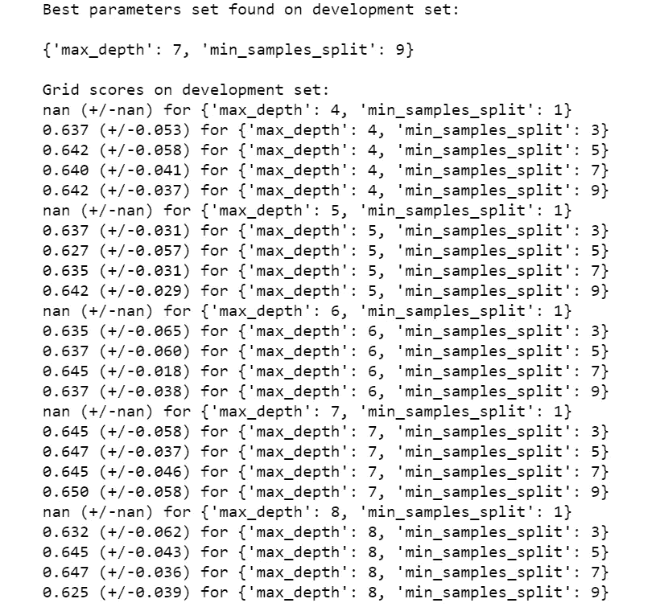

# sklearn 的随机森林分类器简介

> 原文：<https://towardsdatascience.com/introduction-to-random-forest-classifiers-9a3b8d8d3fa7?source=collection_archive---------30----------------------->

## 我们看到一个真正的“无位置”NBA 出现了吗？


照片由 [JC Gellidon](https://unsplash.com/@jcgellidon?utm_source=medium&utm_medium=referral) 在 [Unsplash](https://unsplash.com?utm_source=medium&utm_medium=referral)

诚然，我是 NBA 的超级粉丝，尽管我住在英国，所以我没有机会看很多比赛。这意味着我主要是通过跟踪统计数据和赛后集锦来解决问题。虽然我很遗憾我没有看尽可能多的比赛，但我喜欢分析，喜欢观看和跟踪统计数据，通常能够向任何不知情的受害者说出这些数据。鉴于这一点，我认为将我对篮球和分析的热爱结合起来，将它们融入我对数据科学的学习会很好。因此，我的一个项目是能够根据 NBA 球员的数据预测他们的位置，试图回答我们是否正在见证一个真正的“无位置”联盟的问题。

这方面的数据来自篮球参考网站[1]，该网站列出了 2018-2019 赛季每个 NBA 球员的数据。使用本赛季是因为 2019-2020 赛季的比赛有限，这可能会影响任何可能进行的分析。每个球员的数据包括:比赛时间、上场时间、射门次数、射门次数等。这是典型的 NBA 统计表。当然，作为任何数据分析的一部分，必须首先清理数据。我提取的数据是本赛季所有球员的总数据，并且有一些球员在赛季中期被交易时的副本。首先要做的是删除这些重复项，并将总数转换成每分钟的统计数据，这样就不会让总数的差异影响分析。当然，这可能表明效率，而不是其他任何东西(即每分钟的点数)，但它被视为性能的最佳无偏见指标。这给我留下了 22 个独立变量，从中确定位置，使用相关图，去除了几个被视为高度相关或可能使结果有偏差的变量:

```
corrMatrix = NBA.corr()
f, (ax) = plt.subplots(figsize=(15,15))
sns.heatmap(corrMatrix, annot=True, ax=ax)
plt.show()
```


作者图片

删除了“投篮命中率”、“投篮命中率”、“投篮命中率”(因为它们是 2 分和 3 分变量的集合)以及“罚球命中率”、“两分命中率”和“三分命中率”等列，因为这些也可以用罚球命中率、“2 分命中率”和“三分命中率”来表示。

之后，分析可以继续进行。这包括将数据分割成自变量和因变量，并创建一个训练测试分割，以便验证模型。

```
X = NBA.drop(columns = ["Pos"])
y = NBA.Posfrom sklearn.model_selection import train_test_splitX_train, X_test, y_train, y_test = train_test_split(X, y, test_size = 0.25, random_state=42)
```

## 随机森林分类器

随机森林分类器算法是一种集成方法，它利用决策树分类器方法，但不是只创建一个决策树，而是创建多个决策树。这样做时，它利用了数据的随机采样，因为每棵树都从随机采样的数据点中学习，这些数据点是在没有替换的情况下绘制的，并且使用了在分割节点时考虑的特征的子集。生成单个树的这种随机性最小化了过度拟合的可能性，并提高了模型的整体预测准确性。这是因为最终的预测是通过平均每个个体树的预测做出的，因此遵循了群体的表现优于个体的表现的逻辑。

这样做的优点是:

*   随机性消除了过度拟合的可能性
*   结果可以被看作是高度准确和稳健的
*   我们可以提取特征重要性，它告诉我们哪些变量对结果的贡献最大

当然，也有缺点:

*   由于增加的复杂性，该模型可能比任何决策树花费更长的时间
*   由于许多决策树的组合，与单个决策树相比，该模型可能难以解释

然而，对于这种应用，随机森林算法是一种合适的算法，因为它的复杂性，它的高度精确和稳健的能力，以及在模型中包含大量独立变量的情况下提取特征重要性的潜力。

## 应用

在使用随机森林分类器时，我们还希望对照基线测试结果，为此我们可以创建一个虚拟分类器，根据简单的规则做出决策，例如将所有球员归入最大类别，在本例中是得分后卫位置:

```
from sklearn.dummy import DummyClassifier
from sklearn.metrics import accuracy_score
from sklearn import metricsdc = DummyClassifier(strategy='most_frequent')
dc.fit(X_train,y_train) 
dc_preds = dc.predict(X_test)
print (metrics.classification_report(y_test, dc_preds))
```


作者图片

现在，我们实际上想要为我们的数据生成模型，并查看它如何比较。因此，第一件事是导入取自`sklearn.ensemble`模块的随机森林分类器算法。有各种各样的参数可以改变，这取决于我们想从决策树中得到什么，这里的和这里的给出了解释。出于我们的目的，我们仍将使用默认的基尼分割标准，将估计数设置为 100，以创建 100 个单独的决策树，将 oob_score 设置为 True，将 max_depth 设置为 3，以便我们稍后可以可视化一些单独的树:

```
#import the classifier
from sklearn.ensemble import RandomForestClassifierclf = RandomForestClassifier(n_estimators =100, oob_score=True, max_depth =3)#fit it to the training data
clf.fit(X_train, y_train)
#extract the predictions
test_pred_random_forest = clf.predict(X_test)
```

一旦拟合完成，我们就可以根据模型生成的预测生成混淆矩阵。这里，真实标签在 Y 轴上给出，而预测标签在 X 轴上给出:

```
# get the confusion matrix
confusion_matrix2 = metrics.confusion_matrix(y_test, test_pred_random_forest)#conevrt the matrix to a dataframe
matrix2_df = pd.DataFrame(confusion_matrix2)# set axis to add title and axis labels later
ax = plt.axes()
sns.set(font_scale=1.3) # for label size
plt.figure(figsize=(12,12))plot = sns.heatmap(matrix2_df, annot=True, fmt='g', ax=ax, cmap = "magma") #fmt so that numbers aren't scientific#axis labels and title
ax.set_title('Confusion Matrix - Random Forest', fontsize = 17)
ax.set_xlabel('Predicted Label', fontsize = 15)
ax.set_ylabel('True Label'     , fontsize = 15)# change tick labels from 0-4 to 1-5
labels = ("C", "PF", "PG", "SF", "SG")
ax.set_xticklabels(labels)
ax.set_yticklabels(labels)
plt.show()fig = plot.get_figure()
```


作者图片

由此我们可以看出，该模型在预测中锋和大前锋方面做得相对较好，主要问题是预测他们是彼此，小前锋经常与大前锋混淆，控球后卫和得分后卫之间也有一些混淆。当然，我们可以通过精确度、召回率、f1 分数和准确度指标对此进行量化，就像我们对虚拟分类器所做的那样:

```
print (metrics.classification_report(y_test, test_pred_random_forest))
```


作者图片

有关每个指标的描述，请参见此处的，但是我们可以看到，与虚拟分类器相比，该模型的整体准确性从 0.28 大幅提高到 0.63，这表明我们的模型优于简单的决策规则。然而，只有 63%的准确率，我们仍然错误地预测了 37 %,这表明我们的模型并不完美。因此，我们可以考虑如何提高模型的拟合度。

## 特征重要性

与单个决策树相比，随机森林分类器的好处是我们可以更仔细地检查特征的重要性。这是因为虽然单个决策树可能关注数据的特定部分，从而将高重要性与该特征相关联，即使它不一定具有高重要性，但是跨多个决策树的随机采样和特征选择允许我们识别哪些特征始终具有高重要性。通过创建多个树，我们可以使用特征的平均预测能力，以便减少在使用单个树时与特征重要性相关联的方差。

通过这种理解，我们可以删除不重要的特性并再次重新运行模型，或者简单地使用信息来理解哪些特性对模型不重要。移除特征将降低模型的复杂性，从而减少计算时间，因此权衡是从特征获得的信息与计算时间。

```
fi = pd.DataFrame({'feature': list(X.columns),
                  'importance': clf.feature_importances_}).\
                    sort_values('importance', ascending=True)plot = fi.plot.barh(x = 'feature', y = 'importance', figsize=(15,15))fig = plot.get_figure()
```


作者图片

我们的结果显示，6 个特征信息丰富，而其余 11 个特征信息不丰富。移除这些特征(如果有的话)的决定通常基于阈值(例如 1%)，或者我们可以将它们与随机特征(即随机的一组数字)进行比较，如果它们的性能比它们更差，则将被移除，因为它们仅仅代表噪声。

另一种衡量方法是排列重要性，它使用随机重排来观察每个变量如何影响模型结果。这是通过训练基线模型、记录分数(在本例中为 R 分数)、然后重新排列数据集中某个要素的值并重新运行预测来实现的。这里的特征重要性是基准分数和修改分数之间的差异，因此值越高，特征对于模型越重要:

```
from sklearn.metrics import r2_score
from sklearn.inspection import permutation_importanceresult = permutation_importance(clf, X_test, y_test, n_repeats=10,
                                random_state=42, n_jobs=2)
sorted_idx = result.importances_mean.argsort()fig, ax = plt.subplots(figsize=(15,15))
ax.boxplot(result.importances[sorted_idx].T,
           vert=False, labels=X_test.columns[sorted_idx])
ax.set_title("Permutation Importances (test set)")
fig.tight_layout()
plt.show()
```


作者图片

从这里我们可以看到与特征重要性结果相似的结果，本质上显示罚球尝试和个人犯规没有给模型增加信息。

利用这一点，我们可以创建一个决策规则来丢弃模型中的结果，如果一个特性的重要性小于 1%，我们将使用这个规则。这会影响结果:

```
#extracting unimportant features
UIF = list(fi[fi.importance <= 0.01].feature)X_trainIF = X_train.drop(columns = UIF)
X_testIF = X_test.drop(columns = UIF)clf.fit(X_trainIF, y_train)
test_pred_random_forest_IF = clf.predict(X_testIF)train_accuracy = clf.score(X_trainIF, y_train)
test_accuracy = clf.score(X_testIF, y_test)
oob_score = clf.oob_score_print(f"The training score of the random forest classifier is : {train_accuracy:.3f}")
print(f"The out of basket score is: {oob_score:.3f}")
print(f"The test score of the random forest classifier is {test_accuracy:.3f}")print (metrics.classification_report(y_test, test_pred_random_forest_IF))
```


其中，在扣分、三分百分比、罚球百分比和罚球之后，模型的准确性总体上没有变化！从而降低模型的复杂性，同时不改变模型的准确性。还有一种方法可以改进这个模型。

## 调整超参数

我们尝试改进模型的最后一种方法是调整超参数，这些参数影响模型的工作方式和随机森林的创建。为此，我们将选择`max_depth`和`min_samples_split`，它们分别影响每个决策树可以走多远，这将增加复杂性，以及在分支可以分裂之前需要多少样本。增加最大深度会增加复杂性，但可以改进我们的模型，同样地，减少最小样本分割也是如此。鉴于我们希望能够看到我们是否能够准确预测 NBA 的位置，我们将使用网格搜索进行训练的衡量标准是整体准确性:

```
from sklearn.model_selection import GridSearchCVtuned_parameters = [{'max_depth': [4,5,6,7,8], 
                     'min_samples_split': [1,3,5,7,9]}]scores = ['accuracy']for score in scores:

    print()
    print(f"Tuning hyperparameters for {score}")
    print()

    clf = GridSearchCV(
        RandomForestClassifier(), tuned_parameters,
        scoring = f'{score}'
    )
    clf.fit(X_trainIF, y_train)

    print("Best parameters set found on development set:")
    print()
    print(clf.best_params_)
    print()
    print("Grid scores on development set:")
    means = clf.cv_results_["mean_test_score"]
    stds = clf.cv_results_["std_test_score"]
    for mean, std, params in zip(means, stds, clf.cv_results_['params']):
        print(f"{mean:0.3f} (+/-{std*2:0.03f}) for {params}")
```



作者图片

结果表明，最佳参数为`max_depth` =7 和`min_samples_split` =9。将这些输入回模型会导致:

```
clf = RandomForestClassifier(n_estimators =100, oob_score=True, max_depth =6, min_samples_split = 7)clf.fit(X_trainIF, y_train)
test_pred_random_forest = clf.predict(X_testIF)print (metrics.classification_report(y_test, test_pred_random_forest))
```


作者图片

这导致精度的总体提高，但只是从 0.63 到 0.64 的小幅度提高。

因此，使用随机森林分类器，只有 0.64 的准确性表明，使用这些统计数据，我们可以在一定程度上预测位置，但是在某些位置可能会有一些重叠，即中锋和大前锋，得分后卫和得分后卫。这可能表明联盟中存在一定程度的无位置现象，但事实是，在第一个例子中创建的混淆矩阵表明没有大前锋或中锋与控卫混淆，这可能表明我们不是在一个真正的无位置联盟中，位置根本不重要。

这个结论当然也可能受到球队本身的影响，小球的兴起意味着不需要传统的中锋，比如休斯顿(尽管他们目前有自己的问题)。还可以有更准确的统计数据，如高级统计数据，可以用来通知这一点，因此可以建议每个位置仍然可以非常明确地定义，或者甚至其他方法来分类位置！分析总是可以改进的，在未来我希望用不同的方法和潜在的更多的统计数据重新做这个分析，甚至比较这些年来位置是如何变化的！

完整代码见[此处](https://github.com/PhilipDW183/NBA_positions)

[1][https://www . basketball-reference . com/联赛/NBA_2019_per_game.html](https://www.basketball-reference.com/leagues/NBA_2019_per_game.html)

</introduction-to-decision-tree-classifiers-from-scikit-learn-32cd5d23f4d> [## scikit-learn 决策树分类器简介

towardsdatascience.com](/introduction-to-decision-tree-classifiers-from-scikit-learn-32cd5d23f4d) </an-introduction-to-object-oriented-programming-for-data-scientists-879106d90d89>  </my-first-hackathon-3f6d5fbf7d91> 