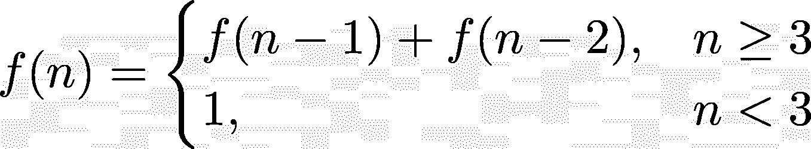
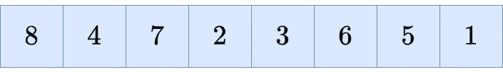
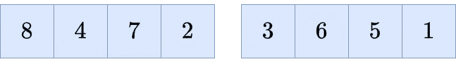
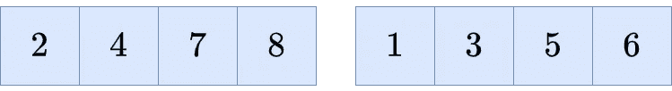
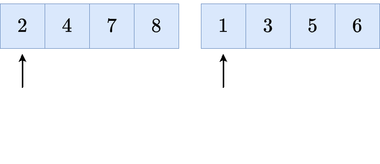
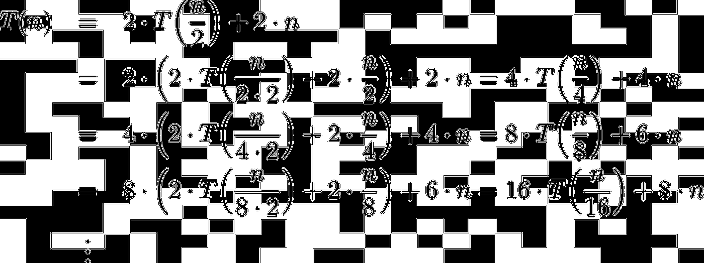
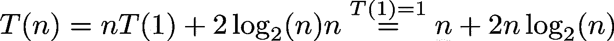

# 递归和合并排序简介

> 原文：<https://towardsdatascience.com/introduction-to-recursion-and-merge-sort-2e143b1b7615?source=collection_archive---------15----------------------->

## 了解 Python 中的递归和合并排序代码


照片由 [Mykyta Martynenko](https://unsplash.com/@cooper301?utm_source=medium&utm_medium=referral) 在 [Unsplash](https://unsplash.com?utm_source=medium&utm_medium=referral) 拍摄

递归是数学和计算机科学中的一个重要概念，有多种形式。它们的本质如下:

> 有一个对象由它自身的较小版本组成。通常有一个最小的原子对象——这是递归结束的地方。

我们对使用递归解决问题特别感兴趣。比如对数字或其他元素进行排序，即将类似
`[1, 4, 5, 2, 6, 3, 6]`的输入数组变成`[1, 2, 3, 4, 5, 6, 6]`。

这是计算机科学中的一个基本问题，许多研究人员对此进行了广泛的研究——作为数据科学家，我们应该对此感到非常高兴，因为我们一直都需要排序。仅举几个例子:

*   使用`pandas_dataframe.sort_values()`或`numpy.sort(numpy_array)`
*   构建决策树，因为排序用于为每个特征寻找最佳分割点
*   在 *k* 最近邻算法中寻找 *k* 最近邻
*   …

读完这篇文章后，你将能够

*   理解什么是递归
*   解释**合并排序**是如何工作的，它是最快最简单的排序算法之一
*   计算合并排序的运行时间

很可能你以前在很多地方见过他们。如果你足够大，也许你知道这个迷因:


艺术家未知，但图片来自 knowyourmeme.com。

或者当你第一次尝试录制屏幕时，你偶然发现了这个:


图片由作者提供。

如果你理解了这些图片，你就掌握了递归的要点。然而，让我们通过更多的数学例子来更好地感受各种形式的递归。

# 简单的例子

## 斐波那契数

作为一个例子，让我们来看一个定义众所周知的斐波那契数的递归公式:

> 1, 1, 2, 3, 5, 8, 13, 21, 34, 55, 89, 144, 233, 377, 610, …

属于这个序列的递归公式是



图片由作者提供。

如果你插上 *n* =1 或者 *n* =2，你得到 1，这是上面序列的前两个数。*n*2 后面的数字是前面两个数字的和。

您可以在这里看到递归特性，因为获得斐波那契数列的第 *n* 个数字涉及计算第( *n* -1)个和第( *n* -2)个数字。这些是*较小的*物体。对于 *n* =1 或 *n* =2，不再需要递归调用——这些是容易评估的原子对象。

## 谢尔比斯基三角

一个著名的递归形状，也被称为[分形](https://en.wikipedia.org/wiki/Fractal)，是[sierpiski 三角形](https://en.wikipedia.org/wiki/Sierpi%C5%84ski_triangle)。它由三角形组成，而三角形又由更小的三角形组成。然而，反过来描述这个过程更容易:你从一个大的等边三角形开始，把它砸成三个更小的三角形。然后你把三个小的打碎成更小的。重复，直到你累了。


图片由作者提供。

现在让我们转向递归的主要用例:**用算法解决问题**。如上所述，我们将使用排序算法 merge sort 作为工作示例。

# 合并排序

要找到一个递归算法来解决任何问题，总是问自己以下问题:

> 如果我能神奇地解决大问题中的小问题，这对我有什么帮助？我可以用这些解决方案来解决小问题，然后把它们组合起来解决大问题吗？

## 合并步骤

现在来说说排序数字:大问题是排序 *n* 个数字。应用上述问题的一种方法如下:

> 如果我能分别对前 n/2 个数字和后 n/2 个数字进行排序，我能把这些解放在一起得到一个完整的排序数组吗？

这将产生同一个问题的两个版本，其大小是原始问题的一半。我们来做一个例子。我们有以下要排序的数字:



初始序列。图片由作者提供。

现在，把它们分成大小相等的两堆:



把它分开。图片由作者提供。

如果我们*神奇地*把左半边和右半边排序:



对两个较小的数组进行排序。图片由作者提供。

我们怎样才能得到初始数组的完整排序呢？这就是我们所说的**合并步骤**，这就是 merge sort 的名字。

这个想法很简单:你将左堆(2)的第一个条目**与右堆(1)的第一个条目**进行比较。这些数字中较小的一个(1)归入结果数组。它现在只包含一个 **1** 。然后，您在**右堆**中再向右移动一步，因为您刚刚使用了那里的一个数字。****

然后，将左堆(2)的**第一个条目**与右堆(3)的**第二个条目**进行比较。这些数字中较小的一个(2)归入结果数组。现在它包含了 **1，2** 。然后，您在左边的**堆**中再向右移动一步，因为您刚刚使用了那里的一个数字。

然后，将左堆(4)的第二个条目**与右堆(3)的第二个条目**进行比较。这些数字中较小的一个(3)归入结果数组。现在包含 **1，2，3** 。然后，您在**右堆**中再向右移动一步，因为您刚刚使用了那里的一个数字。****

你自己试试吧，听起来比实际要难。既然图片胜过千言万语:



合并步骤。图片由作者提供。

## *递归步骤*

但是我们如何神奇地对两个更小的数组进行排序呢？好吧，那就用归并排序吧！😎这就是递归的美妙之处:我们对大数组应用合并排序来对数字进行排序。在这样做的时候，在较小的数组上又调用了两次合并排序，这又总共调用了四次合并排序，依此类推。我们在推卸这个问题。但是在某些时候，我们必须交付一些东西。

那么，我们什么时候能停下来？当我们必须对包含一个数字的数组进行排序时，很容易停下来。这绝对是我们可以做到的。

听起来很复杂？让我们把它变成 Python 代码。设`arr`是一个包含数字的数组。然后，我们可以编写一个简单的合并排序，如下所示:

```
def mergesort(arr):
    n = len(arr)
    if n == 1:
        return arr # sorting a single number :) easy!
    else:
        left_sorted = mergesort(arr[:n//2])
        right_sorted = mergesort(arr[n//2:])

    return merge(left_sorted, right_sorted) # have to define merge!
```

又短又甜，对吧？我们只需要编写前面提到的函数`merge`，将两个已经排序的数组混在一起。

一个简单的方法是

```
def merge(left, right):
    res = [] # store fully sorted array here
    while left and right: # both arrays are not empty
        if left[0] <= right[0]:
            res.append(left.pop(0))  # take first element
        else:                        # and put it to the result
            res.append(right.pop(0))
    res = res + left + right # left or right is empty at this point
                             # just append the rest, as it is sorted
    return res
```

这个有点难，但是它确实在做我们之前讨论过的事情，并且可以从动画中看到。只需插入`merge([1, 3, 5], [2, 4, 6])`并观看它返回`[1, 2, 3, 4, 5, 6]`！

让我们用我们的算法来看看它是否有效:

```
a = [82, 10, 89, 62, 77, 62, 63, 73, 95, 73, 74, 53, 14, 18, 41]

mergesort(a)

# Out:
# [10, 14, 18, 41, 53, 62, 62, 63, 73, 73, 74, 77, 82, 89, 95]
```

太好了！这就是你理解这个算法如何工作以及为什么工作所需要的全部。唯一的问题是这个算法实际上有多快。递归可能看起来很复杂，尤其是当你想计算运行时间的时候。我们会发现事实并非如此。

# 运行时间分析

我不会在这里正式介绍运行时分析和大 O 符号——相反，我们以脚踏实地的方式来做。我将使用单词*步骤*来描述一些简单的事情，例如

*   比较两个元素
*   向数组追加内容
*   检查数组是否为空

除了别的以外。最后，我们可以这样陈述

> 如果问题的输入大小为 n，算法需要 T(n)步来输出解。

我们要量化这个 *T* ( *n* )。

我们的未排序输入列表中有 *n* 个数字。`mergesort`中发生的情况如下:

1.  将`mergesort`应用到输入数组的左半部分(大小 *n* /2)。
2.  将`mergesort`应用到输入数组的右半部分(大小 *n* /2)。
3.  合并结果。

这直接转化为


图片由作者提供。

我们最终得到一个递归公式！看起来很复杂，但是我们会用初等数学来看如何处理它。我们唯一需要做的就是计算`merge`使用的步数。

那么，那里发生了什么？**对于每个数字，**我们

1.  比较两个数字并
2.  将一个数字转移到`result`数组中，

即每个数字 2 步。因此，`merge`所走的步数总共是 2 *n* 步。

为了使公式显式，即消除递归，让我们重复插入公式。下面的等式看起来像个怪物，但是一旦你像这样明确地写下来，模式就真的很简单了。这是我可以一直推荐的东西。



图片由作者提供。

我们可以看到递归地插入公式 k 次给我们


图片由作者提供。

对于每个 *k* 。这对我们有什么帮助？只要插上 *k* =log₂( *n* 就能见证神奇！首先，请注意 *T* (1)=1，因为如果我们输入一个大小为 1 的数组，该函数什么也不做，只是再次按原样输出它。我们得到了



图片由作者提供。

不太难，对吧？您刚刚证明了归并排序的时间复杂度大约为***n*log(*n*)**，去掉了一些常量和无关紧要的项。

上面的陈述是更一般的[主定理](https://en.wikipedia.org/wiki/Master_theorem_(analysis_of_algorithms))的一个例子。类似于我们所做的，你也可以证明这个定理，这并不困难。不要让名字欺骗了你。

# 结论

在本文中，我们已经看到了许多递归的例子，即

*   公式
*   几何形状
*   算法

在算法方面，我们已经描述了合并排序，一种更好的排序算法。这个算法甚至可以在 NumPy 中使用[，这表明合并排序不仅是一个学术上有趣的算法，也可以在实践中使用。](https://numpy.org/doc/stable/reference/generated/numpy.sort.html)

我们甚至可以证明，合并排序使用了大约 *n* log( *n* )步，这与众所周知的 [quicksort](https://en.wikipedia.org/wiki/Quicksort) 或 [heapsort](https://en.wikipedia.org/wiki/Heapsort) 的数量级相同，并且比使用大约 *n* 步的简单排序算法[插入排序](https://en.wikipedia.org/wiki/Insertion_sort)要快得多。术语 *n* log( *n* )也不是随机的:它是基于*比较的*排序算法需要**至少**才能对 *n* 元素进行排序的下界，使得归并排序成为最优排序算法。

在我让您离开之前，这里有一个警告:这个合并排序的实现有一个问题，它需要比长度为 *n* 的初始数组更多的内存，因为我们在变量`left_sorted`和`right_sorted`中存储了两个更小的排序列表。然而，有一些方法可以减轻这一点，但是它们让这个漂亮的算法变得更加漂亮，并且引入了其他问题，比如让它变得不稳定或者更慢。

尽管如此，这是一个有竞争力的，易于理解的算法，你现在甚至能够解释！*你刚刚升级了你的数据科学游戏。*

[1]卡塔杰宁，Jyrki 孙铁麟帕萨宁；朱卡·特霍拉(1996 年)。[“实用就地归并排序”](http://citeseerx.ist.psu.edu/viewdoc/download;jsessionid=89AE191C0C1380ECB57AD67E9F8B3032?doi=10.1.1.22.8523&rep=rep1&type=pdf)。*北欧计算杂志*。**3**(1):27–40。

我希望你今天学到了新的、有趣的、有用的东西。感谢阅读！

**作为最后一点，如果你**

1.  **想支持我多写点机器学习和**
2.  **无论如何都要计划得到一个中等订阅量，**

**为什么不做** [**通过这个环节**](https://dr-robert-kuebler.medium.com/membership) **？这将对我帮助很大！😊**

透明地说，给你的价格不变，但大约一半的订阅费直接归我。

非常感谢，如果你考虑支持我的话！

> *有问题就在* [*LinkedIn*](https://www.linkedin.com/in/dr-robert-k%C3%BCbler-983859150/) *上写我！*