# 使用 PyCaret 介绍 Python 中的回归

> 原文：<https://towardsdatascience.com/introduction-to-regression-in-python-with-pycaret-d6150b540fc4?source=collection_archive---------0----------------------->


卢克·切瑟在 [Unsplash](https://unsplash.com?utm_source=medium&utm_medium=referral) 上的照片

# 1.介绍

[PyCaret](https://www.pycaret.org/) 是一个用 Python 编写的开源、低代码的机器学习库，可以自动化机器学习工作流。这是一个端到端的机器学习和模型管理工具，可以成倍地加快实验周期，提高您的工作效率。

与其他开源机器学习库相比，PyCaret 是一个替代的低代码库，可以用来用几行代码替换数百行代码。这使得实验快速有效。PyCaret 本质上是几个机器学习库和框架的 Python 包装器，比如 scikit-learn、XGBoost、LightGBM、CatBoost、spaCy、Optuna、Hyperopt、Ray 等等。

PyCaret 的设计和简单性受到了公民数据科学家这一新兴角色的启发，这是 Gartner 首先使用的术语。公民数据科学家是超级用户，他们可以执行简单和中等复杂的分析任务，这些任务在以前需要更多的技术专业知识。

想了解更多关于 PyCaret 的信息，可以查看官方[网站](https://www.pycaret.org/)或者 [GitHub](https://www.github.com/pycaret/pycaret) 。

# 2.教程目标

在本教程中，我们将学习:

*   **获取数据:**如何从 PyCaret 资源库导入数据。
*   **设置环境:**如何在 PyCaret 中设置回归实验，开始构建回归模型。
*   **创建模型:**如何创建模型、执行交叉验证和评估回归指标。
*   **调整模型:**如何自动调整回归模型的超参数。
*   **图模型:**如何使用各种图分析模型性能。
*   **预测模型:**如何对新的/看不见的数据进行预测。
*   **保存/加载模型:**如何保存/加载模型以备将来使用。

# 3.正在安装 PyCaret

安装很容易，只需几分钟。PyCaret 从 pip 的默认安装只安装在 [requirements.txt](https://github.com/pycaret/pycaret/blob/master/requirements.txt) 文件中列出的硬依赖项。

```
pip install pycaret
```

要安装完整版:

```
pip install pycaret[full]
```

# 4.什么是回归？

回归分析是一组统计过程，用于估计因变量(通常称为“结果变量”或“目标变量”)与一个或多个自变量(通常称为“特征变量”、“预测变量”或“协变量”)之间的关系。机器学习中回归的目标是预测连续值，如销售额、数量、温度等。

[**了解更多回归**](https://hbr.org/2015/11/a-refresher-on-regression-analysis)

# 5.PyCaret 中的回归模块概述

[PyCaret 的回归模块](https://pycaret.readthedocs.io/en/latest/api/regression.html) ( `pycaret.regression`)是一个受监督的机器学习模块，用于使用各种技术和算法预测连续值/结果。回归可用于预测值/结果，如销售额、售出单位、温度或任何连续的数字。

PyCaret 的回归模块有超过 25 个算法和 10 个图来分析模型的性能。无论是超参数调整、集成，还是堆叠等高级技术，PyCaret 的回归模块都具备。

# 6.教程的数据集

在本教程中，我们将使用 PyCaret 的数据集存储库中的数据集。该数据包含 6000 条用于训练的记录。每列的简短描述如下:

*   **ID:** 唯一标识每个观察(菱形)
*   **克拉重量:**钻石的重量，单位为公制克拉。一克拉等于 0.2 克，大致相当于一枚回形针的重量
*   **切工:**五个数值之一，按以下合意性顺序指示钻石的切工(签名-理想、理想、非常好、良好、一般)
*   **颜色:**六个数值中的一个，表示钻石的颜色，顺序如下(D、E、F——无色，G、H、I——接近无色)
*   **净度:**表示钻石净度的七个值之一，按以下顺序排列(F——无瑕疵，IF——内部无瑕疵，VVS1 或 vvs 2——非常、非常轻微，或 VS1 或 VS2——非常轻微，SI1——轻微)
*   **抛光度:**表示钻石抛光度的四个数值之一(ID —理想、EX —优秀、VG —非常好、G —良好)
*   **对称性:**表示钻石对称性的四个数值之一(ID —理想，EX —优秀，VG —非常好，G —良好)
*   **报告:**两个值之一“AGSL”或“GIA”表示哪个分级机构报告了钻石质量
*   **价格:**钻石估价的美元金额`Target Column`

```
from pycaret.datasets import get_data
dataset = get_data('diamond')
```

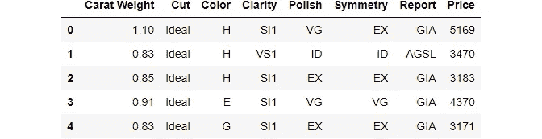

```
#check the shape of data
dataset.shape(6000, 8)
```

为了演示对看不见的数据使用`predict_model`函数，从原始数据集中保留了 600 条记录的样本用于预测。这不应与训练/测试分割相混淆，因为这种特定的分割是为了模拟真实场景而执行的。另一种思考方式是，在进行这个机器学习实验的时候，这 600 条记录是不可用的。

```
data = dataset.sample(frac=0.9, random_state=786)
data_unseen = dataset.drop(data.index)

data.reset_index(drop=True, inplace=True)
data_unseen.reset_index(drop=True, inplace=True)

print('Data for Modeling: ' + str(data.shape))
print('Unseen Data For Predictions: ' + str(data_unseen.shape))**>>> Data for Modeling: (5400, 8)
>>> Unseen Data For Predictions: (600, 8)**
```

# 7.在 PyCaret 中设置环境

`setup`函数在 pycaret 中初始化环境，并创建转换管道，为建模和部署准备数据。在 pycaret 中执行任何其他函数之前，必须调用`setup`。它有两个强制参数:一个 pandas dataframe 和目标列的名称。所有其他参数都是可选的，用于定制预处理管道(我们将在后面的教程中看到)。

当执行`setup`时，PyCaret 的推理算法将根据某些属性自动推断所有特征的数据类型。应该可以正确推断出数据类型，但情况并非总是如此。考虑到这一点，PyCaret 在执行`setup`函数后显示一个包含特征及其推断数据类型的表格。如果所有数据类型都被正确识别，可按下`enter`继续，或按下`quit`结束实验。

确保数据类型正确在 PyCaret 中非常重要，因为它会自动执行多个特定于类型的预处理任务，这些任务对于机器学习模型来说是必不可少的。

或者，您也可以使用`setup`中的`numeric_features`和`categorical_features`参数来预定义数据类型。

```
from pycaret.regression import *
s = setup(data = data, target = 'Price', session_id=123)
```

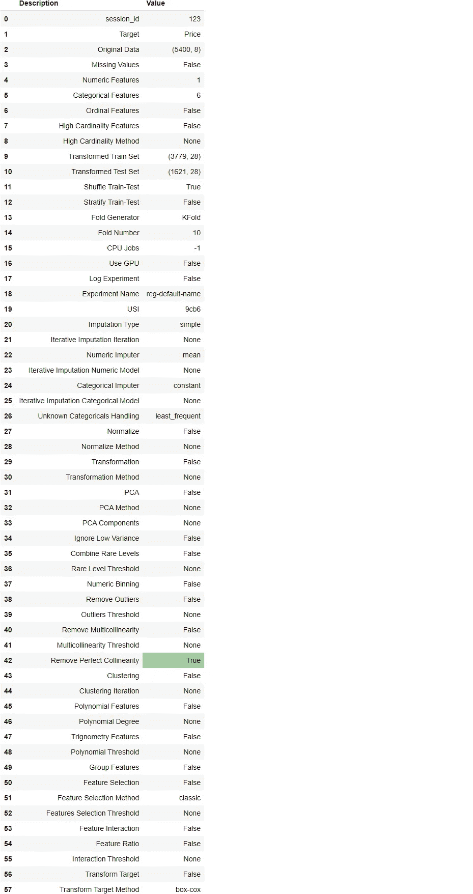

成功执行设置后，它会显示包含几条重要信息的信息网格。大部分信息与执行`setup`时构建的预处理流水线有关。这些特性的大部分超出了本教程的范围。但是，在此阶段需要注意的一些重要事项包括:

*   **session_id:** 一个伪随机数，作为种子分布在所有函数中，以便以后再现。如果没有通过`session_id`，则自动生成一个随机数，分配给所有功能。在本实验中，为了以后的再现性，将`session_id`设置为`123`。
*   **原始数据:**显示数据集的原始形状。对于这个实验，(5400，8)意味着包括目标列在内的 5400 个样本和 8 个特征。
*   **缺失值:**当原始数据中存在缺失值时，显示为真。对于这个实验，数据集中没有缺失值。
*   **数字特征:**推断为数字的特征数量。在该数据集中，8 个要素中有 1 个被推断为数值型。
*   **分类特征:**推断为分类的特征数量。在该数据集中，8 个特征中有 6 个被推断为分类特征。
*   **转换后的训练集:**显示转换后的训练集的形状。注意，对于转换后的训练集,( 5400，8)的原始形状被转换为(3779，28)。由于分类编码，特征的数量从 8 个增加到 28 个
*   **转换后的测试集:**显示转换后的测试/保持集的形状。在测试/保留组中有 1621 个样本。该分割基于默认值 70/30，可使用`setup`中的`train_size` 参数进行更改。

请注意，执行建模所必需的一些任务是如何自动处理的，例如缺失值插补(在这种情况下，训练数据中没有缺失值，但我们仍然需要用于未知数据的插补器)、分类编码等。`setup`中的大多数参数是可选的，用于定制预处理流水线。这些参数超出了本教程的范围，但是当您进入中级和专家级别时，我们将更加详细地介绍它们。

# 8.比较所有模型

一旦设置完成，比较所有模型以评估性能是建模的推荐起点(除非您确切地知道您需要哪种模型，而事实往往并非如此)。该函数训练模型库中的所有模型，并使用 k-fold 交叉验证对它们进行评分以进行度量评估。输出打印一个评分网格，显示平均平均平均误差、平均均方误差、RMSE、R2、均方根误差和 MAPE(默认为 10)以及每个模型花费的训练时间。

```
best = compare_models()
```

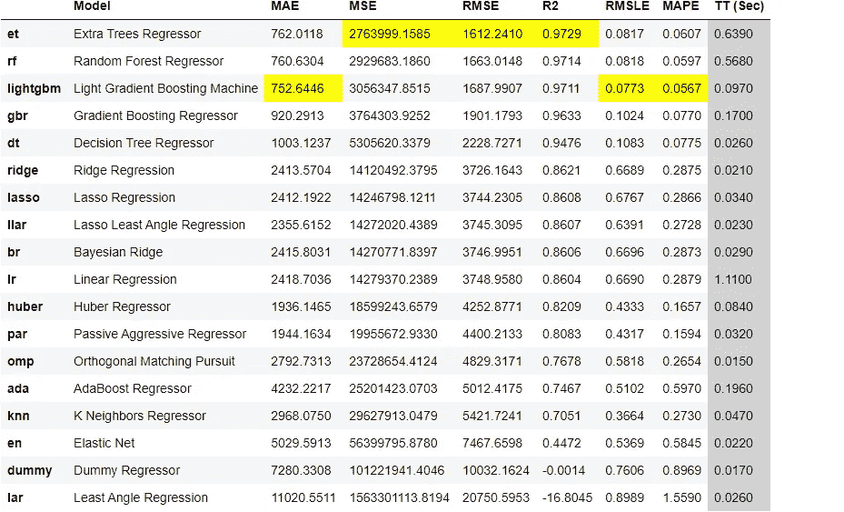

一行代码，我们已经使用交叉验证训练和评估了 20 多个模型。上面打印的评分网格突出显示了最高绩效指标，仅供比较之用。默认情况下，网格使用`R2`(从高到低)排序，这可以通过传递`sort`参数来改变。例如，`compare_models(sort = 'RMSLE')`将按照 RMSLE 对网格进行排序(从低到高，因为越低越好)。

如果您想将折叠参数从默认值`10`更改为不同的值，那么您可以使用`fold`参数。例如`compare_models(fold = 5)`将对所有模型进行五重交叉验证比较。减少折叠次数将改善训练时间。

默认情况下，`compare_models`根据默认的排序顺序返回性能最好的模型，但是也可以通过使用`n_select`参数返回前 N 个模型的列表。

# 9.创建模型

`create_model`是 PyCaret 中粒度最细的函数，通常是大多数 PyCaret 功能的基础。顾名思义，该函数使用交叉验证来训练和评估模型，交叉验证可以用`fold`参数来设置。输出打印出一个得分网格，按折叠显示 MAE、MSE、RMSE、R2、RMSLE 和 MAPE。

对于本教程的剩余部分，我们将使用下面的模型作为我们的候选模型。这些选择仅用于说明目的，并不意味着它们是此类数据的最佳选择或理想选择。

*   AdaBoost 回归器(“ada”)
*   光梯度推进机
*   决策树(“dt”)

PyCaret 的模型库中有 25 个可用的回归变量。要查看所有回归变量的完整列表，请检查 docstring 或使用`models`函数查看库。

```
models()
```

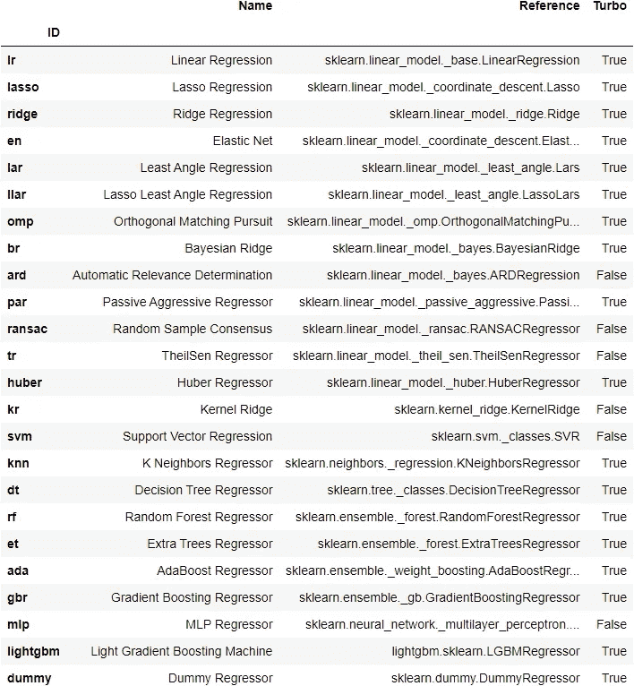

## 9.1 AdaBoost 回归器

```
ada = create_model('ada')
```

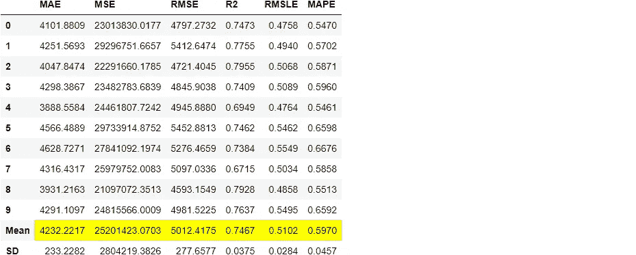

```
print(ada)**>>> OUTPUT** AdaBoostRegressor(base_estimator=None, learning_rate=1.0, loss='linear', n_estimators=50, random_state=123)
```

## 9.2 光梯度推进机

```
lightgbm = create_model('lightgbm')
```

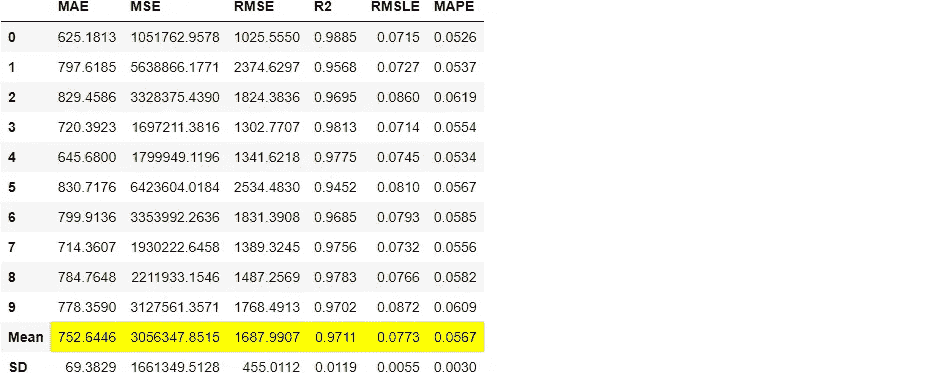

## 9.3 决策树

```
dt = create_model('dt')
```

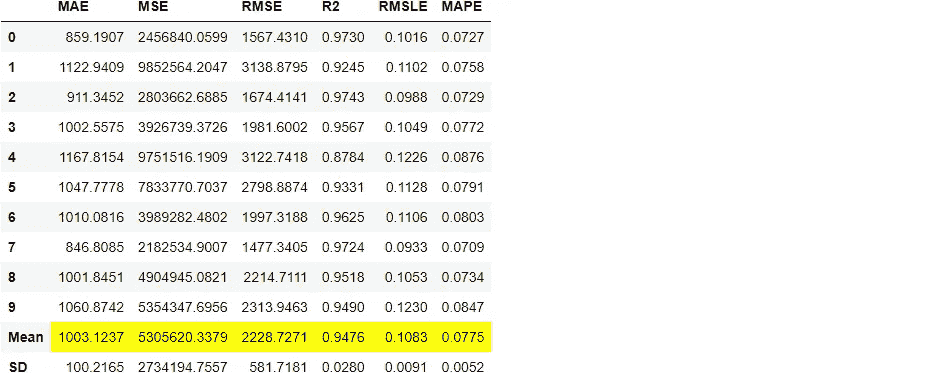

请注意，所有型号的平均分数与`compare_models`中打印的分数相匹配。这是因为打印在`compare_models`分数网格中的指标是所有 CV 折叠的平均分数。与`compare_models`类似，如果您想将折叠参数从默认值 10 更改为不同的值，那么您可以使用`create_model`功能中的`fold`参数。例如:`create_model('dt', fold = 5)`使用五重交叉验证创建决策树。

# 10.调整模型

当使用`create_model`功能创建模型时，它使用默认的超参数来训练模型。为了调整超参数，使用了`tune_model`功能。该功能在预定义的搜索空间中使用`RandomGridSearch`自动调整模型的超参数。输出打印出一个得分网格，按折叠显示 MAE、MSE、RMSE、R2、RMSLE 和 MAPE。要使用自定义搜索网格，您可以在`tune_model`函数中传递`custom_grid`参数。

## 10.1 AdaBoost 回归器

```
tuned_ada = tune_model(ada)
```


```
print(tuned_ada)**>>> OUTPUT** AdaBoostRegressor(base_estimator=None, learning_rate=0.05, loss='linear',n_estimators=90, random_state=123)
```

## 10.2 光梯度推进机

```
import numpy as np
lgbm_params = {'num_leaves': np.arange(10,200,10),
                        'max_depth': [int(x) for x in np.linspace(10, 110, num = 11)],
                        'learning_rate': np.arange(0.1,1,0.1)
                        }tuned_lightgbm = tune_model(lightgbm, custom_grid = lgbm_params)
```

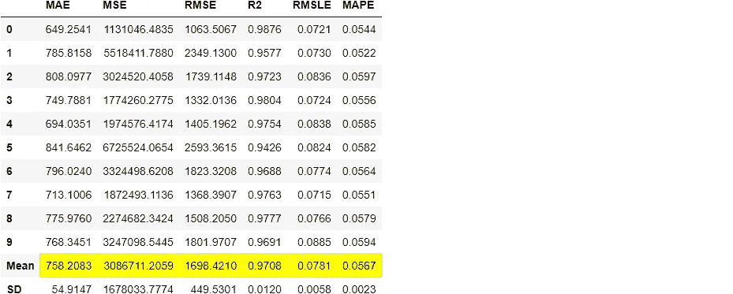

```
print(tuned_lightgbm)**>>> OUTPUT**LGBMRegressor(boosting_type='gbdt', class_weight=None, colsample_bytree=1.0,
              importance_type='split', learning_rate=0.1, max_depth=60,
              min_child_samples=20, min_child_weight=0.001, min_split_gain=0.0,
              n_estimators=100, n_jobs=-1, num_leaves=120, objective=None,
              random_state=123, reg_alpha=0.0, reg_lambda=0.0, silent=True,
              subsample=1.0, subsample_for_bin=200000, subsample_freq=0)
```

## 10.3 决策树

```
tuned_dt = tune_model(dt)
```


默认情况下，`tune_model`会优化`R2`，但这可以使用`optimize`参数进行更改。例如，`tune_model(dt, optimize = 'MAE')`将搜索导致最低`MAE`而不是最高`R2`的决策树回归的超参数。在本例中，我们使用默认指标`R2`只是为了简单起见。选择正确的度量来评估回归变量的方法超出了本教程的范围，但是如果您想了解更多，您可以 [**单击此处**](https://www.dataquest.io/blog/understanding-regression-error-metrics/) 了解回归误差度量。

在最终确定生产的最佳模型时，度量并不是您应该考虑的唯一标准。要考虑的其他因素包括训练时间、k 倍的标准偏差等。现在，让我们向前看，把存储在`tuned_lightgbm`变量中的调整后的光梯度增强机器作为本教程剩余部分的最佳模型。

# 11.绘制模型

在模型最终确定之前，`plot_model`函数可用于分析不同方面的性能，如残差图、预测误差、特征重要性等。此函数接受一个经过训练的模型对象，并基于测试/保留集返回一个图。

有超过 10 个地块可用，请参见`plot_model`文档中的可用地块列表。

## 11.1 残差图

```
plot_model(tuned_lightgbm)
```

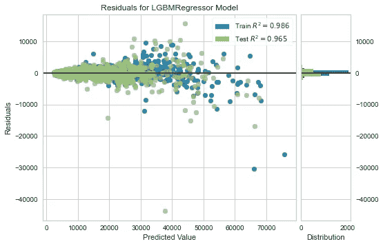

## 11.2 预测误差图

```
plot_model(tuned_lightgbm, plot = 'error')
```

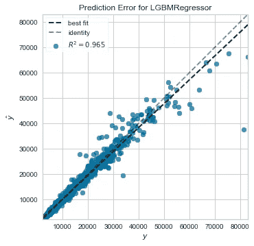

## 11.3 特征重要性图

```
plot_model(tuned_lightgbm, plot='feature')
```

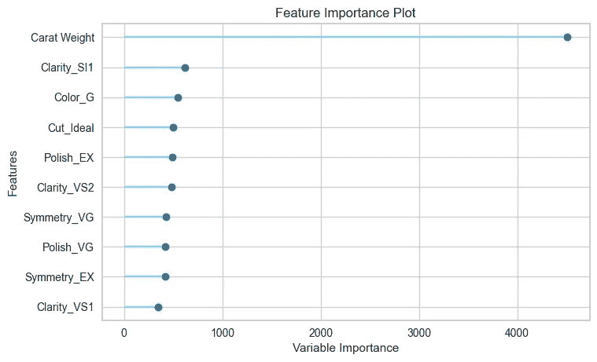

*分析模型性能的另一种*方法是使用`evaluate_model`功能，该功能显示给定模型所有可用图的用户界面。它在内部使用`plot_model`功能。

```
evaluate_model(tuned_lightgbm)
```

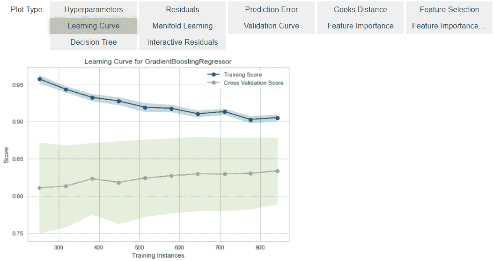

# 12.根据测试/保留样本进行预测

在最终确定模型之前，建议通过预测测试/坚持集和审查评估指标来执行最后的检查。如果您查看上面第 6 节中的信息网格，您将看到 30% (1621 个样本)的数据被分离出来作为测试/保留样本。我们上面看到的所有评估指标都是仅基于训练集(70%)的交叉验证结果。现在，使用我们存储在`tuned_lightgbm`中的最终训练模型，我们将预测拒不接受的样本并评估指标，以查看它们是否与 CV 结果有实质性的不同。

```
predict_model(tuned_lightgbm);
```

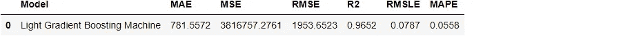

与在`tuned_lightgbm` CV 结果(见上文第 10.2 节)上获得的`**0.9708**`相比，测试/保持装置上的 R2 为`**0.9652**`。这不是一个显著的差异。如果测试/保持和 CV 结果之间存在较大差异，则这通常表明过度拟合，但也可能是由于其他几个因素，需要进一步调查。在这种情况下，我们将继续最终确定模型，并对看不见的数据进行预测(我们在开始时已经分离出来的 10%的数据，从未向 PyCaret 公开)。

# 13.最终确定用于部署的模型

模型定型是实验的最后一步。PyCaret 中的机器学习工作流从`setup`开始，然后使用`compare_models`比较所有模型，并列出几个候选模型(基于感兴趣的度量)，以执行几种建模技术，如超参数调整、集成、堆叠等。这一工作流程最终将引导您找到用于对新的和未知的数据进行预测的最佳模型。

`finalize_model`函数将模型拟合到完整的数据集上，包括测试/保留样本(本例中为 30%)。此函数的目的是在将模型部署到生产中之前，在完整的数据集上训练模型。

```
final_lightgbm = finalize_model(tuned_lightgbm)print(final_lightgbm)**>>> OUTPUT**LGBMRegressor(boosting_type='gbdt', class_weight=None, colsample_bytree=1.0,
              importance_type='split', learning_rate=0.1, max_depth=60,
              min_child_samples=20, min_child_weight=0.001, min_split_gain=0.0,
              n_estimators=100, n_jobs=-1, num_leaves=120, objective=None,
              random_state=123, reg_alpha=0.0, reg_lambda=0.0, silent=True,
              subsample=1.0, subsample_for_bin=200000, subsample_freq=0)
```

警告:最后一个警告。使用`finalize_model`最终确定模型后，包括测试/拒绝集在内的整个数据集将用于训练。因此，如果在使用`finalize_model`后，该模型用于对拒绝集进行预测，则打印的信息网格将会产生误导，因为您试图对用于建模的相同数据进行预测。

为了证明这一点，我们将使用`predict_model`下的`final_lightgbm`来比较信息网格和上面第 12 节中的信息网格。

```
predict_model(final_lightgbm);
```


请注意，`final_lightgbm`中的 R2 是如何从`**0.9652**`增加到`**0.9891**`的，尽管型号是相同的。这是因为`final_lightgbm`变量是在包括测试/拒绝集的完整数据集上训练的。

# 14.根据看不见的数据预测

`predict_model`函数用于预测未知/新数据集。与上一节唯一不同的是，这一次我们将传递`data_unseen`参数。`data_unseen`是在本教程开始时创建的变量，包含原始数据集的 10% (600 个样本)，该数据集从未暴露给 PyCaret。(参见第 5 节的解释)

```
unseen_predictions = predict_model(final_lightgbm, data=data_unseen)
unseen_predictions.head()
```

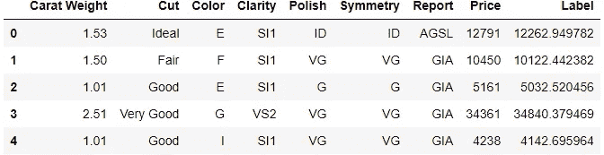

`Label`列被添加到`data_unseen`集合中。标签是使用`final_lightgbm`模型的预测值。如果您想要对预测进行舍入，您可以使用`predict_model`中的`round`参数。您还可以检查这方面的指标，因为您有一个实际的目标列`Price`可用。为此，我们将使用`pycaret.utils`模块。

```
from pycaret.utils import check_metric
check_metric(unseen_predictions.Price, unseen_predictions.Label, 'R2')**>>> OUTPUT** 0.9779
```

# 15.保存模型

我们现在已经完成了实验，最终确定了现在存储在`final_lightgbm`变量中的`tuned_lightgbm`模型。我们还使用了存储在`final_lightgbm`的模型来预测`data_unseen`。这使我们的实验接近尾声，但仍有一个问题要问:当你有更多的新数据要预测时，会发生什么？你必须再次经历整个实验吗？答案是否定的，PyCaret 的内置函数`save_model`允许您保存模型和整个转换管道以备后用。

```
save_model(final_lightgbm,'Final LightGBM Model 25Nov2020')Transformation Pipeline and Model Successfully Saved

**>>> OUTPUT**
(Pipeline(memory=None,
          steps=[('dtypes',
                  DataTypes_Auto_infer(categorical_features=[],
                                       display_types=True, features_todrop=[],
                                       id_columns=[], ml_usecase='regression',
                                       numerical_features=[], target='Price',
                                       time_features=[])),
                 ('imputer',
                  Simple_Imputer(categorical_strategy='not_available',
                                 fill_value_categorical=None,
                                 fill_value_numerical=None,
                                 numeric_strategy='...
                  LGBMRegressor(boosting_type='gbdt', class_weight=None,
                                colsample_bytree=1.0, importance_type='split',
                                learning_rate=0.1, max_depth=60,
                                min_child_samples=20, min_child_weight=0.001,
                                min_split_gain=0.0, n_estimators=100, n_jobs=-1,
                                num_leaves=120, objective=None, random_state=123,
                                reg_alpha=0.0, reg_lambda=0.0, silent=True,
                                subsample=1.0, subsample_for_bin=200000,
                                subsample_freq=0)]],
          verbose=False),
 'Final LightGBM Model 25Nov2020.pkl')
```

# 16.加载保存的模型

为了将来在相同或不同的环境中加载已保存的模型，我们将使用 PyCaret 的`load_model`函数，然后轻松地将已保存的模型应用于新的未知数据进行预测。

```
saved_final_lightgbm = load_model('Final LightGBM Model 25Nov2020')Transformation Pipeline and Model Successfully Loaded
```

一旦模型被加载到环境中，您可以使用相同的`predict_model`函数简单地使用它来预测任何新数据。下面我们应用了加载模型来预测我们在上面第 13 节中使用的相同的`data_unseen`。

```
new_prediction = predict_model(saved_final_lightgbm, data=data_unseen)new_prediction.head()
```


注意`unseen_predictions`和`new_prediction`的结果是相同的。

```
from pycaret.utils import check_metric
check_metric(new_prediction.Price, new_prediction.Label, 'R2')0.9779
```

# 17.总结/后续步骤？

本教程涵盖了从数据摄取、预处理、训练模型、超参数调整、预测和保存模型以备后用的整个机器学习管道。我们已经在不到 10 个命令中完成了所有这些步骤，这些命令是自然构建的，记忆起来非常直观，例如`create_model()`、`tune_model()`、`compare_models()`。在没有 PyCaret 的情况下，重新创建整个实验在大多数库中需要 100 多行代码。

我们只讲述了`pycaret.regression`的基础知识。在未来的教程中，我们将更深入地研究高级预处理、集成、广义堆叠和其他技术，这些技术允许您完全定制您的机器学习管道，并且是任何数据科学家都必须知道的。

感谢您阅读[🙏](https://emojipedia.org/folded-hands/)

# 重要链接

⭐ [教程](https://github.com/pycaret/pycaret/tree/master/tutorials)py caret 新手？查看我们的官方笔记本！
📋[社区创建的示例笔记本](https://github.com/pycaret/pycaret/tree/master/examples)。
📙[博客](https://github.com/pycaret/pycaret/tree/master/resources)投稿人的教程和文章。
📚[文档](https://pycaret.readthedocs.io/en/latest/index.html)py caret 的详细 API 文档
📺[视频教程](https://www.youtube.com/channel/UCxA1YTYJ9BEeo50lxyI_B3g)我们的视频教程来自各种赛事。
📢[讨论](https://github.com/pycaret/pycaret/discussions)有疑问？与社区和贡献者互动。
🛠️ [变更日志](https://github.com/pycaret/pycaret/blob/master/CHANGELOG.md)变更和版本历史。
🌳[路线图](https://github.com/pycaret/pycaret/issues/1756) PyCaret 的软件和社区发展计划。

# 作者:

我写的是 PyCaret 及其在现实世界中的用例，如果你想自动得到通知，你可以在[媒体](https://medium.com/@moez-62905)、 [LinkedIn](https://www.linkedin.com/in/profile-moez/) 和 [Twitter](https://twitter.com/moezpycaretorg1) 上关注我。