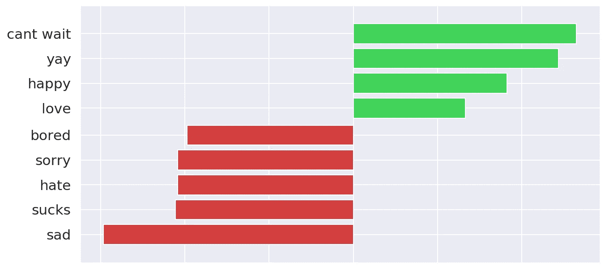
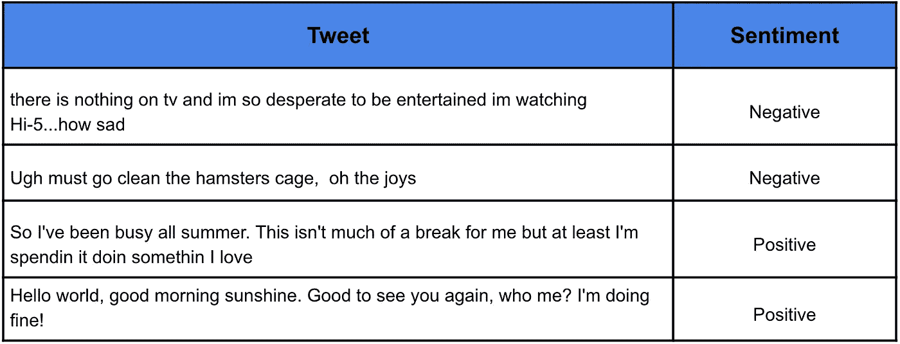
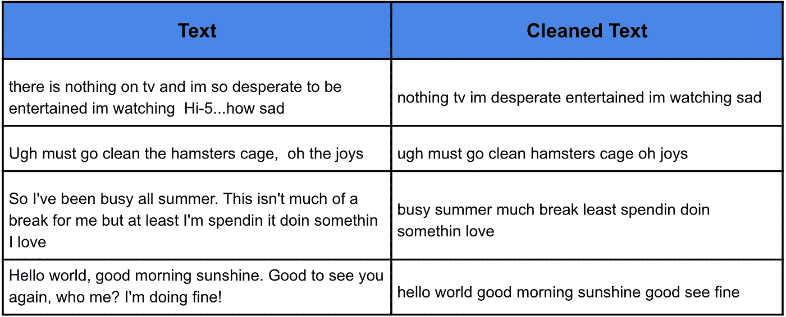
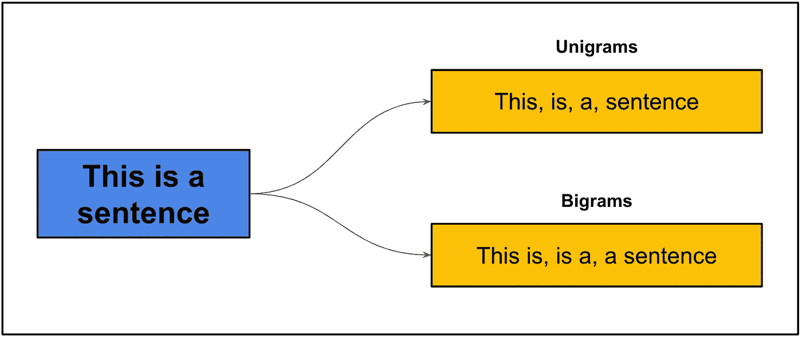
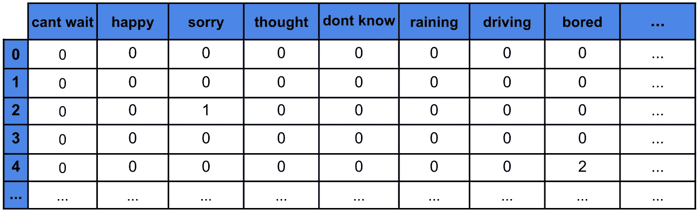
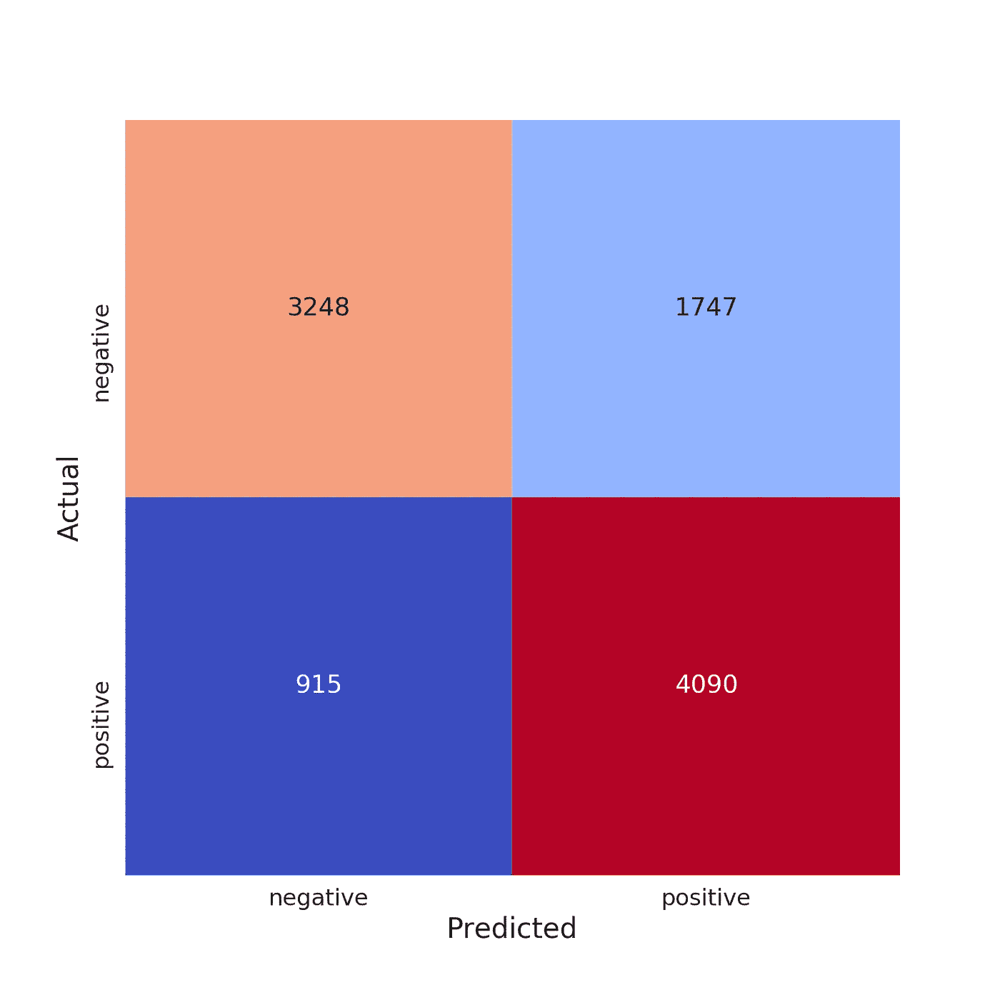
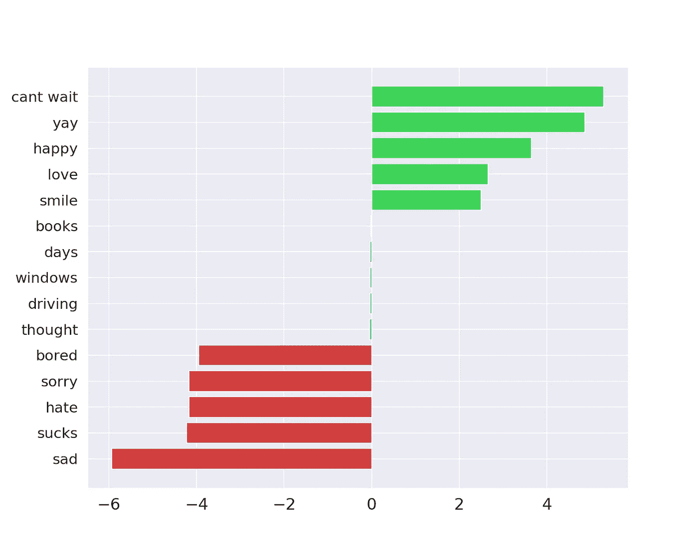

# 情感分析简介

> 原文：<https://towardsdatascience.com/introduction-to-sentiment-analysis-f623f7d40bfa?source=collection_archive---------11----------------------->

## [入门](https://towardsdatascience.com/tagged/getting-started)

## 用 Python 创建您的第一个情感分析模型

来源:flaticon(参见许可证详情)

BTS 的《炸药》有 11，768，848 条评论，是 YouTube 上评论最多的视频。假设一个 BTS 成员想知道这些听众对这首歌的感受。每秒阅读一条评论，仍然要花费他 4 个多月的时间。幸运的是，使用机器学习，他可以自动将每个评论标记为正面或负面。这就是所谓的情感分析。同样，通过在线评论、调查反馈和社交媒体帖子，企业可以获得大量的客户反馈。情感分析对于分析和理解这些数据变得至关重要。

在本文中，我们将介绍使用 Python 构建情感分析模型的过程。具体来说，我们将使用 SVM 创建一个单词袋模型。通过解释这个模型，我们也理解了它是如何工作的。在此过程中，您将学习文本处理的基础知识。我们会检查关键的代码片段，你可以在 [GitHub](https://github.com/conorosully/medium-articles) 上找到完整的项目。在我们深入所有这些之前，让我们先解释一下什么是情感分析。

# 什么是情感分析？

情绪是某人用语言表达的想法或感觉。记住这一点，情感分析是预测/提取这些想法或感觉的过程。我们想知道一篇文章的情绪是积极的、消极的还是中性的。我们所说的积极/消极情绪的确切含义取决于我们试图解决的问题。

对于 BTS 的例子，我们试图预测听众的意见。积极的情绪意味着听众喜欢这首歌。我们可以使用情绪分析来标记我们平台上潜在的仇恨言论。在这种情况下，负面情绪意味着文本包含种族主义/性别歧视的观点。其他一些例子包括预测讽刺/挖苦，甚至一个人的意图(例如，他们是否打算购买产品)。

# 用 Python 进行情感分析

因此，有许多类型的情感分析模型。做情感分析也有很多方法。我们将集中应用这些方法中的一种。那就是用 SVM 创造一个单词袋模型。让我们从帮助我们做到这一点的 Python 包开始。

## 包装

在第 2–5 行，我们有一些标准的包，如 Pandas/NumPy 来处理我们的数据，Matplotlib/Seaborn 来可视化它。对于建模，我们使用来自 sci-kit learn 的 svm 包(第 7 行)。我们还使用一些度量包(第 8 行)来度量我们模型的性能。最后一组包用于文本处理。它们将帮助我们清理文本数据并创建模型特征。

## 资料组

为了训练我们的情感分析模型，我们使用了来自[sensition 140](https://www.kaggle.com/kazanova/sentiment140)数据集的推文样本。该数据集包含 160 万条被分类为正面或负面情绪的推文。您可以在表 1 中看到一些例子。

表 1:推文示例

使用下面的代码，我们加载整个数据集。1，600，000 行是一个很大的数据量，尤其是考虑到我们必须清理文本并从中创建要素。因此，为了让事情更容易管理，在第 9 行，我们随机抽取了 50，000 条推文。

## 文本清理

下一步是清理文本。我们这样做是为了删除文本中不重要的部分，并希望使我们的模型更加准确。具体来说，我们将使我们的文本小写，并删除标点符号。我们还将从文本中删除非常常见的词，即停用词。

为此，我们创建了下面的函数，它获取一段文本，执行上述清理并返回清理后的文本。在第 18 行，我们将这个函数应用于数据集中的每条 tweet。我们可以在表 2 中看到这个函数如何清理文本的一些例子。

注意所有清理过的 tweets 都是小写的，没有标点符号。第一条推文中的词语“有”、“是”、“关于”、“所以”、“要”、“是”和“如何”都被删除了。这些都是停用词的例子。我们预计这些词在正面和负面的推文中都会出现。换句话说，他们不会告诉我们任何关于一条推文的情绪。所以，去掉它们，我们就有希望留下传达情感的词语。

表 2:干净的 tweet 示例

接下来，思考文本清理将如何影响你的模型是很重要的。对于某些问题，停用词和标点符号可能很重要。比如生气的客户可能更容易用感叹号！！！如果你不确定，你可以把文本清理当作一个超参数。您可以使用停用词和非停用词来训练模型，并查看对准确性的影响。

## 特征工程(词汇袋)

即使在清理之后，像所有的 ML 模型一样，SVM 也不能理解文本。这意味着我们的模型不能接受原始文本作为输入。我们必须首先用数学的方法来描述文本。换句话说，我们必须将推文转换成模型特征。一种方法是使用 N 元语法。

N-gram 是 N 个连续单词的集合。在图 2 中，我们看到了一个例子，一个句子是如何被分解成一元语法(unigrams)和二元语法(bigrams)的。单字就是句子中的单个单词。二元模型是所有两个连续单词的集合。三元组(3 个字母)是所有 3 个连续单词的集合，依此类推。你可以通过简单地计算某些 N 元语法出现的次数来用数学方法表示文本。

图 1:一元和二元示例

对于我们的问题，我们从我们的推文中选取了 1000 个最常见的单字/双字。也就是说，我们计算这些 N 元语法在我们清理过的推文中出现的次数，并取前 1000 个。为了创建模型特征，我们然后计算这些 N 元语法在每条推文中出现的次数。这种方法被称为[词汇袋](https://machinelearningmastery.com/gentle-introduction-bag-words-model/)。

表 3 给出了使用这种方法创建的特征矩阵的例子。第一行给出了 1000 个 N-gram 中的每一个。每条推文都有一个编号行。矩阵中的数字给出了 N-gram 在 tweet 中出现的次数。例如，“抱歉”在 tweet 2 中出现一次。本质上，我们将每条推文表示为一个向量。换句话说，我们正在使用 N-gram 的计数来矢量化我们的推文。

表 3:使用词袋的特征矩阵

下面的代码用于创建这些特征矩阵中的一个。我们首先将数据集分成训练集(80%)和测试集(20%)。在第 6 行，我们定义了一个 CountVectoriser，它将使用前 1000 个一元/二元模型对我们的 tweets 进行矢量化。在第 7 行，我们用它来矢量化我们的**训练集**。**。fit_transform()** 函数将首先获取 1000 个最常见的 N 元语法，然后统计它们在每条 tweet 中出现的次数。

我们遵循类似的过程来矢量化我们的**测试集**。在这种情况下，我们使用**。transform()** 函数。这将使用与训练集相同的列表来计数每个 N 元语法出现的次数。使用相同的 N 元文法列表对每个集合进行矢量化是很重要的。对测试集使用不同的列表会导致模型做出不正确的预测。

最后，我们使用最小-最大缩放来缩放特征矩阵。这确保了我们所有的功能都在同一范围内。这一点很重要，因为支持向量机可能会受到具有较大值的特征的影响。与 N 元文法列表一样，我们以相同的方式缩放这两个集合(即，使用来自训练集合的最大值和最小值)。

我们已经转换了我们的测试集，使用从训练集中获得的 N-grams 和缩放权重。如前所述，这样做是为了以相同的方式对两个集合进行矢量化。这样做也是为了避免数据泄露。在实践中，我们的模型将用于新的/看不见的推文。这些推文，以及它们的 N-gram 和重量，在训练期间是不可用的。因此，为了更好地预测未来的性能，我们的模型应该在一个被视为未知的集合上进行测试。

## 系统模型化

准备好我们的训练和测试集后，我们现在可以训练我们的模型了。我们在下面代码的第 2 行中做了这件事。这里我们在训练台上训练一只 SVM。具体来说，我们使用具有线性核的 SVM，并将惩罚参数设置为 1。在第 5 行，我们使用这个模型对测试集进行预测，在第 8 行，我们计算这些预测的准确性。

最终，该模型在测试集上的准确率为 73.4%。通过查看图 2 中的混淆矩阵，我们可以更深入地了解模型的性能。与 1747 个假阳性相比，有 915 个假阴性。换句话说，大多数错误来自于模型错误地将带有负面情绪的推文预测为带有正面情绪。因此，作为初稿，我们的模型还不算太差，但仍有很大的改进空间。

图 2:混淆矩阵

用于创建混淆矩阵的代码

我们可以从几个方面改进模型的性能。我们可以花更多的时间调整模型的超参数。如上所述，我们已经将惩罚参数设置为 1。这实际上是在测试了几个不同的值(即 0.001、0.01、0.1、1 和 10)并查看哪个值具有最高的 k 倍交叉验证准确性之后选择的。其他超参数，比如内核和文本清理步骤，也可以用同样的方式进行调优。我们也可以解释我们的模型，弄清楚它是如何工作的，并根据这些发现做出改变。

## 解读我们的模型

解释 SVM 的一种方法是查看模型权重/系数。通过训练 SVM 的过程，训练集中的每个 N 元语法被赋予一个权重。具有正权重的 n-gram 与积极情绪相关联。同样，那些负权重的人与消极情绪有关。

在图 3 中，我们看到了 1000 个 N 元图中 15 的系数。前 5 个都有很高的正系数。这是有道理的，因为你可能希望带有“开心”或“微笑”等词的推文有积极的情绪。类似地，具有负系数的词:“无聊”、“憎恨”等等……会与消极情绪联系在一起。请注意，也有 N-gram 的系数接近 0。

图 3: SVM 系数权重

用于可视化模型系数的代码

系数小的 n-gram 不会对我们模型的预测产生太大影响。系数可能很小，因为 N 元语法往往出现在带有积极和消极情绪的推文中。换句话说，它们不会告诉我们任何关于一条推文的情绪。像停用词一样，我们可以删除这些词，并有望提高模型的性能。

超参数调整和模型解释是我们可以提高准确性的许多方法中的一部分。你也可以通过尝试不同的模型，比如神经网络，得到更好的结果。你可以使用更先进的技术，比如单词嵌入，而不是单词袋，来对推文进行矢量化。有这么多的选择，希望这篇文章给你一个好的起点。

情感分析是自然语言处理中的一类问题。在下面的文章中，我将带您了解解决另一个问题的过程——语言识别。如果你对 NLP 感兴趣，我推荐你去看看。我们还建立在上面解释的许多概念之上。

 [## 深度神经网络语言识别

### 使用 DNN 和字符三元组对一段文本的语言进行分类

towardsdatascience.com](/deep-neural-network-language-identification-ae1c158f6a7d) 

## 图像来源

所有图片都是我自己的或从[www.flaticon.com](http://www.flaticon.com/)获得的。在后者的情况下，我拥有他们的[高级计划](https://support.flaticon.com/hc/en-us/articles/202798201-What-are-Flaticon-Premium-licenses-)中定义的“完全许可”。

## 参考

[1]评论最多的音乐视频(2021)，【https://kworb.net/youtube/topvideos_comments.html 

[2]情绪分析:权威指南(2021 年)，[https://monkeylearn.com/sentiment-analysis/](https://monkeylearn.com/sentiment-analysis/)

[3] [Susan Li](https://medium.com/u/731d8566944a?source=post_page-----f623f7d40bfa--------------------------------) ，网络抓取，酒店点评的文本挖掘与情感分析(2018)，[https://towards data science . com/Scraping-tripadvisor-Text-Mining-and-opining-Analysis-for-Hotel-Reviews-cc 4 e 20 AEF 333](/scraping-tripadvisor-text-mining-and-sentiment-analysis-for-hotel-reviews-cc4e20aef333)