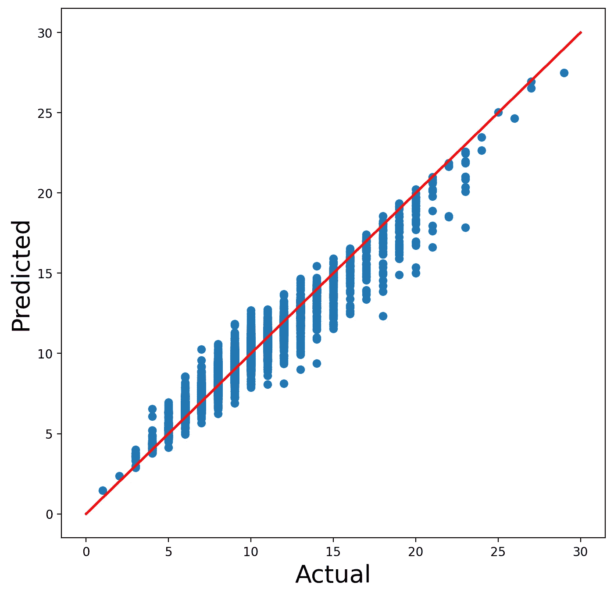
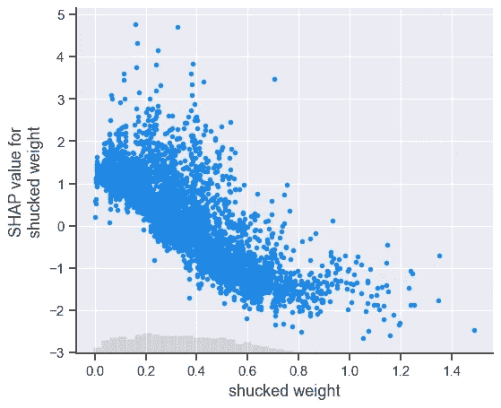

# Python SHAP 简介

> 原文：<https://towardsdatascience.com/introduction-to-shap-with-python-d27edc23c454?source=collection_archive---------0----------------------->

## 如何创造和解读 SHAP 情节:瀑布、力量、卑鄙的 SHAP、蜂群和依赖

*更新日期:2023 年 3 月 12 日*

(来源:作者)

SHAP 是理解和调试模型的最强大的 Python 包。它可以告诉我们每个模型特征是如何对单个预测做出贡献的。通过聚合 SHAP 值，我们还可以了解多个预测的趋势。通过几行代码，我们能够识别和可视化模型中的重要关系。

我们遍历用于计算和显示 SHAP 值的代码。这包括对以下 SHAP 图的解释:

*   瀑布图
*   力图
*   平均 SHAP 图
*   蜂群图
*   依赖图

我们为预测一个**连续**目标变量的模型做这个。最后，我们解释了对于**二元**目标变量的解释是如何相似的。你可以在 GitHub 上找到完整的项目。

还有一个**视频**过一遍这篇文章的内容。如果你想要更多，请查看我的 [**SHAP 课程**](https://adataodyssey.com/courses/shap-with-python/) **。**注册我的 [**简讯**](https://mailchi.mp/aa82a5ce1dc0/signup) :)即可免费获取

# 资料组

为了演示 SHAP 包，我们将使用一个有 4177 个观察值的[鲍鱼数据集](https://archive.ics.uci.edu/ml/datasets/abalone)。下面，你可以看到我们的数据集的快照。鲍鱼是一种美味的贝类。我们想用数据集来预测他们的年龄。更具体地说，我们的目标变量是鲍鱼壳中**环**的数量。我们将使用鲍鱼的**壳长**、**壳径**和**总重**等特征。

(来源: [UCI 机器学习库](https://archive.ics.uci.edu/ml/datasets/abalone))(许可证:CC0:公共领域)

在下面的图表中，我们展示了一些特征和目标变量之间的关系。**剥壳重量**是鲍鱼肉的重量(即鲍鱼肉从壳中取出后的重量)。我们可以看到，环的数量随着**去皮重量**的增加而增加。这是有道理的，因为我们预计老鲍鱼会更大，有更多的肉。

图 1:体重和性别特征的数据探索(来源:作者)

我们还可视化了鲍鱼的性别，这是一个分类特征。在我们可以在模型中使用这个特性之前，我们需要使用一键编码来转换它。如您所见，这将为每个生成的二进制要素生成一个单独的 SHAP 值。这使得很难理解原始分类特征的总体贡献。我们在下面的文章中探索了一个解决方案。

 [## 分类特征的 SHAP

### 将已经用一键编码转换的分类特征的 SHAP 值相加

towardsdatascience.com](/shap-for-categorical-features-7c63e6a554ea) 

对于数据探索的最后一点，我们为连续特征创建一个相关矩阵。你可以看到我们正在处理高度相关的特征。长度和直径完全相关。同样，**整体重量**与其他重量测量值高度相关。例如肉的重量(**去壳重量**)和除去肉的壳的重量(**壳重**)。

图 2:关联热图(来源:作者)

# 包装

我们在下面导入必要的 Python 包。我们有一些用于管理和可视化数据的标准库(第 2-5 行)。XGBoost 用于建模目标变量(第 7 行)，我们导入一些包来评估我们的模型(第 8 行)。最后，我们导入 SHAP 包(第 10 行)。我们初始化包(第 11 行)。这是为了让我们可以在笔记本上显示一些 SHAP 的情节。

# 系统模型化

我们利用数据探索为特征工程提供信息。首先，我们从 X 特征矩阵中去掉长度和整体重量(第 10-11 行)。我们看到这些与其他特征完全相关。

我们看到**性**是一个分类特征。在模型中使用它之前，我们需要将其转换成 3 个虚拟变量(第 2-4 行)。然后，我们从特征矩阵中删除原始特征(第 5 行)。

我们现在有 8 个模型特征。你可以在下面看到这些的快照。

(来源:作者)

我们现在可以训练一个模型来预测鲍鱼壳上的年轮数量。因为我们的目标变量是连续的，所以我们使用 **XGBRegressor** (第 2 行)。我们在整个特征集上训练模型(第 3 行)。

这个模型应该足以证明 SHAP 一揽子计划。我们可以通过使用图 3 中的散点图对其进行评估来了解这一点。我们将模型的预测(第 2 行)与实际的环数进行比较。红线给出了我们完美预测的值。

图 3:实际与预测环的散点图(来源:作者)

**注意:**我们没有在模型上投入太多精力。除非您使用 SHAP 进行数据探索，否则您应该始终使用最佳实践。你的模型越好，你的 SHAP 分析就越可靠。

# SHAP 地块

最后，我们可以用 SHAP 值来解释这个模型。为此，我们将模型传递给 SHAP **解释器**函数(第 2 行)。这将创建一个解释器对象。我们用它来计算特征矩阵中每个观察值的 SHAP 值(第 3 行)。

## 情节 1:瀑布

对于特征矩阵中的 4，177 个观察值中的每一个，都有 8 个 SHAP 值。这是我们模型中每个特征的一个 SHAP 值。我们可以使用**瀑布**函数来可视化第一次观察的 SHAP 值(第 2 行)。

**E[f(x)] = 9.933** 给出了所有 4177 只鲍鱼的平均预测年轮数。f(x) = 12.668 是这种特殊鲍鱼的预测年轮数。SHAP 值是介于两者之间的所有值。例如，去皮重量增加了预测环数 **1.68**

图 4:第一次观察的瀑布图(来源:作者)

在我们的数据集中，每个观察/鲍鱼都有一个独特的瀑布图。都可以用和上面一样的方式来解读。在每种情况下，SHAP 值告诉我们与平均预测相比，特征对预测的贡献如何。较大的正值/负值表示该特征对模型的预测有重大影响。

## 剧情 2:武力剧情

另一种可视化的方法是使用力场图。你可以认为这是一个浓缩的瀑布图。我们从相同的基值 **9.933** 开始，您可以看到每个特征如何影响 **13.04** 的最终预测。

图 5:第一次观察的力图(来源:作者)

## 图 3:堆叠力图

瀑布图和力量图非常适合解释个人预测。为了了解我们的模型是如何进行预测的，我们需要汇总 SHAP 值。一种方法是使用堆积力图

我们可以将多个力图组合在一起，创建一个堆叠力图。这里，我们在力图函数中传递前 100 次观察的 SHAP 值。每个单独的力图现在是垂直的，并并排堆叠。

你可以在下面看到这个情节是互动的。我们还可以更改绘图的顺序，并选择要显示的特征贡献。

图 6:交互式堆叠力图(来源:作者)

例如，在下图中，我们有:

*   仅显示壳重量的 SHAP 值( **y 轴** **=壳重量影响**)
*   通过壳重量特征值( **x 轴** **=壳重量**)命令力图

从该图中，我们可以看出，随着壳体重量的增加，SHAP 值也增加。换句话说，老鲍鱼的壳更重。

图 7:外壳重量的叠加力图(来源:作者)

这是理解我们的模型所捕捉的关系的本质的一种方式。我们将看到蜂群图和依赖图也可以这样使用。

## 情节 4:卑鄙的 SHAP

下一张图将告诉我们哪些特征是最重要的。对于每个特征，我们计算所有观测的平均 SHAP 值。具体来说，我们取绝对值的平均值，因为我们不希望正值和负值相互抵消。最后，我们有下面的条形图。每个功能都有一个栏。例如，我们可以看到**壳重**具有最大的平均 SHAP 值。

图 8:绝对均值图(来源:作者)

具有较大正/负贡献的要素将具有较大的平均 SHAP 值。换句话说，这些特征对模型的预测产生了重大影响。在这种意义上，该图可以以与特征重要性图相同的方式使用。

## 情节 5:蜂群

接下来，我们有一个最有用的情节。蜂群将所有的 SHAP 值可视化。在 y 轴上，值按要素分组。对于每个组，点的颜色由特征值决定(即特征值越高越红)。

图 7:蜂群图(来源:作者)

像卑鄙的 SHAP 一样，蜂群可以用来突出重要的关系。事实上，上图中的特征是由平均 SHAP 排序的。

我们也可以开始理解这些关系的本质。对于**壳重**，注意当特征值增加时，SHAP 值如何增加。我们在叠加力图中看到了类似的关系。它告诉我们，壳重量的值越大，预测的环数就越多。

你可能已经注意到**去皮重量**有相反的关系。查看蜂群图，我们可以看到该特性的较大值与较小的 SHAP 值相关联。我们可以使用依赖图来仔细观察这些关系。

## 图 6:依赖图

相关性图是单个特征的 SHAP 值与特征值的散点图。如果特征与目标变量具有非线性关系，它们特别有用。

例如，以壳重量的相关图为例。查看蜂群图，我们可能假设 SHAP 值随着特征值线性增加。依赖图告诉我们，这种关系并不是完全线性的。

图 8:弹壳重量的相关图(来源:作者)

我们还可以使用第二个特征的值来给散点图着色。我们现在有相同的图，去皮重量越大，点越红。我们可以看到，当壳重和去壳重都很大时，SHAP 值也很大。

图 9:用去壳重量着色的壳重相关图(来源:作者)

这些图可以用来可视化功能之间的相互作用，但要小心！在我们的例子中，情节是两个特征之间相互关联的结果。

我们也有**剥壳重量**(即鲍鱼肉的重量)的依赖图。使用这个图，我们可以确认我们在蜂群图中看到的关系。SHAP 值随着**去皮重量**的增加而降低。

图 10:去皮重量的相关图(来源:作者)

直觉上，这种关系似乎很奇怪。难道我们不会期待老鲍鱼更大，肉更多吗？事实上，这是壳重和去壳重之间的**相互作用**的结果。由于相关性，我们在相关性图中看不到它。在下面的文章中，我们将探讨如何使用 SHAP 互动值来识别这样的互动。

 [## 分析与 SHAP 的互动

### 使用 SHAP Python 包来识别和可视化数据中的交互

towardsdatascience.com](/analysing-interactions-with-shap-8c4a2bc11c2a) 

# 二元目标变量

二元目标变量的 SHAP 值的解释与上述类似。SHAP 值仍然会告诉我们每个因素对模型预测的贡献大小。不同的是，我们现在用对数概率进行预测。这是一个正面预测的**对数几率**。在图 11 中，您可以看到 SHAP 值给出了预测对数优势和平均预测对数优势之间的差异。

图 10:用对数优势解释 SHAP 值(来源:作者)

为了更好地理解这一点，让我们深入 SHAP 的情节。我们首先创建一个二进制目标变量(第 2 行)。这具有以下值:

*   **1** 如果鲍鱼的年轮数高于平均值
*   **0** 否则

我们使用目标变量和之前相同的特征来训练一个 **XGBoost 分类器**(第 5–6 行)。该模型的准确率为 96.6%

我们现在计算 SHAP 值(第 2-3 行)并显示瀑布图(第 6 行)。注意，代码与连续变量的代码相同。

如图 11 所示，即使是瀑布图也是相似的。不同的是基值现在是 **E[f(x)] = -0.789** 。这是所有鲍鱼的平均预测对数概率。对于这种特定的鲍鱼，模型预测其年轮数高于平均水平的概率为 **0.3958** (即 **P = 0.3958** )。这给了我们一个预测的对数几率为**f(x)= ln(0.3958/(1–0.3958))=-0.423。**

图 11:带有二元目标变量的瀑布图(来源:作者)

正 SHAP 值被解释为增加对数几率。例如，脱壳重量增加了对数几率 **1.32** 。此功能增加了模型预测高于平均年轮数的可能性。同样，负值会降低对数几率。

我们也可以像以前一样聚合这些值。好消息是，对《蜜蜂群》或《SHAP 均值》的解读将是一样的。你只需要记住，我们现在处理的是对数概率。

正如我们所见，SHAP 值是用来理解我们的模型如何进行预测的有用工具。然而，我们只是触及了该方案所能提供的皮毛。如果你想了解更多，我写了很多关于 SHAP 的文章。下面的文章深入探讨了 SHAP 和沙普利价值观的某些方面。

 [## 从沙普利到 Shapley 理解数学

### 如何计算 SHAP 要素贡献的概述

towardsdatascience.com](/from-shapley-to-shap-understanding-the-math-e7155414213b)  [## KernelSHAP vs TreeSHAP

### 基于速度、复杂性和其他考虑因素比较 SHAP 近似方法

towardsdatascience.com](/kernelshap-vs-treeshap-e00f3b3a27db)  [## 使用 SHAP 调试 PyTorch 图像回归模型

### 使用 DeepShap 来理解和改进驱动自动驾驶汽车的模型

towardsdatascience.com](/using-shap-to-debug-a-pytorch-image-regression-model-4b562ddef30d) 

我希望这篇文章对你有帮助！如果你想看更多，你可以成为我的****推荐会员来支持我。你可以访问 medium 上的所有文章，我可以得到你的部分费用。****

** [## 通过我的推荐链接加入 Medium 康纳·奥沙利文

### 作为一个媒体会员，你的会员费的一部分会给你阅读的作家，你可以完全接触到每一个故事…

conorosullyds.medium.com](https://conorosullyds.medium.com/membership) 

你可以在|[Twitter](https://twitter.com/conorosullyDS)|[YouTube](https://www.youtube.com/channel/UChsoWqJbEjBwrn00Zvghi4w)|[时事通讯](https://mailchi.mp/aa82a5ce1dc0/signup)上找到我——注册免费参加 [Python SHAP 课程](https://adataodyssey.com/courses/shap-with-python/)

## 图像来源

所有图片都是我自己的或从[www.flaticon.com](http://www.flaticon.com/)获得。在后者的情况下，我拥有他们的[保费计划](https://support.flaticon.com/hc/en-us/articles/202798201-What-are-Flaticon-Premium-licenses-)中定义的“完全许可”。

## 参考

南伦德伯格， *SHAP 蟒包* (2021) 【T2，

南伦德伯格和 s .李，*解释模型预测的统一方法* (2017 年)，[https://arxiv.org/pdf/1705.07874.pdf](https://arxiv.org/pdf/1705.07874.pdf)

C.Molnar，*可解释机器学习*(2021)[https://christophm . github . io/Interpretable-ml-book/shap . html](https://christophm.github.io/interpretable-ml-book/shap.html)**