# SQL 简介:每个数据专家必须知道的 5 个关键概念

> 原文：<https://towardsdatascience.com/introduction-to-sql-5-key-concepts-every-data-professional-must-know-fd26ea4e6da7?source=collection_archive---------34----------------------->

## 用 PostgreSQL、DVD 租赁数据库和这本初学者友好的指南掌握 SQL 的基础知识。

[阿德里安·匡威](https://unsplash.com/@adrienconverse?utm_source=medium&utm_medium=referral)在 [Unsplash](https://unsplash.com?utm_source=medium&utm_medium=referral) 拍摄的照片

SQL 已经存在了几十年，是数据分析和查找的首选语言。随着 R 和 Python 等与数据相关的编程语言的兴起，很容易将 SQL 仅用于简单的`SELECT *`语句，并在以后执行过滤和聚合。虽然很诱人，但这不是最好的解决方案。

今天，您将通过大量的实践示例学习 SQL 的基础知识。您需要安装一个 [PostgreSQL](https://www.postgresql.org/) 数据库来跟进。

这篇文章的结构如下:

*   数据集介绍
*   选择数据
*   过滤数据
*   排序数据
*   匹配数据
*   连接和分组数据
*   结论

# 数据集介绍

如前所述，您需要安装 PostgreSQL 数据库。您还需要 [Dvd 租赁](https://www.postgresqltutorial.com/postgresql-sample-database/)数据集，您可以通过*恢复*功能将其加载到您的数据库中。

Dvd 租赁数据集的 ER 图如下所示:

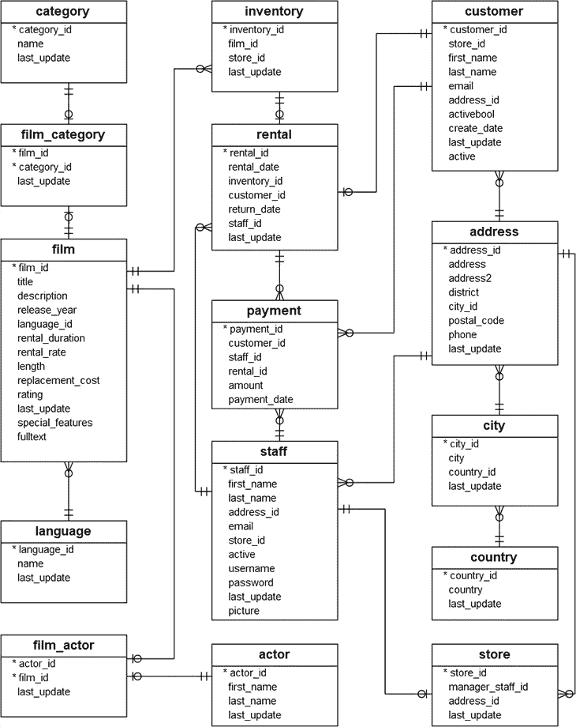

图 1 — DVD 租赁数据库图(来源:[https://www . PostgreSQL tutorial . com/PostgreSQL-sample-database/](https://www.postgresqltutorial.com/postgresql-sample-database/))

在整篇文章中，您将使用客户和付款表，但是您可以自由地探索其他表格。

# 选择数据

对 SQL 最基本的操作是选择数据。它是用`SELECT`关键字完成的(不区分大小写)。如果想从特定的表中获取所有的列，可以使用`SELECT * FROM <table_name>`语法。同样，如果只需要特定的列，可以用列名替换星号。

让我们看几个例子来全面了解一下。

以下是如何从*客户*表中获取所有数据的方法:

结果如下图所示:

图 2 —来自客户表的数据(作者图片)

但是，如果您只想要客户 ID、名字和姓氏的数据，该怎么办呢？你可以这样做:

结果如下:

图 3 —来自客户表的数据—自定义列(作者图片)

指定列名而不是使用星型语法总是一个好习惯。该表的结构将来可能会改变，所以您可能会得到比预期更多的列。即使事实并非如此，选择不使用的列又有什么意义呢？

# 过滤数据

很可能不需要表中的所有记录。这就是过滤发挥作用的地方。您可以使用`WHERE`关键字过滤结果集。任何必须满足的条件都会随之而来。

以下是如何抓住不活跃的顾客:

结果如下所示:

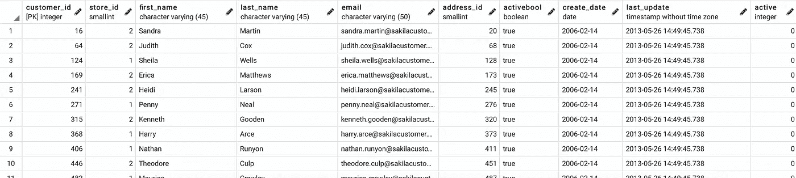

图 4 —客户表中的非活跃客户(按作者分类)

但是如果要按多个条件过滤呢？不能再使用`WHERE`关键字。相反，您可以列出由`AND`关键字分隔的条件。

下面是如何从第一个商店(store_id 为 1)中选择所有非活动客户的方法:

结果如下:

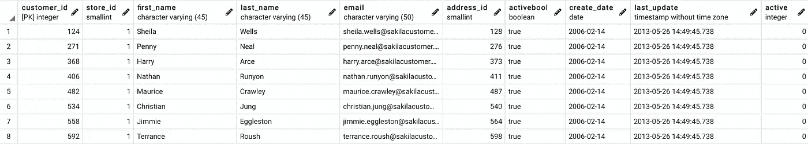

图 5 —第一家商店的不活跃客户(图片由作者提供)

您可以在此条件后添加任意多的过滤条件；只要确保用`AND`关键字将它们分开。

# 排序数据

排序是所有分析的重要组成部分。也许你想按注册日期对用户进行分类，按到期日期对产品进行分类，或者按评级对电影进行分类——`ORDER BY`关键词已经涵盖了这一切。

让我们看看如何根据客户各自的 ID 对其进行排序:

结果如下所示:

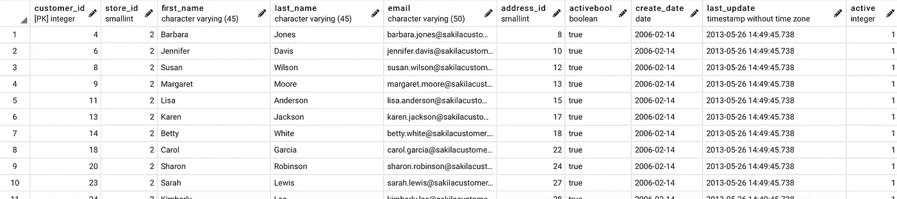

图 6 —按客户 ID 排序的客户(按作者排序的图片)

如您所见，默认情况下，排序是按升序进行的。有时您希望项目从最高到最低排序(降序)，因此您需要一个额外的关键字— `DESC`。

以下是如何进行同样的排序，但按降序排列:

结果如下图所示:

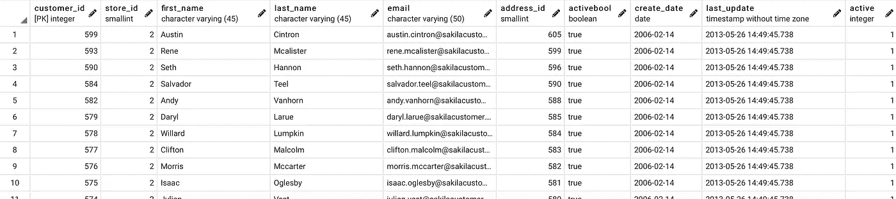

图 7-按客户 ID 降序排序的客户(按作者排序的图片)

这就是数据分类的全部内容。

# 匹配数据

有时候你不知道你到底在找什么，但是你有一个大概的想法。例如，您可能知道感兴趣的客户的姓名以某个字母(或一系列字母)开头，但您不太确定。

这就是匹配的作用。在 SQL 中，匹配是用`LIKE`关键字实现的。有多种方法可以进行匹配，但我们将只讨论基本的方法。

例如，假设您只想查看名字以“An”开头的客户:

结果如下所示:

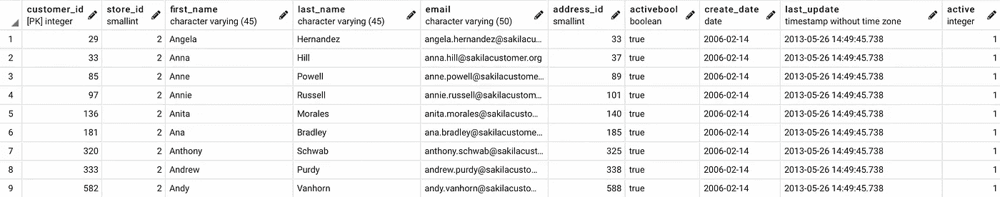

图 8-名字以“An”开头的客户(图片由作者提供)

你可以在变量的不同部分进行匹配。例如，假设您只想要那些名字以“ne”结尾的客户:

结果如下:

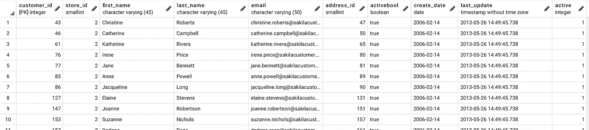

图片 9-名字以“ne”结尾的客户(图片由作者提供)

还有更高级的匹配操作，比如指定前后的字符数，但这超出了今天的范围。

# 连接和分组数据

您需要的所有数据都存储在一个表中是不太可能的。通常情况下，您必须使用连接来合并两个或多个表的结果。幸运的是，使用 SQL 很容易做到这一点。

连接有多种类型:

*   `INNER JOIN`–返回在两个表中具有匹配值的行
*   `LEFT JOIN`–返回左表中的所有行，只返回右表中匹配的行
*   `RIGHT JOIN`–返回右表中的所有行，只返回左表中匹配的行
*   `FULL JOIN`–在任一表中有匹配项时返回所有行

下面是如何使用连接来组合*客户*和*付款*表，并提取每笔交易的付款金额:

结果如下所示:

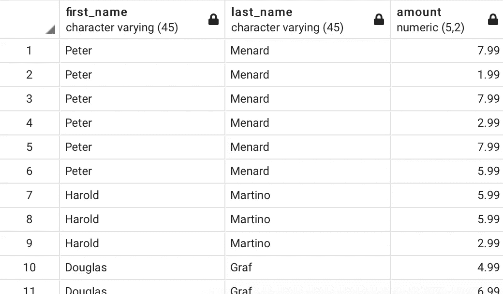

图 10 —客户每笔交易支付的金额(图片由作者提供)

如您所见，每个客户都有多条记录。这是因为一条记录代表一笔交易，而一个客户可以进行多笔交易。

如果你想得到每个客户的总金额，你必须使用`GROUP BY`关键字和一个聚合函数。让我们来看一个例子:

结果如下所示:

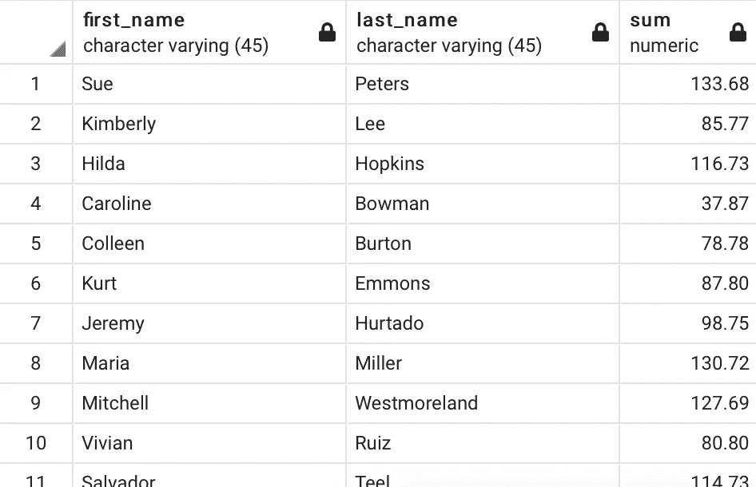

图 11 —每位客户的总金额(图片由作者提供)

这里发生了什么？简而言之，您将每个名字和姓氏分成不同的组(假设每个客户都有唯一的名字)，并计算每个组的总和。

有几件事可以改进。例如，现在我们返回所有完全未排序的记录。以下代码片段按总和(降序)对行进行排序，并且只保留前五行:

结果如下:

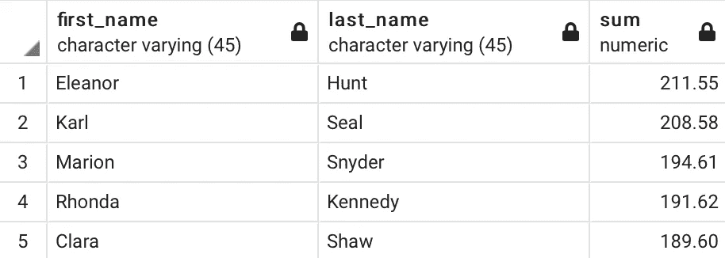

图 12 —按消费金额排名的前 5 名客户(按作者排序的图片)

您仍然可以改进这个结果集。例如，假设您想要将名字和姓氏合并为一个名为 *customer_name* 的列，并且您还想要将聚合列重命名为 *total* :

结果如下所示:

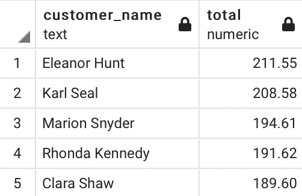

图 13 —按消费金额排名的前 5 名客户(v2)(图片由作者提供)

# 结论

今天，您已经学习了 PostgreSQL 环境中的 SQL 基础知识。SQL 是一个广泛的主题，您可以(也应该)学习更多。更多中高级指南即将推出，敬请期待。

总结一下——在数据库中进行尽可能多的数据过滤/聚合。这比将整个数据集拖到内存中并在那里执行过滤要快得多。

喜欢这篇文章吗？成为 [*中等会员*](https://medium.com/@radecicdario/membership) *继续无限制学习。如果你使用下面的链接，我会收到你的一部分会员费，不需要你额外付费。*

 [## 通过我的推荐链接加入 Medium-Dario rade ci

### 作为一个媒体会员，你的会员费的一部分会给你阅读的作家，你可以完全接触到每一个故事…

medium.com](https://medium.com/@radecicdario/membership) 

*原载于 2021 年 1 月 27 日 https://appsilon.com**的* [*。*](https://appsilon.com/introduction-to-sql/)