# SQL 介绍和真实生活的例子:分析你的购物习惯

> 原文：<https://towardsdatascience.com/introduction-to-sql-with-real-life-examples-analyze-your-grocery-shopping-habits-a6c6987b61cd?source=collection_archive---------6----------------------->


作者图片

SQL 是数据科学家工具箱的基本组成部分。这是一个探索和准备数据的伟大工具，无论是用于分析还是创建机器学习模型。

学习 SQL 的一个有效方法是把重点放在你想回答的问题上，而不是放在具体的方法或函数上。一旦你知道你在寻找什么，你想用数据回答什么问题，你用来达到目的的函数和操作数将会更有意义。

本文围绕有关数据的问题展开，您将熟悉:

*   SQL 查询的结构，
*   检查数据质量，
*   用 SQL 过滤、汇总和组合数据。

# 分析你的购物习惯

你是那种喜欢记录自己日常活动的人，其中之一就是购物。最近你保留了所有的杂货店收据，这样你就可以分析你的购买模式。

# **创建你的购物数据库**

分析你的购买模式的一个方法是使用 SQL，通过本地数据库引擎 [sqlite](https://www.sqlite.org/index.html) 。你[下载了 sqlite](https://www.sqlite.org/quickstart.html) ，并使用命令行创建了一个杂货数据库。

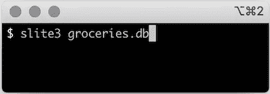

创建杂货数据库。

现在你在 sqlite shell 中(见提示 *sqlite >* )。

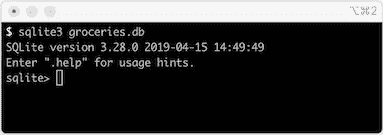

Sqlite shell。

然后，您开始考虑如何组织来自收据的数据。您还没有考虑具体的问题，但是您知道将数据组织到两个表中:

*   **杂货店 _ 访问**汇总了您去杂货店的日期、购物时间和消费金额。
*   **杂货店列表**有每次逛杂货店时所买物品的名称和类别。

因此，在 sqlite shell 中，您可以使用以下命令在本地数据库中创建这些表:

```
create table grocery_visit(date TEXT, time_spent_min INTEGER, amount_spent REAL);create table grocery_list(date TEXT, item_name TEXT, item_category TEXT);
```

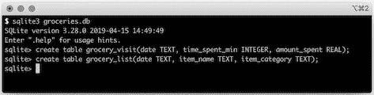

在 sqlite 中创建表*杂货 _ 访问*和*杂货 _ 列表*。

为了确保表确实被创建了，您使用命令 *.tables.* 进行了双重检查

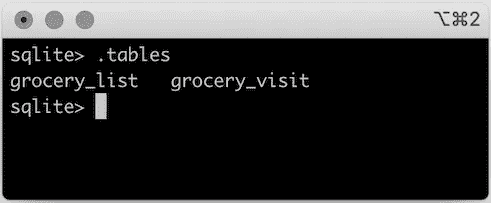

检查您的表实际上是创建的。

然后你仔细检查购物清单上的每一项。

```
insert into grocery_list values("2020-12-03", "Hamburger patties", "Meat and Fish");insert into grocery_list values("2020-12-03", "Chips", "Pantry");insert into grocery_list values("2020-12-03", "Avocado", "Fruits and Vegetables");insert into grocery_list values("2020-12-03", "Lime", "Fruits and Vegetables");insert into grocery_list values("2020-12-03", "Tomato", "Fruits and Vegetables");insert into grocery_list values("2020-12-15", "Rice cakes", "Pantry");insert into grocery_list values("2020-12-15", "Graham crackers", "Pantry");insert into grocery_list values("2020-12-15", "Toothpaste", NULL);insert into grocery_list values("2020-12-15", "Flour", "Pantry");insert into grocery_list values("2020-12-15", "Yeast", "Pantry");insert into grocery_list values("2020-12-15", "Popcorn", "Pantry");insert into grocery_list values("2020-12-15", "Eggs", NULL);insert into grocery_list values("2020-12-15", "Milk", "Dairy");insert into grocery_list values("2020-12-15", "Bananas", "Fruits and Vegetables");insert into grocery_list values("2020-12-15", "Frozen waffles", NULL);insert into grocery_list values("2020-12-23", "Mayo", "Pantry");insert into grocery_list values("2020-12-23", "Flour", "Pantry");insert into grocery_list values("2020-12-23", "Milk", "Dairy");insert into grocery_list values("2020-12-23", "Roasted Chicken", "Meat and Fish");insert into grocery_list values("2020-12-23", "Chocolate chip cookies", "Pantry");insert into grocery_list values("2020-12-23", "Yogurt", "Dairy");insert into grocery_list values("2020-12-23", "Soda", NULL);insert into grocery_list values("2020-12-23", "Grapes", "Fruits and Vegetables");
```

现在你所有的购物数据都已经储存了，你可以开始提问了！

# SQL 查询的剖析

在开始编写用数据回答问题的 SQL 之前，让我们来看看 SQL 查询的构造块。

您可以将查询视为过滤、转换和组合一个或多个数据集的结果。

从广义上讲，SQL 查询由两部分组成，一部分是强制的，另一部分是可选的:

*   **强制部分**定义了输出，以及你从哪些数据中提取，
*   **可选部分**允许您通过过滤、汇总、排序或限制输出大小来操作数据。

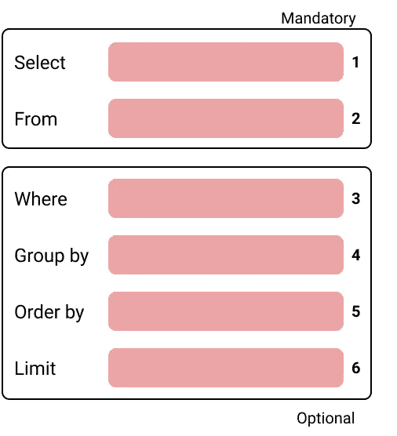

SQL 查询的结构。

查询的每个部分，这里编号为 1 到 6，称为一个*子句*，您可以使用不同的*保留关键字*来引用它。每个子句都允许您对手头的数据集执行特定的操作:

1.  **Select** 之后的所有内容 *select* 关键字表示您的查询的输出。这是最终的结果。
2.  **来自**你正在操作的数据。它可以是一个表，也可以是另一个查询的结果，通常称为*子查询*或*内部查询*。
3.  **其中**用于过滤数据，并指定数据需要符合的一组条件，以便生成输出。
4.  **分组依据**表示您正在汇总数据，例如，对数值进行计数或求和。
5.  **Order by** 您希望如何对结果进行排序。
6.  **限制**表示您只想显示一定数量的结果。

让我们编写一些查询，看看所有这些是如何工作的！

# 瞥一眼数据

数据项目的第一步是数据探索，了解你的数据。一旦你知道了你的数据，使用正确的方法或函数来回答你的问题就会容易得多。

当您探索这个数据集时，您可能会先问:

*   我能看看所有的数据吗？
*   我能看一眼数据吗？
*   我能看到某一列所有可能的值吗？

# 我能看看所有的数据吗？

在这种情况下，你只有很少的数据，所以有可能看到所有的数据。

您可以使用 s *elect ** 来查看表格中的所有数据，即所有的行和列。

```
select * from grocery_visit;
```

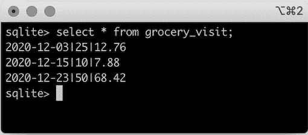

*通配符** 意味着您希望看到结果数据集中的所有列。但是，您可能只对少数几列感兴趣:

```
select date, amount_spent from grocery_visit;
```

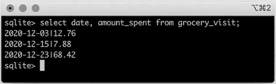

仅从*杂货店中选择几列 _ 访问*。

注意，在每个查询语句的末尾总是有一个分号*；*。这表示查询结束，sqlite 可以继续评估查询。

即使您看到了*日期*和*金额 _ 花费*列的所有数据，也很难将这些值映射到相应的列。如果您正在处理由其他人构建的数据集，这将特别方便。

在 sqlite 中，您可以调整设置以输出列名，也称为表标题*。*

```
*.headers on*
```

*因此，如果您再次运行查询，您将看到列名。*

*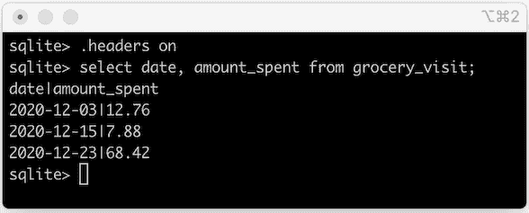*

*查询结果现在显示列名。*

*似乎是一个小细节，但现在更容易理解结果了。从现在开始，所有查询都将输出结果数据集的标题。*

*好吧，回到你的问题！*

# *我能看一眼数据吗？*

*如果您只想看一眼您可以使用的数据，例如， *limit* 操作数表示*将该查询的结果限制为只有 X 条记录*。*

```
*select * from grocery_list limit 10;*
```

*这将从*杂货店 _ 列表*表中返回前 10 条记录。*

*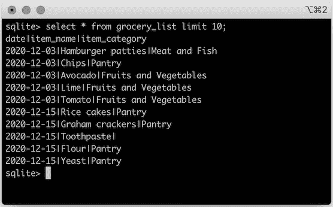*

*用极限操作数查看*杂货店列表*。*

# *检查数据质量*

*您只是快速浏览了一下数据，但是在开始分析之前，检查任何数据质量问题也很重要。*

*例如，你可能已经注意到*杂货清单*中的一些商品没有类别。所以你可以问*我的购物清单中哪些项目没有分类？**

*要检查这一点，您可以使用 *where 子句*并过滤输出，只包括具有 *null* 类别的项目。*

```
*select * from grocery_list
where item_category is null;*
```

*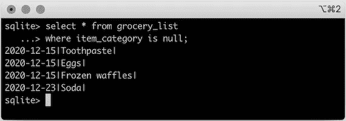*

*检查*杂货清单*中有空类别的商品。*

*您还可以抽查无效值，例如带有拼写错误的项目名称或其他在相关列中没有意义的值。为此，您使用了 *distinct* reserved 关键字，因此它将输出唯一值的列表，而不是某一列中的所有值，因为可能会有一些重复。*

```
*select distinct item_name
from grocery_list;select distinct item_category
from grocery_list;*
```

*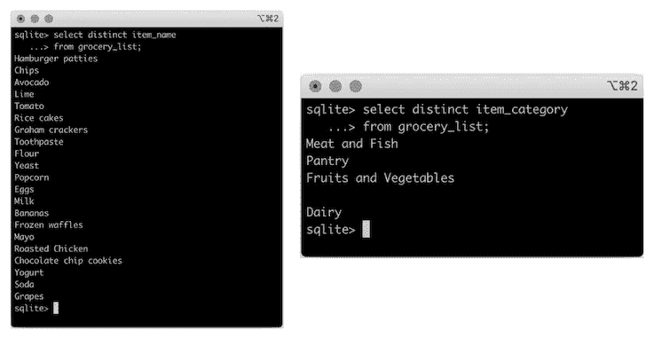*

*列*项目名称*和*项目类别*的不同值。*

*甚至没有名字的空类别也在这里出现。*

# *过滤您的数据*

*在 SQL 中，您通过在 *where 子句*中定义一组规则来过滤数据集。您只是用来查找具有空值的项目类别。*

*这只是一个简单的规则，但是你可以问其他有趣的问题。*

## *我买过哪些不同的水果？*

*在这种情况下，你知道商品类别的确切名称，*水果和蔬菜*，但是假装你不知道😀*

*你有一种预感，类别名称一定涉及到*水果、水果*甚至其复数的某种变体。因此，您可以尝试使用操作符**像**一样对项目类别进行模式匹配。使用这个操作符，您实际上是对任何像这样的项目类别使用*过滤器。**

```
*select *
from grocery_list
where item_category like 'Fruit';*
```

*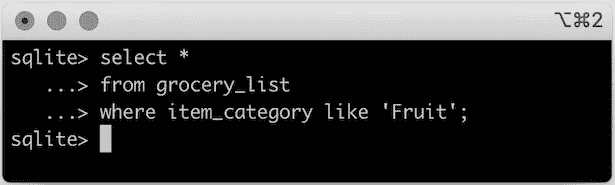*

*对于您的具体问题，使用*的方式不正确，如*操作符。*

*但是你不能像这样使用它，因为在实践中，你所做的是一个精确的匹配，相当于使用一个等号而不是像一样使用*。**

*要进行模式匹配，您需要使用*通配符%。*这表示*过滤任何名称中有水果的项目类别*。由于通配符在字符串的末尾，只要它以 *Fruit* 开头，就会有一个匹配。*

```
*select *
from grocery_list
where item_category like 'Fruit%';*
```

*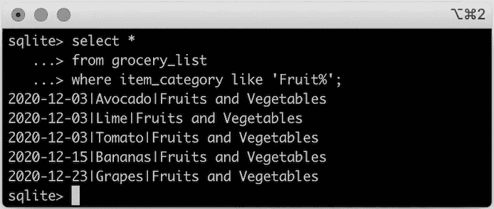*

*使用类似的*操作器进行模式匹配。**

*在 sqlite 中，操作符*像*是不区分大小写的，所以条件*像‘Fruit %’*或*像‘Fruit %’*产生相同的输出。*

## *我什么时候买过牛油果和牛奶？*

*对于这个问题，您希望基于多个条件过滤数据集。因此您可以使用带有两条规则的 *where* 子句:*

*   *一个给你所有你买鳄梨的日子，*
*   *一个给你所有你买牛奶的日子。*

```
*select *
from grocery_list
where item_name = 'Avocado'
or item_name = 'Milk';*
```

*您可以用 操作符中的**重写这个 *where* 子句，它将根据一个项目列表过滤数据集。在这种情况下，列表只包含*鳄梨*和*牛奶。****

```
*select *
from grocery_list
where item_name in ('Avocado', 'Milk');*
```

*无论您想用哪种方式过滤，都会得到相同的输出。*

*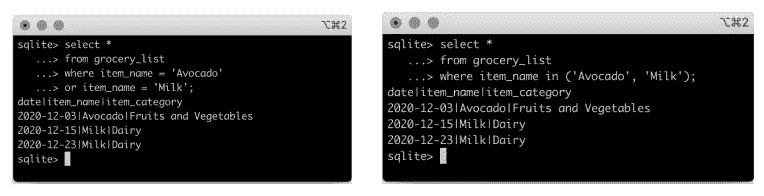*

*使用多个条件或项目列表过滤数据。*

## *我能看到特定范围内的数据吗？*

*您还可以过滤数据集，以便只输出在特定值范围内的数据。*

*例如，您可能想要查看 12 月上半月所有的杂货店访问量。*

```
*select *
from grocery_visit
where date >= '2020-12-01'
and date <= '2020-12-15';*
```

*这里，您使用 *where 子句*中的两个条件过滤数据集，但是，如果您想让它更容易阅读，您可以使用运算符*之间的**。****

```
*select *
from grocery_visit
where date between '2020-12-01' and '2020-12-15';*
```

**

*使用 *where* 子句中的多个*条件*(左)和运算符之间的*(左)过滤特定数据范围的数据集。**

# *汇总数据*

*你可能想问的另一组问题可以被看作是寻找一种总结数据的方法。*

*例如，你去杂货店的总结可以包括:*

*   *你去杂货店的次数，使用**计数** 功能。*
*   *使用 **min** 和 **max** 功能，您去杂货店的最短和最长时间是多久。*
*   *使用**平均** 功能，你平均花了多少时间购物。*

```
*select count(*) as total_visits
, min(time_spent_min) as shortest_visit
, avg(time_spent_min) as average_visit
, max(time_spent_min) as longest_visit
from grocery_visit;*
```

*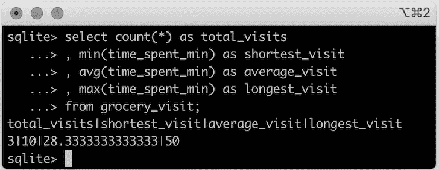*

*你逛杂货店的总结。*

*在你去杂货店的三次访问中，最短的用了 10 分钟，最长的用了 50 分钟，平均来说，你去杂货店大约用了 29 分钟。*

**通配符** ，意味着您正在计算*杂货店 _ 访问*表中的所有记录。*

# *对结果进行排序*

*当您浏览数据集时，对输出进行排序也很有用。*

*回到 SQL 查询的结构，您可以使用可选的 *order by* 子句来指定您希望如何对结果进行排序。然后，使用 [*排序术语*](https://sqlite.org/syntax/ordering-term.html) **asc** 和 **desc** ，输出按升序或降序排序。默认情况下， *order by* 子句按升序对输出进行排序。*

## *我在杂货店花了多少钱？*

*这里您可以使用默认值，从最低到最高输出每次杂货店访问的*amount _ spend*。*

```
*select *
from grocery_visit
order by amount_spent;*
```

*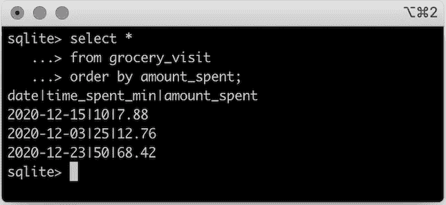*

## *我可以按日期查看所有的杂货店访问吗，从最近的开始？*

*这里是完全相同的查询，但是指定结果按降序排序。*

```
*select date
from grocery_visit
order by date desc;*
```

*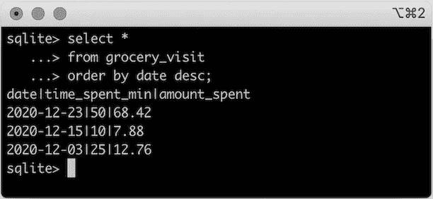*

*但是，相反，你可能只想看到你最后一次去杂货店。在这里，您可以使用到目前为止已经看到的子句和操作数。*

```
*select *
from grocery_visit
order by date desc
limit 1;*
```

*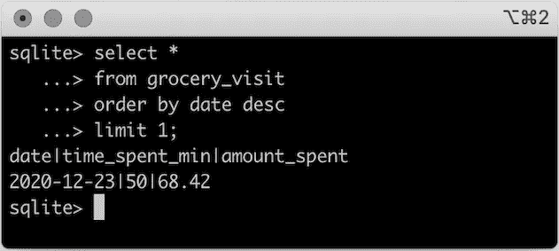*

*显示了最近一次去杂货店的次数。*

# *组合数据*

*到目前为止，您一直在操作一个表。然而，大多数情况下，您需要组合多个表来获得洞察力。*

*在 SQL 中，使用[连接操作符](https://en.wikipedia.org/wiki/Join_(SQL))组合多个表。有不同类型的连接，每种连接都根据不同的规则组合两个表。*

*因为您也经常去百货商店，所以您决定将这些访问的数据存储在表 *dept_store_visit 中。**

```
*create table dept_store_visit(date TEXT, time_spent_min INTEGER, amount_spent REAL);insert into dept_store_visit values ('2020-12-01', 40, 45.99);
insert into dept_store_visit values ('2020-12-15', 25, 37.30);
insert into dept_store_visit values ('2020-12-19', 20, 15.82);*
```

*根据对两家商店的访问数据，你可以提出一个非常有趣的问题。*

## *我什么时候在杂货店或百货商店购物花费超过 15 美元？*

*连接通常被描述为维恩图(左图)，但是您也可以考虑连接两个数据集(右图)，这两个数据集可能共享也可能不共享特征，即列。*

*回答这个问题的一种方法是将一个表中的每条记录与另一个表中的每条记录相结合，以确保生成的数据集能够捕获两个表中的所有数据。*

*要做到这一点，你可以使用一个**交叉连接**，然后当你花费*超过*15 美元时，通过杂货店访问进行过滤。*

*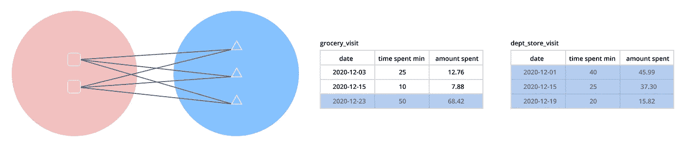*

*交叉连接的可视化表示。*

*在 SQL 中，您可以编写以下查询:*

```
*select *
from grocery_visit
cross join dept_store_visit
where grocery_visit.amount_spent > 15
and dept_store_visit.amount_spent > 15;*
```

*默认情况下，在大多数数据库引擎中，sqlite 也不例外，您可以省略*叉*，您将获得相同的输出。*

*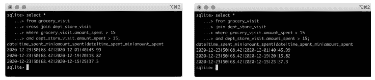*

*杂货店访问和部门商店访问之间的*交叉连接*的输出。*

*因为记录是多对多映射的，并且*杂货店 _ 访问*表只有一个大于$15 的记录，所以它最终与*部门 _ 商店 _ 访问*中的 3 个记录成对出现。因此，您会看到来自*杂货店 _ 访问*表的记录在输出中重复了 3 次。*

*这肯定回答了您的问题，但是输出的结构可能并不完全是您想要的。*

*如果输出是您去杂货店和百货商店的日期列表，那么解释起来会容易得多。就好像您附加了过滤这些表的结果一样。*

*为此，您可以使用**联合操作符**。*

*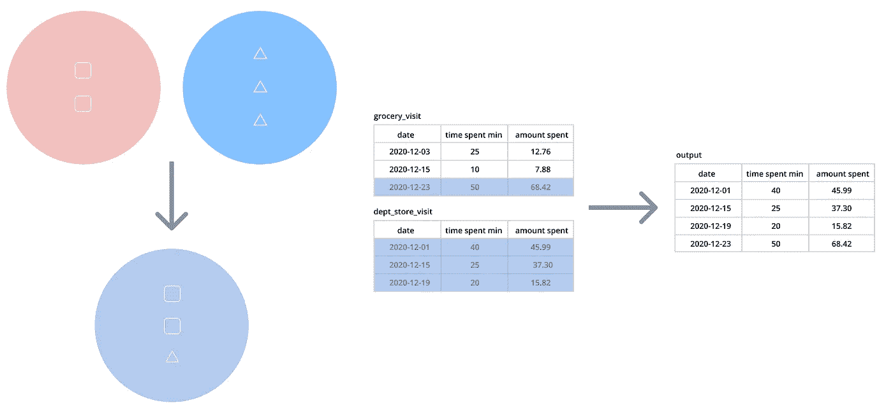*

*union 运算符的可视化表示。*

*因为要追加每个表中的记录，所以两个表必须具有完全相同的结构，或者在执行 union 时选择结构匹配的列。*

```
*select date, amount_spent
from grocery_visit
where amount_spent > 15unionselect date, amount_spent
from dept_store_visit
where amount_spent > 15;*
```

*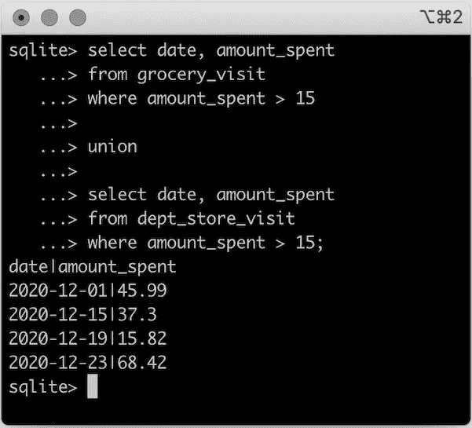*

**杂货店 _ 访问*和*百货 _ 访问*的联合输出。*

## *我在购买面包制作物品时花了多少钱？*

*这里，回答这个问题所需的数据*存在于多个表中*，因此您需要组合:*

*   **杂货店 _ 访问*以获得*花费金额*，以及*
*   **杂货店 _ 列表*根据面粉、酵母和鸡蛋等面包制作项目进行过滤。*

*您刚刚学习了交叉连接。让我们使用它！*

```
*select *
from grocery_visit
cross join grocery_list
where grocery_list.item_name in ('Flour', 'Yeast', 'Eggs');*
```

*如果在进行聚合之前检查生成的数据集，您会发现有些地方不太对劲。*

*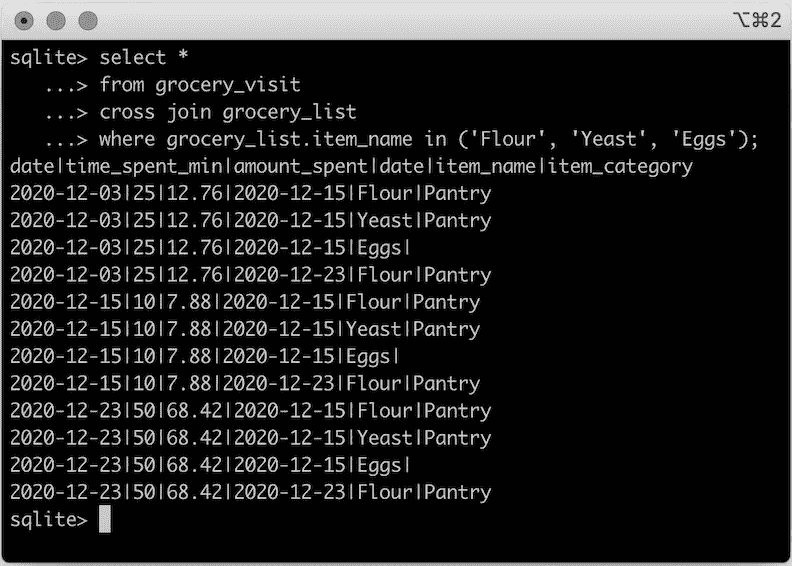*

*交叉连接不是回答这个问题的最佳方式。*

*输出数据集确实包含了您正在寻找的所有项目，但是因为您使用了交叉连接，所以*杂货店 _ 访问*表中的所有记录都与您想要的*杂货店 _ 列表中的记录成对出现。**

*如果你现在做平均，你会看到错误的结果，因为得到的数据集实际上不是你想要的。*

*您真正想要的是，当您已经购买了面粉、酵母和鸡蛋时，只获得杂货店访问的数据。*

*谢天谢地，还有另一个连接操作符可以使用，即**内部连接**。*

*通过一个*内部连接*，你将组合两个具有相似特征的数据集，并返回它们之间的共同点。为了使*内部连接*工作，两个表必须至少有一列是相同的，因为您需要指定两个表中哪个特征需要相等。*

*它遵循以下格式:*

> *tableA *内部连接* tableB *对*tableA . shared _ column = tableB . shared _ column*

*即使两个表有一个或多个相同的列，它们也必须有完全相同的值。否则，您的输出数据集将为空。*

*使用维恩图类比，您正在寻找这两个领域之间的交集。*

*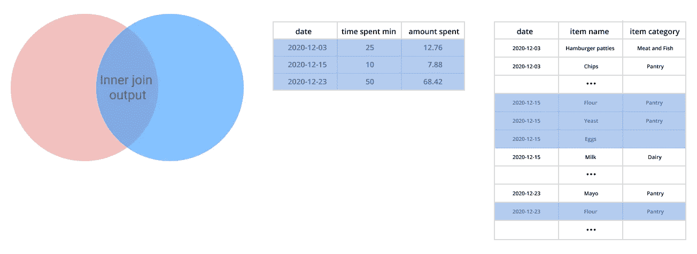*

*一个*内部连接*的可视化表示。*

*要回答这个问题，您需要在逛杂货店的当天匹配两张表。*

```
*select *
from grocery_visit
inner join grocery_list
on grocery_visit.date = grocery_list.date
where grocery_list.item_name in ('Flour', 'Yeast', 'Eggs');*
```

*因此，看一下内部连接的结果，您会看到:*

*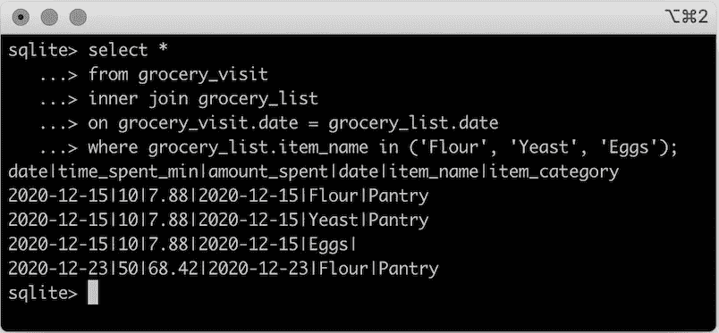*

*您还可以注意到，您在 2020 年 12 月 15 日购买了多种这些商品，因此那次杂货店访问的数据是重复的。但是，您只想计算 2020 年 12 月 15 日和 2020 年 12 月 23 日两次访问的平均*消费金额*。*

*所以，当你计算平均*花费*的时候，你需要确保你不会多次计算数值。你可以使用**独特的** 关键字来处理这个问题。*

```
*select avg(distinct amount_spent) as avg_amount_spent
from grocery_visit
inner join grocery_list
on grocery_visit.date = grocery_list.date
where grocery_list.item_name in ('Flour', 'Yeast', 'Eggs');*
```

*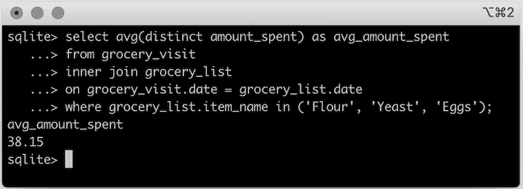*

*你在杂货店购买面粉、酵母和鸡蛋的平均花费。*

*但是你可能会说，*如果不同的杂货店消费相同的金额会怎么样？**

*回到 SQL 查询的剖析，from 子句的*可以像您到目前为止所做的那样直接从一个表中提取数据，或者从另一个查询(称为*子查询)的结果中提取数据。***

*确保你去过所有不同的杂货店购买面粉、酵母和鸡蛋，但也要考虑到:*

*   *在同一天发生的访问，但是花费了不同的金额，*
*   *不同日期的访问，花费完全相同。*

*您可以将该逻辑封装在一个*子查询*中，然后进行平均。这样你就能保证不会多算或少算任何一次去杂货店的次数。*

```
*select avg(amount_spent) as avg_amount_spent
from
(
    select distinct grocery_visit.date, amount_spent
    from grocery_visit
    inner join grocery_list
    on grocery_visit.date = grocery_list.date
    where grocery_list.item_name in ('Flour', 'Yeast', 'Eggs');
)*
```

*由于您已经根据感兴趣的项目进行了筛选，并且您担心每次访问中没有过多或过少地计算支出，因此您可以忽略*子查询*中【杂货店 _ 列表】的所有列。*

## *在我去杂货店的日子里，我也去百货商店吗？如果是，我在这些访问中花了多少时间？*

*在这个问题中，很明显您想要组合*杂货店 _ 访问*和*部门 _ 商店 _ 访问*表中的数据。*

*但是主要的焦点是去杂货店。*

*你将使用一个**左连接**来回答这个问题。*

*使用维恩图类比，您将需要*杂货店 _ 访问*中的所有数据，并且只需要来自*部门 _ 商店 _ 访问*的与杂货店访问日期匹配的记录。*

*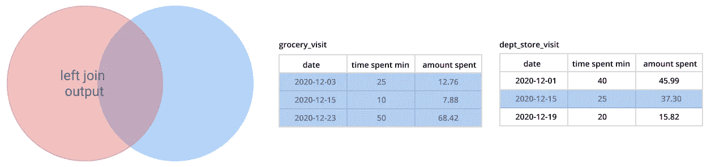*

*左连接的可视化表示。*

*你可以把左连接想象成*把所有东西都放在左边(表)，只从右边(表)取出匹配的东西。**

```
*select grocery_visit.*
, dept_store_visit.time_spent_min as time_spent_dept_store
, dept_store_visit.amount_spent as amount_spent_dept_store
from grocery_visit
left join dept_store_visit
on grocery_visit.date = dept_store_visit.date;*
```

*这里*杂货店 _ 参观。** 表示输出包含来自*杂货 _ 访问的所有列。**

*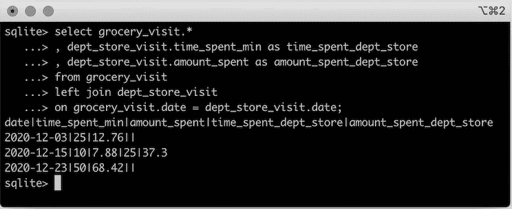*

*根据访问日期，*杂货店 _ 访问*与*部门 _ 商店 _ 访问*的左连接输出。*

*你也可以反过来想这个问题*在我去百货公司的那几天，我是不是也去了杂货店？如果是，我在这些访问中花了多少时间？**

*大多数数据库引擎支持**右连接**，听起来正是左连接的反义词。然而，sqlite [不支持右连接](https://sqlite.org/omitted.html)。*

*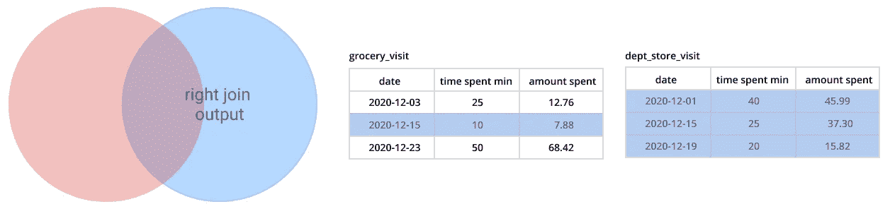*

*右连接的可视化表示。*

*与右加入你*保持一切在右边(表)，只带火柴在左边(表)。*实际上，这意味着翻转最后一个查询中的另一个表。*

# *让您的输出可以用别名来解释*

*您可能还注意到，在最后一个查询中， *dept_store_visit* 的输出与原始的列名不同。那是因为我们用了一个**别名。***

*别名使得引用具有更易理解的名称的表和子查询变得更加容易。在这种情况下，我们使用别名将输出列重命名为与其他表中的列不同的名称。*

*您已经全面了解了 SQL 查询的基础知识！但是不要担心，它不一定要在这里结束，您可以使用高级 SQL 函数和操作数提出许多更微妙的问题。*

*希望这篇文章让你对 SQL 和如何用数据回答问题感到好奇。*

**感谢阅读！**