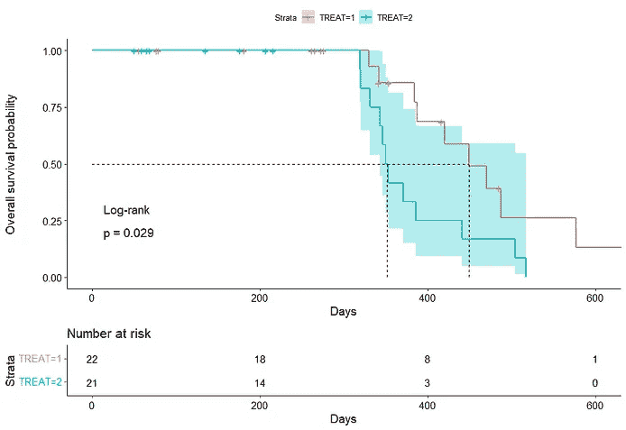

# 生存分析导论

> 原文：<https://towardsdatascience.com/introduction-to-survival-analysis-in-cows-using-r-28b82c2821fb?source=collection_archive---------21----------------------->

## 在使用 R

我的背景是心理学和生命科学，这意味着你迟早会处理生存分析。特别是在我读博士期间，我评估了数百篇关于癌症干预的论文，最感兴趣的结果是生存率——总生存率、无病生存率、复发生存率。

在农业领域，情况有所不同，我很少看到进行生存评估，尽管有很大的空间。本质上，生存分析是事件分析的一个更性感的术语，这就是它的全部——事件分析。

因此，要开始进行事件分析或生存分析，您只需要两个变量:

1.  时间的数字度量，如天数。
2.  事件的分类标识符，通常标记为 0 或 1。

结合起来，这两个变量可以表明:

1.  如果感兴趣的主题遇到了感兴趣的事件(绝对可以是任何事情！)还是没有。
2.  感兴趣的受试者是否以及何时进入研究。
3.  如果感兴趣的受试者离开研究

这就是我们进入 [**审查**](https://www2.karlin.mff.cuni.cz/~pesta/NMFM404/survival.html) 的领域，这在事件分析中可能是最难理解的部分。当在观察框架(研究的结束-开始)中观察到事件时，我们对感兴趣的受试者有时间变量和事件变量。然而，对于其他人，我们可能没有确切的开始日期和/或我们可能永远不会观察到事件。这两个问题分别导致左右审查。右删截要常见得多，为了简洁起见，我们现在将离开区间删截。

请记住，当您想要进行事件分析时，您的数据集需要有事件时间(或无事件时间)和事件的列。算法会为你找出审查！

让我们加载必要的包来执行生存分析。

然后进行必要的数据讨论，包括标准化的协变量。

这里你可以看到用来进行生存分析的数据集。对于每头牛，我们都有一个 SurvivalTime 指标和一个 Vstatus (event)指标。其余的是利益和潜在价值的协变量。

值得注意的是，在事件分析中，重要的是事件的数量，而不是观察的数量或观察花费的时间。如果没有感兴趣的事件，分析就毫无意义！

寻找潜在利益因素存活时间差异的第一批图。

事件在一段时间后开始发生，这些变量之间似乎存在差异。图片作者。

现在，开始分析事件最直接的方法是使用[卡普兰-迈耶方法](https://en.wikipedia.org/wiki/Kaplan%E2%80%93Meier_estimator)。这是一种非参数方法，基本上意味着它并不真正关心任何潜在的模型假设。只要数据集有它需要的东西(观察到的时间和事件),就可以开始了。在这里，我们开始询问[生命表](https://en.wikipedia.org/wiki/Life_table)和简单的事件分析。结合起来，它们将根据观察到的时间-事件组合，为您提供在特定时间点幸存的总体概率。

生命表和事件曲线来观察在特定时间点存活的概率。图片作者。

一年后，发生了 9 起事件，导致 64%的生存概率[48% — 86%]。

生命表是评估是否有足够的事件进行事件分析的好方法。如果是这样，你可以转到感兴趣的分析，这是治疗之间的事件曲线的比较。在卡普兰-迈耶模型中，通过对数秩检验进行比较，这是另一种非参数方法。

治疗之间似乎有统计学上的显著差异，但治疗-2 的巨大置信区间并没有对 p 值的价值给予很大的信任(这通常值得很多不信任)。图片作者。

一旦你抛开卡普兰-迈耶，转而采用 [Cox 回归](https://en.wikipedia.org/wiki/Proportional_hazards_model)——也称为比例风险模型，事件分析就变得非常有趣。Cox 回归是一种半参数方法，能够包含多个预测因子。半参数意味着它关心假设，但不需要截距或基线风险。考克斯回归的问题在于，它很容易打破自己的假设，尤其是给它起了个名字的假设——比例风险假设。

但是，我们还没有讨论什么是[危险](https://en.wikipedia.org/wiki/Failure_rate#hazard_function)。危险通常是一种风险，更具体地说，是在任何给定的时间点从非事件转变为事件的风险。因此，这是遇到感兴趣事件的风险，与时间无关。这就是为什么使用 Cox 回归几乎不切实际的原因，但不管怎样，让我们继续吧。在以后的文章中，我将讨论更多关于应用参数模型和处理这种假设的方法。

进行 Cox 回归的代码并不难。

下面的总结是回归输出，毫无疑问。我们看到我们有 43 个感兴趣的对象，并观察了 22 个事件。对于每个感兴趣的因素，我们得到几个输出:

1.  系数——对数标度上的估计危险系数
2.  **exp(coef)** —危险比(HR)。在这里，4.9 意味着 490%。因此，*治疗 2* ，与*治疗 1* 相比，增加了几乎 500%的危险！
3.  **exp(-coef) —** 逆危险比，即*治疗 1* 的 HR。

一致性统计是用于事件分析的 ROC 统计。似然性、Wald 和评分测试表明，该模型优于不含预测因子的模型。这个消息与之前的试探性情节一致。

要求方差膨胀因子(VIF)以检测严重的交叉相关性/相互依赖性，这通常会导致标准误差或不收敛。

风险比、置信区间和 P 值。图片作者。

所以，到目前为止，一切似乎都很简单，这实际上是生存分析中最大的问题——它真的没有那么难。但是，我们也说过，通过从非参数方法转移到半参数方法，我们有一些[假设](http://www.sthda.com/english/wiki/cox-model-assumptions)要研究，这是我们现在要做的。要检查的最重要的假设是危险比例(PH)假设。我们将通过查看舍恩菲尔德残差和绘制每个预测值的累积双对数曲线来实现这一点。

您需要的是:

1.  累积双对数曲线间的比例距离。
2.  残差的均匀性。

PH 值假设似乎适用于 TREAT、INF 和 Ca4，但对其他两种则让我感到困扰。舍恩菲尔德残差看起来很干净。图片作者。

接下来，我们将通过绘制鞅残差来看看线性假设。

这里没什么可奇怪的。图片作者。

然后，我们将看一看感兴趣的有影响力的主题。

一些观察似乎是有影响的，但由于只有 43 个受试者感兴趣，我很难删除任何没有显示生物学不相容数据的受试者。图片作者。

Cox 回归和假设评估似乎暗示了两个可能引起问题的预测因子。我现在要做的是使用 L1 和 L2 的惩罚方法来看看他们实际上对数据有多少贡献。这些代码已经有 5 年的历史了，所以我确信现在有更多的自动化方法，但是它们仍然可以运行！

让惩罚方法运行起来的代码还真不少。

惩罚暗示了兴趣的三个预测因素。图片作者。

第二种方法与第一种方法一致。图片作者。

不感兴趣的系数也是不符合 PH 假设的系数。这是有意义的——任何使模型不稳定的预测器都将被引导到重采样方法中，重采样方法侧重于限制过度拟合的可能性。

最后但同样重要的是，让我们疯狂一点，仅用三个感兴趣的预测因子重新调整 Cox 回归，并多次对分析进行重新采样。通过这种方式，我们可以很好地了解高于和超出从 Cox 回归本身得到的分布置信区间的风险比的稳定性(顺便说一下，已经显示了一些较大的置信区间)。

有很多代码要运行，但它是有效的。最后，我让 R 对 Cox 回归进行重采样，并将其所有输出存储在一个适合绘图的数据帧中。

基于 Bootstrapping 的风险比的偏斜分布。因此，应该非常仔细地考虑每个 HR 的点估计值。图片作者。

Jack-knife 评估着眼于感兴趣的主题的个人贡献。您希望这些图沿着水平线。图片作者。

我希望这篇文章将通过包括 Kaplan-Meier、Cox 回归、惩罚回归和 Bootstrapping 技术来评估数据集的价值，从而帮助你走上事件分析之路。

请记住，这是关于事件，而不是观察的数量！

尽情享受吧！