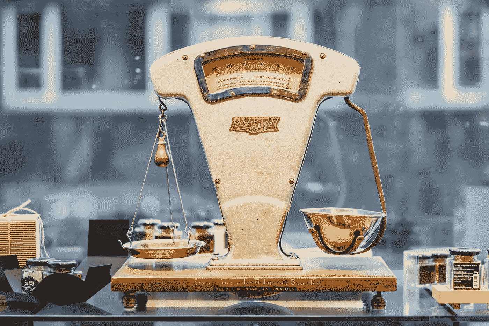
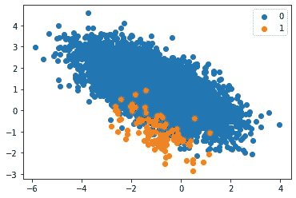
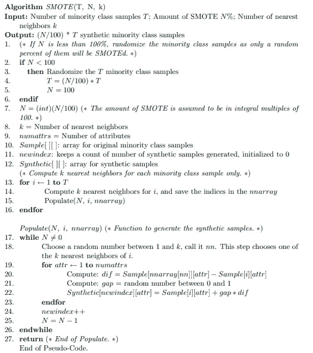
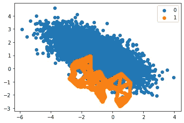

# 合成少数过采样技术及其从头实现

> 原文：<https://towardsdatascience.com/introduction-to-synthetic-minority-over-sampling-technique-and-its-implementation-from-scratch-77593647c10d?source=collection_archive---------10----------------------->

[**Piret Ilver**](https://unsplash.com/@saltsup)**on**[**Unsplash**](https://unsplash.com/)

## 一种从不平衡数据集中构造分类器的方法

# 不平衡数据集

如果分类标签没有被同等地表示，则数据集是不平衡的，因此 100 比 1 数量级的不平衡在诸如欺诈检测的大量真实世界场景中是常见的问题。已经进行了大量的尝试来解决这个问题。然而，这个问题仍然被广泛讨论和研究。在本文中，我想谈谈在这种情况下使用的一种简单而有趣的方法。为了让它更有趣，我想讨论一下它可能的应用和实现。

模型的性能通常通过其预测准确性来评估。然而，当处理不平衡数据集时，这是不合适的。让我们考虑下面的例子

不平衡二分类问题的散点图

在上面的玩具数据集中，有 9900 个样本属于类别 0，而后者只有 100 个样本，比例为 1:100。假设您正在使用上述数据集训练您的模型，而不考虑分布。处理不平衡数据集时发生的最大问题是模型变得偏向主导类。因此，对于一个模型来说，给每个样本分配一个标签 0 以达到 99%的准确率并不困难。然而，重要的是使用不同的度量标准，这可以给你更多的洞察力。如果我们的任务是分类垃圾邮件，我们的模型将完全无用。当然，获得更多的数据总是更好的；然而，这可能极其困难。

# 处理不平衡数据

有不同的方法来解决这个问题。一些常见和简单的是欠采样和过采样。大多数情况下，过采样优于欠采样技术，因为通过移除数据，我们可能会丢失一些重要特征。然而，随机过采样可能导致过拟合，这是另一个问题。也可以两者并用，实现相对平衡的数据。然而，我想介绍一个简单而有趣的算法，它允许我们生成合成数据。

## SMOTE:合成少数过采样技术

SMOTE 是一种过采样技术，允许我们为少数类别生成合成样本。下面的算法描述了 SMOTE 的工作原理。请慢慢理解。

SMOTE 算法摘自[这篇论文。](https://arxiv.org/pdf/1106.1813.pdf)

正如我们所看到的，这个想法是基于 K-最近邻算法。如果你不熟悉，我会附上我的文章，以及它的 Python 实现:)。因此，我们得到一个样本和它的 k 个最近邻之一之间的差，并乘以(0，1)范围内的某个随机值。最后，我们通过添加从前面的操作中获得的值来生成一个新的合成样本。

SMOTE 变换的不平衡二分类问题散点图

上图显示了我们应用 SMOTE 后的数据集。现在，每个类别有 9900 个样本。

> 为什么它对我有意义

如果您有图像分类的经验，图像增强是一种用于获取更多训练样本的非常常见的技术。然而，假设一个模型试图将一幅图像转换到某个高维空间，一个增强的样本应该落在它的原始样本附近的某个地方。因此，在 SMOTE 的情况下，合成样本将等同于增强图像。然而，毫无疑问，收集更多的数据更好，因为它有助于收集特定对象的更广泛的表示。

# 履行

我附上我为 Pytorch 编写的 SMOTE 实现。这很容易翻译成数字。

> 一些应用

假设，您正在使用嵌入开发一个推荐系统，并且您能够检索与一个人喜欢的项目相关联的嵌入。然而，没有足够的关于某个用户的数据来产生一些有意义的推荐。因此，您可以使用现有的嵌入和生成合成嵌入，并计算更有用的推荐。因此，你可以想象使用 SMOTE 作为某种测试时间增加(TTA)。

# 一些遗言

如果分类标签没有被同等地表示，则数据集是不平衡的，因此 100 比 1 数量级的不平衡在诸如欺诈检测的大量真实世界场景中是常见的问题。已经进行了大量的尝试来解决这个问题。然而，这个问题仍然被广泛讨论和研究。今天，您将了解一个简单而有趣的算法来生成合成样本。其实 SMOTE 版本有很多种。您可以查看更多不同版本的 SMOTE 算法，并比较它们相对于原始版本的优势。上面的实现可以很容易地在我的 [GitHub](https://github.com/chingisooinar/SMOTE-Pytorch) 上找到。

# 纸

[SMOTE:合成少数过采样技术](https://arxiv.org/pdf/1106.1813.pdf)

# **相关文章**

</k-nearest-neighbours-knn-algorithm-common-questions-and-python-implementation-14377e45b738>  </handling-imbalanced-datasets-in-machine-learning-7a0e84220f28>  </5-smote-techniques-for-oversampling-your-imbalance-data-b8155bdbe2b5> 