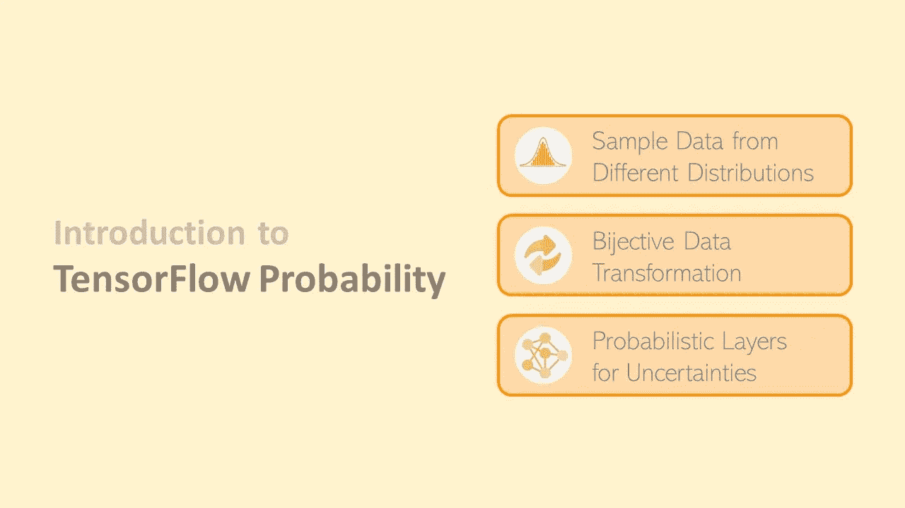
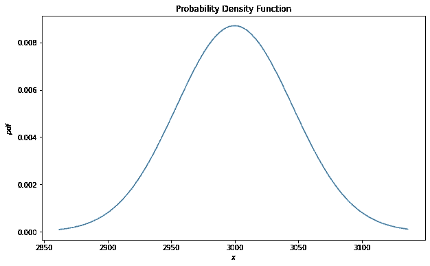
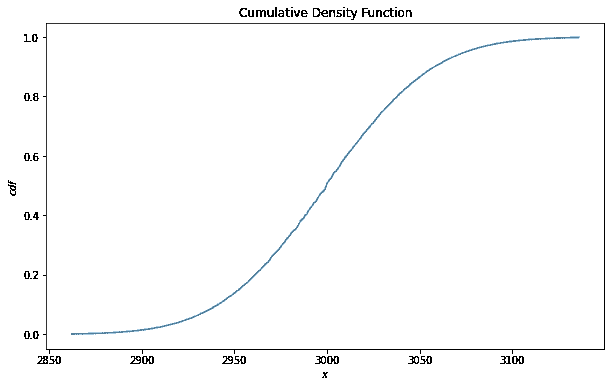
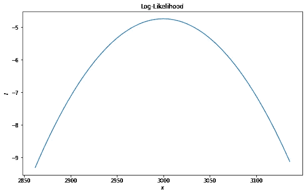
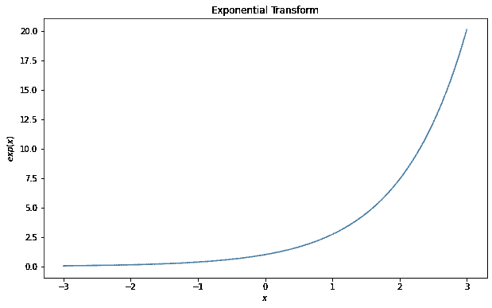
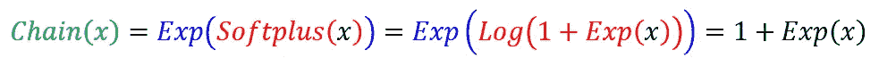
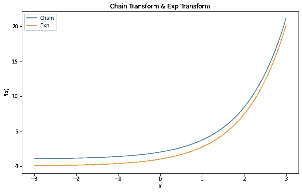
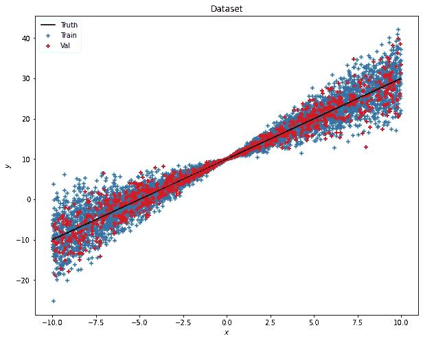
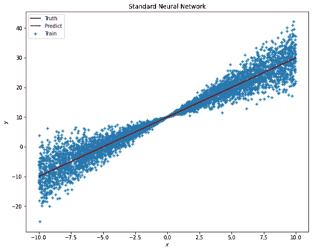
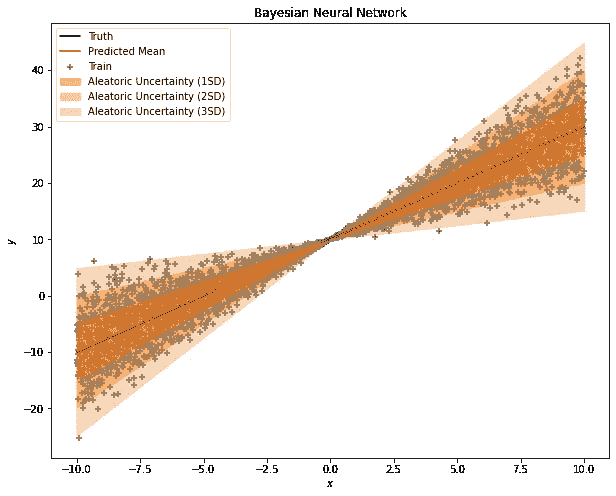

# 张量流概率简介

> 原文：<https://towardsdatascience.com/introduction-to-tensorflow-probability-6d5871586c0e?source=collection_archive---------3----------------------->

## 用张量流概率建立贝叶斯神经网络不应错过的关键模块



照片由 [cyda](https://blog.cyda.hk/)

# 目标

在前面的文章中，我们讨论了贝叶斯神经网络(BNN)的概念及其背后的数学理论。对于那些刚到 BNN 的人，确保你已经检查了下面的链接。

[](/why-you-should-use-bayesian-neural-network-aaf76732c150) [## 为什么你应该使用贝叶斯神经网络？

### 贝叶斯神经网络解释了模型中的不确定性，并提供了权重和权重的分布

towardsdatascience.com](/why-you-should-use-bayesian-neural-network-aaf76732c150) [](/8-terms-you-should-know-about-bayesian-neural-network-467a16266ea0) [## 关于贝叶斯神经网络你应该知道的 8 个术语

### 先验，后验，贝叶斯定理，负对数似然，KL 散度，替代，变分…

towardsdatascience.com](/8-terms-you-should-know-about-bayesian-neural-network-467a16266ea0) 

今天，我们将探索使用张量流概率来实现 BNN 模型的概率规划。从本文中，您将学习如何使用张量流概率来

1.  构建不同的**发行版**并从中取样。
2.  使用**双射函数**转换数据。
3.  将**概率层**与 Keras 结合起来构建 BNN 模型。
4.  推论并说明不同类型的**不确定性**。

# 什么是张量流概率？

TensorFlow Probability (TFP)是 TensorFlow 中用于概率推理和统计分析的库。它提供了概率方法与深度网络的集成，使用自动微分的基于梯度的推理，以及通过硬件加速(GPU)和分布式计算对大型数据集和模型的可扩展性。事实上，TFP 是一个综合的工具，由许多模块组成，包括概率层、变分推理、MCMC、Nelder-Mead、BFGS 等。但我不会深入所有模块，只会挑选和演示其中的一部分。如果你想知道更多的细节，请查看下面的技术文档。

[](https://www.tensorflow.org/probability) [## 张量流概率

### TensorFlow Probability (TFP)是一个基于 TensorFlow 构建的 Python 库，它可以很容易地组合概率模型…

www.tensorflow.org](https://www.tensorflow.org/probability) 

# 分布

作为概率编程包，TFP 支持的关键模块之一是不同种类的统计分布。老实说，我不得不说 TFP 做得非常好，它覆盖了相当多的发行版(包括很多我不知道是什么的发行版，哈哈)。经过统计，我发现截至 2021 年 10 月，已经提供了 117 个发行版。我不打算在这里列出他们的名字。更多细节，可以查看他们的 api 文档[这里](https://www.tensorflow.org/probability/api_docs/python/tfp/distributions)。

今天，我想和大家分享一些我认为有用的功能。在下面，我将使用二项式作为说明。

```
import tensorflow_probability as tfp
tfd = tfp.distributionsn = 10000
p = 0.3
binomial_dist = tfd.Binomial(total_count=n, probs=p)
```

> **1。样本数据**

假设我们想从刚刚创建的二项分布中抽取 5 个样本。您只需使用 ***样本*** 方法，并指定您想要抽取的样本数量。

```
binomial_dist.sample(5)
```

*< tf。张量:shape=(5，)，dtype=float32，numpy = array(
【3026。, 3032., 2975., 2864., 2993.]，dtype=float32) >*

> **2。汇总统计数据**

另一个很酷的特性是获取汇总统计数据。对于像二项式这样的简单分布，我们可以很容易地通过下式得出统计数据


照片由 [cyda](https://blog.cyda.hk/) 拍摄

然而，对于一些复杂的分布，计算统计数据可能并不容易。但是现在你可以简单地利用这些工具。

```
mu = binomial_dist.mean()
std = binomial_dist.stddev()
print('Mean:', mu.numpy(), ', Standard Deviation:', std.numpy())
```

*均值:3000.0，标准差:45.825756*

> 3.**概率密度函数(PDF)**

要找到给定的 *x* 的 PDF，我们可以使用 ***prob*** 的方法。

```
x = 3050
pdf = binomial_dist.prob(x)
print('PDF:', pdf.numpy())
```

*PDF: 0.004784924*

```
import matplotlib.pyplot as plt
fig = plt.figure(figsize = (10, 6))
x_min = int(mu-3*std)
x_max = int(mu+3*std)
pdf_list = [binomial_dist.prob(x) for x in range(x_min, x_max)]
plt.plot(range(x_min, x_max), pdf_list)
plt.title('Probability Density Function')
plt.ylabel('$pdf$')
plt.xlabel('$x$')
plt.show()
```



cyda 拍摄的照片

> **4。累积密度函数**

要找到给定 *x* 的 CDF，我们可以使用方法 ***cdf*** 。

```
x = 3050
cdf = binomial_dist.cdf(x)
print('CDF:', cdf.numpy())
```

*CDF: 0.865279*

```
fig = plt.figure(figsize = (10, 6))
x_min = int(mu-3*std)
x_max = int(mu+3*std)
cdf_list = [binomial_dist.cdf(x) for x in range(x_min, x_max)]
plt.plot(range(x_min, x_max), cdf_list)
plt.title('Cumulative Density Function')
plt.ylabel('$cdf$')
plt.xlabel('$x$')
plt.show()
```



cyda 拍摄的照片

> **5。对数似然**

我想介绍的最后一个方法是 ***log_prob*** 。这用于计算对数似然。根据前两篇文章，我想每个人都会意识到这有多重要，因为我们总是用它作为损失函数。因此，要找到对数似然，我们只需调用

```
x = 3050
l = binomial_dist.log_prob(x)
print('Log-likelihood:', l.numpy())
```

*对数可能性:-5.342285*

```
fig = plt.figure(figsize = (10, 6))
x_min = int(mu-3*std)
x_max = int(mu+3*std)
l_list = [binomial_dist.log_prob(x) for x in range(x_min, x_max)]
plt.plot([j for j in range(x_min, x_max)], l_list)
plt.title('Log-Likelihood')
plt.ylabel('$l$')
plt.xlabel('$x$')
plt.show()
```



cyda 拍摄的照片

# 双喷射器

双射体是由张量流命名的术语，基本上是指双射变换。根据定义，双射变换是两个集合的元素之间的函数，其中一个集合的每个元素恰好与另一个集合的一个元素配对，而另一个集合的每个元素恰好与第一个集合的一个元素配对。

对我来说，我会把双对象看作是现成的数据转换函数。在这里你可以找到很多常用的函数，比如***Log******Exp******Sigmoid******Tanh******soft plus******soft sign***等等。

您可以简单地用下面的代码调用 bijector。

```
tfb = tfp.bijectors
exp = tfb.Exp()
```

要应用转换，只需将值传递给对象。

```
import numpy as np
x = np.linspace(-3, 3, 100)
y = exp(x)fig = plt.figure(figsize = (10, 6))
plt.plot(x, y)
plt.title('Exponential Transform')
plt.ylabel('$exp(x)$')
plt.xlabel('$x$')
plt.show()
```



cyda 拍摄的照片

我想分享一个小技巧，有一个名为 ***Chain、*** 的双射器，用于应用一系列双射器。例如，如果我们想将 *x* 传递给 ***softplus*** 函数，然后传递给 ***exp*** 函数。我们可以这样写

```
exp = tfb.Exp()
softplus = tfb.Softplus()
chain = tfb.Chain([exp, softplus])
```

这样做相当于



cyda 拍摄的照片

```
x = np.linspace(-3, 3, 100)
y_chain = chain(x)
y_exp = exp(x)fig = plt.figure(figsize = (10, 6))
plt.plot(x, y_chain, label = 'Chain')
plt.plot(x, y_exp, label = 'Exp')
plt.title('Exponential Transform')
plt.ylabel('$exp(x)$')
plt.xlabel('$x$')
plt.legend()
plt.show()
```



由 [cyda](https://blog.cyda.hk/) 拍摄

# 层

***tfp.layers*** 模块通过将原来的层替换为概率层，为开发人员建立了一个用户友好的界面，方便他们将模型从标准神经网络切换到贝叶斯神经网络。在下面，我将列出一些我经常使用的层作为参考。

*   **认知的不确定性**
*   **独立正态** : 随机不确定性
*   **分布λ**:随机不确定性

## ***1。创建数据集***

因此，为了训练 BNN 模型，首先，我们必须创建数据集。

```
def create_dataset(n, x_range, slope=2, intercept=10, noise=0.5):
    x_uniform_dist = tfd.Uniform(low=x_range[0], high=x_range[1])
    x = x_uniform_dist.sample(n).numpy().reshape(-1, 1)
    y_true = slope*x+intercept
    eps_uniform_dist = tfd.Normal(loc=0, scale=1)
    eps = eps_uniform_dist.sample(n).numpy().reshape(-1, 1)*noise*x
    y = y_true + eps
    return x, y, y_truen_train = 5000
n_val = 1000
n_test = 5000
x_range = [-10, 10]
x_train, y_train, y_true = create_dataset(n_train, x_range)
x_val, y_val, _ = create_dataset(n_val, x_range)
x_test = np.linspace(x_range[0], x_range[1], n_test).reshape(-1, 1)
```

样本数据实际上是一个线性拟合，带有一个异质方差以及 *x* 的值。为了更好地可视化，您可以使用以下代码进行绘图。

```
def plot_dataset(x_train, y_train, x_val, y_val, y_true, title):
    fig = plt.figure(figsize = (10, 8))
    plt.scatter(x_train, y_train, marker='+', label='Train')
    plt.scatter(x_val, y_val, marker='+', color='r', label='Val')
    plt.plot(x_train, y_true, color='k', label='Truth')
    plt.title(title)
    plt.xlabel('$x$')
    plt.ylabel('$y$')
    plt.legend()
    plt.show()plot_dataset(x_train, y_train, x_val, y_val, y_true, 'Dataset')
```



cyda 拍摄的照片

## 2.标准神经网络

在训练 BNN 之前，我想制作一个标准的神经网络作为比较的基线。

```
import tensorflow as tf
tfkl = tf.keras.layers# Model Architecture
model = tf.keras.Sequential([
    tfkl.Dense(1, input_shape = (1,))
])# Model Configuration
model.compile(optimizer=tf.optimizers.Adam(learning_rate=0.01), loss=tf.keras.losses.MeanSquaredError())# Early Stopping Callback
callback = tf.keras.callbacks.EarlyStopping(monitor='val_loss', patience=30, min_delta=0, mode='auto', baseline=None, restore_best_weights=True)# Model Fitting
history = model.fit(x_train, y_train, validation_data=(x_val, y_val), epochs=1000, verbose=False, shuffle=True, callbacks=[callback], batch_size = 100)
```

正如你可能观察到的，简单模型只设置了一个 ***密集*** 隐藏层，为了检查模型的执行情况，我们可以使用 ***预测*** 方法。

```
y_pred = model.predict(x_test)
fig = plt.figure(figsize = (10, 8))
plt.scatter(x_train, y_train, marker='+', label='Train')
plt.plot(x_train, y_true, color='k', label='Truth')
plt.plot(x_test, y_pred, color='r', label='Predict')
plt.legend()
plt.title('Standard Neural Network')
plt.show()
```



cyda 拍摄的照片

看起来，预测与预期的真实线性线相匹配。然而，使用 SNN 不能告诉预测的不确定性。

## 3.贝叶斯神经网络

所以就到了主菜。让我们一步一步地讨论代码。

**3.1 模型架构**

```
tfpl = tfp.layersmodel = tf.keras.Sequential([
    tfkl.Dense(2, input_shape = (1,)),
    tfpl.DistributionLambda(lambda t: tfd.Normal(loc=t[..., :1], scale=1e-3+tf.math.abs(t[...,1:])))
])
```

你可能会注意到，我们将有一个 ***密集*** 层输出两个神经元。你能猜出这两个参数是干什么用的吗？它们是**均值**和**标准差**，将被传递给我们在 ***分布层*** 中指定的正态分布。

**3.2 车型配置**

```
negloglik = lambda y_true, y_pred: -y_pred.log_prob(y_true)
model.compile(optimizer=tf.optimizers.Adam(learning_rate=0.01), loss=negloglik)
```

根据我们在以前文章中的讨论，我们将对 BNN 使用负对数似然，而不是 MSE。如果你不知道我在说什么，我强烈建议你回到前两篇文章，先熟悉一下概念和理论。

**3.3 训练模型**

```
# Early Stopping Callback
callback = tf.keras.callbacks.EarlyStopping(monitor='val_loss', patience=300, min_delta=0, mode='auto', baseline=None, restore_best_weights=True)# Model Fitting
history = model.fit(x_train, y_train, validation_data=(x_val, y_val), epochs=10000, verbose=False, shuffle=True, callbacks=[callback], batch_size = 100)
```

这里没有什么特别的，基本上一切都和 SNN 的场景相似，所以我将跳过这一部分。

**3.4 预测**

今天最有价值的代码就在这里。

```
# Summary Statistics
y_pred_mean = model(x_test).mean()
y_pred_std = model(x_test).stddev()
```

通过调用 ***mean*** 和 ***stddev*** 函数，现在可以告诉你预测的不确定性水平。

```
fig = plt.figure(figsize = (10, 8))
plt.scatter(x_train, y_train, marker='+', label='Train')
plt.plot(x_train, y_true, color='k', label='Truth')
plt.plot(x_test, y_pred_mean, color='r', label='Predicted Mean')
plt.fill_between(x_test.ravel(), np.array(y_pred_mean+1*y_pred_std).ravel(), np.array(y_pred_mean-1*y_pred_std).ravel(), color='C1', alpha=0.5, label='Aleatoric Uncertainty (1SD)')
plt.fill_between(x_test.ravel(), np.array(y_pred_mean+2*y_pred_std).ravel(), np.array(y_pred_mean-2*y_pred_std).ravel(), color='C1', alpha=0.4, label='Aleatoric Uncertainty (2SD)')
plt.fill_between(x_test.ravel(), np.array(y_pred_mean+3*y_pred_std).ravel(), np.array(y_pred_mean-3*y_pred_std).ravel(), color='C1', alpha=0.3, label='Aleatoric Uncertainty (3SD)')
plt.title('Bayesian Neural Network')
plt.xlabel('$x$')
plt.ylabel('$y$')
plt.legend()
plt.show()
```



cyda 拍摄的照片

# 结论

看，你现在能够区分模型输出的任意不确定性。等等，那么认知的不确定性在哪里？我把这部分留给你们去进一步探索。提示是将 ***密集*** 层替换为 ***密集*** 层。去试试吧。=)