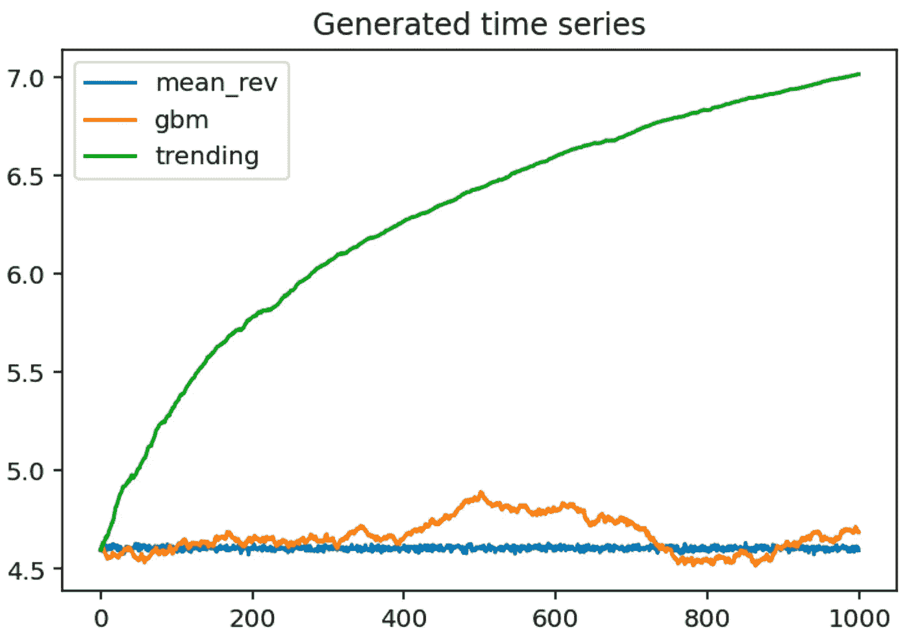

# 赫斯特指数简介 Python 代码

> 原文：<https://towardsdatascience.com/introduction-to-the-hurst-exponent-with-code-in-python-4da0414ca52e?source=collection_archive---------4----------------------->


图片由 [StockSnap](https://pixabay.com/users/stocksnap-894430/?utm_source=link-attribution&utm_medium=referral&utm_campaign=image&utm_content=2616931) 来自 [Pixabay](https://pixabay.com/?utm_source=link-attribution&utm_medium=referral&utm_campaign=image&utm_content=2616931)

## 一种快速调查给定时间序列是趋势、均值回复还是随机游走的方法

在金融领域，一些最常用的交易策略是基于动量和均值回复的。我将试着对这两者做一个简单的解释。

在**基于动量的策略**中，投资者试图利用现有市场趋势的持续性。例如，在最后一个利息期，某家公司经营良好，股价随着时间的推移稳步上升。在这种情况下，投资者可能会押注价格将继续上涨，从而进入多头头寸。或者*反之*为空头。自然，策略不是那么简单，进入和退出的决定通常是基于一系列的技术指标。

**均值回归**假设股票收益和波动性等属性会随着时间的推移回归到它们的长期平均值。在数学上，这样的时间序列被称为[奥恩斯坦-乌伦贝克](http://en.wikipedia.org/wiki/Ornstein%E2%80%93Uhlenbeck_process)过程。在这种策略中，投资者试图通过假设在一些极端事件(无论是积极的还是消极的)之后，股价将恢复到长期模式来赚钱。

我们可以很容易地在描绘股价随时间演变的图上识别出这两种模式。然而，当建立自动交易策略时，手动检查每一只股票并决定哪种模式在图上可见是不可行的。这就是为什么我们需要使用某种自动化的方法来确定在给定的股票价格中我们可以观察到两种模式中的哪一种。

在本文中，我将介绍如何使用 Hurst 指数来识别给定的时间序列(不仅仅是股票价格或收益等金融时间序列)是趋势性的、均值回复的还是简单的随机游走。

# 赫斯特指数

我们可以使用**赫斯特指数** (H)作为时间序列长期记忆的度量，也就是说，测量该序列偏离随机游走的程度。标量代表时间序列强烈回归平均值(均值回复模式)或在某个方向聚集(趋势模式)的相对趋势。

赫斯特指数的值介于 0 和 1 之间。根据 **H** 的值，我们可以将任何时间序列分为三类:

*   **H < 0.5** —均值回复(反持续)系列。该值越接近 0，均值回归过程越强。实际上，这意味着高值后面跟着低值，反之亦然。
*   **H = 0.5** — 一个几何随机游走。
*   **H > 0.5** —趋势(持续)系列。数值越接近 1，趋势越强。实际上，这意味着一个高值后面跟着一个更高的值。

至少有几种计算赫斯特指数的方法。不幸的是，他们的结论并不总是一致的(你可以在这里看到一个这样的例子[)。](https://mybinder.org/v2/gh/mmngreco/quantdare_posts/master?filepath=marzo_14/persistence_cc.ipynb)

在本文中，我将只展示最简单的实现，它是基于对数价格的方差来估计**扩散行为**的速率。

先把 *x* 定义为股价的对数 *S* 。


任意滞后的方差(用 *τ* 表示)可以表示为:


如果股票价格遵循几何布朗运动(GBM，随机漫步)，方差将随着滞后 *τ:* 线性变化


然而，股票价格并不总是遵循 GBM。在偏离随机游走的情况下(因此当某种形式的自相关存在时)，给定滞后的方差不再与滞后本身成比例，但它会获得一个[异常指数](https://en.wikipedia.org/wiki/Anomalous_diffusion)。新关系如下所示:


其中 H 再次代表赫斯特指数。

另一种计算赫斯特指数的可能方法是基于 [**重标范围(R/S)分析**](https://www.investopedia.com/terms/r/rescaled-rangeanalysis.asp) 。为了保持文章的简短，我不会在这里描述所有需要的步骤，但会让你参考一个[逐步说明](https://en.wikipedia.org/wiki/Hurst_exponent)。文献表明，与其他方法(如自相关分析、方差比等)相比，使用 R/S 统计会产生更好的结果。但是，它也有一个缺点，就是对短程依赖非常敏感。

# Python 中的示例

和往常一样，我们需要首先导入一些库。然而，这一次我们不会完全依赖于一个库，而是自己创建一个函数来计算 Hurst 指数。

然后，我们准备数据。作为一个真实的例子，我们将使用标准普尔 500 10 年的历史价格。我们可以使用`yfinance`库轻松下载价格。如果你对库的更多细节感兴趣，请查看我的另一篇文章。


作者图片

我们还将生成一些人工数据来反映赫斯特指数可以识别的所有三种情况:均值回复、随机游走和趋势。我们在下面的代码片段中这样做。



作者图片

我想说这个系列清楚地展示了我们希望他们展示的模式。也许趋势图有点矫枉过正，但至少应该很容易正确分类。

下一步是定义一个用于计算赫斯特指数的函数。

为了计算赫斯特指数，我们首先计算一个序列和它的滞后版本之间的差异的标准偏差，对于一系列可能的滞后。然后，我们将赫斯特指数估计为滞后数对上述标准偏差的双对数图的斜率。

滞后的数量多少有些随意。默认值 20 基于 Matlab 对 Hurst 函数的实现。然而，据文献报道，如果我们将滞后数设置得太高，结果可能会不准确。我们会尽快调查的。

让我们从标准普尔 500 的数据开始。总的来说，我们可以在图上看到该系列的趋势——除了一些例外，总体趋势是积极的。我们通过选择最大滞后值来计算赫斯特指数，看看它是如何影响指数值的。

默认值为 20，标准普尔 500 系列似乎是轻度均值回归。随着我们增加滞后的数量，均值回复只会更强(指数值向 0 递减)。

```
Hurst exponent with 20 lags: 0.4394 
Hurst exponent with 100 lags: 0.3834 
Hurst exponent with 300 lags: 0.3257 
Hurst exponent with 500 lags: 0.3231 
Hurst exponent with 1000 lags: 0.1795
```

请记住，这些值是为 10 年系列获得的。如果我们把范围缩小到某个时间段，结论可能会大不相同！这也是在实践中使用赫斯特指数时需要记住的事情。

现在是时候为人工生成的系列重复这个练习了。让我们看看基于赫斯特指数的结论是否会与预期相符。

```
Hurst exponents with 20 lags ---- 
mean_rev: 0.0064 
gbm: 0.4539 
trending: 0.8715 
Hurst exponents with 100 lags ---- 
mean_rev: -0.0021 
gbm: 0.5401 
trending: 0.8442 
Hurst exponents with 300 lags ---- 
mean_rev: 0.0002 
gbm: 0.5691 
trending: 0.7463 
Hurst exponents with 500 lags ---- 
mean_rev: 0.0015 
gbm: 0.4854 
trending: 0.6662
```

均值回复序列的结论在所有滞后值上都是最一致的。我们应该注意，最大滞后的负值 100 可能是由于一些近似值，按照设计，它应该停止在 0。

对于随机游走系列，指数的值在预期的 0.5 附近振荡。

最后，趋势系列由所有选定滞后的 Hurst 指数正确识别，然而，随着我们增加滞后，指数的值向 0.5 减小，这将表明随机游走。

我们可以得出结论，总的来说，结果足够接近最初的预期，但是，我们考虑的滞后的最大值会影响我们的结论。这种分析表明，一个给定的序列既不是纯粹的均值回复序列，也不是趋势序列。政权的状态取决于我们是着眼于短期还是长期(通过观察不同范围的滞后)。这就是为什么在实际尝试根据赫斯特指数制定交易策略之前，最好先对它有一些 T2 的感觉。

最后，如前所述，有相当多的方法来计算赫斯特指数。对于基于重标范围(R/S)分析的赫斯特指数的实现，您可以查看`hurst`库([库](https://github.com/Mottl/hurst))。我没有在本文中使用它，因为这个库还没有开发(最后一次更新是在 2 年前)。但是，你绝对可以试一试。

# 外卖食品

*   赫斯特指数是时间序列中记忆的一种度量，用于将序列分类为均值回复、趋势或随机游走。
*   根据最大滞后参数的选择(即，我们看的是短期还是长期)，结果可能会有很大不同。
*   有几种方法可以计算 Hurst 指数，最常用的两种方法是基于异常扩散和重标极差分析。

您可以在我的 [GitHub](https://github.com/erykml/medium_articles/blob/master/Time%20Series/hurst_exponent.ipynb) 上找到本文使用的代码。此外，欢迎任何建设性的反馈。你可以在推特上或者评论里联系我。

*免责声明:前方加盟商链接*

最近，我在进行基于动量交易策略的 MOOC 时遇到了赫斯特指数。Quantra 是一个提供交互式课程的平台，重点是量化金融的 Python。我给[写了一篇短文](/quantra-a-python-coding-platform-to-learn-quantitative-finance-8e5e88c89120#f0c9-3f7942496ad2)，展示了这个平台的一些特性，并描述了我的个人经历。

如果您喜欢这篇文章，您可能还会对以下内容感兴趣:

</introduction-to-backtesting-trading-strategies-7afae611a35e>  </the-best-book-to-start-learning-about-time-series-forecasting-69fcc618b6bb>  

# 参考

*   Kroha，p .，& Skoula，M. (2018 年 3 月)。赫斯特指数和来自市场时间序列的交易信号。在*冰之石①*(第 371–378 页)。
*   赫斯特先生(1951 年)。水库的长期蓄水能力。ASCE 交易，116(776)，770–808。
*   [https://mybinder.org/v2/gh/mmngreco/quantdare_posts/master?file path = marzo _ 14/persistence _ cc . ipynb](https://mybinder.org/v2/gh/mmngreco/quantdare_posts/master?filepath=marzo_14/persistence_cc.ipynb)
*   [https://www . quant start . com/articles/Basics-of-Statistical-Mean-Reversion-Testing/](https://www.quantstart.com/articles/Basics-of-Statistical-Mean-Reversion-Testing/)