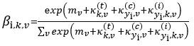
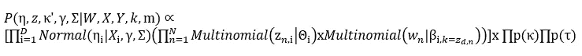

# 结构主题模型(STM)简介

> 原文：<https://towardsdatascience.com/introduction-to-the-structural-topic-model-stm-34ec4bd5383?source=collection_archive---------11----------------------->

## 使用主题模型进行社会科学研究的独特方式

马林·斯特兰德瓦尔在 [Unsplash](https://unsplash.com?utm_source=medium&utm_medium=referral) 上拍摄的照片

关于主题建模最酷的事情之一是它在许多领域都有应用。它可以帮助激发探究，提供对文本的独特见解，并为您提供组织文档的新方法。

结构主题模型(STM)是一种专门为社会科学研究设计的主题模型。STM 允许我们将元数据合并到我们的模型中，并揭示不同的文档如何使用不同的单词选择来谈论相同的潜在主题。

# 激励 STM

主题建模描述了在文档语料库中发现潜在的主题。最著名的话题模型大概是[潜在狄利克雷分配(LDA)](https://jmlr.org/papers/volume3/blei03a/blei03a.pdf) 。LDA 的基本前提是将文档建模为主题的分布(主题流行度)和主题作为词的分布(主题内容)。查看这个媒体指南，了解一些关于 LDA 的基础知识。

LDA 很棒，但它确实做了一些限制性的假设:

1.  文档中的 opics 相互独立。在英语中:仅仅因为文件 1 有潜在主题 1，它没有给我们任何信息是否文件 1 有潜在主题 2，3，等等。
2.  词在主题(即主题内容)中的分布是固定的。在英语中:文档 1 的主题 1 使用与文档 2、3 等的主题 1 相同的单词。
3.  主题可以完全基于文档的文本进行建模。在英语中:LDA 在确定主题时只查看文档的文本，不考虑任何其他信息(作者、日期、来源)。

为了解决独立性的第一个假设，看看[相关主题模型](/intuitive-guide-to-correlated-topic-models-76d5baef03d3) (CTM)。STM 采用了 CTM，但是在此基础上增加了一些特性。

从社会科学或人文科学的角度来看，假设二有些次优。两份文件可能是关于同一个主题——比如抗议——但是从不同的角度来看这个主题。也许一方倾向于强调“警察暴行”或“和平抗议者”，而另一方则使用“法律与秩序”和“激进暴徒”这样的术语。这两个文档可以说是关于相同的主题，但是主题内容(即组成主题的单词)因文档而异。

至于第三个假设，我们可以想象特定文档的主题流行度和主题内容都与关于该文档的“元数据”相关。例如，某些来源可能更倾向于写政治或以特定的方式写政治。元数据可以包括发布日期、作者、出版物、社交媒体上的喜欢，或者关于文档的任何数量的分类或数字变量。

# STM 解决方案

在 LDA 中，我们的主题流行度和内容来自我们预先设置的具有超参数的狄利克雷分布——有时被称为 *a* 和 *b* 。使用 STM，我们的主题流行度和内容来自文档元数据。我们将用于生成主题流行度的文档元数据矩阵称为“ *X* ”，用于生成主题内容的文档元数据矩阵称为“ *Y* ”然而，为了简单起见，我们假设 *X* = *Y* (也就是说，我们在两种情况下使用相同的元数据)，并且两者都是 *dxp* 矩阵，其中 *d* 是语料库中文档的数量， *p* 是我们将使用的元数据特征的数量。

# 话题流行度

对于主题流行度，我们的目标是得到每个文档的概率向量，我们称之为θᵢ.我们需要从特定文档的 *X* ᵢ(一个 *1xp* 元数据向量)到θᵢ(一个 *1xk* 向量，其条目总和为 1，本质上对应于该文档有多少是由给定主题组成的。出于我们的目的， *i* 仅仅意味着这个θ是特定于一个给定的文档 *i* 抱歉；下标" *i* "通常是下标" *d* "，就像文献中的" document "一样，但是我怎么也找不到一个 Unicode 下标" d "。

为了得到θᵢ，我们将把 *X* ᵢ乘以一个叫做“τ”的权重矩阵 *pxk* τ从何而来？我们把τ的列叫做“γ” [R STM](https://cran.r-project.org/package=stm) 包的默认设置是针对 *γₚ,ₖ~N(0，σₖ )* 其中*σₖ~半柯西(1，1)* 。

从解释上来说，*半柯西(1，1)* 先验意味着大多数参数将从零附近开始(正态分布的平均值为零，而*半柯西(1，1)* 意味着方差也将接近零)。在推理步骤中，我们将学习实际的参数值，但是这些参数的先验会将这些值拉向零，这意味着只有与主题高度相关的元数据才会最终产生影响。半柯西先验将非影响系数*收缩到*零，但实际上并不将参数归零。如果你有大量的元数据，而这些元数据可能与文档的主题不相关(例如，一键编码的特性)，我们可能希望引入稀疏性。对于这些情况，R 包支持带有 L1 或弹性网正则化的伽玛先验。

在我们陷入 STM 的实现细节之前，最重要的事情是我们已经完成了从一个 *1xp* 元数据向量到一个 *1xk* 向量的线性转换，大致对应于主题流行度。

我们仍然没有一个概率向量。从τ * *X* ᵢ得到的矢量将作为最终生成θ的逻辑正态分布的平均值:

θᵢ ~逻辑正常(τ *X* ᵢ，σ)

这意味着我们将τ *X* ᵢ的结果视为方差为σ的多元正态分布的平均值。事实上，σ是 *kxk* 主题协方差矩阵(更全面的解释见 CTM)，这就是我们如何打破假设一，将主题之间的相关性纳入我们的模型。然后，我们将多元正态分布的结果向量(称为η)通过逻辑函数转换成概率。

从这里开始，它只是常规的 LDA，其中我们基于由这些主题概率组成的多项式来生成每个单词的主题( *z* )，即 *z* ᵢ,ₙ~ *多项式(* θᵢ *)，*用于文档 *i* 中的每个 *n* 单词。既然我们已经知道了文档中每个单词的主题，我们仍然需要计算出不同单词对于给定主题的概率，这将在下一节中探讨。

# 主题内容

对于文档的主题内容，我们从 *Y* ᵢ开始，我们的 *1xp* 给定文档的元数据向量 *i.* 我们的最终目标是一个叫做βᵢ的 *kxV* 矩阵，其中 *V* 是我们的词汇长度。在βᵢ，每一个 *k* 行都只是一个概率向量，其中每一列的值都是该主题生成一个单词的概率。正如下标 *i* 所示，这个β是特定于单个给定文档的。

为了获得单个文档(βᵢᵏ)中单个主题的单词概率，我们将从基线单词概率开始，我们称之为 *m* 。 *m* 是一个 *1xv* 向量，基本上代表了全局单词概率:通常这意味着任意给定单词在语料库中的对数转换率，但也可以根据一些已知的词频预先设定。

从那里，我们将偏离基线，加入一些向量，我们称之为κ。注意，κ (kappa)和*k*不一样，我知道这很混乱，但请记住，κ是一组偏离全局词频的偏差，而 *k* 是主题的数量。

首先，我们将添加一个偏离基线的主题，名为κₖᵗ.上标“*t”*只是提醒这是我们的“主题”偏差，而“*k”*下标则进一步提醒这种偏差是特定于主题 *k* 的。更准确地说，κᵗ是一个带有κₖᵗ的矩阵，意味着我们现在只看第 k 行。无论如何，在这一点上，它基本上像常规的 LDA 一样，因为κₖᵗ是主题对词频的非文档特定影响。

其次，我们将通过向基线添加文档偏差来改进 LDA，我们称之为κᵧᵢᶜ(假设“γi”实际上是“ *y* ᵢ"… Unicode 再次胜过我)。上标“c”只是象征这是“协变量”偏差(元数据的另一种说法)，而γi/ *y* ᵢ也表示这个协变量来自特定文档的元数据。换句话说，κᵧᵢᶜ是基于模型认为元数据将如何影响我们的词频的偏差。

最后，为了更好地衡量，我们将添加一个与主题和协变量(又名元数据)的交互偏差:κᵧᵢ,ₖ,ᵥⁱ.这里没有什么值得大书特书的；这最后一个κ术语仅仅涵盖了我们的基础，以防元数据和给定主题之间存在影响词频的“相互作用”(上标“*I”*表示)。

一旦我们将所有这些加在一起，我们就可以应用一些逻辑转换，我们将得到给定文档中给定主题的单词概率。

βᵢ,ₖ,ᵥ.的全配方奶粉βᵢ,ₖ,ᵥ的意思是:对于给定的文档 *i 和给定的话题 k，给定单词 v 的概率是多少*

κ从哪里来并不重要，因为我们在后验推理过程中学到了它。虽然κ可能看起来有点不透明，但简单地说，它为我们提供了特定于文档的主题内容。一旦我们建立了 STM 模型，我们就可以在不同的文档中看到相同主题 *k* 的最频繁出现的单词(即最高βᵢᵏ)。

这样，我们基本上就完成了！这是最终的板块图。

STM 平板图。回忆 z 是我们θ产生的话题。w 是从那个题目中选出来的词，基于β。 *M* 是语料库中文档的数量。 *N* 是一个文档的字数。框有点像循环，意味着我们在为每个文档的每个单词重复最内部的过程(z 和 w)。

这是总体的后验分布:

后验分布。回想一下，η本质上是我们在将其转换为概率的逻辑转换之前的主题流行度。

# 超级简要推理侧边栏

这个大等式说的是，在 STM 中，我们被给定了文档的单词( *W)* 文档的元数据( *X，Y* ，以及主题的数量( *k* )。我们需要估计潜在的主题流行率(η)；具体的主题分配( *z* )、与基线主题内容的协变量和交互偏差(κ)、从元数据到主题流行度的映射参数(γ)以及主题之间的相关性(σ)。

如果你对推理感兴趣，选择 STM 算法是“非共轭变分期望最大化(EM)的快速变体。”概括地说，我们首先估计(估计/E-step)主题内容和流行参数，然后使用两种不同的算法(最大化/M-step)更新所有参数。我们正在测试这些参数给定数据的可能性，根据我们的数据更新参数，并迭代直到参数的变化低于某个阈值(即模型收敛)。这看起来很复杂，毫无疑问在计算上很困难，但是在高层次上，它可以归结为常规的贝叶斯推理。

2 快速注释:我已经包括了 *k* 作为我们预先设置的超参数。R STM 包有一个“searchK”功能，它会尝试自动找到最佳的 k。它是如何确定最优的 *k，*不值得深究，就我们所关心的而言，后验概率将 *k* 视为给定值，因此我们在此将其作为超参数。然而原作者并没有把它包含在他们的后验方程中，也没有把 *m 包含在内*回忆一下我们可以预先设定 *m* 或者从 *W* 推导出来。不管怎样，这不是我们估计的，但确实会影响κ，所以我把它包括在我们的后验概率中。

# 结论

概括一下:STM 不仅支持更高质量的模型，还提供了对语料库的洞察，例如元数据如何影响文档在主题中使用的单词。有了这些，你就有希望理解关于气候变化意识形态两极分化的论文背后的方法了。

您也有希望开始在 R 中使用 STM(或者如果 R 让您头疼，那么您可以使用这个 [GUI](https://cran.r-project.org/web/packages/stmgui/index.html) 来代替)。我强烈推荐看一下 [STM 主页](https://www.structuraltopicmodel.com/)，那里有方法论文、更多 STM 包和更多使用 STM 发表的论文的链接。

[1] M. Roberts、B. Stewart、D. Tingley 和 E. Airoldi，[《结构主题模型和应用社会科学](https://scholar.princeton.edu/files/bstewart/files/stmnips2013.pdf)》(2013)，为 NIPS 2013 年主题模型研讨会准备:计算、应用和评估。

[2] M. Roberts，B. Stewart，E. Airoldi，[社会科学实验的文本模型](https://scholar.princeton.edu/sites/default/files/bstewart/files/stm.pdf) (2016)，美国统计协会杂志。

[3] D .布莱，A. Ng。，和 M. Jordan，[潜在狄利克雷分配](https://www.jmlr.org/papers/volume3/blei03a/blei03a.pdf) (2003)，《机器学习研究杂志》。

[4] D. Blei 和 J. Lafferty，[相关主题模型](https://dl.acm.org/doi/10.5555/2976248.2976267) (2005)，NIPS'05:第 18 届神经信息处理系统国际会议论文集。