# 时间序列分析简介—使用 Python 进行数据辩论和转换

> 原文：<https://towardsdatascience.com/introduction-to-time-series-analysis-data-wrangling-and-transformation-with-python-4ad5063720f6?source=collection_archive---------27----------------------->

## 准时系列

## 如何准备和分析时间序列数据


照片由[思想目录](https://unsplash.com/@thoughtcatalog?utm_source=medium&utm_medium=referral)在 [Unsplash](https://unsplash.com?utm_source=medium&utm_medium=referral) 上拍摄

时间序列课程通常主要关注统计测试的应用和预测模型的创建。然而，我发现这在很大程度上假设了读者的能力水平。如果你和我一样，那么你可能只通过本科统计学课程和 YouTube 视频了解时间序列的概念。

在这篇文章中，我们将回顾你将如何处理数据和进行探索性的数据分析。

我们开始吧！

一如既往，让我们导入所需的 Python 库。

```
import numpy as np
import pandas as pd
import matplotlib.pyplot as plt
import matplotlib.ticker as tkr
```

很好，现在让我们加载数据。在这篇文章中，我们将利用贾斯汀·基金斯的鳄梨价格数据。这样的数据可以在[这里找到。](https://www.kaggle.com/neuromusic/avocado-prices)

让我们通过熊猫加载数据。

```
df_av = pd.read_csv('avocado.csv')
```

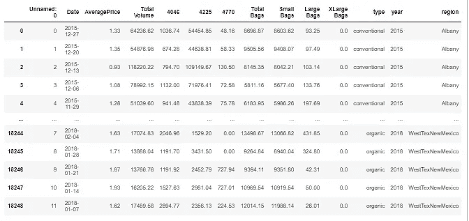

图一。原始数据

我们可以看到数据是**而不是简单而干净的数据列**，事实上实际上有多个时间序列变量。这将最终允许我们从事更丰富的分析；然而，让我们首先关注清理数据。

我们可以看到数据有一个**日期**列。为了方便起见，让我们将该列分配给索引，并去掉未命名的列。

```
df_av = pd.read_csv('avocado.csv', index_col='Date')
df_av.drop(df_av.columns[0],axis=1,inplace=True)
df_av.head(5)
```

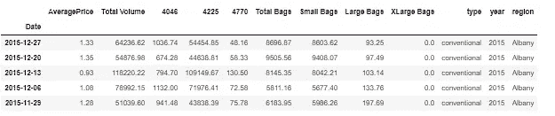

图二。更干净的数据

这些数据现在更有用了，现在让我们绘制一个折线图(时间序列数据的一种常见的可视化选择)。为了简单起见，让我们只关注总体积。

```
ax = df_av['Total Volume'].plot(figsize=(20,5))
ax.set_title('Total Volume of Avocados', fontsize = 22)
ax.set_xlabel('Year', fontsize = 15)
ax.set_ylabel('Volume', fontsize = 15)
plt.grid(True)
plt.show()
```

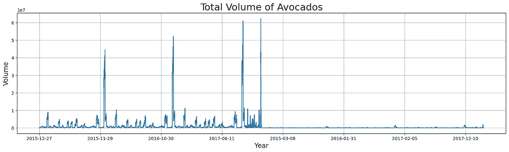

图三。一段时间内鳄梨的总量

我们可以看到曲线图 nice 绘出了这段时间内鳄梨的总量；然而，你们中的一些读者可能会认为这些数据看起来有点奇怪。如果你这么认为，那么恭喜你，你似乎对时间序列数据的本质有很好的直觉。

如果我们再看一遍数据，我们就能真正看到发生了什么。

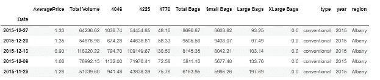

图 4。再次查看数据

我们可以看到数据本身是**而不是纯粹的时间序列**，有一个地理指示器标记为区域。我们拥有的数据实际上是统计学家和经济学家所说的面板数据。数据本身包含 54 个不同的地区，所有地区的数据量相同(新墨西哥州是明显的例外)。

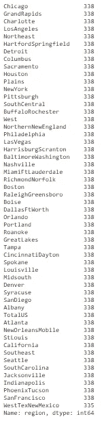

图五。所有区域值的计数

面板数据完全是一种稍微不同的动物，所以为了继续，让我们选择一个单独的区域。就我而言，我选择把重点放在旧金山。

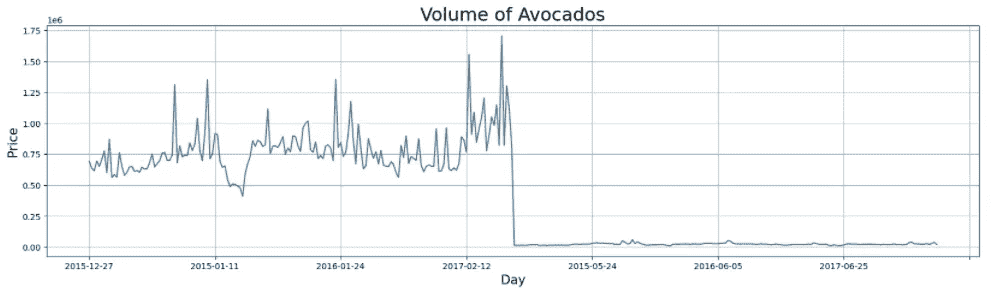

图六。旧金山鳄梨的数量

我们可以看到数据还是比较奇怪的。这是因为数据中列出了**两种**鳄梨，**常规**和**有机**。让我们把这两者分别画在不同的图上。

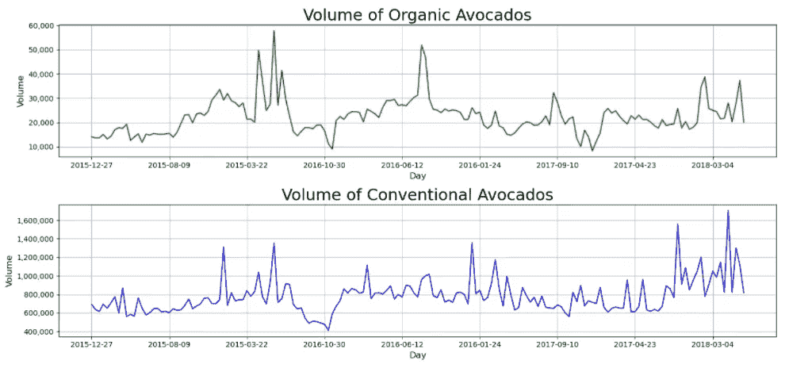

图 7。分解旧金山的鳄梨产量

我们可以看到，常规牛油果的体积远远大于有机牛油果；然而，两者似乎呈现出相似的总体增长趋势。让我们继续关注传统鳄梨的数量。

让我们看看每月的平均交易量，而不是每天的交易量。要做到这一点，必须首先找到提取月份的方法。到目前为止，我们仅有的日期数据是索引数据。

```
df_sfo_co = df_sfo[df_sfo['type'] == 'conventional']
df_sfo_co.index
```

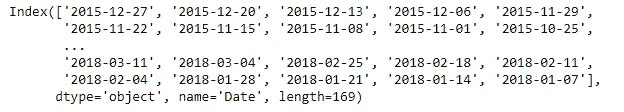

图 8。索引数据

我们可以看到该索引包含月份数据。为了提取它，让我们使用列表理解。注意，出于本文的目的，我们将提取年和月。原因稍后将变得明显。

```
[f"{i.split('-')[0]} - {i.split('-')[1]}" for i in df_av.index]
```

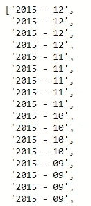

图九。提取年月标签

然后可以将数据放入原始数据帧中。

```
df_sfo_co['year_month'] = [f"{i.split('-')[0]} - {i.split('-')[1]}"  
                           for i in df_sfo_co.index]
df_sfo_co.index
```

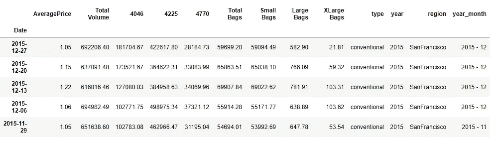

图 10。添加了年月列

既然我们已经附加了 **year_month** 数据，现在让我们通过获得**月平均值**而不是实际数量来折叠数据。

```
df_sfo_co = df_sfo_co.groupby('year_month', as_index=False).agg({'Total Volume':'mean', 'year' : 'mean'})
df_sfo_co
```

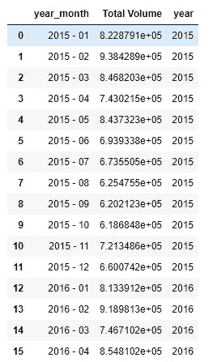

图 11。年月合计

太好了，这看起来更像你的典型时间序列数据，让我们画出来。

```
ax = df_sfo_co['Total Volume'].plot(figsize=(20,5))
ax.set_title('Volume of Avocados', fontsize = 22)
ax.set_xlabel('Month', fontsize = 15)
ax.set_ylabel('Price', fontsize = 15)
ax.set_xticks(np.arange(0, len(df_sfo_co['Total Volume'])+1, 2))   ax.get_yaxis().set_major_formatter(tkr.FuncFormatter(lambda x, p: format(int(x), ',')))plt.grid(True)
plt.show()
```

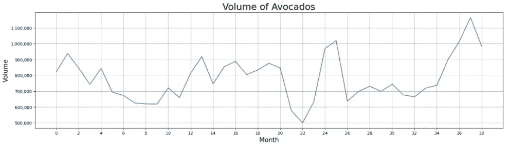

图 12。月聚合线图

最后，最好始终记住，时间序列数据不需要以上述格式呈现。我们还可以设置图表，使 x 轴只包含月份，用几条线代表几年。

关于这一点的争论相当广泛，但请容忍我。

```
df_sfo_pivot = df_sfo_co.pivot(index='year_month',
                            columns='year',
                            values='Total Volume')shift_value = -12
year_list = [2016, 2017, 2018]
for i in year_list:
    df_sfo_pivot[i] = df_sfo_pivot[i].shift(shift_value)
    shift_value -= 12df_sfo_pivot.dropna(how = 'all', inplace = True)
df_sfo_pivot.index = list([i.split('-')[1] for i in df_sfo_pivot.index])
df_sfo_pivot
```

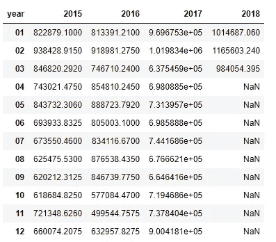

图 13。争论和旋转的数据

很好，现在剩下的唯一任务就是绘制它。

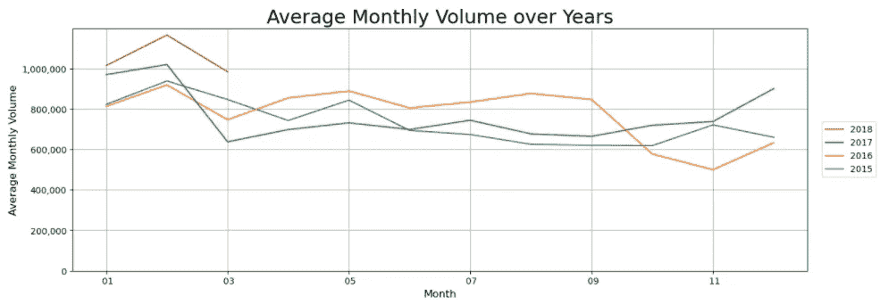

图 14。堆积折线图

上图让我们可以更好地看到不同年份之间的差异，以及不同年份之间是否存在季节性。从上面的图表中，我们可以清楚地看到每年**2 月**需求出现峰值，随后在**3 月**需求明显下降。然后似乎没有明显的季节性成分，直到 2016 年**和 2017 年**的**12 月**需求上升。

**总之**

时间序列分析对于任何参与发现趋势和分析市场(尤其是股票市场)的数据科学家来说都是一个强大的工具。虽然本文没有深入到具体的时间序列分析技术，但是我发现写一下实践中的数据争论和转换方面是谨慎的。这种技能不仅对时间序列分析至关重要，对每个处理数据的人也是如此。