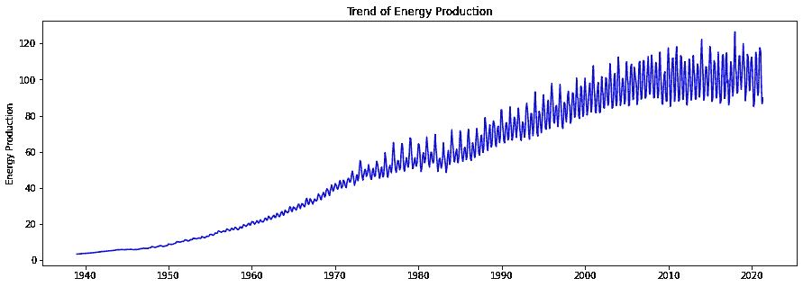
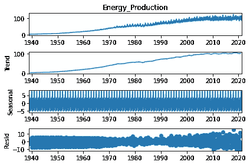
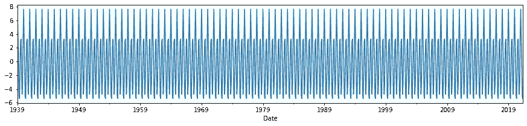
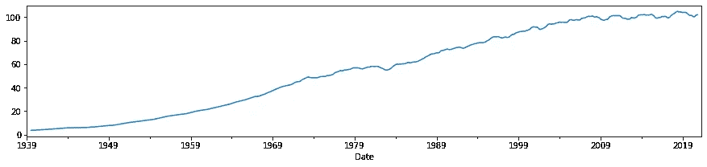
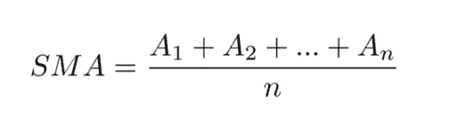
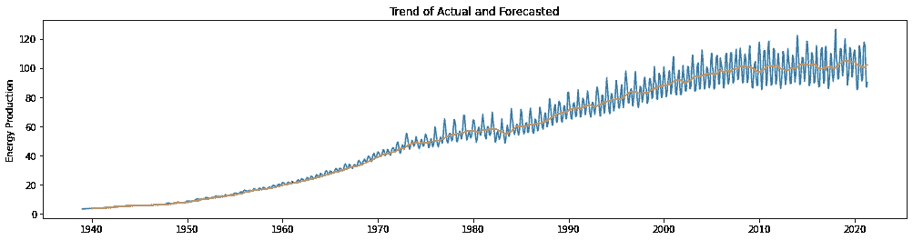
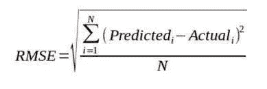
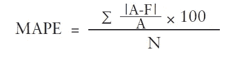
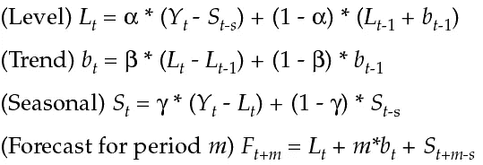
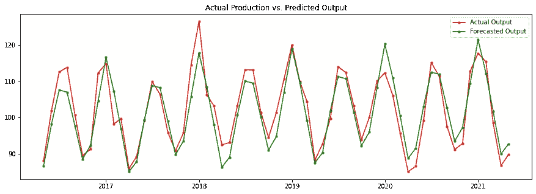

# 时间序列预测简介

> 原文：<https://towardsdatascience.com/introduction-to-time-series-forecasting-part-1-average-and-smoothing-models-a739d832315?source=collection_archive---------4----------------------->

## 第 1 部分:平均和平滑模型

时间序列是一个独特的领域。它本身就是一门科学。专家引用“一个好的预测是一种福气，而一个错误的预测可能是危险的”。本文旨在介绍时间序列的基本概念，并简要讨论用于预测时间序列数据的常用方法。


内森·杜姆劳在 [Unsplash](https://unsplash.com?utm_source=medium&utm_medium=referral) 上的照片

时间序列数据是在不同的时间点 t 观察到的关于响应变量 Y(t)的数据。关于变量的数据以规则的间隔和时间顺序收集。**任何随时间顺序观察到的事物都是时间序列。**

例如，在几个时间间隔内收集的智能手机销售数据、一个国家每年的 GDP、每年/每月的发电量等。都是时间序列数据的例子。

**预测时间序列数据的目的是了解观察序列在未来将如何继续。**

时间序列数据将具有以下一个或多个组成部分:

1.  **趋势分量** —它是数据在整个时间跨度内的持续向上或向下移动。趋势可以是线性的，也可以是非线性的
2.  **季节性成分** —它是一个日历年内以固定间隔发生的趋势的反复向上或向下波动。它总是有一个固定和已知的频率。
3.  **周期性成分** —周期性波动是由经济衰退等宏观经济因素引起的。在这里，复读之间的间隔超过几年。周期性波动的周期性不是固定的。周期性模式的平均长度比季节性模式的平均长度长。
4.  **不规则波动(也称白噪声)** —它是时间序列数据中不相关的随机成分。如果时间序列数据只有白噪声作为分量，则不能用于预测。这是因为该系列的观测值是相同且独立分布的，平均值为 0，方差为常数。

**预测模型的选择将取决于时间序列中存在的成分**。时间序列预测模型可以大致分为简单模型(均值模型、线性趋势模型、随机游走模型)、平均和平滑模型(移动平均、指数平滑)、线性回归模型、ARIMA 模型。

简单模型实际上是底层模型，更复杂的模型建立在底层模型之上。

在深入研究平滑和 ARIMA 等复杂模型之前，让我们先了解这些底层模型。

# **简单预测模型:**

## 平均模型:

对于独立同分布的时间序列(**I . I . d——没有趋势，所有观测值具有相同的概率分布，并且彼此独立**)，时间 t+1 的预测由时间 t 之前的历史数据的平均值给出。该平均值使均方误差最小，也是一个无偏预测值。

如果我们预测未来很长一段时间，预测将是一条水平线或平均值。这是因为该模型假设所有未来的观察值将来自同一分布。考虑平均值为 45 的数列 X。因此，根据均值模型，所有未来期间的 X 预测值应为 45。我们知道这是一个不切实际的假设，除非 X 是一组不随时间变化的来自总体的独立随机样本。

## **线性趋势模型:**

线性趋势模型是简单回归模型的一种特殊情况，其中独立变量是时间 t。它用于均值随时间逐渐增加的时间序列，即存在恒定趋势。在这种情况下，不使用水平线或均值模型来预测未来值，而是用一条斜线来拟合数据。线性趋势模型试图找到最符合历史数据的斜率和截距。

## **随机漫步模型:**

在随机游走模型中，时间序列 X 在 y(t+1)处的值等于 y(t)加上一个随机噪声。

假设 t=0，X0 = 0。

那么在 t=1 时，X1 = X0 + Z1(其中 Z1 为随机噪声)。但是给定 X0 =0，X1= Z1。

在 t=2 时，X2 = X1+Z2。但是 X1 = Z1，因此，X2 = Z1 + Z2

**如果我们在遥远的未来执行这个运算，我们得到 X(t) = Z1+Z2+…Z(t)。**

因此，时间 t 的预测值是到时间 t 的白噪声的总和

**我们如何解读这一点？**

该模型假设，在每个周期中，变量从其先前值中随机移出一步，并且这些步在大小上独立且相同地分布，即，时间 t 和 t-1 的序列值的变化是完全随机的，并且具有零均值。

随机游走模式见于股票价格。价格变动不是随机的，但是每天的价格变化是随机的，因此不可能预测第二天的价格。

随机漫步的另一种变化是带有漂移的**随机漫步**。这里，该系列从其最后记录的位置开始随机步进，步进具有非零均值，即 y(t)= y(t-1)+α，其中α是漂移参数。

现在让我们进入实际的时间序列预测。

我们将使用工业生产—公用事业的数据来更好地理解时间序列预测的概念。所用数据可来源于此环节:[**【https://fred.stlouisfed.org/series/IPG2211A2N】**](https://fred.stlouisfed.org/series/IPG2211A2N)。该数据集给出了从 1940 年到 2020 年美国所有天然气和电力公用事业的每月工业产量。

让我们首先从导入 Python 中的重要库开始:

```
*# Importing Libraries*
**import** **pandas** **as** **pd**
**import** **numpy** **as** **np**
**import** **matplotlib.pyplot** **as** **plt**
**import** **seaborn** **as** **sns**
**import** **warnings**
warnings.filterwarnings('ignore')
%matplotlib inline
**from** **statsmodels.tsa.seasonal** **import** seasonal_decompose
**from** **numpy** **import** mean
**from** **sklearn.metrics** **import** mean_squared_error
**import** **math**
**from** **statsmodels.graphics.tsaplots** **import** plot_acf, plot_pacf 
**from** **statsmodels.tsa.stattools** **import** adfuller
**from** **statsmodels.tsa.arima_model** **import** ARIMA
**import** **statsmodels.api** **as** **sm**
**import** **pmdarima** **as** **pm**
**from** **statsmodels.tsa.api** **import** ExponentialSmoothing
**from** **matplotlib** **import** pyplot
**import** **warnings**
**import** **itertools**
```

让我们也看看最初的观察结果。有两列:名为“IPG2211A2N”的日期和生产列。

```
df.head() DATE            IPG2211A2N
0  1939-01-01      3.3298
1  1939-02-01      3.3552
2  1939-03-01      3.4315
3  1939-04-01      3.4569
4  1939-05-01      3.4569
```

我们将把列名“IPG2211A2N”改为“Energy_Production”。日期采用对象格式。我们将把它改为日期时间。总共有 989 个观测值没有缺失数据。

让我们画出时间序列。



**我们可以观察到既有趋势性又有季节性**。我们可以使用 Python 中的函数' **decompose** '将时间序列数据分解成单独的部分。

```
y_decompose = seasonal_decompose(df['Energy_Production'], model = 'additive', freq = 12)
y_decompose_plot = y_decompose.plot()
```



使用这个函数，我们得到四个不同的图。其中包括系列的整体视觉图、趋势部分、季节部分和残差。人们也可以分别查看每个时间序列的组成部分。

## 时间序列的季节性成分

```
plt.figure(figsize=(15,3))
y_decompose.seasonal.plot();
```



## 时间序列的趋势分量

```
plt.figure(figsize=(15,3))
y_decompose.trend.plot();
```



如果我们观察这些单独的图，我们可以推断出**趋势和季节成分都存在于时间序列中，并且是相加的。**

## **这是什么意思？**

**相加时间序列**是趋势和季节性的幅度不随时间增加的时间序列。它们保持相当稳定。**乘法时间序列**是趋势性和季节性的幅度随着时间段的增加而增加的时间序列。

我们将首先使用简单的预测方法，检查误差指标(RMSE 和 MAPE)，然后使用更复杂的预测方法，如 SARIMA。

# 方法 1:简单移动平均法(SMA)

这种方法更适合没有强烈趋势和季节性成分的数据。

**SMA** 是最简单的预测方法之一，利用过去 N 次观测值的平均值来预测一个时间序列数据的未来值。这里，N 是超参数。平均模型的基本假设是序列具有缓慢变化的均值。因此，我们采用移动平均值来估计平均值的当前值，然后用它来预测未来。**如果系列或多或少稳定，可以采用较低的 N 值。如果系列非常不稳定，则应采用较高的 N 值。需要探究 N 的值以找到最佳拟合模型。**

移动平均法的公式如下:



给定的时间序列具有很强的季节性，也具有很强的趋势。SMA 的预测方法在这里行不通。但是，我们仍然会继续使用它，以了解为什么它不是最佳模型。

我们将采用 12 个月的移动平均线，因为我们在看月度数据，这种模式每年都会重复。然后，我们将绘制实际趋势和预测趋势，并观察预测值与实际时间序列的接近/远离程度。下面的 python 代码。滚动(窗口=12)采用超参数 n。

```
df1 = df.copy()
df1['Moving Avg_12'] = df1['Energy_Production'].rolling(window=12).mean().shift(1)
```

让我们绘制两个时间序列，即实际时间序列和预测时间序列。

```
plt.figure(figsize=(17,4))
plt.ylabel('Energy Production')
plt.title('Trend of Actual and Forecasted')
plt.plot(df1[['Energy_Production','Moving Avg_12']]);
```



**显然移动平均法给出了平均趋势。它不能反映实际数据的波峰和波谷。**因此，在这种情况下，我们无法预测产量。我们将使用 RMSE(均方根误差)和 MAPE(平均绝对百分比误差)等指标来检查预测的准确性。

对于初学者来说， **RMSE 是平方误差平均值的平方根。**由公式给出:



使用的另一个精度指标是**平均绝对百分比误差。它是绝对百分比误差**的平均值。它很容易解释，因为它用百分比表示平均误差。MAPE 的公式如下:



我们将构建一个自定义函数来计算 MAPE。对于 RMSE 来说，python 有一个内置函数。我们将检查最近 60 次观察的测试数据的准确性，即最近 5 年的数据

```
*# Function for MAPE*
**def** get_mape(actual, predicted):
    **return** np.round(np.mean(np.abs((actual-predicted) / actual))*100,2)get_mape(df1['Energy_Production'][928:].values, df1['Moving Avg_12'][928:].values)
```

8.48

```
*# Calculate RMSE* **
from** **sklearn.metrics** **import** mean_squared_error
np.sqrt(mean_squared_error(df1['Energy_Production'][928:].values, df1['Moving Avg_12'][928:].values))
```

10.158

**因此，12 个月移动平均法的预测精度指标为:RMSE = 10.15，MAPE = 8.48**

这肯定可以使用更先进的方法进一步改进。

# 方法 2:指数平滑法

简单移动平均法的缺点是它对所有的观察值给予同等的权重。直觉上，最近的观察应该比早期的观察给予更大的权重。**指数平滑法**通过**给过去的观察值分配不同的权重**来消除这种限制。**在这里，分配给过去数据的权重以指数方式下降，而最近的观察被分配较高的权重。重量减少的速率由一个超参数控制，也称为“平滑常数”。**

与简单平均法相比，指数平滑法的另一个重要优势是平滑常数可以使用“求解器”轻松优化，以最小化均方误差。

**指数平滑方法有三种:**

1.  **单指数平滑**
2.  **双指数平滑和**
3.  **三重指数平滑法或霍尔特温特斯法**

让我们详细介绍一下其中的每一个。

## **单指数平滑:**

这种方法只处理时间序列的水平部分。它使用一个称为平滑常数的超参数α，其值介于 0 和 1 之间。因为只使用一个平滑常数，所以称为单指数平滑。

这里，在时间 t 的预测被给出为**Ft =**α*** y(t-1)+(1-**α**)* F(t-1)**

## **双指数平滑:**

这解决了时间序列的水平(l)和趋势(b)部分。因此，**使用两个平滑常数**，即**α用于水平分量，β用于趋势分量。这些等式如下:**

**l(t)=α* y(t)+(1-α)*(l(t-1)+b(t-1))———**水平***l*
b(t)=*β**(l(t)-l(t-1))+(1-*β*)* b(t-1)——**趋势** *b*
y**

****beta 值较低的模型假设趋势变化非常缓慢，而 beta 值较大的模型假设趋势变化非常迅速。****

**单一指数平滑法假设时间序列相对稳定，没有趋势性和季节性。但是，在这种情况下，数据表现出很强的趋势性和季节性。因此，我们不能使用单一指数法进行预测。双指数平滑法考虑了平均值或水平分量和趋势分量。它没有考虑季节性。因此，我们也不能使用双指数平滑法。**

****我们将因此使用三重指数平滑法，也称为霍尔特温特模型。它考虑到了水平、趋势和季节因素。****

## ****三重指数平滑法/霍尔特温特法:****

**在这种方法中，除了水平和趋势分量之外，我们还对季节分量应用平滑。平滑是跨季节应用的。也就是说，一个季节的第四分量相对于前一个季节的第四分量、前两个季节的第四分量等等被平滑。**因此，将会有四个方程——水平、趋势、季节性各一个，最后一个方程包含所有单个组件。****

****由于模型是加法或乘法**，等式会有所不同。老实说，人们需要付出巨大的努力来理解这些方程背后的数学。如果你想更深入地了解方程式背后的直觉，可以参考这个链接:[https://grisha . org/blog/2016/02/17/triple-index-smoothing-forecasting-part-iii/](https://grisha.org/blog/2016/02/17/triple-exponential-smoothing-forecasting-part-iii/)**

**加法霍尔特·温特方法的四个方程如下:**

****

**这里 s 是季节长度，即新的季节开始之前的数据点数。**

**让我们看看如何用 Python 编写三重指数平滑的代码。我们将使用训练数据来建模。**

```
**from** **statsmodels.tsa.holtwinters** **import** ExponentialSmoothingfit1 = ExponentialSmoothing(np.asarray(df1['Energy_Production'][:928].values), seasonal_periods=12 ,trend='add', seasonal='add',).fit()fit1.summary()
```

**模型输出给出了平滑参数α、β和γ的最佳值。**

```
**Exponential Smoothing Model Results   **                    
====================================================================
Dep. Variable:                endog   No. Observations:  928            
Model:        Exponential Smoothing   SSE: 2846.672                          
Optimized:                     True   AIC: 1072.171                          
Trend:                     Additive   BIC: 1149.500                          
Seasonal:                  Additive   AICC: 1072.924                         
Seasonal Periods:                12   Date: Wed, 21 Jul 2021
Box-Cox:                      False   Time: 18:40:08                 
Box-Cox Coeff:                 None                                         
====================================================================
                              **coeff                   code  **               
--------------------------------------------------------------------
**smoothing_level               0.4085441                alpha                 
smoothing_slope              5.4582e-17                 beta                 
smoothing_seasonal            0.3517790                gamma   **              
initial_level                 58.340136                  l.0                 
initial_slope                 0.1026049                  b.0                 
initial_seasons.0            -55.146903                  s.0                 
initial_seasons.1            -55.161188                  s.1                 
initial_seasons.2            -55.142231                  s.2                 
initial_seasons.3            -55.137545                  s.3                 
initial_seasons.4            -55.138415                  s.4                 
initial_seasons.5            -55.097211                  s.5                 
initial_seasons.6            -55.101285                  s.6                 
initial_seasons.7            -55.096024                  s.7                 
initial_seasons.8            -55.072809                  s.8                 
initial_seasons.9            -55.106835                  s.9                 
initial_seasons.10           -55.102856                 s.10                 
initial_seasons.11           -55.147951                 s.11                 
--------------------------------------------------------------------
```

**我们现在将根据测试数据检查模型。预测之后，我们将绘制实际测试数据和预测数据。我们将再次使用 MAPE 和 RMSE 作为准确性指标。**

```
train_data = df1['Energy_Production'][:928]
test_data = df1['Energy_Production'][928:]
y_hat_avg = test_data.copy()
y_hat_avg['Holt_Winter'] = fit1.forecast(len(test_data))**rms = math.sqrt(mean_squared_error(test_data, y_hat_avg.Holt_Winter))
print(rms)**
```

**3.9916714233453447**

```
**get_mape(test_data, y_hat_avg.Holt_Winter)**
```

**3.27**

**让我们画出实际的和预测的数列。**

```
fig = plt.figure(figsize=(15,5));
future, = plt.plot(test_data.index, test_data, 'r.-', label='Actual Output');
predicted_future, = plt.plot(test_data.index, y_hat_avg.Holt_Winter, 'g.-', label='Forecasted Output');
plt.legend(handles=[future, predicted_future]);
plt.title('Actual Production vs. Predicted Output');
```

****

**我们可以看到预测产量与实际产量非常接近。与简单的移动平均法相比，性能更好。**

****三重指数平滑法的预测精度为:RMSE 3.99，MAPE 3.27。我们可以尝试更先进的技术来进一步优化指标。****

**这就把我们带到了第一部分的结尾。**

**我将总结本文中的要点:**

1.  **在一个时间序列数据中，因变量是 Y(t)，在不同的时间点观察到 t**
2.  **一些技术，如简单模型，平均和平滑模型，线性模型和 ARIMA 模型，用于预测时间序列数据。**
3.  **MAPE 和 RMSE 等指标更常用于评估预测模型的准确性。**
4.  **简单和加权移动平均等技术是最简单的预测方法之一，但是它们不适合具有高度季节性和趋势性的数据。**
5.  **平滑技术提供了对移动平均法的改进。在这里，过去的观察被赋予不同的权重。**
6.  **最重要的一点是，在某些情况下，平滑和移动平均等简单模型可能会优于 ARIMA 等基于复杂回归的模型。因此，在选择最终模型之前，使用不同的技术开发多个模型是有好处的。**

**在第 2 部分中，我们将使用更复杂的方法，如 ARIMA 及其扩展、萨里玛或季节性 ARIMA，并详细了解平稳性等术语。**

**希望这篇文章对你有用。我欢迎任何问题或建议。**