# 时间序列预测导论第二部分(ARIMA 模型)

> 原文：<https://towardsdatascience.com/introduction-to-time-series-forecasting-part-2-arima-models-9f47bf0f476b?source=collection_archive---------2----------------------->

## 大多数时间序列预测方法都假设数据是“平稳的”，但实际上它往往需要某些变换才能进一步处理。


Miguel Luis 在 [Unsplash](https://unsplash.com?utm_source=medium&utm_medium=referral) 上拍摄的照片

在第一篇文章中，我们看了简单的移动平均和指数平滑方法。在这篇文章中，我们将看看更复杂的方法，如 ARIMA 及其扩展。

# 方法 3:季节性自回归综合移动平均数

季节性 ARIMA 是 ARIMA 模型的一个变种。它是支持数据季节性的 ARIMA 方法的扩展。让我们首先了解 ARIMA 模式的运作。

ARIMA 是一种用于预测时间序列数据的统计模型。**ARIMA 方程是一个回归型方程，其中自变量是因变量的滞后和/或预测误差的滞后。**ARIMA 模型的方程式如下:

**y '(t)= c+ϕ1* y '(t1)+⋯+ϕp*y′(t−p)+θ1 *ε(t1)+⋯+θq *ε(TQ)+εt**

等式中有三项:

**AR:自动回归:**时间序列用其以前的值回归，即 y(t-1)，y(t-2)等。滞后的顺序表示为 **p.**

**I:积分:**时间序列使用差分使其平稳。差值的阶数表示为 **d.**

**MA:移动平均:**用过去观测值的残差对时间序列进行回归，即误差 **ε** (t-1)，误差 **ε** (t-2)等。误差滞后的阶数表示为 **q.**

上式中，**y′t**为差分数列， **ϕ1** 为第一项 AR 的系数， **p** 为 AR 项的阶次， **θ1** 为第一项 MA 的系数， **q** 为 MA 项的阶次， **εt** 为误差。

ARIMA 不支持季节性数据。对于具有显著季节性模式的时间序列，使用季节性 ARIMA 模型。

它和 ARIMA 有什么不同？**除了 ARIMA 的三个参数，即 P、D、Q，SARIMA 还有三个季节参数(P、D、Q)。**额外的三个参数说明了**季节水平的自回归分量(P)、差异分量(D)和移动平均分量(Q)。**

**可以表示如下:ARIMA (p，D，q) (P，D，Q)m** 这里 m 是每个季节的观测次数(在我们的例子中，m 是 12)。模型的季节性成分用大写字母表示，模型的非季节性成分用小写字母表示。

在我们进入萨里玛的细节之前，让我们先了解一下术语**‘自相关’和‘偏自相关’。**

**自相关函数(ACF) :** 滞后 k 的自相关是 Y(t)和 Y(t-k)之间的相关性，在不同的 k 滞后处测量。对于滞后 1，在 Y(t)和 Y(t-1)之间测量自相关，类似地，对于滞后 2，在 Y(t)和 Y(t-2)值之间测量自相关。不同 k 值的自相关图被称为**自相关图或相关图。**

**偏自相关(PACF) :** 滞后 k 的偏自相关是在所有其他中间值(Y(t-1)，Y(t-2)，…)的影响下，Y(t)和 Y(t-k)之间的相关。Y(t-k+1))同时从 Y(t)和 Y(t-k)中删除。例如，y(t)和 y(t+1)之间的部分自相关与它们的自相关相同，因为它们之间没有中间项。y(t)和 y(t+2)之间的部分自相关将从 y(t)和 y(t+2)中去除 y(t+1)的影响。不同 k 值的部分自相关图称为**部分自相关图。**

**在我们使用 ARIMA 或其任何扩展之前，我们需要确保时间序列是平稳的。**

**时间序列的平稳性是什么意思？**

如果一个时间序列具有以下三个性质，则称它是平稳的:

1.  **它有一个恒定的平均值**，即平均值随时间保持不变
2.  **它有一个恒定的方差**，即方差随时间保持恒定
3.  **它有一个恒定的协方差。**两个时间段之间的协方差值取决于两个时间段之间的滞后，而不取决于计算协方差的时间。这意味着 t=2 和 t = 4 时序列之间的协方差应该与 t=7 和 t=9 时序列之间的协方差大致相同。

**平稳时间序列将具有相同的统计特性，即相同的均值、方差和协方差，无论我们在什么点测量它们，因此这些特性是时不变的。从长期来看，这个系列没有可预测的模式。时间图将显示序列大致水平，具有恒定的平均值和方差。**

为什么我们需要平稳的时间序列？因为如果时间序列不是平稳的，我们只能研究它在那个时间段的行为。时间序列的每个周期都有其独特的行为，如果序列不是稳定的，就不可能预测或概括未来的时间周期。

**一个平稳的时间序列将趋向于返回到它的平均值，围绕这个平均值的波动将具有恒定的幅度。**因此，由于方差有限，平稳时间序列不会偏离均值太多。

**平稳时间序列的一个例子是“白噪声”。**由于其固有的平稳性，它没有可预测的长期模式。因此它是无记忆的。

以下是白噪声的分布情况:

```
*#* ***Plot for White Noise with Mean 0 and standard deviation as 0.8***
wnoise= np.random.normal(loc=0, scale=0.8, size=800)
plt.figure(figsize=(15, 4)),
plt.plot(wnoise);
plt.title('Distribution of White Noise');
```

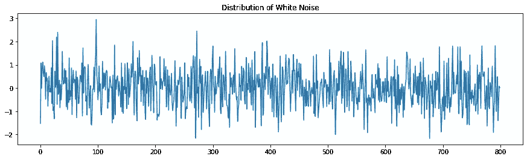

**从上面的图中可以看出，平均值的分布是恒定的，完全是随机的。很难预测时间序列的下一步动向。**如果我们绘制该序列的自相关图，将会观察到完全的零自相关。这意味着任何时间 t 的序列与其滞后值之间的相关性为零。

```
acr = plot_acf(wnoise, lags = 50)
```

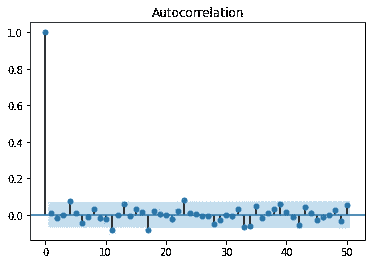

在上面的 ACF(自相关图)中，你可以看到所有的滞后都在蓝色突出显示的区域内。这表明不同滞后的观测值之间几乎没有相关性。如果一个或多个尖峰在这个范围之外，或者超过 5%的尖峰在这些范围之外，那么我们可以推断该序列不是“白噪声”。

## 我们如何检查平稳性？

用于检查平稳性的两个流行测试是**增强迪基富勒测试(ADF)和科维亚特科夫斯基-菲利普斯-施密特-申测试(KPSS)** 。让我们详细看看每个测试。

## **1。增强的迪基富勒测验:**

这种统计检验属于称为单位根检验的类别。它检查时间序列是否有单位根，从而是非平稳的。当我们进行这个测试来检查平稳性时，我们检查单位根。

**零假设 Ho** :有单位根，即时间序列是非平稳的
**交替假设 Ha** :没有单位根，即时间序列是平稳的

## **单位根是什么意思？**

观察到两种非平稳随机时间序列:

1.  无漂移随机行走模型
2.  漂移随机游动模型

**无漂移随机游走中，**序列的均值是常数，等于其初始值或起始值，但方差随时间增加。因此，该序列是非平稳的。通常，股票价格被认为是遵循随机游走的。显示随机游走的数据具有长周期的上升或下降趋势，以及方向上的突然和不可预测的变化。
因此，这个模型的预测是最后一次观察，因为未来的运动是不可预测的，同样有可能上升或下降。

时间序列 Y 在 t 时刻的值等于其在 t-1 时刻的值加上一个随机冲击即 **Y(t) = Y(t-1) +误差 u(t)**
**无漂移随机游走的一阶差分是一个平稳的时间序列。**为什么？原因从上式可知，Y(t) — Y(t-1) =误差项 u(t)。误差项是具有均值 0 和恒定方差的白噪声或平稳序列

**在有漂移的随机游走**中，序列的均值和方差都随时间增加。因此，该序列不是静止的。这里，时间 t 的时间序列值等于时间(t-1)的值加上漂移参数α加上随机冲击，即 Y(t)= Y(t-1)+α+u(t)。漂移参数α是系列从一个周期到下一个周期的平均增量。

**随机游走模型被称为单位根过程。**

**写为:Y(t) = (Delta)* Y(t-1) + u(t)**

**如果 delta 的值为 1(随机游走)或大于 1(有漂移的随机游走)，则序列是非平稳的。如果 delta 的值小于 1，我们断定该序列是平稳的。**

*请注意，非平稳性或单位根也可能是确定性趋势的原因。我在本文中没有涉及这一部分。*

现在让我们看看 KPSS 测试。

**2。科维亚特科夫斯基-菲利普斯-施密特-申(KPSS 测试):**

这是另一个不太流行的检验平稳性的测试。这里的零假设和交替假设与 ADF 检验相反。

**零假设:**过程是趋势平稳的。

**交替假设:**数列有单位根(数列不是平稳的)。

如果我们使用这两种测试来确认平稳性，则可能出现以下四种情况之一:

**情景一—** 两个测试都得出平稳性结论。因此，数列是平稳的。

**情景二** —两个测试都得出非平稳性的结论。因此，该序列是非平稳的。

**情景三** — ADF 检验得出平稳性结论，但 KPSS 检验得出非平稳性结论。这表明需要使用差分来使序列平稳。这里，创建了一个新的序列，其中时间 t 处的观测值由时间 t 处的实际值和时间 t-1 处的值之间的差给出。因此，

**差分序列的值(t)=观测值(t)-观测值(t-1)**

**情景四** — ADF 检验得出非平稳性结论，但 KPSS 检验证实平稳性。这表明需要使用去趋势来使系列静止。常见的去趋势方法包括使用对数变换、原始序列的平方根变换。

一旦数列稳定下来，下一步就是建立 ARIMA 模型。建立 ARIMA 模型有两种方法。

**方法 1:** 通过查看差异数据的 ACF 和 PACF 图，手动选择模型阶数，并确定 p 和 q 的最佳值。使用不同的 p 和 q 值构建多个模型，并选择最终模型，即具有**最低 AIC 的模型。(AIC 或阿凯克的信息准则是一个有用的模型选择工具。给定一组时间序列数据的模型，最佳模型是具有最低 AIC 的模型。它通过惩罚具有更多参数的模型来平衡拟合优度和过度拟合。)**

**方法 2:** 使用 Auto Arima (auto.arima())寻找给定时间序列的最佳模型。

实际上，这两种方法混合使用。使用方法 1，确定 p 和 q 的范围。在下一步中，Auto Arima 函数用于步骤 1 中确定的范围。

在方法 1 中提到的 ARIMA 模型中，有一些用于确定 p、d 和 q 的最佳值的指导原则。这些措施如下:

## 准则 1:确定 ARIMA 模型中的差分顺序:

拟合 ARIMA 模型的第一步也是最重要的一步是决定差分的阶次，以使序列平稳。正确的方法是从最低差值开始，即 d=1。通常这将使系列静止。然而，如果仍然有一个显著的趋势，或者如果滞后≥10 的自相关为正显著，那么序列需要二阶差分。阶数大于 2 的差分从来不是优选的。

如果差分序列的滞后 1 的自相关为零或负值，或者如果自相关都很小且没有模式，则该序列不需要更多的差分。如果滞后-1 自相关比-0.5 更负，则表明序列可能已被过度差分。

## 准则 2:识别 ARIMA 模型中的应收账款或并购术语:

一旦我们有了平稳序列，下一步就是确定 ARIMA 模型中的 AR 和 MA 项。直觉如下:

1.  如果差分序列的 PACF 显示出一个锐截止和/或 lag1 自相关为正(这表明一个“欠差分”序列),而 ACF 衰减较慢，则考虑在模型中增加一个 AR 项。AR 术语的数量将取决于 PACF 截止的滞后时间。
2.  如果差分序列的 ACF 显示出锐截止和/或 lag1 自相关为负(这表示“过度差分”序列),而 PACF 衰减较慢，则考虑将 MA 项添加到模型中。这里，通过添加 MA 项来解释自相关模式。MA 项的数量将取决于 ACF 截止的滞后。
3.  AR 项与滞后 1 处的欠差分或正自相关相关，而 MA 项与滞后 1 处的过差分或负自相关相关。

## 准则 3:最终确定哪种 ARIMA 模式？

选择与 AR 或 MA 项差异水平较低的模型。然而，AR 和 MA 的混合模型有时可能是最佳选择。

**如果 AR 系数之和等于 1 或几乎等于 1(即存在单位根)，则增加差分阶数并减少 AR 项数。**

**如果 MA 系数之和等于 1 或接近 1，则降低差分阶数，增加 MA 项数。**

AR 系数之和或 MA 系数之和等于 1 的模型称为有“单位根”。这种模型没有作为白噪声的残差。

*除了 ARIMA 模型中的 P、D、q，像萨里玛这样的季节性模型还有额外的季节性项 P、D、q。这些也可以从 ACF 和 PACF 图中确定。*

## 季节性 ARIMA (SARIMA)指南:

## **准则 4** :识别季节性和非季节性差异顺序:

SARIMA 模型中最重要的一步是决定是否需要季节差异。如果季节性很强，应该使用季节差异的顺序。如果序列在应用季节差异后仍然不是平稳的，我们可以考虑应用非季节差异。H ***然而，永远不要使用一个以上的季节差异，季节和非季节差异之和不应超过 2。***

我们使用季节性差异和非季节性差异的顺序并不重要，但是，如果我们有高度季节性的数据，最好先执行季节性差异，然后执行非季节性差异。

## 准则 5:识别季节性和非季节性 AR 和 MA 术语:

如果季节性滞后 k 处的自相关为正(在我们的例子中 k=12，24，36 ),则向模型添加季节性 AR 项(P)。如果季节性滞后的自相关为负，则向模型添加季节性 MA 项(Q)。**应注意不要在同一个模型中同时包含季节性 AR 和 MA 术语，并且每个术语的顺序不应超过 1。**

这些是杜克大学的罗伯特·瑙提出的指导方针。请参考以下链接，以获得对上述准则的详细理解。https://people.duke.edu/~rnau/411arim.htm

让我**总结一下**ARIMA/萨里玛造型的关键步骤:

1.  绘制时间序列数据，观察趋势和季节性
2.  使用 ADF 和 KPSS 等统计测试来检查平稳性
3.  如果序列不稳定，请使用差分或去趋势等变换。对于季节性数据，除了非季节性差异外，可能还需要季节性差异。
4.  一旦确定了差分的阶数，我们就需要决定最佳的 AR 和 MA 项。
5.  使用 ACF 和 PACF 图获得参数 P，P，Q，Q 的范围。使用 auto.arima 并指定这些参数的范围。
6.  检查回归模型的假设，即误差的正态性和误差之间没有自相关。

现在让我们一次一个地完成这些步骤。

数据的曲线如下:

```
plt.figure(figsize=(15,5))
plt.ylabel('Energy Production')
plt.title('Trend of Energy Production')
plt.plot(df['Energy_Production'],'b-');
```

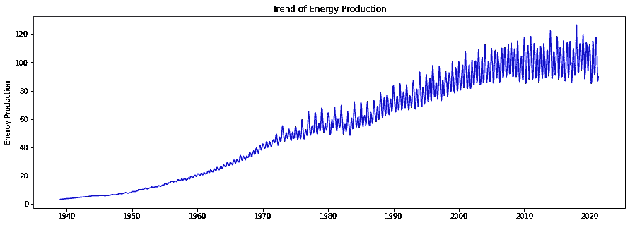

这里我们将去掉某一部分数据，即从 1940 年到 1964 年的观测数据。原因是非常旧的数据，可能会引起不必要的噪声。

```
df1 = df.copy()
df2 = df1['Energy_Production'][312:]
df2 = pd.DataFrame(df2)
df2.head()
```

能源 _ 生产日期
1965–01–01 29.4598
1965–02–01 28.7989
1965–03–01 28.8497
1965–04–01 28.1889
1965–05–01 27.7059

我们现在可以继续运行统计测试来检查平稳性。

## **测试 1:增强的 Dickey Fuller 测试:**

```
X = df2['Energy_Production'].values
result = adfuller(X)
print('ADF Statistic: **%f**' % result[0])
print('p-value: **%f**' % result[1])
print('Critical Values:')
**for** key, value **in** result[4].items():
    print('**\t%s**: **%.3f**' % (key, value))**ADF Statistic: -2.231551
p-value: 0.194994
Critical Values:
	1%: -3.440
	5%: -2.866
	10%: -2.569**
```

这里，p 值大于 0.05，因此我们不能拒绝零假设。因此，级数有单位根，是非平稳的。

## 测试 2 : KPSS 测试

```
**from** **statsmodels.tsa.stattools** **import** kpss

**def** kpss_test(timeseries):
    print("Results of KPSS Test:")
    kpsstest = kpss(timeseries, regression="c")
    kpss_output = pd.Series(
        kpsstest[0:3], index=["Test Statistic", "p-value", "Lags Used"]
    )
    **for** key, value **in** kpsstest[3].items():
        kpss_output["Critical Value (**%s**)" % key] = value
    print(kpss_output)kpss_test(df2['Energy_Production'].values)**Results of KPSS Test:
Test Statistic            3.273962
p-value                   0.010000
Lags Used                20.000000
Critical Value (10%)      0.347000
Critical Value (5%)       0.463000
Critical Value (2.5%)     0.574000
Critical Value (1%)       0.739000
dtype: float64**
```

这里，p 值小于 0.05。然而，KPSS 检验的零假设与 ADF 检验相反。因此，在这里，我们将拒绝平稳序列的零假设，并得出结论，该序列是非平稳的。

**这与场景 2 类似，两个测试都确认给定序列是非平稳的。我们现在将考虑使数列平稳的步骤。**

鉴于季节性很强，我们将首先使用季节差异。给定 m=12，我们需要将时间 t 的观测值与其在 t-12 的滞后值区别开来。如果我们这样做，差分序列的前 12 个观测值将取 NaN 值。这里，季节差异 D 的顺序是 1。

```
df2['Energy_Production_diff'] = df2['Energy_Production'] - df2['Energy_Production'].shift(12)
df2[['Energy_Production','Energy_Production_diff']].head(13)
```

日期能源 _ 生产能源 _ 生产 _ 差异
1965–01–01 29.4598 南
1965–02–01 28.7989 南
1965–03–01 28.8497 南
1965–04–01 28.1889 南
1965–05–01 27.7059 南
1965–06–08

我们将删除 NaN 观测值，并绘制数据序列，以检查差分是否使序列平稳。

```
plt.figure(figsize=(18,5));
plt.xlabel('Time');
plt.ylabel('Energy Production');
plt.title('Differenced Time Series of Energy Production');
plt.plot(df2['Energy_Production_diff1']);
```

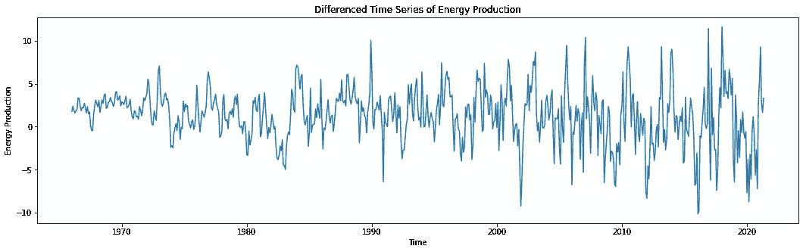

尽管方差不是常数，但该序列看起来几乎是平稳的。我们将再次运行这两个测试来确认稳定性。

```
**# ADF Test:** 
X = df2['Energy_Production_diff1'].dropna().values
result = adfuller(X)
print('ADF Statistic: **%f**' % result[0])
print('p-value: **%f**' % result[1])
print('Critical Values:')
**for** key, value **in** result[4].items():
    print('**\t%s**: **%.3f**' % (key, value))**ADF Statistic: -7.448126
p-value: 0.000000
Critical Values:
	1%: -3.440
	5%: -2.866
	10%: -2.569**
```

这里，p 值小于 0.05。因此，我们将拒绝零假设，并得出结论，该序列是平稳的。

```
**# KPSS Test** 
kpss_test(X)Results of KPSS Test:
**Test Statistic            0.575462
p-value                   0.024867**
Lags Used                20.000000
Critical Value (10%)      0.347000
Critical Value (5%)       0.463000
Critical Value (2.5%)     0.574000
Critical Value (1%)       0.739000
dtype: float64
```

KPSS 检验的 p 值小于 0.05。因此，我们将拒绝数列是平稳的零假设。KPSS 检验的结论是该序列是非平稳的。

**这个结果类似于本文上面提到的场景 3。两种检验都给出了相互矛盾的结果，ADF 的结论是序列是平稳的，而 KPSS 检验的结论则相反。**因此，我们可以得出结论，该序列是非平稳的。如果我们绘制差分序列的 ACF 和 PACF 图，我们可以看到初始滞后之间的强正自相关。

```
acf_plot = plot_acf(df2['Energy_Production_diff1'].dropna(), lags= 30)
```

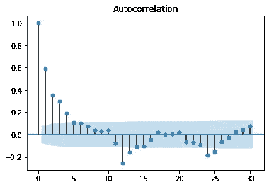

```
pacf_plot = plot_pacf(df2['Energy_Production_diff1'].dropna(), lags= 30)
```

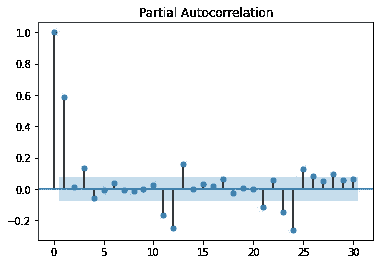

因此，我们将继续下去，并再次差分序列，使其静止。这将是 1 阶的非季节性差异，即 d = 1

```
df2['Energy_Production_diff121'] = df2['Energy_Production_diff1'] - df2['Energy_Production_diff1'].shift(1) 
```

我们将使用两个统计测试来检查和确认平稳性。

```
**# ADF Test** 
X = df2['Energy_Production_diff121'].dropna().values
result = adfuller(X)
print('ADF Statistic: **%f**' % result[0])
print('p-value: **%f**' % result[1])
print('Critical Values:')
**for** key, value **in** result[4].items():
    print('**\t%s**: **%.3f**' % (key, value))**ADF Statistic: -8.939993
p-value: 0.000000**
Critical Values:
	1%: -3.441
	5%: -2.866
	10%: -2.569# **KPSS Test:**
kpss_test(X)
Results of KPSS Test:
**Test Statistic            0.017791
p-value                   0.100000**
Lags Used                20.000000
Critical Value (10%)      0.347000
Critical Value (5%)       0.463000
Critical Value (2.5%)     0.574000
Critical Value (1%)       0.739000
dtype: float64
```

**在这一步，两个测试都确认系列是稳定的。**让我们绘制 ACF 图和 PACF 图，以及总体差异系列图。

```
acf_plot = plot_acf(df2['Energy_Production_diff121'].dropna(), lags= 30)
```

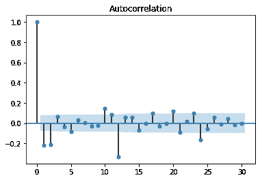

```
pacf_plot = plot_pacf(df2['Energy_Production_diff121'].dropna(), lags= 30)
```

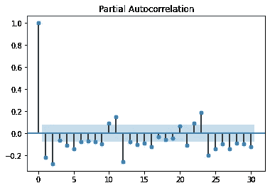

这两个图确实有明显的滞后，但我们将继续处理序列平稳，如 ADF 和 KPSS 测试所证实的。差分序列的曲线如下:

```
plt.figure(figsize=(18,5));
plt.xlabel('Time');
plt.ylabel('Energy Production');
plt.title('Differenced Time Series of Energy Production');
plt.plot(df2['Energy_Production_diff121']);
```

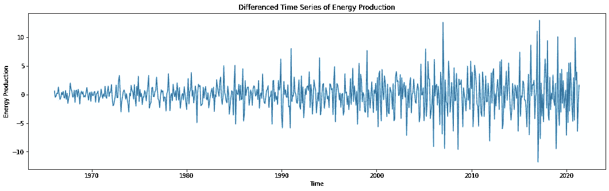

这个图看起来很像白噪声的分布。我们可以从上面的图中推断出这个数列是平稳的。

到目前为止，我们已经使用了两次差分，即一次 D=1 阶的季节性差分和一次 d=1 阶的非季节性差分。下一步是确定 AR 和 MA 参数。在 ACF 图中，在 1、12 和 24 处有显著的负滞后。因此，MA 参数应为 1，季节性 MA 参数应为 2。**(准则 2，5)** 。鉴于 PACF 图在 1 和 12 处也有负滞后，根据指南，我们将不包括 AR 和季节性 AR 项。

***由此，模型的最终顺序似乎是(0，1，1)(0，1，2)12。***

在遵循 ACF 和 PACF 图的方法 1 时，很难在第一时间提出最佳模型。这是因为要正确解读这些情节是非常困难的。因此，一般的方法是将这两种方法结合起来。使用第一种方法，我们可以确定非季节性参数 P、D、q 和季节性参数 P、D、q 的范围。然后，这可以作为 auto arima 函数的输入。

让我们看看它是如何实现的。

我们将首先安装库“pmdarima ”,然后导入它。

```
**import** **pmdarima** **as** **pm
from** **pmdarima** **import** auto_arima
*# Ignore harmless warnings*
**import** **warnings**
warnings.filterwarnings("ignore")df3 = df2['Energy_Production']
```

我们将从 ACF 和 PACF 图中定义 P、Q、P、Q 值的范围。这里，我们取了 d=D=1。(在这种情况下，ADF 和 KPSS 测试是同步的)。我们将参数 P，P，Q，Q 初始化为 0，最大值为 2。正如指南中提到的，我们不应该建立具有更高阶 AR、MA、SAR、SMA 参数的模型。假设数据是季节性的，这里 m 是 12，search = ' True '。

```
model = auto_arima(df3, start_p=0, start_q=0,
                          max_p=2, max_q=2,m=12,start_P=0,start_Q=0, 
                          max_P = 2, max_Q = 2,
                          seasonal=**True**,
                          d=1,D=1,trace=**True**,
                          error_action='ignore',   
                          suppress_warnings=**True**,  
                          stepwise=**True**)
```

上面的代码需要一些时间来运行，因为它评估了许多模型的组合。代码的输出是具有最小 AIC 的模型。

```
Performing stepwise search to minimize aic
 ARIMA(0,1,0)(0,1,0)[12]             : AIC=3281.487, Time=0.08 sec
 ARIMA(1,1,0)(1,1,0)[12]             : AIC=3171.654, Time=0.23 sec
 ARIMA(0,1,1)(0,1,1)[12]             : AIC=3018.258, Time=0.58 sec
 ARIMA(0,1,1)(0,1,0)[12]             : AIC=3218.537, Time=0.08 sec
 ARIMA(0,1,1)(1,1,1)[12]             : AIC=3015.997, Time=0.92 sec
 ARIMA(0,1,1)(1,1,0)[12]             : AIC=3141.548, Time=0.28 sec
 ARIMA(0,1,1)(2,1,1)[12]             : AIC=2994.828, Time=1.94 sec
 ARIMA(0,1,1)(2,1,0)[12]             : AIC=3058.224, Time=0.81 sec
 ARIMA(0,1,1)(2,1,2)[12]             : AIC=2977.369, Time=5.76 sec
 ARIMA(0,1,1)(1,1,2)[12]             : AIC=3010.587, Time=3.48 sec
 ARIMA(0,1,0)(2,1,2)[12]             : AIC=3047.276, Time=4.01 sec
 ARIMA(1,1,1)(2,1,2)[12]             : AIC=2912.252, Time=7.25 sec
 ARIMA(1,1,1)(1,1,2)[12]             : AIC=2931.644, Time=4.72 sec
 ARIMA(1,1,1)(2,1,1)[12]             : AIC=2918.937, Time=3.15 sec
 ARIMA(1,1,1)(1,1,1)[12]             : AIC=2937.865, Time=1.59 sec
 ARIMA(1,1,0)(2,1,2)[12]             : AIC=3010.240, Time=6.52 sec
 ARIMA(2,1,1)(2,1,2)[12]             : AIC=2914.225, Time=9.10 sec
 ARIMA(1,1,2)(2,1,2)[12]             : AIC=2914.220, Time=7.80 sec
 ARIMA(0,1,2)(2,1,2)[12]             : AIC=2930.445, Time=5.22 sec
 ARIMA(2,1,0)(2,1,2)[12]             : AIC=2980.502, Time=6.62 sec
 ARIMA(2,1,2)(2,1,2)[12]             : AIC=2916.073, Time=16.42 sec
 ARIMA(1,1,1)(2,1,2)[12] intercept   : AIC=2914.035, Time=21.91 sec

**Best model:  ARIMA(1,1,1)(2,1,2)[12] **         
Total fit time: 108.511 seconds
```

让我们看看模型的总结。Auto Arima 给出(1，1，1)(2，1，2)12 作为最佳模型，即具有最小 AIC 的模型。

```
print(model.summary())**Statespace Model Results        **                         
===================================================================
Dep. Variable:      y                 No. Observations: 677
Model: SARIMAX(1, 1, 1)x(2, 1, 2, 12) Log Likelihood: -1449.126            
Date:  Wed, 28 Jul 2021               AIC: 2912.252                      
Time:  17:14:03                       BIC: 2943.740                      
Sample: 0- 677                        HQIC : 2924.454                                                                                                            Covariance Type: opg                                                                  
====================================================================
                 coef    std err          z      P>|z|      
**ar.L1**          0.5133      0.034     15.039      0.000             
**ma.L1**         -0.9304      0.018    -52.457      0.000           
**ar.S.L12**       0.6594      0.090      7.340      0.000             
**ar.S.L24**      -0.3230      0.041     -7.930      0.000           
**ma.S.L12 **     -1.3218      0.093    -14.195      0.000           
**ma.S.L24**       0.5492      0.075      7.350      0.000            
sigma2         4.5143      0.186     24.224      0.000             
====================================================================
Ljung-Box (Q): 52.32                  Jarque-Bera (JB): 112.23       
Prob(Q): 0.09                         Prob(JB):0.00                         
Heteroskedasticity (H):4.73           Skew: 0.07                            
Prob(H) (two-sided): 0.00             Kurtosis: 5.01
====================================================================

Warnings:
[1] Covariance matrix calculated using the outer product of gradients (complex-step).
```

需要进行某些检查:AR 和 MA 项的系数小于 1，两个季节性 AR 项的系数之和小于 1，两个 MA 项的系数之和也小于 1。这些项中的每一项在 p 值小于 0.05 时都是显著的。这似乎是一个很好的模式。因此，萨里玛模型(1，1，1) (2，1，2)12 是最终选择的模型。 *(这接近我们从图中识别的模型(0，1，1)(0，1，2)12)*

我们现在将数据分为训练和测试，并计算测试数据的预测。

```
train = df3[:612]
test = df3[612:]**from** **statsmodels.tsa.statespace.sarimax** **import** SARIMAX
final_model = SARIMAX(train,order=(1,1,1),seasonal_order=(2,1,2,12))
result = final_model.fit()
print(result.summary())
```

摘要如下:

```
Statespace Model Results                                 
====================================================================
Dep. Variable: Energy_Production        No. Observations:612                 
Model: SARIMAX(1, 1, 1)x(2, 1, 2, 12)   Log Likelihood :-1247.862               
Date:  Wed, 28 Jul 2021                 AIC :2509.724                           
Time:  17:14:32                         BIC :2540.491                         
Sample: 01-01-1965- 12-01-2015          HQIC: 2521.702                         

====================================================================
                 coef    std err          z      P>|z|     
--------------------------------------------------------------------
**ar.L1 **         0.5832      0.038     15.368      0.000       
**ma.L1  **       -0.9411      0.017    -55.676      0.000      
**ar.S.L12  **     0.6723      0.167      4.020      0.000       
**ar.S.L24 **     -0.2318      0.047     -4.908      0.000      
**ma.S.L12  **    -1.3065      0.169     -7.738      0.000      
**ma.S.L24**       0.5211      0.125      4.175      0.000       
**sigma2  **       3.7119      0.161     23.044      0.000      
===================================================================================
Ljung-Box (Q): 61.31                  Jarque-Bera (JB): 109.28              
Prob(Q): 0.02                         Prob(JB): 0.00                        
Heteroskedasticity (H): 4.62          Skew: -0.11
Prob(H) (two-sided): 0.00             Kurtosis: 5.08                         
====================================================================
Warnings:
[1] Covariance matrix calculated using the outer product of gradients (complex-step).
```

我们还将运行模型诊断来检查误差的正态性假设和残差分布。如果误差是正态分布的，并且彼此不相关，那么我们实际上有一个好的模型。

```
result.plot_diagnostics(figsize=(15, 12));
```

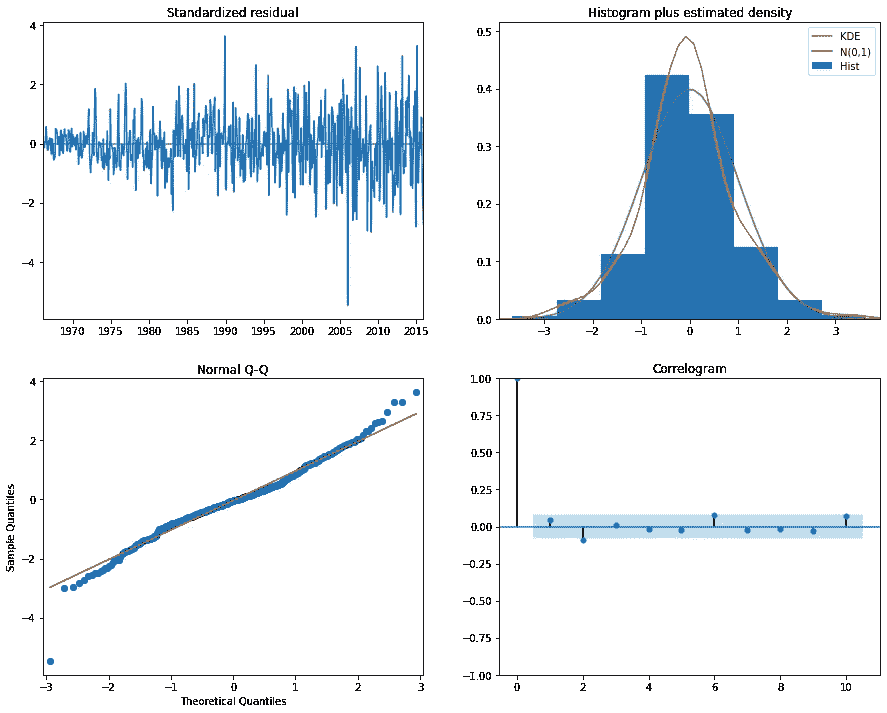

**我们在这里可以看到残差是白噪声，也是正态分布。因此，我们可以继续这一模式。**

我们现在将预测测试数据，然后检查准确性。

```
*# Obtain predicted values*
start=len(train)
end=len(train)+len(test)-1
predictions = result.predict(start=start, end=end, dynamic=**False**, typ='levels').rename('SARIMA(1,1,1)(2,1,2,12) Predictions')*# Plot predictions against known values*
title = 'Energy Production - Actual vs. Predicted'
ylabel='Production'
xlabel='Date'

ax = test.plot(legend=**True**,figsize=(12,6),title=title)
predictions.plot(legend=**True**)
ax.autoscale(axis='x',tight=**True**)
ax.set(xlabel=xlabel, ylabel=ylabel
```

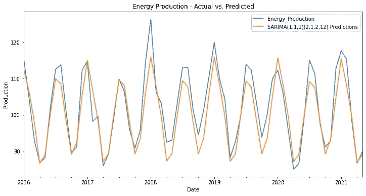

我们可以看到预测值与实际值非常接近。如果我们计算模型的 MAPE 和 RMSE，我们分别得到 3.09 和 4 的值。我们可以将这些值与测试系列的平均值进行比较，以检查误差的大小是否可以接受。在这种情况下，它是。(*我们无法将这些指标与平均和平滑方法进行比较，因为数据维度不同*)

这就把我们带到了时间序列预测的第 2 部分的结尾。这是一篇相当长的文章，这里有太多的东西需要吸收。时间序列预测是一门科学，这只是冰山一角。这里有更多值得探索的地方。

下面是这篇文章的要点。

1.  ARIMA 模型基本上是回归模型，其中独立变量是序列的滞后值和/或滞后预测误差。
2.  使用 ARIMA 模型进行预测的必要条件之一是序列应该是平稳的。
3.  平稳序列具有恒定的均值、恒定的方差，并且对于等滞后的观测值，协方差大致相同。
4.  时间序列的平稳性用扩展的迪基-富勒检验和 KPSS 检验来检验。如果序列不是稳定的，就使用差分法。可能只有一个差异(即使用 D 或 D)或两者都有。如果我们同时使用季节性差异和非季节性差异，建议在数据系列具有高度季节性的情况下首先使用季节性差异。
5.  参数 AR(p)、MA(q)、s AR(p)、SMA(Q)使用 ACF 和 PACF 图来识别。有一些准则可以帮助粗略估计这些参数的顺序。但是，最终的模型是使用 auto.arima()函数构建的。
6.  最终模型应该满足某些假设，如误差的正态性和残差之间的零自相关，即残差应该是白噪声。最终模型中所有参数的 p 值应该是显著的。

有许多链接对理解这个主题非常有帮助。下面是其中的几个。

1.  https://otexts.com/fpp2/index.html——这是著名的在线书籍《预测——原理与实践》的链接，作者是罗布·J·海曼和乔治·阿萨纳索普洛斯
2.  https://people.duke.edu/~rnau/411home.htm[——理解预测的另一个非常有用的来源。我多次提到这几页。](https://people.duke.edu/~rnau/411home.htm)
3.  [https://online.stat.psu.edu/stat510/lesson/4/4.1](https://online.stat.psu.edu/stat510/lesson/4/4.1)

希望这篇文章对你有用。一如既往，如果有任何问题或更正或建议，请告诉我。