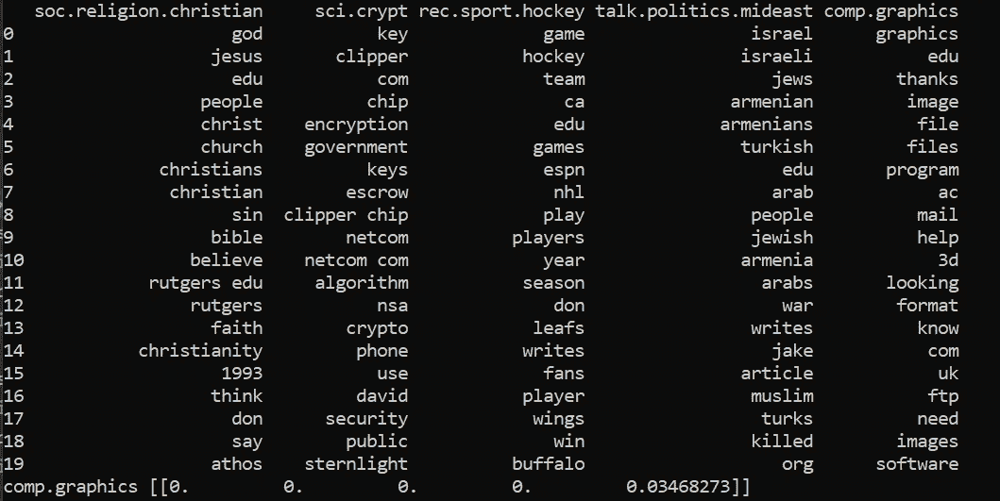
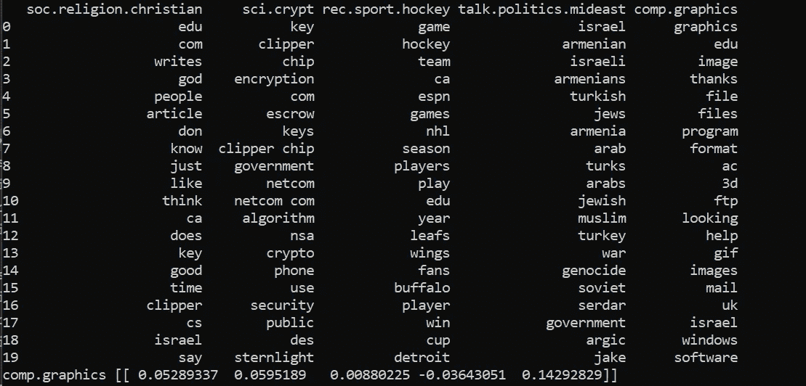
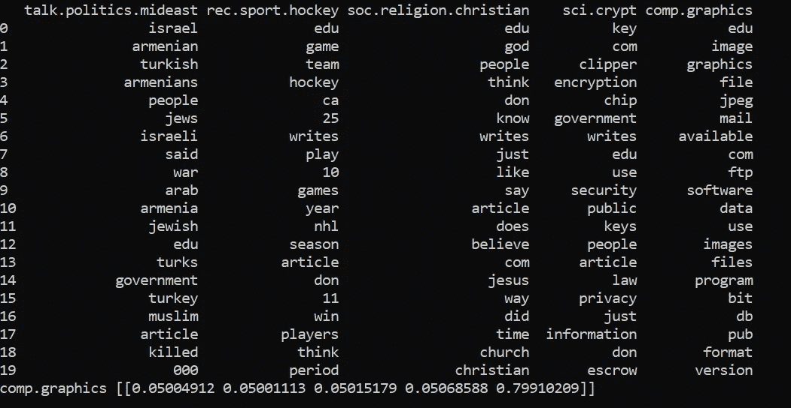

# 使用 Scikit-Learn 进行主题建模简介

> 原文：<https://towardsdatascience.com/introduction-to-topic-modeling-using-scikit-learn-4c3f3290f5b9?source=collection_archive---------7----------------------->

## 探索 3 种无监督技术，从文档中提取重要主题


由[托尔加·乌尔坎](https://unsplash.com/@tolga__?utm_source=unsplash&utm_medium=referral&utm_content=creditCopyText)在 [Unsplash](https://unsplash.com/s/photos/order?utm_source=unsplash&utm_medium=referral&utm_content=creditCopyText) 拍摄的照片

基于我以前关于自然语言处理的文章

*   [使用 Python 中的 spaCy 提取文本摘要](https://medium.com/better-programming/extractive-text-summarization-using-spacy-in-python-88ab96d1fd97)
*   [使用 Python 中的 spaCy 提取关键字](https://medium.com/better-programming/extract-keywords-using-spacy-in-python-4a8415478fbf)

让我们来探索如何使用另一个流行的机器学习模块`scikit-learn`来执行主题提取。在本教程中，我们将学习以下无监督学习算法:

*   非负矩阵分解(NMF)
*   潜在狄利克雷分配
*   TruncatedSVD(与 count 或 tfidf 矩阵一起使用时，也称为潜在语义分析)

至于数据集，可以选择使用自己的或者下载公开的 [20 新闻组数据集](http://qwone.com/~jason/20Newsgroups/)。它由大约 20k 个与新闻组相关的文档组成。总共有 3 种变化:

*   [20news-19997.tar.gz](http://qwone.com/~jason/20Newsgroups/20news-19997.tar.gz)—包含原始的未修改的 20 个新闻组数据集
*   [20news-bydate.tar.gz](http://qwone.com/~jason/20Newsgroups/20news-bydate.tar.gz)—除了删除重复项和一些标题外，数据集还按日期排序。分成训练和测试文件夹。
*   [20news-18828.tar.gz](http://qwone.com/~jason/20Newsgroups/20news-18828.tar.gz)—删除重复的邮件，邮件头只包含发件人和主题。

我在本教程中使用了`20news-18828`数据集。为了使事情简单和简短，我将只使用 20 个主题中的 5 个。

*   体育运动曲棍球
*   宗教，基督教
*   谈论。政治。中东
*   比较图形
*   科学地穴

`scikit-learn’s Vectorizers`期望一个列表作为输入参数，每一项用字符串表示一个文档的内容。您可以通过以下代码轻松处理数据集并将其存储在 JSON 文件中:

在将数据放入任何`Vectorizers`之前，从单个文件中读取数据要快得多。

请注意，我们创建的新数据集包含不必要的标题，如`From`，后跟电子邮件和人名。这样的噪音会影响你最终预测的结果。在实际的用例中，您应该删除它们，只保留与文档相关的信息。

让我们继续下一部分，开始安装必要的模块

# 设置

强烈建议您在继续安装之前创建一个虚拟环境。

## sci kit-学习

您可以通过在终端中运行以下命令来轻松安装最新版本的`scikit-learn`:

```
pip install -U scikit-learn
```

## 熊猫

接下来，继续安装 pandas，这是一个强大的数据分析和处理工具。

```
pip install pandas
```

## Numpy

在撰写本文时，最新的`numpy`版本是`1.19.4`。它有一个严重的错误，导致 Windows 操作系统出现以下错误。

```
The current Numpy installation fails to pass a sanity check due to a bug in the windows runtime
```

`numpy`背后的开发者发布了

> “…解决此问题的错误修复 1.19.3。这个 bugfix 破坏了 Linux 上的其他东西，所以我们不得不在 1.19.4 版中恢复这个修复，但你仍然可以通过 pip install numpy==1.19.3 安装 1.19.3。”

换句话说，您应该根据您机器的操作系统安装工作版本。

*   `Windows` — 1.19.3
*   `Linux` — 1.19.4

运行下面的命令来安装`numpy`。相应地修改版本。

```
pip install numpy==1.19.3
```

您应该在虚拟环境中安装以下软件包。

```
cycler          0.10.0
joblib          1.0.0
kiwisolver      1.3.1
matplotlib      3.2.0
numpy           1.19.3
pandas          1.2.0
Pillow          8.0.1
pip             20.3.3
pyparsing       2.4.7
python-dateutil 2.8.1
pytz            2020.5
scikit-learn    0.24.0
scipy           1.5.4
setuptools      51.1.0
six             1.15.0
threadpoolctl   2.1.0
```

# 履行

在这一节中，我们将使用三种不同的算法来实现我们的主题建模代码。创建一个名为`test.py`的新 Python 文件。

## 导入

在文件顶部添加以下 import 语句。

```
import pandas as pdfrom sklearn.feature_extraction.text import TfidfVectorizer, CountVectorizerfrom sklearn.decomposition import NMF, LatentDirichletAllocation, TruncatedSVDimport numpy as np
import json
import random
```

## 正在加载数据集

接下来，我们将加载之前创建的数据集。在将列表放入一个`Vectorizer`之前，将列表中的所有项目打乱是一个好主意。

```
corpus = []with open('data.json', 'r', encoding='utf8') as f:
    corpus = json.loads(f.read())
    random.shuffle(corpus)
```

## 变量

初始化下面的变量，稍后会用到。

```
n_features = 1000
n_components = 5
n_top_words = 20
```

`n_components`表示主题的数量，而`n_top_words`表示要为单个主题提取的热门单词的数量。

默认情况下，预测过程中没有相应主题的标签。需要自己识别，之后手动标注。

定义以下变量作为每个算法的标签:

```
nmf_topics = ['soc.religion.christian', 'sci.crypt', 'rec.sport.hockey', 'talk.politics.mideast', 'comp.graphics']lsa_topics = ['soc.religion.christian', 'sci.crypt', 'rec.sport.hockey', 'talk.politics.mideast', 'comp.graphics']lda_topics = ['talk.politics.mideast', 'rec.sport.hockey', 'soc.religion.christian', 'sci.crypt', 'comp.graphics']
```

此外，在每次运行期间，主题的顺序和排列不是有序的，特别是对于诸如 LDA 的概率模型。因此，您应该在运行整个训练和预测管道后修改这种安排。

## 计数矢量器

将一组文本文档转换成一个包含所有令牌计数的矩阵。有时，令牌计数被称为术语频率。

有一个非常有用的输入参数可以修改:

*   `max_df` —忽略频率高于给定阈值的术语。接受浮点数(范围从 0 到 1)或整数。Float 表示文档的比例，而 integer 表示绝对计数。
*   `min_df` —类似于`max_df`，但忽略频率低于给定阈值的术语
*   `max_features` —将只考虑给定的特征，这些特征在整个语料库中按词频排序
*   `stop_words` —接受要从语料库中删除的自定义停用词列表。您可以指定字符串`english`，它使用内置的英语停用词。
*   `ngram_range` —表示 n 元语法提取的上下边界的元组。

继续添加以下代码:

```
tf_vectorizer = CountVectorizer(max_df=0.95, min_df=2, max_features=n_features, stop_words='english', ngram_range=(1, 2))tf = tf_vectorizer.fit_transform(corpus)
```

它将删除出现在少于`2`个文档中或出现在至少`95%`个文档中的单词。将`ngram_range`设置为`(1, 2)`表示我们在对数据集进行矢量化时使用的是一元语法和二元语法。

## tfidf 矢量器

与`CountVectorizer`不同，`TfidfVectorizer`将文档转换为 TF-IDF 特征矩阵。最终结果类似于通过`CountVectorizer`后接`TfidfTransformer`的处理。

输入参数与`CountVectorizer`大致相同。除了基于字数和文档数的算法(如潜在狄利克雷分配(LDA ))之外，您应该尽可能这样做。

添加以下代码，初始化`TfidfVectorizer`并向量化文档的输入列表。

```
tfidf_vectorizer = TfidfVectorizer(max_df=0.95, min_df=2, 
max_features=n_features, stop_words='english', ngram_range=(1, 2))tfidf = tfidf_vectorizer.fit_transform(corpus)
```

输入参数与我们之前用于`CountVectorizer`的参数完全相同。

# 非负矩阵分解(NMF)

顾名思义，这种算法是用来寻找

> “……两个非负矩阵(W，H)，它们的乘积近似于非负矩阵 x。”

这些结果对降低特征维数和源分离非常有用。此外，它还可以用于主题抽取。

## 初始化

有几个输入参数可以微调。例如，您可以更改初始化程序的`init`参数:

*   `random` —非负随机矩阵
*   `nndsvd` —非负双奇异值分解。这是稀疏的首选。
*   `nndsvda` — `nndsvd`用 x 的平均值填零，不需要稀疏的时候用。
*   `nndsvdar` — `nndsvd`用小随机值填零。与`nndsvda`相比，速度更快但精度更低。

默认情况下，该值是随机的，除非`n_components` < `n_features`。如果是这种情况，将使用`nndsvd`。

## 解决者

您可以使用以下选项之一调整数值`solver`参数:

*   `cd` —坐标下降
*   `mu` —乘法更新

## 贝塔损失

`NMF`可应用三种不同的目标函数(在 sklearn 中调用函数时称为`beta_loss`):

*   `frobenius`
*   `kullback-leibler`
*   `itakura-saito` —只能在`mu solver`中使用，输入矩阵 X 不得包含零。

目标函数在实例化时将默认为`frobenius`。当运行 NMF 时，时间复杂度是多项式的。

## 实例化 NMF

初始化一个新的实例，它接受`TfidfVectorizer`的输出矩阵。

```
nmf = NMF(n_components=n_components, random_state=1, alpha=.1, l1_ratio=.5, init='nndsvd').fit(tfidf)
```

`alpha`和`l1_ratio`与正规化有关。如果您不想进行调整，请将`alpha`值设置为 0。

# LatentDirichletAllocation

LDA 是一种很好的生成概率模型，用于从文本语料库等离散数据集中识别抽象主题。

## 学习方法

`scikit-learn`中的 LDA 基于在线变分贝叶斯算法，支持以下`learning_method`:

*   `batch` —在每次更新中使用所有训练数据。
*   `online` —每次更新使用小批量的训练数据。训练数据量大的话会比`batch`快很多。

从 0.20 版本开始，默认`learning_method`为批量。

## 实例化 LDA

拟合 LDA 时，您应该使用`CountVectorizer`而不是`TfidfVectorizer`，因为 LDA 是基于术语计数和文档计数的。用`TfidfVectorizer`拟合 LDA 将导致稀有词被不成比例地采样。这样一来，他们会对最终的话题分布产生更大的冲击和影响。

使用以下代码创建一个新的 LDA 实例。

```
lda = LatentDirichletAllocation(n_components=n_components, random_state=1).fit(tf)
```

由于 LDA 是一个概率模型，所以每次运行它时，最终结果都会有所不同。因此，最好将`random_state`参数设置为一个固定的数字，并使用 pickle 在本地保存模型，以保留它稍后推断主题的方式。

# 潜在语义分析

另外，`scikit-learn`还附带了一个很棒很有用的降维模型，叫做`Truncated Singular Value Decomposition` ( `TruncatedSVD`)。与 PCA 不同，该模型计算奇异值分解时不将数据居中。

如果`TruncatedSVD`模型配有 count 或 tfidf 矩阵，它也被称为`Latent Semantic Analysis` (LSA)。大多数文章倾向于称之为 LSA，而不是 T9。为了保持一致，在本教程中我也将它称为 LSA。

## 算法

它支持两种不同的算法:

*   `randomized` —快速随机奇异值分解求解器
*   `arpack` —基于 SciPy 的 ARPACK 包装器作为特征值求解器

## 实例化 LSA

通过以下代码创建一个符合 tfidf 矩阵的新实例`TruncatedSVD`。

```
lsa = TruncatedSVD(n_components=n_components, random_state=1, algorithm='arpack').fit(tfidf)
```

请注意，在执行转换之前，您应该将该类的实例与预定义的`random_state`匹配一次。这防止了`sign indeterminnancy`问题，因为转换的输出取决于算法和`random_state`。

# 主题和推理

## 获取主题

完成后，让我们创建一个通用函数，以 DataFrame 的形式从模型返回主题。我们的实现基于下面教程中的[函数，但做了一点改动。请根据您的用例随意修改它。](https://sklearn.org/auto_examples/applications/plot_topics_extraction_with_nmf_lda.html)

## 基于文本输入的推理

我们将需要另一个函数来对我们选择的任何输入文本进行推理。定义一个名为`get_inference`的新函数，并在其中添加以下代码。

这是我自己的实现，它返回

*   可信度最高的主题标签
*   所有主题的置信度值
*   超过特定阈值的所有主题的标签

请注意，根据所使用的算法，特定主题的置信度值可以是负数。

## 结果

最后一步是运行我们之前创建的两个函数，并打印出结果。我将使用下面的输入文本，其中应该映射到`comp.graphics`。

```
text = 'you should use either jpeg or png files for it'
```

继续调用我们所有模型上的函数。

对于`NMF`，我得到了以下输出，它展示了输入文本的主题分布和最终推断:



作者图片

尽管最终结果是准确的，但是`LSA`的结果却不太乐观。基于主题分布，有相当多的词被错误地建模。



作者图片

另一方面，`LDA`返回了以下结果。单词`edu`被预测为三个话题的最热门单词。这主要是因为我使用的数据集有`From`标题，其中包含相当多以`.edu`结尾的电子邮件地址。



作者图片

请注意，主题和热门词汇的顺序可能会在每次运行时有所不同，尤其是如果您没有指定`random_state`或使用`online`学习。

如果您想在每次执行时保留相同的结果，可以考虑使用`pickle`在本地保存`Vectorizer`和模型。

# 结论

让我们回顾一下今天所学的内容。

我们从探索 20 个新组数据集开始，这些数据集分为三个不同的类别。我们还处理了数据，只使用了 5 个主题，而不是完整的数据集。

然后，我们继续安装必要的 Python 模块，并将数据集加载到 Python 文件中。

此外，我们还创建了 CountVectorizer 和 TfidfVectorizer，用于在将文档拟合到我们的模型之前对它们进行矢量化。

我们基于`non-negative matrix factorization`、`latent dirichlet allocation`和`TruncatedSVD`构建了三个不同的模型。

最后，我们创建了通用函数来获取主题，并从我们构建的模型中执行推理。

感谢你阅读这篇文章。希望在下一篇文章中再见到你！

# 参考

1.  [20 个新闻组数据集](http://qwone.com/~jason/20Newsgroups/)
2.  [StackOverflow — Numpy 运行时问题](https://stackoverflow.com/questions/64654805/how-do-you-fix-runtimeerror-package-fails-to-pass-a-sanity-check-for-numpy-an)
3.  [SkLearn —话题抽取](https://sklearn.org/auto_examples/applications/plot_topics_extraction_with_nmf_lda.html)