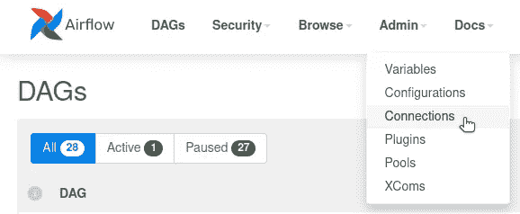
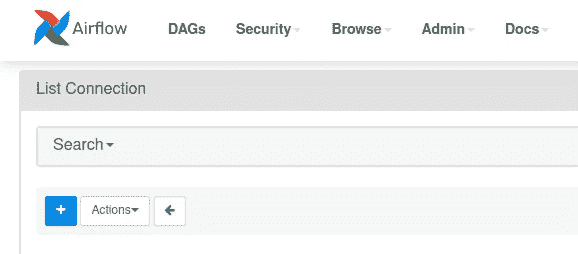
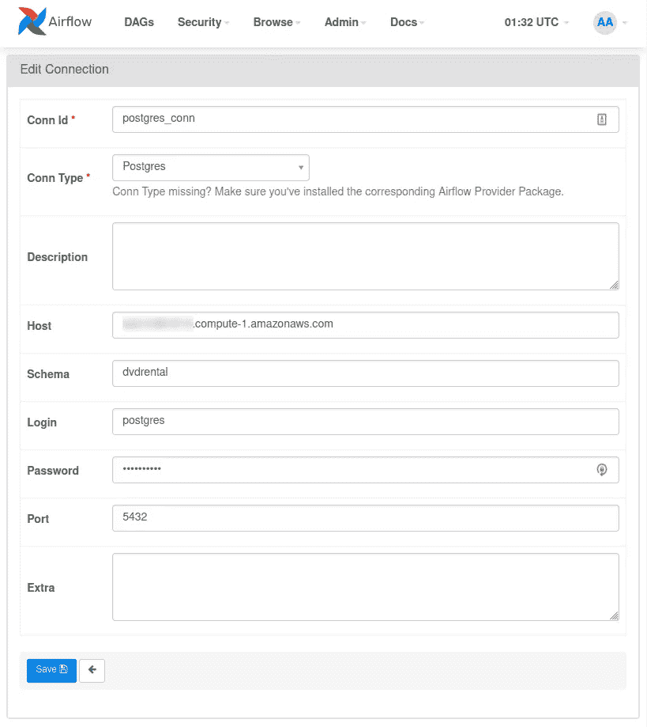
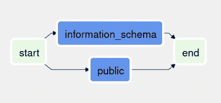
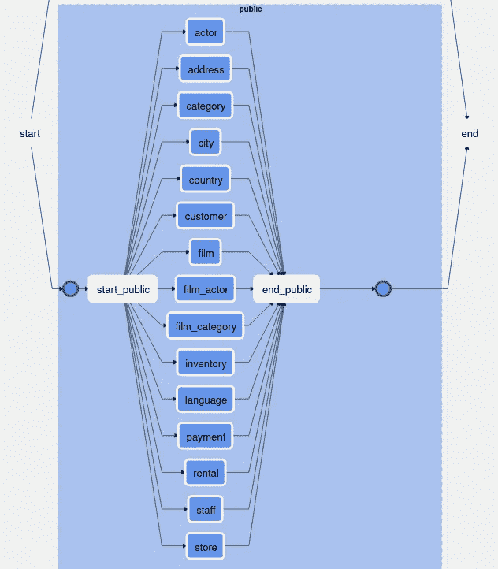
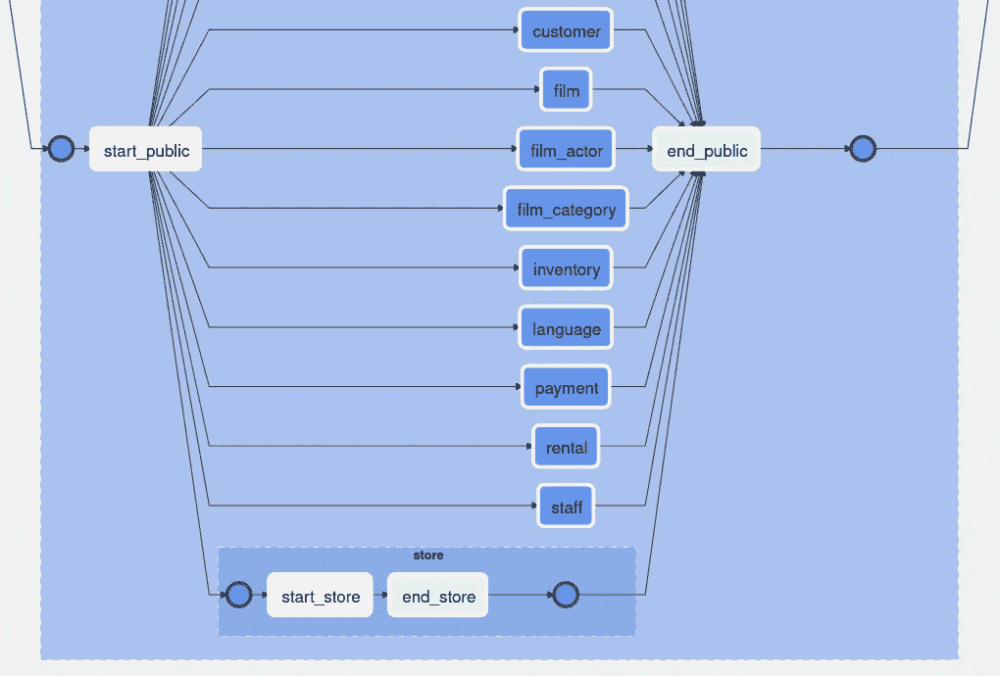

# 用 Airflow 和 SQLAlchemy 反思数据库

> 原文：<https://towardsdatascience.com/introspecting-databases-with-airflow-and-sqlalchemy-6ef18d85acce?source=collection_archive---------16----------------------->

## 迭代自动自省数据库对象的教程


由[pawebukowski](https://unsplash.com/@bukowski?utm_source=medium&utm_medium=referral)在 [Unsplash](https://unsplash.com?utm_source=medium&utm_medium=referral) 拍摄的照片

在最近一个利用了[气流](https://airflow.apache.org/)的数据迁移项目中，我需要连接到一个数据库并自动自省它的模式和表。一个需要内省的数据库有*数百*个模式。每个模式都有几十个不同的表，其中大多数都有不同的列和列约束。

换句话说，我们的数据库元数据由成千上万的对象组成，没有人会手动将这些对象输入到配置文件或硬编码的 Python 列表中。知道了 Airflow 使用 [SQLAlchemy](https://www.sqlalchemy.org/) 模块尽可能地用方言和引擎与数据库通信，我有一种预感，我可以利用 Airflow 与数据库的 SQLAlchemy 连接来生成模式、表、列或我需要访问的任何数据库对象的列表。

我的预感是对的！SQLAlchemy 和 [Airflow 的 DB API 钩子](https://airflow.apache.org/docs/apache-airflow/stable/_api/airflow/hooks/dbapi/index.html)使得[获得任何连接数据库的 SQLAlchemy 引擎](https://airflow.apache.org/docs/apache-airflow/stable/_api/airflow/hooks/dbapi/index.html#airflow.hooks.dbapi.DbApiHook.get_sqlalchemy_engine)变得容易。

# 预赛

这个演示需要遵循几个初步步骤。我们将使用 PostgreSQL，但几乎任何常见的数据库都可以。

## 安装气流

从这里的开始[。用](https://airflow.apache.org/docs/apache-airflow/stable/start/index.html)[对接器安装](https://airflow.apache.org/docs/apache-airflow/stable/start/docker.html)很容易。

## 创建 PostgreSQL 数据库

AWS 提供了一个关于如何做的快速指南。如果您愿意，可以用表填充`public`模式(或其他模式),并插入一些数据。(如果已经有了一个填充了可以连接的模式和表的 Postgres 数据库，可以跳过这一步。)

# 气流设置

以下步骤可以通过 Airflow CLI 完成，但 web UI 简单而漂亮。

## 运行气流

运行气流调度程序和 web 服务器。如何运行气流包含在[气流入门教程](https://airflow.apache.org/docs/apache-airflow/stable/start/index.html)中。一旦气流开始，将你的浏览器指向网络用户界面。如果您通过 Docker 或本地安装了 Airflow，URL 很可能是`http://localhost:8080/`。

## 创建到 Postgres 数据库的连接

从 web UI 的导航栏中，单击**管理** > **连接**。



通过 Airflow web UI 创建 Postgres 数据库连接

点击蓝色的 **+** 按钮添加一个新的连接。



通过 Airflow web 用户界面添加新连接

输入您的数据库主机连接详情，并点击**保存**按钮。注意:“模式”字段实际上是您想要连接的数据库。我正在使用我的`dvdrental`数据库中现成的 [DVD 租赁数据](https://www.postgresqltutorial.com/postgresql-sample-database/)。记下您的**连接 Id** ，因为我们在下一步中需要它。



通过 Airflow web UI 定义您的 Postgres 数据库连接

# 创建 DAG

在气流安装过程中创建的`dags`文件夹中，添加一个名为`introspect_db.py`的 Python 文件。将此 DAG 代码复制并粘贴到文件中。如果你有 **Conn Id** `postgres_conn`，保持代码不变。否则，更改`pg_hook`分配行以反映您的**连接 Id** 。

```
import logging
import re
from typing import List

from airflow import DAG
from airflow.operators.dummy import DummyOperator
from airflow.operators.python import PythonOperator
from airflow.providers.postgres.hooks.postgres import PostgresHook
from airflow.utils.dates import days_ago
from airflow.utils.task_group import TaskGroup

from sqlalchemy.inspection import inspect
from sqlalchemy.engine.reflection import Inspector
from sqlalchemy.engine import Engine

def log_info(info, *args, **kwargs):
    logging.info(f"info={info}")
    logging.info(f"args={args}")
    logging.info(f"kwargs={kwargs}")

default_args = {
    "owner": "airflow",
}

with DAG(
        dag_id="introspect_db",
        default_args=default_args,
        schedule_interval="@once",
        start_date=days_ago(2),
) as dag: pg_hook = PostgresHook(postgres_conn_id="postgres_conn")
    pg_engine: Engine = pg_hook.get_sqlalchemy_engine()
    pg_inspector: Inspector = inspect(pg_engine)

    schema_names: List[str] = pg_inspector.get_schema_names()

    schema_task_groups: List[TaskGroup] = [
        TaskGroup(group_id=f"{s}") for s in schema_names
    ]

    for schema_tg in schema_task_groups:
        # Ex. of schema_tg.group_id: "public"
        schema_name: str = schema_tg.group_id

        table_names: List[str] = \
            pg_inspector.get_table_names(schema=schema_name)

        table_task_groups: List[TaskGroup] = [
            TaskGroup(group_id=f"{t}", parent_group=schema_tg)
            for t in table_names
        ]

        for table_tg in table_task_groups:
            # Ex. of table_tg.group_id: "public.actor"
            table_name_p = re.compile(r"^\w+\.(\w+)$")
            table_name: str = re.match(
                table_name_p,
                table_tg.group_id
            ).group(1)

            start_table = PythonOperator(
                task_id=f"start_{table_name}",
                task_group=table_tg,
                python_callable=log_info,
                op_kwargs={
                    "info": [
                        f"table_tg.group_id={table_tg.group_id}",
                        f"table_name={table_name}",
                    ]
                }
            ) end_table = DummyOperator(
                task_id=f"end_{table_name}",
                task_group=table_tg
            ) start_table >> end_table start_schema = PythonOperator(
            task_id=f"start_{schema_name}",
            task_group=schema_tg,
            python_callable=log_info,
            op_kwargs={
                "info": [
                    f"schema_tg.group_id={schema_tg.group_id}",
                    f"schema_name={schema_name}",
                ]
            }
        ) end_schema = DummyOperator(
            task_id=f"end_{schema_name}",
            task_group=schema_tg
        )

        start_schema >> table_task_groups >> end_schema

    start = DummyOperator(task_id="start")
    end = DummyOperator(task_id="end")

    start >> schema_task_groups >> end
```

DAG 代码中有几个片段值得一提。

片段 1。第一个代码片段(如下)说明了如何获取数据库的模式名。首先，使用 Postgres 连接(如上定义)获得一个 Postgres 挂钩。这个钩子用于获取 SQLAlchemy 引擎。反过来，该引擎用于检查连接的数据库中所有模式名称的列表。

```
# Snippet 1pg_hook = PostgresHook(postgres_conn_id="postgres_conn")
pg_engine: Engine = pg_hook.get_sqlalchemy_engine()
pg_inspector: Inspector = inspect(pg_engine)schema_names: List[str] = pg_inspector.get_schema_names()
```

片段 2。下一个代码片段演示了如何为每个自省模式创建一个 TaskGroup 对象列表。我们迭代每个模式 TaskGroup 对象，从模式 TaskGroup 的组 ID 中获取每个模式名称作为字符串，然后在模式中执行某种工作。

```
# Snippet 2schema_task_groups: List[TaskGroup] = [
    TaskGroup(group_id=f"{s}") for s in schema_names
]for schema_tg in schema_task_groups:
    # Ex. of schema_tg.group_id: "public"
    schema_name: str = schema_tg.group_id ...
```

片段 3。在这种情况下，我们在每个模式中所做的“工作”是自省模式的所有表。为了做到这一点，我们采用了与模式相似的方法。然而，这一次我们需要做两件不同的事情。首先，为了创建每个表 TaskGroup 对象，我们需要将`schema_tg` TaskGroup 对象传递给`parent_group`参数。其次，我们需要从表 TaskGroup 对象的`group_id`中解析出表名。任务组 ID 的格式是`<schema>.<table>`，所以我使用了`re` regex 模块来解析出表名。例如，对于一个表任务组 ID 为`public.actor`，正则表达式模式`^\w+\.(\w+)$`将允许我们提取任务组 ID 的`actor`部分。

```
# Snippet 3 table_names: List[str] = \
        pg_inspector.get_table_names(schema=schema_name)

    table_task_groups: List[TaskGroup] = [
        TaskGroup(group_id=f"{t}", parent_group=schema_tg)
        for t in table_names
    ]

    for table_tg in table_task_groups:
        # Ex. of table_tg.group_id: "public.actor"
        table_name_p = re.compile(r"^\w+\.(\w+)$")
        table_name: str = re.match(
            table_name_p,
            table_tg.group_id
        ).group(1) ...
```

片段 4。最后，注意任务依赖是如何定义的。任务对`start`和`end`以及`start_schema`和`end_schema`是单个任务。在每个任务对之间是一个变量，代表一组 TaskGroup 对象。这类似于用类似于`task_1 >> [task_2, task_3] >> task_4`的列表定义任务依赖关系，因为`schema_task_groups`和`table_task_groups`是 TaskGroup 对象的*列表*。

```
# Snippet 4 start_schema >> table_task_groups >> end_schema ...start >> schema_task_groups >> end
```

代码准备好了。现在，我们可以与 web 用户界面进行交互。

# 查看 DAG 的结构

在`http://localhost:8080/`返回 web UI，点击 **introspect_db** DAG 链接，然后点击**图形视图**按钮。您应该在 web UI 中看到模式任务组。

我的看起来像这样。



图表视图中的方案任务组

单击其中一个模式任务组将其展开。您应该可以在所选的模式任务组中看到表任务组。



图表视图中的表任务组

最后，单击其中一个表任务组将其展开，您将显示表组中的任务。



图表视图中表任务组中的任务

# 结论

在本教程中，我们使用了 Airflow 中包含的工具来自省数据库的对象，将这些对象反映为嵌套的任务组，并遍历这些对象。您在任何级别上对对象做什么工作都由您决定。我希望这个指南对解决你的类似问题有所帮助。感谢阅读！