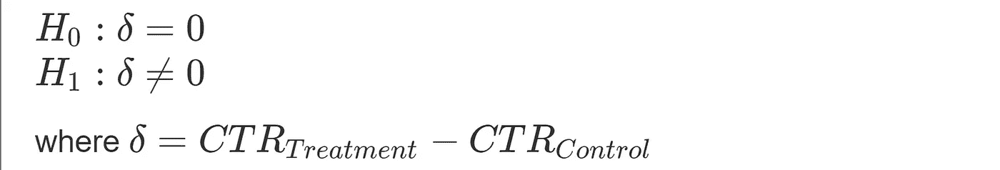
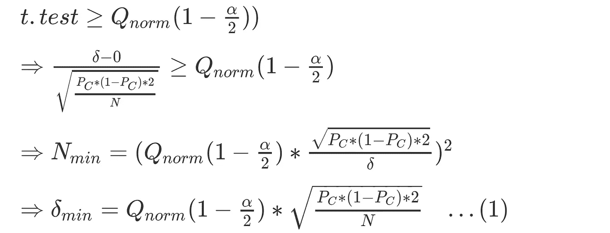
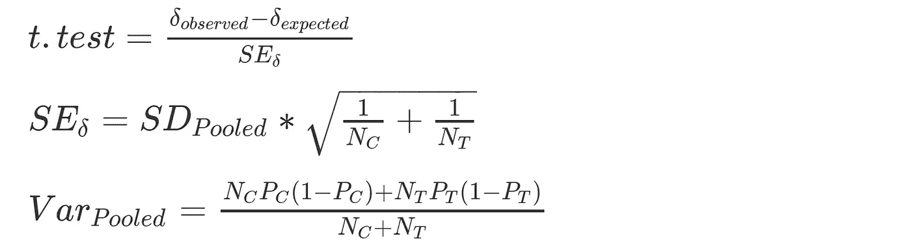
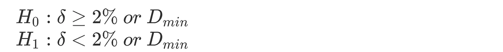
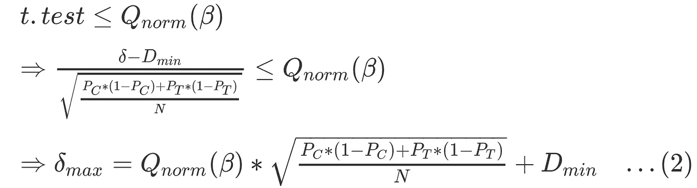
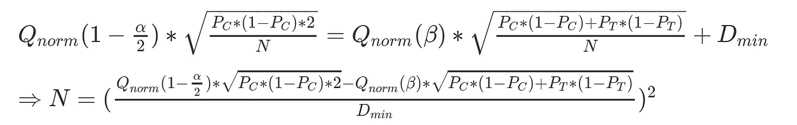

# A/B 样本规模背后的直觉

> 原文：<https://towardsdatascience.com/intuition-behind-a-b-sample-sizing-cb7e9c4fb992?source=collection_archive---------16----------------------->

## 了解埃文·米勒的样本量计算器

马库斯·斯皮斯克在 [Unsplash](https://unsplash.com?utm_source=medium&utm_medium=referral) 上的照片

**TLDR:** 这篇文章展示了埃文·米勒网站上样本量计算器背后的 R 代码(和数学)。

## 为什么要阅读另一篇关于这方面的文章呢？

在由 Diane Tang 和谷歌团队在 Udacity 开设的关于 A/B 测试的热门课程中，他们简要讨论了“[大小与功率的权衡](https://www.youtube.com/watch?v=bnTIVGBkKhM)，并建议用户参考 [Evan Miller 的在线计算器](https://www.youtube.com/watch?v=WnQoZzxas-g)来确定α & β的理想水平所需的样本大小。但是如果你像我一样喜欢打开黑匣子，这篇文章就是为你准备的。(如果你想跳过数学，只得到代码，滚动到最后。)

## **让我们从一个简单的设置开始**

*   假设我们网站上“订阅”按钮的当前点击率(CTR)为 25%(即，当用户加载页面时，有 25%的概率会点击它。)
*   现在假设，我们提出一个我们认为(即假设)会增加 CTR 的设计变更。虽然我们不知道这种变化需要测试多少，才能产生实际的商业意义，但至少需要提高 2 个百分点*(即从 25%增加到至少 27%)。*

*A/B 测试是这个测试的完美框架。然而，在运行测试之前，我们需要确定运行测试的样本大小。应该是 100 个用户、10000 个用户还是 1000 万个用户？*(你懂了大意)**

*假设我们保持对照组和治疗组的样本大小相等(=N)，让我们看看我们对α & β的选择如何驱动 N 的最小值。*

## *α对样本量的影响*

*α或“显著性水平”表示类型 1 错误的概率，这是 P(拒绝 Null | Null 为真)，在以下假设下(*注意这是一个* ***双尾检验)*** :*

**

*如果我们只对控制 1 型误差感兴趣，那么对于选定的α值，我们可以使用以下等式来确定所需效应(δ，在我们的例子中为+2%)所需的最小 N 值(如果检测到，则为“统计显著”)，或者确定对于给定的 N 值具有统计显著性的最小正效应(δ min)(在下面的等式中，我们使用α/2，因为这是一个双尾测试。然而，我们只关注右端的尾部，因为从商业角度来看，我们只对δ的正值感兴趣。)*

**

*上面的公式是从下面给出的 t.test 公式推导出来的，有两个简化:*

*   *对照组和治疗组的样本量相等，等于 N*
*   *给定我们的零假设，对于对照组和治疗组，二项分布的概率(=25%，本例中的 CTR)是相同的。*

**使用混合方差计算检验统计量:**

**

**哪里，**

*   **下标 C & T 分别表示对照组和治疗组，**
*   **P 是二项式分布的概率(在我们的示例中，它代表 CTR，更一般的是基本转换率)**

*然而，在我们的实验中，我们还希望控制 2 型误差，用β表示。让我们看看这如何影响我们的样本量估计。*

## *β对样本量的影响*

*β度量 2 类错误的概率，为 P(拒绝 Null 失败| Null 为假)。*

*但是让我们考虑一下这个问题。说‘当 Null 为 false 时’是什么意思？在我们上面的设置中，空值是“δ = 0”。因此，对于δ的任何(真)非零值，空值将为假。对于δ =-0.05(如果由于某种原因我们提议的变更恶化了 CTR)，或者对于δ =+0.001(如果提议的变更改善了 CTR，但只是略微改善)，它将是假的。然而，对于这两种情况，给定 N 的β值(反之亦然)会非常不同。那么，我们对‘Null is false’的哪个版本感兴趣呢？*

*答案是我们只对 *Delta 至少大到+2%* 的版本感兴趣。这与前面提到的具有实际意义的最小量+2%相同。*

*   *在(真)δ < +2%, we don’t care about β, because the result is of no practical importance to us anyway.*
*   *And, for scenarios where (true) δ ≥ +2%, as long as we control β for δ = +2% case, β for cases where δ > +2%的情况下，将在我们的公差范围内。这是基于β随δ增加而减小的事实。*

*在讨论方程之前，让我们以一种更直观且与我们上面的评论一致的方式重新陈述我们的零假设。(*注意这是一个* ***单(左)尾测试)****

**

*在这些新的假设下，我们可以将β表示为 P(拒绝 Null | Null 为真)。这类似于我们在原始假设下表达α的方式。*

**

## *将这一切结合在一起*

*等式(1)和(2)给出了δ的范围，分别满足我们期望的α和β水平。为了确保在满足α容差的δ最小值下，我们的测试全部满足β容差，我们将两个等式相等，并估计 N 的最小值如下:*

**

## *例子*

*在我们的示例中，N 的值等于 7，415。参考下面的 R 代码。*

*这与埃文·米勒的计算器得出的值一致*

**

*来源:[埃文·米勒的计算器](https://www.evanmiller.org/ab-testing/sample-size.html#!25;80;5;2;0)*

*感谢您的阅读。如果你有问题或意见，请留言。*