# 中心极限定理背后的直觉

> 原文：<https://towardsdatascience.com/intuition-behind-central-limit-theorem-8dc1ca40de1a?source=collection_archive---------16----------------------->

[莱昂纳多·巴尔德斯拉](https://unsplash.com/@ilbaldii?utm_source=medium&utm_medium=referral)在[号航天飞机](https://unsplash.com?utm_source=medium&utm_medium=referral)上的照片

**中心极限定理** (CLT)是统计学领域最基本的概念之一。没有它，我们将在现实世界中游荡，遇到的问题多于解决方案。它的应用非常广泛——从参数估计到假设检验，从制药行业到电子商务。在任何行业中，几乎没有任何实证研究可以不利用 CLT 原理。一个多世纪前的一句话总结了 CLT 的重要性。

> “我几乎不知道有什么比[中心极限定理]所表达的宇宙秩序的奇妙形式更能打动想象力了。如果希腊人知道的话，他们会将法律拟人化并神化。”
> 
> ——弗朗西斯·高尔顿爵士，1889，[自然遗传](https://books.google.com/books?id=vc8oAAAAYAAJ&pg=PA66&hl=en#v=onepage&q&f=false)。

在我们深入探究神秘莫测的中心极限定理(CLT)世界之前，我们需要理解几个术语来理解和表达潜在的语言。在本博客中，我们将首先了解人口与样本、参数与统计、推断统计的相关性以及抽样分布。我们还将从人群中提取一些样本并进行比较，为 CLT 奠定基础。我们最终会以 CLT 的正式定义，它的局限性和一个在实践中可以看到的 CLT 原则的例子来结束这篇文章。

## **人群对比样本**

什么是群体，它与样本有何不同？

***人口*** 指一组/一组数据中的每一个成员所有的美国公民，一个城市的所有居民，一所学校的所有学生，等等。进行调查以收集全部人口数据的过程称为 ***人口普查*** 。

***样本*** 指时间和资源允许测量的人群中的成员子集。进行调查以收集样本数据的过程称为 ***样本调查*** 。

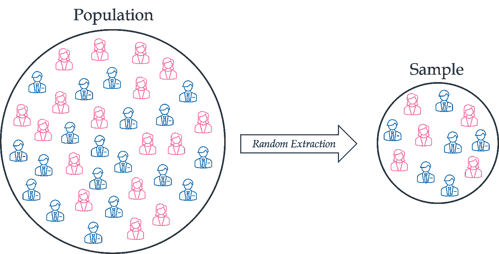

**取样流程**

采样有多有用？

让我们考虑一下在印度首都地区引人注目的连锁企业 81C 面包店。该公司希望推出一个新的标志，以更好地与目标受众——30 岁以下的成年人——联系起来。该公司必须从内部利益相关者小组列出的三个相关设计中选择最佳设计。公司是如何着手的？明智的做法是收集目标受众的反馈，考虑他们的意见，然后再决定哪种设计最能引起群体的共鸣。

然而，公司是否应该对所有客户(现有的或潜在的)进行调查，以找出最合适的设计？从时间和成本的角度来看，这难道不是一项极其昂贵的工作吗？

**采样**的魔力来了。公司需要做的只是从总体中选择有限的一组成员，并对这组样本进行调查。随后，利用抽样调查的结果，公司可以得出关于人群偏好(特征)的(合理)结论，并选择最佳标志设计继续前进。请记住，样本需要是*无偏的*和*代表总体的*，并且需要从相关总体中随机*抽取*。只有这样，样本才可以作为合适的代表*来帮助人们解决手头的问题。*

> 样本需要*无偏*且*代表总体的*，并且需要从相关总体中随机*抽取*。

## **参数与统计**

什么是参数，它与统计数据有何不同？

***参数*** 是描述总体(特征)的数字/数量，而 ***统计*** 是描述样本的数字/数量。用于描述人口/样本特征的数字可以是对*集中趋势*(平均值、中位数或众数)的度量，也可以是对*离差*(方差、标准差、范围或四分位间距)的度量。

以下是在总体和样本背景下几个重要且广泛使用的度量的符号和公式。在下表中， *x* 表示总体或样本集中的个体值。

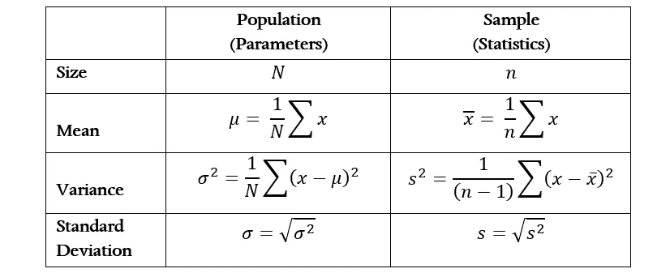

## **推断统计的相关性**

样本统计有什么用？

在推断统计学的帮助下，我们可以使用(样本的)统计数据进行有根据的猜测，并得出(总体的)参数的结论。同时也可以理解推断结论中的置信度(或不确定性)。由于我们只能收集和研究*有限的数据集*，而不是整个人口，因此与人口参数估计相关的不确定性出现了。

*置信区间*是一个区间估计(两个值之间的范围)，用于表示与总体参数估计相关的不确定性。给定一个样本统计量，我们可以有把握地估计真实总体参数(如均值)的区间。换句话说，区间只是表明在一定的置信水平下，真实的总体参数位于估计的范围内。例如，我有 90%的信心，真实的人口平均数在 9.05 和 11.25 之间。

如果你对置信区间的概念及其计算更感兴趣，可以参考[文章](https://www.statisticshowto.com/probability-and-statistics/confidence-interval/)。

## **样本的唯一性和局限性**

为什么统计值不能为我们提供参数的*精确值*而不是*估计值*？

假设约翰、迈克和凯文每个人都分别被分配了任务*去推断印第安纳州霍金斯的一个假想城镇的居民的平均年龄。让我们假设这三个人都被分配了*单独的*资源来解决手头的问题，并且他们在整个练习过程中*不会相互协作*。每个人从人群中随机抽取 100 个年龄。*

你认为任何样本的平均年龄(统计数据)会与城市人口的平均年龄(参数)相同吗？嗯，很可能不是，因为样本由于其受*限制的*大小( *n* )而只能获得关于总体的*有限的*信息，因此没有足够的技能来辨别准确的参数值本身。然而，三个样本统计值中的任何一个仍然可能偶然等于参数值，即使这种事件发生的可能性很小。

你认为 Mike 样本的统计值(平均年龄)会与 Kevin 样本的统计值完全匹配吗？同样，很可能不会，因为每个样本很可能以来自总体的一组*不同的*值结束，从而产生一个*唯一的*统计值。然而，两个不同的样本仍然可能偶然地具有相同的一组值，即使这种事件发生的概率非常低。

让我们从总体中抽取三个不同的样本，见证一个样本在行动中的“唯一性”和“局限性”。

这是霍金斯小镇所有 15 万居民的(模拟)年龄分布。分布的形状是伽玛，人口的平均年龄(参数)是 18 岁。

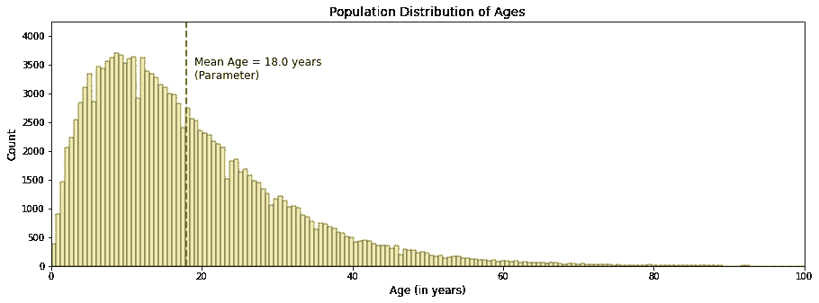

印第安纳州霍金斯的模拟人口

让我们通过*随机*和*独立*从人群中选择 100 个年龄，为每个约翰、迈克和凯文准备单独的样本。“独立”确保任何选择都不依赖于先前的选择。因此，我们很可能在样本中再次发现相同的年龄。只有通过在下一次选择发生之前用*替换*群体中的一个值，才能保证这一条件。

下图以地毯图的形式显示了三个样本的分布。每个样本的成员值由接触 x 轴上侧的刻度表示。

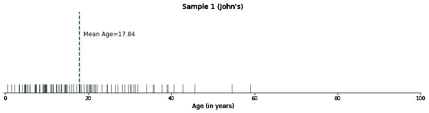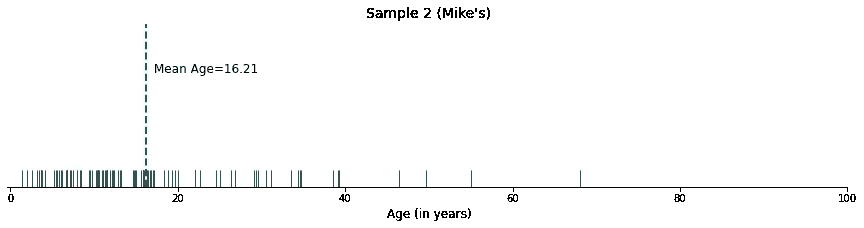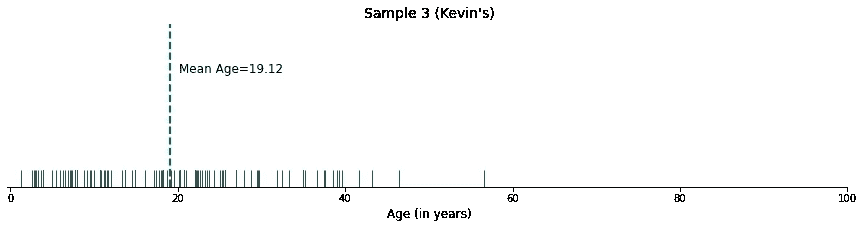

你有没有注意到年龄组的独特性，以及每个样本的统计数据(平均年龄)的独特性？所有统计值(17.84、16.21 和 19.12)彼此不同，并且与群体参数(18.0)也不同。然而，统计值似乎是围绕参数旋转的。

统计值的方差(或抽样误差)的出现是因为每个样本通过其自己的*唯一*和*有限*窗口窥视(和访问)总体——唯一性的出现是由于*随机*抽样和*有限*样本大小的限制。

如果我们从人群中抽取数千个样本，会发生什么？许多(统计值)的力量能以某种方式揭示真实的参数吗？

## **采样分布**

如果我们从总体中抽取数千个构造相似的样本(随机且独立，每个样本大小为 100)并计算每个样本的平均年龄(统计)，我们可以绘制一个直方图，称为 ***采样分布*** ，以展示收集的数千个平均统计值的频率。请记住，John、Mike 和 Kevin 只是构成下面抽样分布的成千上万个样本中的三个。

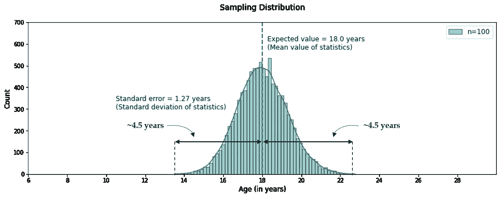

> 抽样分布是由样本统计的所有可能值组成的概率分布。它显示了从同一总体中抽取的每个可能的样本(大小为 *n)* 中统计值可能出现的频率。

请记住，统计数据可以是均值、中值、方差或任何其他定量描述样本(特征)的度量。然而，对于当前的问题，我们特意选择了*平均值*作为统计量，因为 CLT 原则仅适用于*平均值*统计量/参数。

下面是从上面的抽样分布中得到的一些重要观察结果。

*   在样本大小( *n* )为 100 的情况下，抽样分布的形状被证明是*近似*正态(又名高斯)且对称的，即使原始人口分布向右倾斜。正如我们将在后面看到的，人口分布越偏斜或不对称， *n* 就必须越高，抽样分布才能接近正态形状。
*   统计值/样本均值的平均值，也就是统计值(平均年龄)的*期望值*，为 18.01 岁，与参数(人口平均年龄= 18.0 岁)非常接近，可以毫无保留地认为等于参数。*统计值的期望值*，用 *E()* 表示，是统计值在重复抽样中的长期平均值，因此是我们对任何特定试验中该值的最佳猜测。
*   统计的**标准误差**，简单来说就是样本均值的标准差，是 1.83 年。它表示抽样分布有多分散，或者在样本的平均年龄中观察到的方差有多大。我们将在后面看到， *n* 越高，标准误差就越低。

整个过程——抽样、计算统计值(平均值)和寻找统计值的期望值——是 CLT 的基础，可以形象地概括如下。

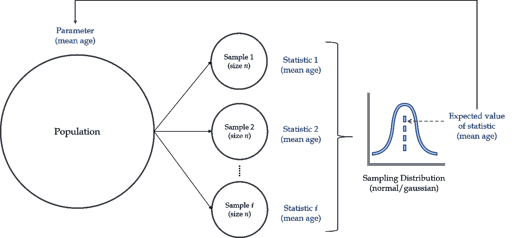

**样本大小对样本分布的影响**

样本大小对抽样分布有影响吗？如果是，为什么？

事实证明，样本大小对样本分布的形状和宽度有着深远的影响。让我们看看当样本大小( *n* )改变时，抽样分布是如何变化的。

下面是从 Hawkins 的人口(年龄)中产生的抽样分布，但是具有不同的样本大小(注意每个图右上角的图例)。

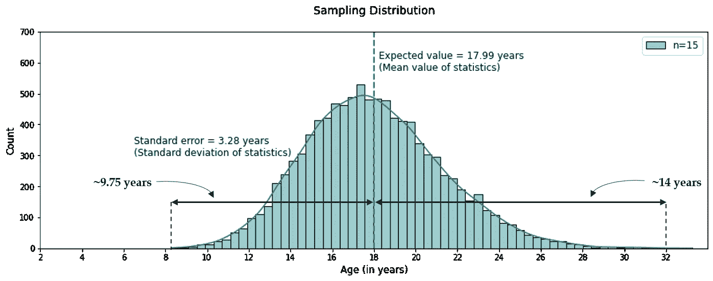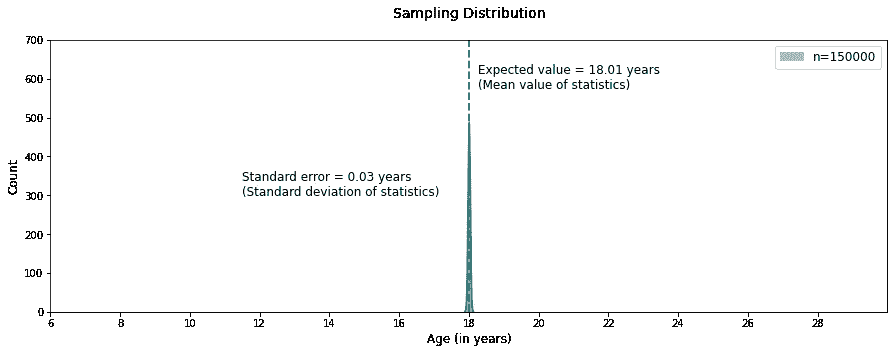

在改变样本大小 *n* 时，我们观察到两件重要的事情。

*   随着样本量的增加，抽样分布*接近于*正态分布。 *n* =15 的抽样分布是不对称的——它稍微向右倾斜(左边部分的宽度大致为 9.75 年，而右边部分的宽度超过 14 年)，模仿原始人口分布。将样本大小增加到至少 100 会使分布呈现对称性，因此呈正态分布。

> 样本量越大，形状越接近正态曲线。

*   随着样本量( *n)* 的增加，统计的标准误差(分布的宽度)减小。

想一想这个问题。如果一个样本有能力挑选出(几乎)所有的人口，难道它就不能非常有把握地告诉我们总体的平均值吗？为什么这些样本的平均值会有任何(明显的)差异？请注意，在最后一个采样分布中，n =150k(等于整个人口的大小)，平均年龄的标准误差最小，为 0.03 岁。

根据同样的推理，如果每个样本在抽样过程中能够挑选出更少的总体成员，从而获得更少的总体信息，那么这些样本的均值将显示出更高的方差。这从上面的采样分布中可以明显看出，其中 *n* =15、100 和 500。随着我们增加 *n* ，样本均值的方差减小。你还记得约翰、迈克和凯文的样本的平均值吗，每个样本的大小都限制在 100？你还记得它们不相等，因此显示出一些差异吗？

> 随着样本量的增加，统计的标准误差减小。

## **中心极限定理**

这是 CLT 的一个更正式的定义；这基本上就是我们到目前为止所讨论的内容。

> 如果我们抽取样本，每个样本的大小为𝑛，并计算每个样本的平均值，我们将期望获得一个值的分布，称为平均值的抽样分布。CLT 指出，对于大型随机样本，无论被抽样的总体/过程是如何分布的，均值的抽样分布都是近似正态的。样本量 *n* 越大，抽样分布就越接近精确的正态分布。

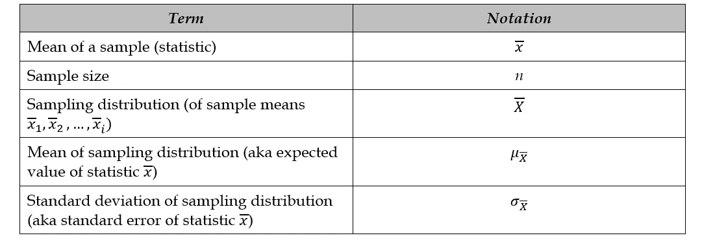

CLT 术语的符号

表示(样本均值的)抽样分布的符号如下，其中' ~ '读作“分布为”，“N”读作“正态”。

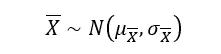

CLT 建立了抽样分布特征与相关总体分布特征之间的关系，如下所示。

注意，随着 *n* 的增加，平均统计的标准误差减小。这也正是我们在上一节中观察到的。

根据上面的公式，我们也可以说样本均值呈正态分布，其均值(即期望值)等于总体均值，其方差等于总体方差除以构成抽样分布的样本大小。因此，CLT 的精髓可以在下面的公式中得到体现。

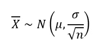

根据 CLT 原理，当样本量*大*时，达到采样分布的(近似)正态性。但是样本量应该有多大才能达到样本分布的正常形状呢？

尽管许多书籍/文章推荐*n*30 作为经验法则，样本的大小取决于人口的形状。如果潜在的(人口)分布是近似对称的，那么我们的抽样分布应该是非常正常的。在这种情况下，我们甚至可以将 *n* 减少到 10。但是，如果基本分布严重偏斜，那么我们需要增加样本量，以获得样本分布的正常形状。还记得 Hawkins 居民的年龄偏右的情况吗，我们需要 100 的样本量来得到样本分布的正态形状？

下图显示了四种不同类型的人口分布的抽样分布。为了在相应的抽样分布中实现像样的正态形状，对于给定的正态、均匀、伽玛和双峰总体分布，分别需要 10、25、100 和 250 的最小样本量。

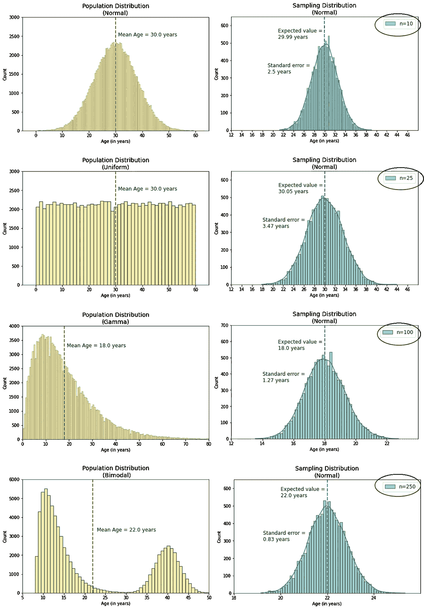

## **CLT 的局限性**

只有当满足下列条件时，CLT 原理才能应用于一个问题。

a)总体必须有一个有限的平均值和方差。例如，柯西分布就是这样一种没有定义均值和方差的分布，因此不符合 CLT 原理。也就是说，大多数现实世界的案例都涉及有限的均值和方差。

b)CLT 建立的总体分布特征与抽样分布特征之间的关系仅适用于*均值*统计量，不适用于样本的方差、标准差、众数或中位数。

c)对于正态、均匀或其他对称的总体分布，样本大小可以低至 10。然而，对于一个不对称的总体，根据分布的偏斜程度，样本量需要增加到一个较大的值(也许是数百)。因此，除非我们确信总体是对称分布的，否则只有当样本量很大时，我们才应该应用 CLT 原理。

d)我们需要确保抽样以随机和独立的方式进行。在一个样本中，如果对其任何成员的选择依赖于对任何其他成员的选择，那么抽样就不是独立的。在这种情况下，我们不能应用 CLT 原理根据总体分布的特征来辨别抽样分布的特征，反之亦然。

## **例题**

这是一个展示 CLT 原理应用之一的解决方案的问题。

**问题**:谷歌 Waymo 的使命是通过推出市场上最安全的自动驾驶电动汽车来颠覆汽车行业。这家公司不仅关心社会和环境，也关心员工。人力资源部计划在今年夏天的某个星期五为员工举办一次野餐。100 个人响应参加 4 小时的郊游。活动的组织者为与会者准备了 53 加仑的水。在夏天四个小时的郊游中，一个成年人平均需要半加仑的水；需水量的变化是 0.01 加仑平方。组织者需要知道团队在野餐结束前用完可用水的概率是大于还是小于她的阈值 5%。

**解决方案**:

由于对水的需求因人而异，所以一个成年人在夏季外出 4 小时所需的水量可以认为是一个均值为 0.5 加仑、标准差为 0.1 加仑的分布，即方差为 0.01 的平方根。我们可以把这种分布看作形状未知的关注人群。

如果我们从人口分布中随机选取 100 个需水量样本，我们将得到一个*唯一的*(统计)人均需水量值。如果我们要抽取五万个结构相似的样本，我们最终会得到一个人平均需水量的抽样分布。

根据 CLT 原理，不管原始总体分布的形状如何，对于大量随机样本，抽样分布应接近正态分布，其期望值等于总体均值，其标准误差等于总体的标准偏差除以样本大小的平方根。当然，我们假设人口分布并没有荒谬地远离对称形状，因此，100 是一个足够“大”的样本量，足以使 CLT 原则适用于手头的问题。

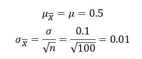

抽样分布可以表示如下。

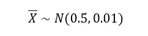

100 名员工有 53 加仑的水，平均每个人有 0.53 加仑的水可用。我们需要做的就是计算出一个样本每人需要超过 0.53 加仑水的概率。通俗地说，50，000 个样本(在抽样分布中)中有多少个样本需要每人 0.53 加仑以上？

给定采样分布的标准偏差为 0.01，很容易意识到样本统计量(0.53)在右侧距离平均值 0.5 有 3 个标准偏差。这被称为样本统计的 z 得分，它告诉我们样本统计与平均值的差距，即分布的标准差。(你可以在这里阅读更多关于 z-score [。](https://www.statisticshowto.com/probability-and-statistics/z-score/)

如下图所示，在正态分布中，*大约有* 99.7%的数据落在距离平均值 3 个标准差以内。由于 0.53 位于右侧，距离均值 3 个标准差，其出现的概率为 0.15% —参考下面正态分布最右侧的微小区域。

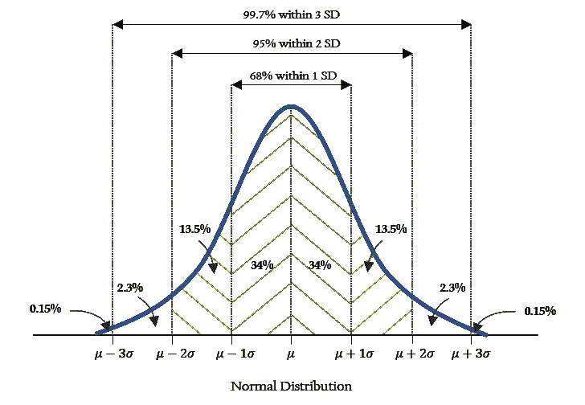

**回答**:组织者可以放心，团队用完 53 加仑水的概率远低于她设定的 5%的门槛水平。

**总结**:以下是解决手头问题的步骤要点。

*   参数——总体的平均值和标准偏差——被提供给我们，
*   利用 CLT 原理，计算抽样分布的特征——统计量的期望值和标准误差，
*   给定的*统计值(每人 0.53 加仑)在抽样分布中的位置被确定，并且*
*   基于正态分布的已知特征，估计统计数据出现的概率。

我希望这篇文章能帮助你很好地理解中心极限定理背后的上下文和直觉，以及它的原理和应用。如果一开始觉得难以接受，一两天后再看一遍。很容易与一些技术术语混淆，如样本、样本均值和样本分布，但如果你耐心地按照文章中描述的顺序一次理解一个，那么一切都会变得有意义。

如果您有任何问题或反馈，请随时留下您的评论。你也可以通过我的 LinkedIn 个人资料联系我。