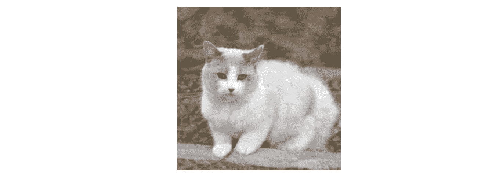
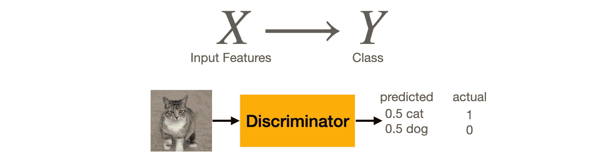
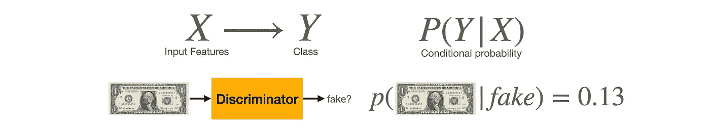

# 甘辨伪背后的直觉

> 原文：<https://towardsdatascience.com/intuition-behind-gans-discriminator-122ed821e9e5?source=collection_archive---------27----------------------->

## 打造您的 GAN 系列——第 2 部分，共 4 部分

图片由 [Ohmydearlife](https://pixabay.com/users/ohmydearlife-11960660/?utm_source=link-attribution&utm_medium=referral&utm_campaign=image&utm_content=4541731) 来自 [Pixabay](https://pixabay.com/?utm_source=link-attribution&utm_medium=referral&utm_campaign=image&utm_content=4541731)

生成对抗网络由两个网络组成，一个生成器和一个鉴别器。在本教程中，我们将看看鉴别器是如何工作的。

**有用的链接**

这是*构建你的生成性敌对网络的第二部分:*

第一部分:[生成对抗网络背后的直觉](/intuition-behind-generative-adversarial-networks-52628d3119f5?sk=3cd90c14b830754e5695533db851b5e1)
第二部分:[甘鉴别器背后的直觉](/intuition-behind-gans-discriminator-122ed821e9e5?sk=040bf4125e6d1c5a790c50db0fe2d4f7) (this)
第三部分:[甘生成器背后的直觉](/intuition-behind-gans-generator-e66f6b0dfa7c?sk=195a36e4191093f789f857ec578ace98)
第四部分:[训练生成对抗网络](/training-generative-adversarial-network-with-codes-2a6af80cf1f0?sk=1ca3e71e91dcb6633e08fb6ee3415fee)

[笔记本](https://github.com/jinglescode/generative-adversarial-networks/blob/main/tutorials/04%20Training%20GAN/Train%20Basic%20GAN.ipynb):训练甘生成手写数字
[GitHub repo](https://github.com/jinglescode/generative-adversarial-networks) :包含本教程系列

# 什么是量词？

看这张照片:

由[生成的一只猫的图像，这些猫并不存在](https://thesecatsdonotexist.com/)。

没费多大力气就知道这是一只猫的照片。即使它像狗一样有四条腿和一条尾巴，你也可以 100%确定这是一只猫而不是一只狗。神经网络分类器的目标是执行与您刚才所做的相同的操作，将此图像分类为“猫”，而不是“狗”。

分类器是一个神经网络，它接受特征，并输出一组类别的概率。例如，如果我们将一只猫的图像输入分类器，它会产生一组概率，其中所有概率的总和是`1`。

一开始，它做得很糟糕，将`0.5`分为`cat`和`dog`两类。这意味着模型认为这个图像有 50%的可能性是一只猫，另外 50%是一只狗。

鉴别者认为这个图像 50%是一只猫。[图片由[作者](https://jinglescode.github.io/) ]

这是我们想要修正模型的时候，这样它就可以改进它的预测。我们将输入正确的答案，即`1`代表猫，`0`代表狗，模型将使用“成本(或损失)函数”计算其预测与正确标签的差距。

有了成本函数，我们可以在网络中更新那些内部参数，称为“权重”，根据这个成本函数的梯度，在下一次预测猫和狗时变得更好。在我们向模型展示了数千张猫和狗的照片后，它会调整自己的权重，以学习猫长什么样，狗长什么样。

# 鉴别器是一个分类器

鉴别器是一个分类器，它确定输入样本是真的还是假的。这些输入样本可以是来自训练数据的真实样本，也可以是来自生成器的虚假样本。

最初，它的表现很差，将假样本错误分类为`real`。判别网络的权值被更新以减少其分类误差。在转动它的重量几圈后，它能更好地区分真假样品。

在概率方面，鉴别器模拟给定一组输入`X`的假样本的概率。在多类上下文中，鉴别器模拟样本是特定类的可能性。

鉴别器模拟给定一组输入的样本概率`X`。[图片由[作者](https://jinglescode.github.io/)

例如，给定由生成器生成的一张一美元钞票的图像，如果鉴别器确定这是一张假钞的概率为 13%，则鉴别器认为这是一张真的一美元钞票。在这种情况下，当训练具有 sigmoid 输出的标准二元分类器时，成本函数，二元交叉熵损失([torch . nn . bcewithlogitsloss](https://pytorch.org/docs/stable/generated/torch.nn.BCEWithLogitsLoss.html))被最小化。

# PyTorch 代码

摘自[古德菲勒、伊恩等人的《生成性敌对网络》](https://github.com/jinglescode/generative-adversarial-networks/blob/main/tutorials/01%20Intuition%20Behind%20GANs/assets/Generative%20Adversarial%20Networks.pdf)论文:

> *当模型都是多层感知器时，对抗性建模框架最容易应用。我们还定义了第二个多层感知器 D(x；θd ),它输出单个标量。D(x)代表 x 来自数据而不是 pg 的概率。我们训练 D 以最大化将正确标签分配给训练样本和来自 g 的样本的概率*

我们将构建四层的鉴别器。网络接受图像张量并返回单个值，该图像是真实还是虚假的概率。由于 MNIST 图像的大小是 28x28，我们将使图像变平，这给了我们一个输入维度`784`。

[笔记本](https://github.com/jinglescode/generative-adversarial-networks/blob/main/tutorials/04%20Training%20GAN/Train%20Basic%20GAN.ipynb):训练甘生成手写数字

# 概括起来

鉴别器是一个分类器，旨在捕捉条件概率`P(y|x)`。它学习在给定一组输入特征的情况下，对一个实例是真的还是假的概率进行建模。来自鉴别器的输出概率是分类标签。

判别模型的目标是检测虚假生成的数据，因此训练判别神经网络以最小化最终分类误差。它通过查看生成器创建的真实样本和假样本来学习区分不同的类别，并尝试辨别哪些是真实的，哪些是假的。

[GitHub repo](https://github.com/jinglescode/generative-adversarial-networks) :包含本教程系列

## 下一步是什么？

让我们看看发电机是如何工作的。

</intuition-behind-gans-generator-e66f6b0dfa7c> 