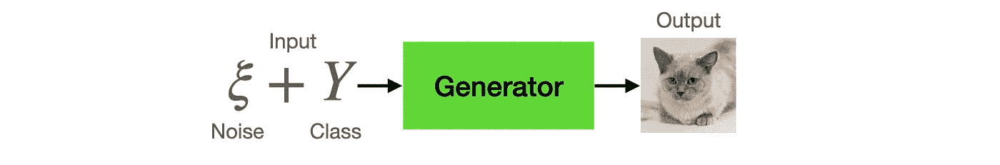
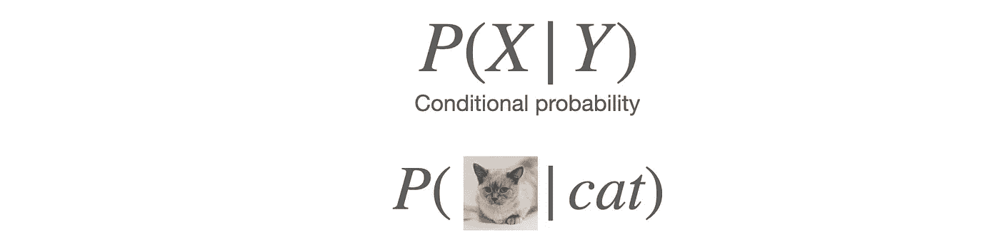
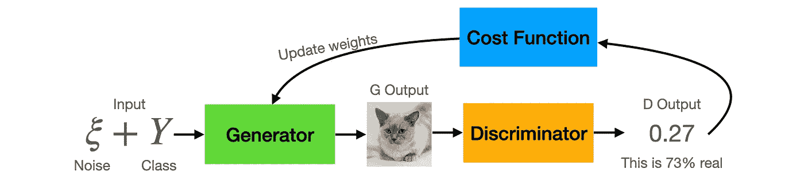

# 甘发电机背后的直觉

> 原文：<https://towardsdatascience.com/intuition-behind-gans-generator-e66f6b0dfa7c?source=collection_archive---------39----------------------->

## 打造您的 GAN 系列——第 3 部分，共 4 部分

图片来自 [Pixabay](https://pixabay.com/?utm_source=link-attribution&utm_medium=referral&utm_campaign=image&utm_content=3077928) 的 [peter_pyw](https://pixabay.com/users/peter_pyw-2946451/?utm_source=link-attribution&utm_medium=referral&utm_campaign=image&utm_content=3077928)

生成对抗网络由两个网络组成，一个生成器和一个鉴别器。在上一个教程中，我们已经看到了[鉴别器](/intuition-behind-gans-discriminator-122ed821e9e5?sk=040bf4125e6d1c5a790c50db0fe2d4f7)是如何工作的，在这个教程中，我们将看看发生器是如何工作的。

**有用的链接**

[笔记本](https://github.com/jinglescode/generative-adversarial-networks/blob/main/tutorials/04%20Training%20GAN/Train%20Basic%20GAN.ipynb):训练甘生成手写数字
[GitHub repo](https://github.com/jinglescode/generative-adversarial-networks) :包含本教程系列

这是*构建你的生成性敌对网络的第 3 部分:*

第一部分:[生成对抗网络背后的直觉](/intuition-behind-generative-adversarial-networks-52628d3119f5?sk=3cd90c14b830754e5695533db851b5e1)
第二部分:[甘鉴别器背后的直觉](/intuition-behind-gans-discriminator-122ed821e9e5?sk=040bf4125e6d1c5a790c50db0fe2d4f7)
第三部分:甘生成器(this)
第四部分:[训练生成对抗网络](/training-generative-adversarial-network-with-codes-2a6af80cf1f0?sk=1ca3e71e91dcb6633e08fb6ee3415fee)

# 什么是输入和输出？

生成器的目标是根据输入特征生成样本。我们输入到生成器中的有两个输入特征，1)类别和 2)噪声。

生成器根据输入特征、1)类别和 2)噪声生成样本。[图片由[作者](https://jinglescode.github.io/)

**类**。如果我们已经用猫和狗的图像训练了我们的模型，那么通过请求一只“猫”，我们期望生成器输出一只看起来很棒的猫的图像。如果我们的模型只为一个类训练，那么这个输入特性是不需要的。

**噪音**。在用猫图像训练了一个生成模型之后，我们期望我们的模型能够[生成各种各样的猫](https://thesecatsdonotexist.com/)。因为我们不想每次都得到相同的猫图像，因此我们也输入一个噪声向量，它是一组随机值。这种随机噪声为模型提供了不同的输入特征。它可以帮助我们生成逼真多样的表象，比如白猫或橘猫，波斯或孟加拉，站着或躺着。

因此，噪声向量(有时带有类别`y`)作为输入馈入发生器神经网络；它将生成一个图像——类`y`的现实而多样的表示。

我们设计我们的生成器来输出形状为`[channel, width, height]`的张量，在生成图像的情况下，我们倾向于用三个通道来表示图像(对于三种颜色，*红色*、*绿色*、*蓝色*)。如果你是生成音乐，也许你只需要`[channel, time]`。

此噪声向量也近似于类的样本分布，其中常见要素比罕见要素更有可能被生成。例如，对于“猫”类，如果数据集包含许多尖耳朵的猫，则更有可能生成尖耳朵的猫。而打呵欠的猫可能更难被摄像机捕捉到；因此，不太可能产生打哈欠的猫。

# 发电机是怎么学习的？

首先，我们将一个噪声向量和一个类别(`y`)输入生成器(`G`)，神经网络计算并产生一组特征(`G(z)`)——模型认为猫长什么样的图像。

生成器的目标是在给定类别标签“猫”的情况下，最大化生成猫图像的概率。[图片由[作者](https://jinglescode.github.io/)

这是给定类别`Y`的特征`X`的条件概率。给定类别标签`y`，生成器模拟特征`x`的概率。因此，如果给定类别标签“猫”，该模型旨在最大化其生成猫图像的概率。

这个生成的图像被输入鉴别器(`D`)，它执行分类(`D(G(Z)`)并产生数据属于类别`y`的概率。换句话说，它决定了它认为基于输入的东西有多真实，有多假。

训练发电机的过程。[图片由[作者](https://jinglescode.github.io/) ]

利用鉴别器的预测，我们可以计算一个成本函数(`g_loss`)，该函数查看由生成器生成的样本在多大程度上被鉴别器认为是真实的。生成器将改进和调整其权重，以提高这一指标-鉴别器认为图像是真实的概率(`p(x)`)。

实际类别和输出之间的差异用于更新权重和改进模型，以生成可以欺骗鉴别器的更真实的图像。

当我们训练出了一个可以骗过鉴别器，骗过人类以为是真的生成器，我们就可以拯救生成器神经网络了。我们可以将噪声输入向量提供给这个生成器，它将生成真实的样本。使用不同的噪声向量，它可以生成各种各样的样本。因此，我们可以生成[这些不存在的猫](https://thesecatsdonotexist.com/)。

# PyTorch 代码

发生器网络接收噪声矢量，通过 4 个`linear+batchnorm+relu`模块应用非线性变换。然后输出大小为`784`的张量，以匹配展平的 MNIST 图像的输出大小`28x28`。

[笔记本](https://github.com/jinglescode/generative-adversarial-networks/blob/main/tutorials/04%20Training%20GAN/Train%20Basic%20GAN.ipynb):训练甘生成手写数字

# 概括起来

生成模型的目标是学习产生真实的样本来欺骗鉴别器，因此生成神经网络被训练为最大化最终分类误差。

就像一个艺术家可以画出看起来像真实的绘画或风景的图片，或者生成具有不同变化的猫的图片，而鉴别器无法从生成的数据中分辨出真实的。

[GitHub repo](https://github.com/jinglescode/generative-adversarial-networks) :包含本教程系列

## 下一步是什么？

让我们将生成器和鉴别器结合起来，开始训练模型。

</training-generative-adversarial-network-with-codes-2a6af80cf1f0> 