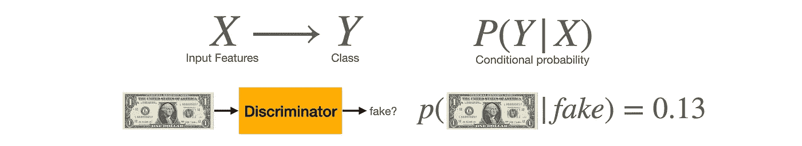
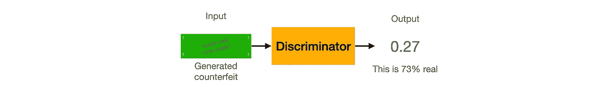

# 生成性对抗网络背后的直觉

> 原文：<https://towardsdatascience.com/intuition-behind-generative-adversarial-networks-52628d3119f5?source=collection_archive---------45----------------------->

## 打造您的 GAN 系列——第 1 部分，共 4 部分

图片由来自 [Pixabay](https://pixabay.com/?utm_source=link-attribution&utm_medium=referral&utm_campaign=image&utm_content=3146946) 的[斯蒂芬·凯勒](https://pixabay.com/users/kellepics-4893063/?utm_source=link-attribution&utm_medium=referral&utm_campaign=image&utm_content=3146946)拍摄

生成敌对网络(GANs)是强大的模型，它学习产生难以与现有真实对象区分的现实对象，如图像和音频(语音/音乐)。

在本教程中，我们将看看 GANs 的基本结构，以获得一些关于 GANs 模型如何工作的直觉。我们将看看伊恩·古德菲勒等人介绍甘斯的[原始论文](https://github.com/jinglescode/generative-adversarial-networks/blob/main/tutorials/01%20Intuition%20Behind%20GANs/assets/Generative%20Adversarial%20Networks.pdf)。

**有用的链接**

这是*构建你的生成性敌对网络的第一部分:*

第一部分:[生成对抗网络背后的直觉](/intuition-behind-generative-adversarial-networks-52628d3119f5?sk=3cd90c14b830754e5695533db851b5e1) (this)
第二部分:[甘鉴别器背后的直觉](/intuition-behind-gans-discriminator-122ed821e9e5?sk=040bf4125e6d1c5a790c50db0fe2d4f7)
第三部分:[甘生成器背后的直觉](/intuition-behind-gans-generator-e66f6b0dfa7c?sk=195a36e4191093f789f857ec578ace98)
第四部分:[训练生成对抗网络](/training-generative-adversarial-network-with-codes-2a6af80cf1f0?sk=1ca3e71e91dcb6633e08fb6ee3415fee)

[笔记本](https://github.com/jinglescode/generative-adversarial-networks/blob/main/tutorials/04%20Training%20GAN/Train%20Basic%20GAN.ipynb):训练甘生成手写数字
[GitHub repo](https://github.com/jinglescode/generative-adversarial-networks) :包含本教程系列

GAN 模型有两个主要部分，一个发生器和一个鉴别器；这是两个独立的神经网络。

生成器学习生成看起来像真的假货来欺骗鉴别器。鉴别者学会区分什么是真的什么是假的。

所以你可以把生成器想象成伪造者，把鉴别器想象成警察。*生成器*伪造假钞，试图看起来尽可能真实，它这样做是希望愚弄*鉴别器*。而*鉴别器*学习并更好地识别真钞和伪钞。

# 鉴别者——警察

鉴别者就像一名正在接受识别伪钞训练的警察。它的工作是看一张照片，并告诉我们照片中是否包含真钱。由于我们在看图片，这个神经网络接收一个图像，然后输出单个值——在这种情况下，图像是否包含真钱的图片(或者没有)。

如你所见，这里的判别模型是一个用于分类的卷积神经网络。他们取一组特征(`X`)，一批图像，并学习区分类别(`Y`)，在这种情况下，*真*或*假*。

鉴别器预测图像为“*假”的概率。【图片由* [*作者*](https://jinglescode.github.io/)

*换句话说，在给定一组特征`X`的情况下，他们试图对类别`Y`的概率进行建模。它开始时很难区分真钱和假钱，但在训练过程中，它学会了更好地区分真钱和假钱。*

# *生产者——造假者*

*另一方面，生产者是正在学习如何制造假币的伪造者。与接收图像并输出值的鉴别器不同，生成器接收输入要素并输出图像。我们将两个输入特征输入到生成器中，1)一个类(`Y`)，以及 2)一个噪声向量。*

**

*生成器使用噪声矢量并生成图像。*【图片由* [*作者*](https://jinglescode.github.io/)*

****类**。我们可能希望我们的模型学会生成几个不同的对象。有时，我们不希望只是生成一个随机的账单，我们希望这个模型根据我们的选择生成 1 美元、5 美元或 20 美元。但是如果我们只生成一个类，那么我们不需要这个类`Y`输入。**

****噪音**。我们需要模型来生成一个类的不同表示。例如，我们旨在创造各种各样的逼真的狗；噪声确保了生成的总是不同的东西，因为持续生成同一只狗是没有意思的。这种随机噪声也作为一种输入，可以帮助我们创建具有各种特征的图像。有时狗站着或躺着。有时它有尖尖的耳朵，有时它的舌头伸出来。通过添加噪声，这些模型将生成真实且多样的表示。**

**在开始的时候，生成器不会生成一些现实的东西；它一边学习，一边设法欺骗鉴别器，直到我们得到一个好的生成器，可以生成我们想要的逼真图像。此外，生成器没有输入用于训练的真实图像，所以这对于生成器来说很难学习，尤其是在开始的时候。**

# **一起工作(或竞争)**

**这两个网络在开始时都不擅长它们的任务，但是在训练过程中，它们相互竞争，相互学习，直到它们达到我们不再需要鉴别器的程度。然后我们可以使用发电机；给定任何类(`Y`)和任何随机噪声，都可以产生逼真的图像。**

**现在我们有一个警察，就是寻找假币的鉴别者(`D`)。和一个伪造者，发电机(`G`)，谁是印刷假币。让我们让他们互相学习。**

**在第一轮中，生成器获取一个随机数向量(`z`)并生成一个图像。因为制造者对货币应该是什么样子一无所知，它会制造出可怜的伪造品，几乎不像真的货币(`G(z)`)。**

****

**Noobie 发电机产生一张可怜的假钞。*【图片由* [*作者*](https://jinglescode.github.io/)*】***

**与生成的货币一起，它被馈送到鉴别器。鉴别器将一组真实(`x`)或生成(`G(z)`)的图像作为输入，并产生该数据是真实的概率(`P(x)`)。但是鉴别器在识别钱的工作上同样糟糕，所以它不会知道区别。事实上，鉴别者可能会认为美元是真的！**

****

**Noobie 鉴别器认为假钞是真的！*【图片由* [*作者*](https://jinglescode.github.io/)**

***此时，我们会介入，告诉鉴别者这张美钞其实是假的。然后我们给它看一张真的美钞，问它和假的有什么不同(`loss_d`)。鉴别者将努力学习如何不被愚弄来抓住发生器，即使是最接近的复制品，以便鉴别者可以寻找新的细节来区分真假。***

***通过这种方式，鉴别器可以将像这样画得不好的图像与稍微好一点的和真实的图像区分开来。例如，鉴别者可能会注意到真钱上有一个人的照片，而假钱上没有。利用这些知识，鉴别器在区分真假方面变得稍微好一点。***

******

***现在鉴别者意识到真的钞票上有一张脸，而这张没有，所以它是假的。*【图片由* [*作者*](https://jinglescode.github.io/)***

***随着鉴别器变得更好，并分类出钞票是假的，我们将结果反馈给生成器，生成的货币被检测为假的，因此它需要加强其游戏。生成器将通过查看由鉴别器产生的真实数据的概率(`P(x)`)来知道如何改进(`loss_g`)。为了欺骗鉴别者，生成器会试图伪造看起来更像真样本的新样本。***

******

***生成器生成了一张更好的假钞，现在包括了一张脸。*【图片由* [*作者*](https://jinglescode.github.io/)***

***这个看起来更真实一点，因为它现在包含了一张脸；假钞又被认为是有效的了！同样，鉴别器必须查看真实样品并提取特征来检测假冒样品。***

***这在训练过程中在生成器和鉴别器之间来回进行，直到两个网络都是专家。最终，生产者可以制造出近乎完美的赝品，鉴别者的眼睛变得更加敏锐，能够察觉最细微的错误。***

***因此，在训练过程的每次迭代中，生成网络的权重被更新以增加分类误差。相反，鉴别网络的权重被更新，以便减小这个误差。***

***这些相反的目标和两个网络的对抗性训练的隐含概念，这就是为什么它们被称为“对抗性网络”，名称为“生成性对抗性网络”。随着时间的推移，生成器和鉴别器相互竞争，都变得越来越好。他们之间的竞争使得这两个网络朝着各自的目标前进。***

# ***概括起来***

*****生成模型**的目标是学习产生逼真的样本来糊弄鉴别器，所以生成神经网络被训练成最大化最终的分类误差。就像一个艺术家可以画出看起来像真实的绘画或风景的图片，或者生成具有不同变化的狗的图片，而鉴别器无法从生成的数据中分辨出真实的。***

*****鉴别模型**的目标是检测虚假生成的数据，因此训练鉴别神经网络以最小化最终分类误差。它通过查看生成器创建的真实样本和假样本来学习区分不同的类别，并尝试辨别哪些是真实的，哪些是假的。***

## ***编码***

***想看看整个训练过程在行动中，这个笔记本包含代码，用于训练一个生成性的对抗性网络，学习生成手写数字。***

***[笔记本](https://github.com/jinglescode/generative-adversarial-networks/blob/main/tutorials/04%20Training%20GAN/Train%20Basic%20GAN.ipynb):训练甘生成手写数字
[GitHub repo](https://github.com/jinglescode/generative-adversarial-networks) :包含本教程系列***

## ***下一步是什么？***

***让我们看看鉴别器是如何工作的。***

*** [## 甘辨伪背后的直觉

### 打造您的 GAN 系列——第 2 部分，共 4 部分

towardsdatascience.com](/intuition-behind-gans-discriminator-122ed821e9e5)***