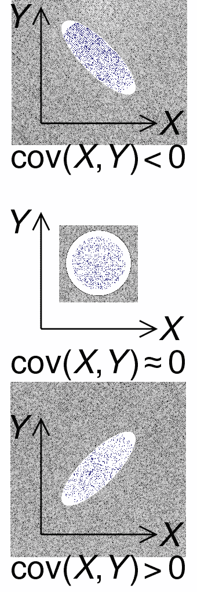

# 独立同分布的直觉

> 原文：<https://towardsdatascience.com/intuition-for-independent-and-identically-distributed-dc59e1528162?source=collection_archive---------48----------------------->

## [数据科学](https://towardsdatascience.com/data-science/home)

## 理解统计学中的一个关键假设及其含义

一般来说，数据科学的主要目的，特别是机器学习的主要目的，是利用过去来预测未来。在各种统计模型的具体假设之外，不可避免的假设是，未来可以从过去的事件中预测。

[图片](https://unsplash.com/photos/QrA26jc8szY)由[提供](https://unsplash.com/@ary_attab)在 [Unsplash](https://unsplash.com/)

我们假设有一些我们可以描述的函数，它接收我们观察到的数据，并输出某个未来事件的概率— **P(Y | X)** ，给定 **X** 输入，输出 **Y** 的概率。我们必须仔细构建我们的模型，以确保 **X** 提供的信息对预测 **Y** 有用且可靠。除了“[虚假关联](https://www.tylervigen.com/spurious-correlations)，我们选择直接或间接告知 **Y** 的特征。

# 同分布

假设我们想预测第一次从一副牌中抽出黑桃皇后的几率——通过建模以非常迂回的方式……从数学上来说，这只是 1/52 的几率，但请继续玩下去。

每一次观察，或者每一行，都是我们从一副牌中随机抽取一张牌的一次尝试。我们将这样做 10，000 或 100，000 或 100 万次。当 N → ∞时，我们第一次抽到黑桃皇后的概率应该接近 1/52！

但这是假设所有的套牌都是一样的！这是我们的同分布假设。我们必须假设每副牌都有从 a 到 k 的所有 13 张花色牌。如果每三副牌只有 50 张牌呢？或者一副牌缺少所有的黑桃？我们的概率会发生不可预测的变化。如果在我们汇编了所有这些训练数据之后，我们发现我们实际上是在预测从一副 [euchre](https://en.wikipedia.org/wiki/Euchre) 牌中抽出黑桃皇后的概率，那该怎么办呢！总共 25 张牌只有 9 到 a(高)!我们希望我们的训练和测试数据来自同一个分布。

# 自主的

我们还假设每个甲板和拉力都是独立的。例如，如果我们在没有替换的情况下对牌组[进行抽样，这意味着在我们抽了一张不是黑桃皇后的牌之后，我们不把它放回牌组，最终我们将不得不抽黑桃皇后！我们的概率会在每次抽牌后更新，从 1/52 … 1/51 … 1/50 直到它的 1/1(如果黑桃皇后是这副牌中的最后一张)。](https://www.statisticshowto.com/sampling-with-replacement-without/)

当一件事的结果不受另一件事的影响时，独立性就得到满足。在这个例子中，第二次抽牌的结果受到第一次抽牌的影响，因为我们的牌组中少了一张牌！这就是为什么我们假设独立性，并且通常用替换抽样。

有一个度量标准可以量化有替代和无替代抽样之间的差异，**协方差**:两个随机变量的联合变异性。在机器学习项目中，协方差绝对是您应该知道并在您的数据中调查的东西。[ [1](https://www.statisticshowto.com/sampling-with-replacement-without/)

[图片](https://en.wikipedia.org/wiki/File:Covariance_trends.svg)由 [CMG Lee](https://commons.wikimedia.org/wiki/User:Cmglee) 在 [Wikimedia](https://commons.wikimedia.org/wiki/Main_Page) 上以 [CC BY-SA 4.0 许可证](https://creativecommons.org/licenses/by-sa/4.0/deed.en)提供。

如果协方差为零，那么这两个变量是独立的，互不影响。如果变量倾向于表现出相似的行为，比如一个变量的增加对应于另一个变量的增加，那么它们具有正的协方差。归一化协方差给出了**相关系数**，其定义了这种关系的大小。

# 含义

假设独立同分布对于使用我们的模型进行预测非常重要，因为我们假设过去——我们现有的数据 **X** —将代表问题空间，并准确预测未来 **Y** 。

还有一些假设独立同分布的特定技术，如自举聚合(bagging)模型或交叉验证。特别是 Bagging，像随机森林一样，使用数据的随机子样本来生成许多不同的模型，然后将这些模型组合或平均在一起，以减少方差和过度拟合。如果数据不是独立同分布的，那么每个子样本会有很大的不同，并且不会描述数据集的基本分布。

bagging 算法专门使用替换进行采样，以确保新训练集的独立性。对于容易过度拟合的模型，如神经网络和决策树，bagging 是减少方差/增加稳定性的一个很好的工具。

正如 Nate Silver 所说，“很容易过度拟合一个模型，当你只是在描述噪音时，认为你已经捕捉到了信号”。[2]

> 你可以在这里阅读中心极限定理[，在这里](https://en.wikipedia.org/wiki/Central_limit_theorem)阅读 Bagging [。](https://en.wikipedia.org/wiki/Bootstrap_aggregating)

# 连接

我一直在寻找连接和探索其他项目！你可以在 [GitHub](https://github.com/ArenCarpenter) 或者 [LinkedIn](https://www.linkedin.com/in/aren-carpenter/) 上关注我，在 [Medium](https://arencarpenter.medium.com/) 上查看我的其他故事。我也有一个[推特](https://twitter.com/ArenCarpenter)！

# 来源

[**斯蒂芬妮·格伦**](https://www.statisticshowto.com/contact/) 。[**StatisticsHowTo.com**](https://www.statisticshowto.com/)的《有置换的抽样/无置换的抽样》:我们这些人的基本统计！[https://www . statistics show to . com/sampling-with-replacement-without/](https://www.statisticshowto.com/sampling-with-replacement-without/)

[2] N. Silver,《信号与噪音:为什么如此多的预测失败——但有些没有(2012 年)。