# 深度学习中不同激活函数背后的直觉

> 原文：<https://towardsdatascience.com/intuitions-behind-different-activation-functions-in-deep-learning-a2b1c8d044a?source=collection_archive---------24----------------------->

## **衍生产品、优点、缺点、Python 实现和用例**

来源:乔希·里默尔在 Unsplash 上的照片

正如我们所知，在神经网络中，神经元以相应的权重、偏置和各自的激活函数工作。权重与输入相乘，然后在进入下一层之前对元素应用激活函数。

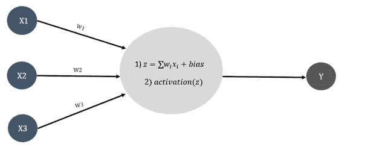

作者图片

**为什么需要激活功能？**

激活函数有助于将非线性引入神经元的输出，这有助于准确性、计算效率和收敛速度。为了优化的目的，激活函数相对于权重应该是单调的、可微分的和快速收敛的。

在本文中，我们将讨论以下重要的激活功能:

1)乙状结肠

2)双曲正切值

3)整流线性单元(ReLU)

4)泄漏的 ReLU

5)指数线性单位(ELU)

6)参数重新逻辑(预逻辑)

7) Softmax

**1)** **乙状结肠**

这是最常见的激活功能之一，也称为逻辑功能。该函数定义为:

作者图片

该函数及其导数如下所示:

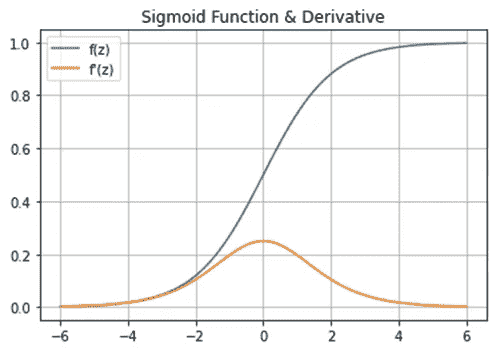

作者图片

从上图中，我们观察到:

a)函数看起来像 S 形曲线

b)该函数在 0 和 1 之间转换输入值，并以 0.5 ie 为中心。**不以零为中心。**

c)函数是单调且可微的。注意，sigmoid 函数的导数范围在 0 到 0.25 之间。

**乙状结肠的缺点**

**a)** **消失梯度:**在神经网络中，在反向传播阶段，权重(w)更新如下:

作者图片

从图中，我们可以理解导数的范围是 0 到 0.25。由于微分的链式法则，导数可能很低，以至于权重可能不会显著改变或更新。这导致在反向传播阶段更新权重的问题，并且没有值得注意的信息被传递到随后的层。这个问题叫做消失梯度。

**b)** **由于其指数性质，计算开销很大**。

**c)** 输出**不是以零为中心**，这降低了更新权重的效率。

**2)** **双曲正切(Tanh)**

另一个非常常用的激活函数是 Tanh，其定义为:

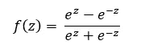

图片来自作者

该函数及其导数如下所示:

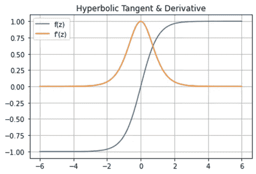

图片来自作者

从上图可以清楚地看出:

a)函数看起来像 S 形曲线

b)该函数转换-1 和 1 之间的值，并以 0 为中心。

c)函数是单调且可微的。注意，双曲正切函数的导数范围在 0 到 1 之间。

Tanh 和 sigmoid 都是单调递增函数，当它接近+inf 和-inf 时，渐近于某个有限值。

**Tanh 的缺点:**与 Sigmoid 类似，Tanh 也有消失梯度的问题，并且由于其指数运算而计算量大。

**双曲正切函数优于 Sigmoid 函数的优势:**正如我们注意到的，双曲正切函数以零为中心，这意味着双曲正切函数关于原点对称。因此，如果训练集上每个输入变量的平均值接近于零，收敛通常会更快。

**3)** **整流线性单元(ReLU)**

ReLU 是更新隐藏层时最常用的激活函数。当传递负输入时，ReLU 返回 0，对于任何正输入，它返回值本身。该功能定义为:

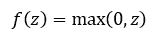

图片来自作者

该函数及其导数如下所示:

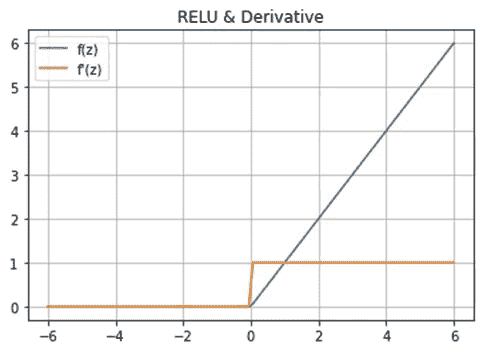

图片来自作者

从上图中，我们观察到:

a)对于任何小于零的值，该函数输出 0，对于正值，该函数是单调和连续的。

b)对于 z <0 and 1 for z> 0，函数的导数为 0，但是函数在点 0 处不可微。

c)它是不可微的，对于负输入，导数是 0。

**ReLU 的优点**

a) ReLU 克服了消失梯度的问题，因为对于 z>0，导数为 1。

b)由于其简单的方程，与 Sigmoid 和 Tanh 激活函数相比，其计算速度更快。

**缺点(Dying ReLU):** 如上所述，对于负输入，导数为 0，因此等式(1)导致 w(new) = w(old)。这意味着，进入这种状态的神经元将停止对错误/输入的变化做出响应(因为梯度为 0，所以没有变化)。这就是所谓的垂死的 ReLu 问题。这导致死神经元不能在反向传播中更新权重。为了克服这个问题，漏 ReLU 出现了。

**4)**漏液 ReLU

这是对 ReLU 的改进，通过调整负输入的函数，如下所示:

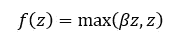

作者图片

该函数及其导数如下所示:

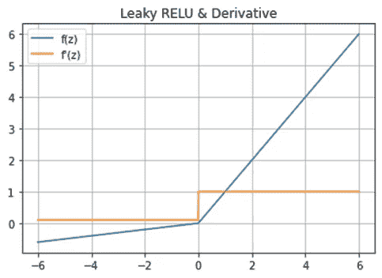

作者图片

基本上，泄漏 ReLU 允许一个小的非零恒定梯度。这确保了神经元不会因为引入非零斜率而死亡。

**Leaky ReLU 的缺点:**如果大部分权重是负数，那么根据导数的链式法则，它会乘以 0.01 的倍数。这将最终导致渐变消失，我们试图克服这一点。

**5)** **指数线性单位(ELU)**

为了解决这个问题并保持 leaky relu 的其他特性，elu 出现了。这被定义为:

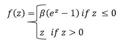

作者图片

该函数及其导数如下所示:

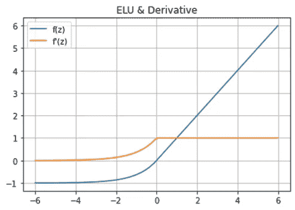

作者图片

**优点:**

a)濒死再禄问题得到解决

b)输出 id 以零为中心

c)不需要在 0 找到导数

**缺点:**由于其指数性质，计算量很大。

**6)** **参数 ReLU (PReLU)**

这是所有不同 ReLU 变体的最一般化形式。该函数定义为:

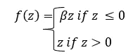

作者图片

其中，β被授权在反向传播期间学习，并且可以被视为学习参数。

注意，如果β = 0，类似于 ReLU

如果β = 0.01，类似于泄漏 ReLU

**7)**soft max

Softmax 计算 n 个不同事件的概率分布。它计算每个目标类相对于所有可能的目标类的概率。之后，计算出的概率有助于确定给定输入的目标类别。该函数定义如下:

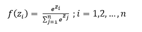

作者图片

该函数如下所示:

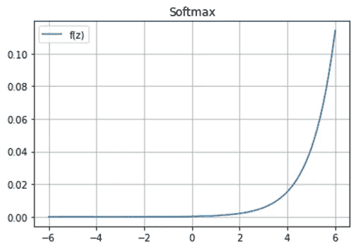

作者图片

Softmax 通常用于多类问题。如果层数超过 2 层，则在最后一层使用该激活功能。“最大”部分返回最大值，“软”部分确保较小的值具有较低的概率，但不会被丢弃。还要注意，所有类别的概率之和将是 1。

# **Python 代码片段**

下面的 python 代码用于为每个函数及其相应的导数创建上面的图形。

图片来自作者

# **不同激活功能的快速汇总**

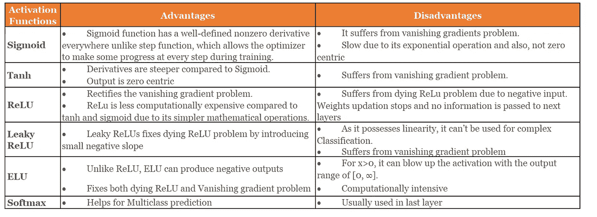

作者图片

# **更多激活功能**

这些是深度学习中经常使用的激活功能，但列表并没有到此为止:

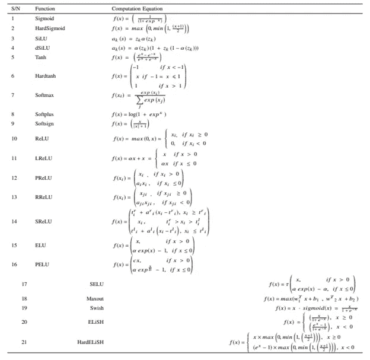

# **何时使用哪些激活功能**

通常，如果输出范围在(0，1)或(-1，1)之间，则可以使用 sigmoid 或 tanh。另一方面，要预测大于 1 的输出值，通常使用 ReLU，因为根据定义，tanh 或 sigmoid 不合适。

在二元分类器的情况下，应该使用 Sigmoid 激活函数。预测多类问题的概率时，应在最后一层使用 softmax 激活函数。同样，tanh 或 sigmoid 通常在隐藏层中效果不佳。应该在隐藏层中使用 ReLU 或 Leaky ReLU。当隐藏层数很高(接近 30)时，使用 Swish 激活功能。

然而，激活函数的使用主要取决于数据、手头的问题和预期输出的范围。

希望你喜欢这篇文章！！

免责声明:本文所表达的观点是作者以个人身份发表的意见，而非其雇主

**参考文献:**

https://arxiv.org/pdf/1811.03378.pdf

[https://machine learning mastery . com/choose-an-activation-function-for-deep-learning/](https://machinelearningmastery.com/choose-an-activation-function-for-deep-learning/)