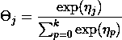
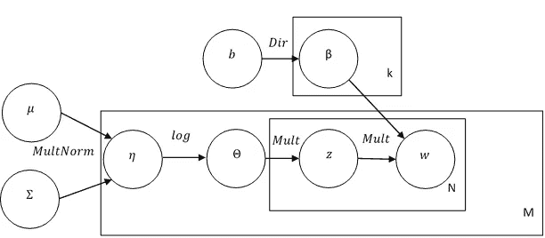

# 相关主题模型的直观指南

> 原文：<https://towardsdatascience.com/intuitive-guide-to-correlated-topic-models-76d5baef03d3?source=collection_archive---------15----------------------->

## LDA 的一个简洁的扩展，它可以成为更高级主题模型的主干

[吴怡](https://unsplash.com/@takeshi2?utm_source=medium&utm_medium=referral)在 [Unsplash](https://unsplash.com?utm_source=medium&utm_medium=referral) 上拍照

自从大卫·布莱、吴恩达和迈克尔·乔丹(不，不是篮球运动员；不，不是演员)在 [2003](https://dl.acm.org/doi/pdf/10.5555/944919.944937) 提出了潜在的狄利克雷分配(LDA)，主题建模已经成为所有数据科学中最受欢迎的模型之一。有趣的事实:最初的 LDA 论文是被机器学习研究杂志引用最多的论文。

简单地说，主题建模就是找出文档是关于什么的。与有监督的文档分类不同，我们不可能事先知道主题。相反，我们采取一种无人监督的方法，发现文档中的潜在主题。LDA 对于文档建模、分类甚至协同过滤特别有用。

在这篇文章中，我将介绍一个重要的，但有些被忽视的 LDA 扩展:相关主题模型[(CTM)。](http://people.ee.duke.edu/~lcarin/Blei2005CTM.pdf)

**激励 CTM:LDA 的局限性**

我们将从头开始，首先回顾 LDA，然后展示 CTM 如何试图超越 LDA。medium 上已经有几个很棒的 [LDA](/latent-dirichlet-allocation-lda-9d1cd064ffa2) [指南](/light-on-math-machine-learning-intuitive-guide-to-latent-dirichlet-allocation-437c81220158)，我强烈推荐它们来补充这个简要概述。

LDA 将文档建模为主题的分布，将主题建模为单词的分布。我们的单词生成过程包括从文档的主题分布中选择一个主题(一个我们称之为θᵢ的多项式分布，其中 *i* 仅仅意味着这个θ特定于文档 *i* )并从该主题的单词分布中选择一个单词(另一个多项式通常称为β)。这些分布是由狄利克雷分布生成的。现在，我们只关注产生θᵢ的第一个狄利克雷，文档的主题分布。

LDA 的位置图。方框右下角的意思是重复操作那么多次。 *M* 是语料库中文档的数量；n 是文档中的字数；k 是主题的数量。z 是θ抛出的特定主题，它决定了我们使用哪个β概率向量来选择我们的最终单词 w。*a 和* b 是各自狄利克雷分布的超参数。

对于那些不太熟悉狄利克雷的人来说，可以把它看作贝塔的多元推广。它不仅为单个伯努利试验产生概率，而且为多个类别的概率向量产生概率，在我们的例子中，为我们模型中的 *k* 主题产生概率。换句话说，狄利克雷是多项式的共轭先验。

我知道这有点晦涩难懂，但即使您不完全理解，也有两点需要注意:

1.  事实上，狄利克雷是多项式的共轭先验，当我们开始实际处理数据时，数学会很好地出来。我们仍然需要做一些近似来得到我们的最终主题和它们的分布，这可以通过[变分推理](https://jonathan-hui.medium.com/machine-learning-variational-inference-273d8e6480bb)或者其他技术如[折叠吉布斯采样](https://www.ics.uci.edu/~asuncion/pubs/KDD_08.pdf)来完成。
2.  狄利克雷产生独立的主题概率(用数学术语来说:它产生一个[中性向量](https://en.wikipedia.org/wiki/Neutral_vector))。回想一下多项式，如果您删除其中一个类别，其余的概率只是围绕剩余的概率进行重新归一化。其余类别不会改变相对大小。狄利克雷模型被设计用来生成概率，这意味着我们不能对相关的主题建模。

如果我们认为话题高度相关呢？这并不太牵强:一个潜在的主题可能包含一串关于食物的单词，而另一个主题可能包含关于健康和健身的单词。这两个话题大概至少有些依赖。与随机选择的文档相比，关于健康和健身的文档更有可能也是关于食物的。

**CTM 解决方案**

我们将忽略生成模型的其余部分，只关注如何生成θs。为了引入相关性，我们将从多元正态分布而非狄利克雷分布开始。如果狄利克雷是贝塔的多元推广，那么多元正态就是正态的多元推广。和以前一样，我们的目标是为我们的概率向量生成 *k* 个值(每个主题一个)。

对于单变量正态分布，我们需要一个均值和标准差。对于多元正态分布，我们需要 *k* 均值和 *k* 标准差。我们还会考虑不同主题之间的协方差。总之，我们为多元正态分布提供两个参数:平均值的长度向量(μ)和协方差矩阵(σ)。

在这一点上，我们的模型将会产生一个任意大小的向量 k，我们称之为η。这些数字可能是负的，也可能是巨大的。最终，我们的目标是得到一个非负数的概率向量，其和为 1(称为单纯形)。

为了将多元正态分布的结果映射到概率中，我们将通过逻辑函数的一个变量来传递所有的值。具体来说，对于每个输出多元正态ηⱼ(其中 *j* 对应于一个主题)，我们应用变换:

将多元正态通过逻辑转换的最终结果称为 [logit 正态分布](https://en.wikipedia.org/wiki/Logit-normal_distribution)。总之，我们所做的只是将狄利克雷分布—θ~*Dir(*α*)*—与对数正态分布—θ~*f(N(*μ，σ)交换，其中 f(x)是逻辑变换，N 是多元正态分布。

CTM 板块图。“Log”表示上面列出的逻辑转换。

这个小开关有几个重要的含义。不幸的是，多元常态，加上最后的逻辑转换，并不像狄利克雷那样有整齐的性质。

因此，我们不能再使用 LDA 使用的标准变分推理技术。相反，CTM 使用了一种叫做平均场变分推论的方法。平均场变分推论的力学是…涉及的。让我们把它留下，我们现在有额外的变分参数，需要迭代方法来优化。就我们的目的而言，主要的要点是 CTM 的培训时间可能会稍长一些。

这种更长时间的培训的回报是，我们不仅得到了更好的主题，我们还得到了看到主题之间关系的额外好处。在 LDA 中，研究人员将不得不在训练后尝试手动整理相关性。有了 CTM，我们只需看看模型本身就能观察到相关性。也许关于领导力的书籍也使用了大量的宗教语言，反之亦然，这可能在相关性中表现出来。也许我们通过相关性找到超集-子集关系(例如，具有一般体育词汇的主题可能与具有篮球词汇的主题相关)。

在以下情况下，CTM 特别有用:

*   我们事先就有预感，话题很可能是相关的。
*   我们正在对许多主题进行建模，在这种情况下，至少有几个主题是相关的。

然而，我应该限定相关性不是主题之间某种形式的语义距离。我们只是观察到某些主题可能一起出现，也可能不一起出现。因为 CTM 依赖于参数推断/估计，而不是一些封闭形式的解决方案，所以最好不要太深入地解读主题之间的精确相关性。然而，当涉及到在 EDA 过程中提供广泛的笔触或激发进一步的探究时，这些种类的见解会非常有趣。

**结论**

概括一下:

*   主题建模是一种发现文档潜在主题的无监督方法。
*   最常见、最著名的主题建模方法是潜在的狄利克雷分配。在 LDA 中，我们将文档建模为(独立的)主题的分布，这些主题本身就是单词的分布。
*   如果我们允许主题之间的相关性，我们可以改进这个基线。
*   这是以更长的训练时间为代价的。
*   然而，它使研究者能够检查主题之间的关系。

老实说，CTM 并不完全是 ML 社区的开箱即用的宠儿。然而，CTM 绝对有它的用处(见 CTM 过去三年的论文关于[新冠肺炎研究](https://journals.plos.org/plosone/article?id=10.1371/journal.pone.0244839)、[高等教育研究](https://link.springer.com/content/pdf/10.1007/s10734-020-00500-x.pdf)和[气候变化新闻](https://www.tandfonline.com/doi/abs/10.1080/23251042.2020.1866281))，CTM 背后的直觉是一些非常酷的模型的有益起点。

想到了两个非常酷的 CTM 扩展:

*   [嵌入式主题模型](https://www.mitpressjournals.org/doi/full/10.1162/tacl_a_00325)
*   [结构主题模型](https://www.structuraltopicmodel.com/)

现在，我链接到原始的论文，但我希望在未来能发布更直观的嵌入式和结构化主题模型的指南。敬请期待！

[1] D .布莱，A. Ng .，和 m .乔丹，[潜在的狄利克雷分配](https://www.jmlr.org/papers/volume3/blei03a/blei03a.pdf) (2003)，《机器学习研究杂志》。

[2] D. Blei 和 J. Lafferty，(2005)，NIPS’05:第 18 届神经信息处理系统国际会议论文集。