# 直观的 Kaggle 任务探索和模型基线

> 原文：<https://towardsdatascience.com/intuitive-kaggle-task-exploration-and-model-baselining-e5f641943d08?source=collection_archive---------36----------------------->


插图照片由来自 [Pexels](https://www.pexels.com/photo/photo-of-man-sitting-on-a-cave-1659437/?utm_content=attributionCopyText&utm_medium=referral&utm_source=pexels) 的[马里乌斯·文特尔](https://www.pexels.com/@marius-venter-792254?utm_content=attributionCopyText&utm_medium=referral&utm_source=pexels)拍摄。

## 这篇文章展示了如何利用 PyTorch Lightning 和 TorchVision 模型探索数据集和准备基线方法。

在前一篇[文章](/how-to-prepare-your-development-environment-to-rank-on-kaggle-1a0fa1032b84)中，我们描述了配置 Kaggle 开发环境和获取数据集的最佳实践。

</how-to-prepare-your-development-environment-to-rank-on-kaggle-1a0fa1032b84>  

现在我们已经配置了一个环境，让我们遍历我们的 [Kaggle 内核](https://www.kaggle.com/jirkaborovec/plant-pathology-with-lightning)并一步一步解释每个单元。主要阶段将是:(1)加载数据，(2)检查标签分布，以及(3)观看每个类的一些样本图像。稍后，我们开始将数据包装到 PyTorch 类，也就是 Dataset 和 Dataloader。最后，我们把它们放在一起，并且(5)训练一个简单的基线 CNN 模型。

我选择了 [PyTorch Lightning](https://github.com/PyTorchLightning/pytorch-lightning) 来完成这项任务，因为它有助于将我的数据科学代码从深度学习工程中分离出来，使我们能够专注于:
a)使用`[LightningDataModules](https://pytorch-lightning.readthedocs.io/en/stable/extensions/datamodules.html)`加载和处理数据。
b)选择在我们的`[LightningModules](https://pytorch-lightning.readthedocs.io/en/stable/common/lightning_module.html)`中使用的模型/架构。
c)用`[TorchMetrics](https://torchmetrics.readthedocs.io/en/stable/)`评估绩效。

<https://github.com/Borda/kaggle_plant-pathology>  

# 数据探索

虽然[植物病理学 2021-fgvc 8](https://www.kaggle.com/c/plant-pathology-2021-fgvc8)挑战赛组织者提供了任务描述，但我始终建议自己做一些数据探索，以验证你知道如何处理给定的数据。

首先，我们检查图像文件夹和标签，加载它们并观察使用了什么注释格式。在这种情况下，它是一个两列的表格，第一列是图像名称，第二列是多个字符串标签。

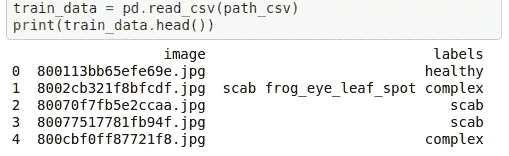

使用 pandas 数据帧从注释 CSV 表中获取快照。

对于分类任务，检查标签分布有助于了解预期情况。理想情况下，每个类中的样本数量应该几乎相等；如果不是，你应该部署一些技术来平衡你的数据集，如果它是严重不平衡的*(平衡技术超出了本文的范围)*。

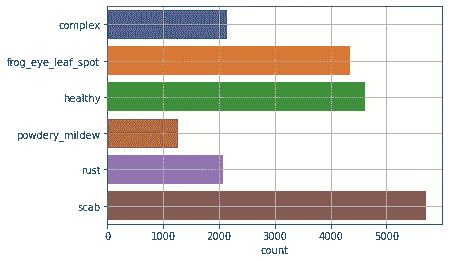

植物病理学数据集的标签分布。

## 将数据包装到 PyTorch 类

[Pytorch Lightning](https://pytorch-lightning.readthedocs.io/en/stable) 只是组织了 [Pytorch](https://pytorch.org/) 在引擎盖下使用标准 Pytorch 对象和方法进行数据处理，如`Dataset` `Dataloader`对象。`Datasets`定义了如何从存储器(如硬盘)加载数据，并将输入数据(图像)与注释(标签)结合起来。需要实现的主要方法是`__getitem__`，简单来说可能如下所示:

[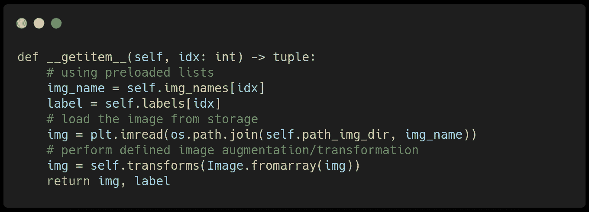](https://github.com/Borda/kaggle_plant-pathology/blob/a642861e8d4d896c15b10c5dfcf071d8436889b5/kaggle_plantpatho/data.py#L92-L104)

来自共享[库](https://github.com/Borda/kaggle_plant-pathology)的代码[片段](https://github.com/Borda/kaggle_plant-pathology/blob/a642861e8d4d896c15b10c5dfcf071d8436889b5/kaggle_plantpatho/data.py#L92-L104)。

与几乎所有的分类机器学习任务一样，该模型不直接与文本标签一起工作，我们需要将我们的文本转换为我们可以建模的表示。

我们使用二进制编码来表示标签，对于图像中出现的特定标签使用`1`，否则使用`0`。所得到的二进制向量位置对应于所有可能标签的固定集合中的标签索引，所有可能的标签都是子数据集划分——训练/验证/测试。

例如，健康样本的图像由`[0,0,1,0,0,0]`表示，标有“锈痂”的图像为`[0,0,0,0,1,1]`。下面，我们展示了一些来自我们实现的`Dataset`的图像编码对的例子:

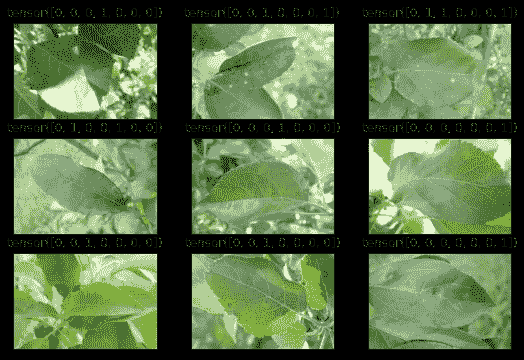

来自编码数据集的样本配对图像和标签。图片来源:[植物病理学 2021 — FGVC8](https://www.kaggle.com/c/plant-pathology-2021-fgvc8)

## 将数据包装到 Lightning 类

最后一个数据相关的步骤是定义一个`LightningDataModule`。这个 PyTorch Lightning 组件封装了所有的数据处理步骤，包括:
1。创造一个`Dataset`2
。将`Dataset`分割成训练/验证(/测试)子数据集
3。将子数据集包装到特定的 PyTorch 本机中`DataLoader`

这些`DataLoaders`然后在模型训练期间直接访问`LightningDataModule`。下面是一个示例，让您对`LightningDataModule` 结构有一个简单的了解:

[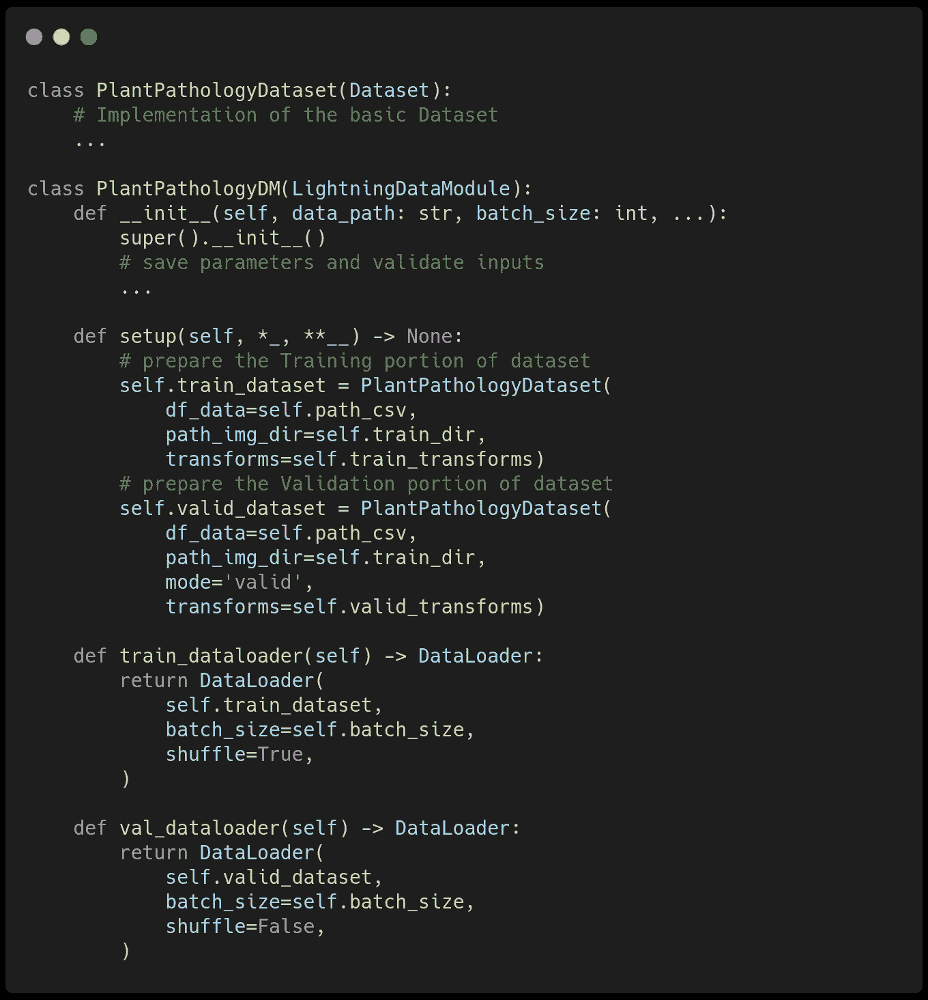](https://github.com/Borda/kaggle_plant-pathology/blob/af444ede4f09ce6b37e3e59d552b54d49b5c4d0c/kaggle_plantpatho/data.py#L150-L316)

来自共享[库](https://github.com/Borda/kaggle_plant-pathology)的代码[片段](https://github.com/Borda/kaggle_plant-pathology/blob/af444ede4f09ce6b37e3e59d552b54d49b5c4d0c/kaggle_plantpatho/data.py#L150-L316)。

## 基础数据扩充

数据扩充是一种基本的机器学习技术，旨在通过训练数据集的合成扩展来扩展可变性，并有望防止人工过度拟合。增强的思想是在最终的外观方向上生成新的样本，这些样本可能在训练数据集中丢失。但是，它仍然有可能在验证或生产的后期出现。在图像领域，典型的增强是几何变换和颜色/强度变化。

我们使用垂直/水平翻转、旋转、小裁剪和小透视变换的随机组合来模拟不同的观察位置(参见下面带有一系列`torchvision`变换的代码快照)。

[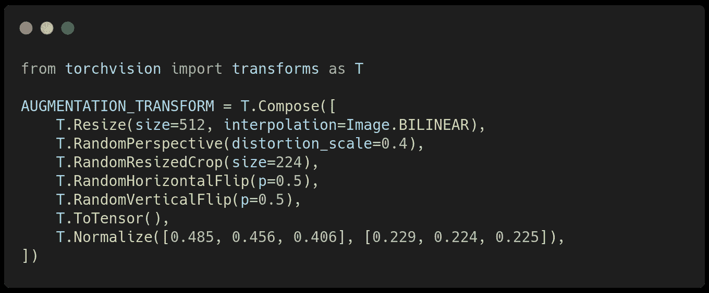](https://github.com/Borda/kaggle_plant-pathology/blob/af444ede4f09ce6b37e3e59d552b54d49b5c4d0c/kaggle_plantpatho/augment.py#L15-L26)

来自共享[库](https://github.com/Borda/kaggle_plant-pathology)的代码片段。

# 基线模型拟合

在训练一个复杂的模型之前，我们应该用一个基线模型来检查我们的数据集，以验证我们的训练管道没有泄漏。这种最佳实践消除了下游的混乱，因为如果我们从一个不收敛的非常复杂的模型开始，我们就不知道问题出在数据处理、训练过程还是我们的模型本身。

## 调整火炬视觉模型

我们从 [TorchVision](https://pytorch.org/vision/stable/index.html) 软件包中推荐一个简单的 [ResNet50](https://iq.opengenus.org/resnet50-architecture/) (通常被认为是模型复杂性和学习能力之间的一个很好的权衡)，它具有预先训练的权重，可以加速任何收敛并将其打包成一个模块。

需要包装预训练模型，因为基本 ResNet50 有 1000 个输出(因为它是在 [ImageNet 数据集](https://image-net.org/)上训练的)，而我们的分类只需要六个输出/类——我们用新的线性层替换最后一个线性层。

[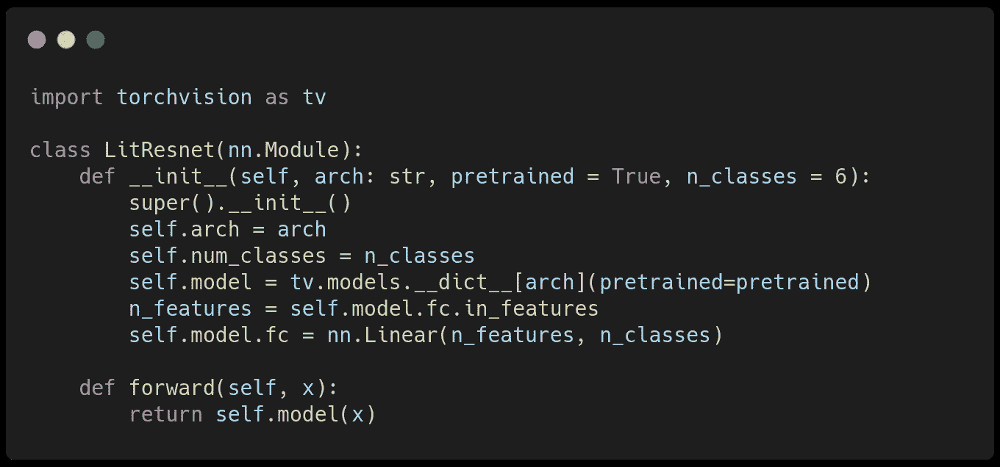](https://github.com/Borda/kaggle_plant-pathology/blob/af444ede4f09ce6b37e3e59d552b54d49b5c4d0c/kaggle_plantpatho/models.py#L11-L22)

来自共享[库](https://github.com/Borda/kaggle_plant-pathology)的代码[片段](https://github.com/Borda/kaggle_plant-pathology/blob/af444ede4f09ce6b37e3e59d552b54d49b5c4d0c/kaggle_plantpatho/models.py#L11-L22)。

## 准备闪电模型

`LightningModule`是 PyTorch Lightning 的一个核心对象，它聚集了所有与模型相关的过程——模型(架构&权重)、如何执行训练/验证步骤、记录指标等。

第一步是定义一个新的`LightningModule`——包装我们的模型、度量、损失函数和训练所需的其他参数。对于图像分类指标，我们使用传统的[准确度、精确度](https://en.wikipedia.org/wiki/Accuracy_and_precision)和 [F1 得分](https://en.wikipedia.org/wiki/F-score)指标。作为损失函数，由于数据是多标签数据，我们使用具有 Logits 的[二元交叉熵。](https://gombru.github.io/2018/05/23/cross_entropy_loss/)

[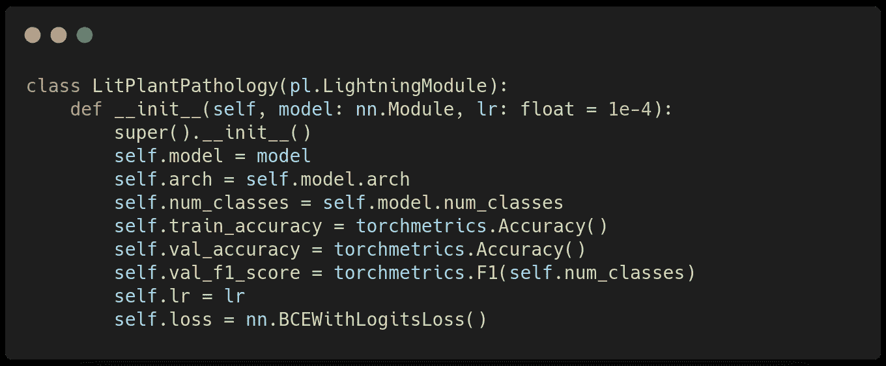](https://github.com/Borda/kaggle_plant-pathology/blob/a642861e8d4d896c15b10c5dfcf071d8436889b5/kaggle_plantpatho/models.py#L25-L49)

来自共享[库](https://github.com/Borda/kaggle_plant-pathology)的代码[片段](https://github.com/Borda/kaggle_plant-pathology/blob/a642861e8d4d896c15b10c5dfcf071d8436889b5/kaggle_plantpatho/models.py#L25-L49)。

编写`LightningModule`的下一步是定义训练和验证步骤，在该步骤中，我们指定如何将数据输入模型以获得预测并计算损失。该损失被传递给优化，用于自动权重更新。您可以看到它们非常相似，因为我们想要跟踪相似的度量标准来进行培训和验证；区别在于`training_step`需要回波损耗。

[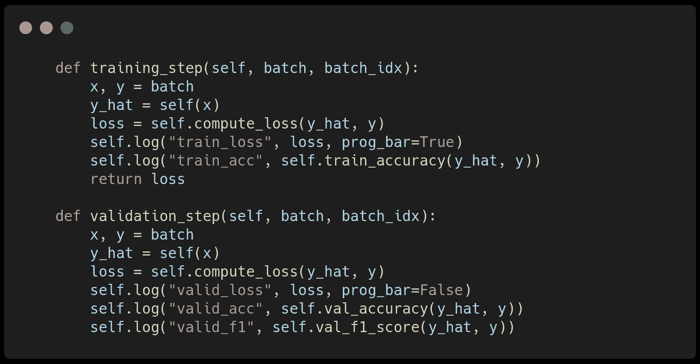](https://github.com/Borda/kaggle_plant-pathology/blob/a642861e8d4d896c15b10c5dfcf071d8436889b5/kaggle_plantpatho/models.py#L61-L80-L80)

来自共享[库](https://github.com/Borda/kaggle_plant-pathology)的代码[片段](https://github.com/Borda/kaggle_plant-pathology/blob/a642861e8d4d896c15b10c5dfcf071d8436889b5/kaggle_plantpatho/models.py#L61-L80-L80)。

最后一步是定义我们想要使用的优化器和一个可选的调度器，该调度器根据训练进度(由训练步骤索引驱动)管理训练期间的学习率变化。我们使用带有默认参数的加权 Adam 优化器。

[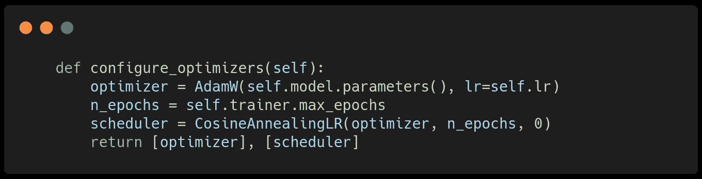](https://github.com/Borda/kaggle_plant-pathology/blob/a642861e8d4d896c15b10c5dfcf071d8436889b5/kaggle_plantpatho/models.py#L82-L85)

来自共享[库](https://github.com/Borda/kaggle_plant-pathology)的代码[片段](https://github.com/Borda/kaggle_plant-pathology/blob/a642861e8d4d896c15b10c5dfcf071d8436889b5/kaggle_plantpatho/models.py#L82-L85)。

## 用闪电训练模型

PyTorch Lightning 拥有丰富的[回调](https://pytorch-lightning.readthedocs.io/en/latest/extensions/callbacks.html)生态系统。它们为最佳实践提供开箱即用的支持，从[检查点](https://pytorch-lightning.readthedocs.io/en/1.4.0/common/weights_loading.html)(在训练期间保存模型权重)和[提前停止](https://pytorch-lightning.readthedocs.io/en/1.4.0/common/early_stopping.html)(如果模型不再改进，则停止训练)到高级技术，如[修剪](https://pytorch-lightning.readthedocs.io/en/1.4.0/extensions/generated/pytorch_lightning.callbacks.ModelPruning.html)或[随机权重平均](https://pytorch-lightning.readthedocs.io/en/1.4.0/extensions/generated/pytorch_lightning.callbacks.StochasticWeightAveraging.html)。

我们在训练期间配置检查点以保存具有最佳验证 F1 分数的模型:

```
ckpt = pl.callbacks.ModelCheckpoint(
    monitor='valid_f1',
    filename='checkpoint/{epoch:02d}-{valid_f1:.4f}',
    mode='max',
)
```

现在我们有了开始训练所需的所有代码。

在 PyTorch 闪电中，训练被抽象为闪电`Trainer`。我们设置训练参数，如学习率、历元数、我们想要使用的 GPU 数量(对于 Kaggle，使用所有 GPU)、训练精度(我们将浮点精度从 32 位降低到 16 位，这不会损害训练性能，但允许我们将每批中的数据量增加一倍)等等。

```
trainer = pl.Trainer(
    gpus=1,
    callbacks=[ckpt],
    max_epochs=35,
    precision=16,
    accumulate_grad_batches=24,
    val_check_interval=0.5,
)
```

训练呼叫`trainer.fit(model=model, datamodule=dm)`开始我们模型的训练…坐在你舒适的椅子上，观察你的模型如何学习…

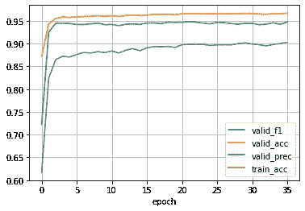

几个时代的训练表演。

在这篇文章中，我们分享了如何筛选给定的数据集，以及你应该关注哪些有趣的方面。我们展示了如何将类似文件的数据集包装到 PyTorch 类数据集，这是数据处理的核心。此外，我们在 [PyTorchLightning](https://pytorch-lightning.readthedocs.io/en/stable/) 中基于 [TorchVision](https://pytorch.org/vision/stable/index.html) 模型编写了一个基本的图像多标签分类模型，并在 GPU 上以混合精度无缝训练，无需额外代码。

在未来，我将展示如何使用一些最简单的可持续性技巧将笔记本转换为可共享的 Python 包，以及如何使用公开的训练参数编写一个简单的 CLI，以便更容易地进行超参数搜索。

</converting-kaggle-training-notebooks-to-sharable-code-1cc59fec2414>  

**敬请关注，关注我了解更多！**

<https://devblog.pytorchlightning.ai/best-practices-to-rank-on-kaggle-competition-with-pytorch-lightning-and-grid-ai-spot-instances-54aa5248aa8e>  

# 关于作者

[**Jirka boro vec**](https://medium.com/@jborovec)**已经在几家不同的 IT 公司从事机器学习和数据科学工作好几年了。特别是，他喜欢探索有趣的世界问题，并用最先进的技术解决它们。此外，他开发了几个开源 python 包，并积极参与其他知名项目。在 [*Grid.ai*](https://www.grid.ai/) 工作，担任研究工程师，是[*pytorchlightning . ai*](https://pytorchlightning.ai/)的主要撰稿人。**