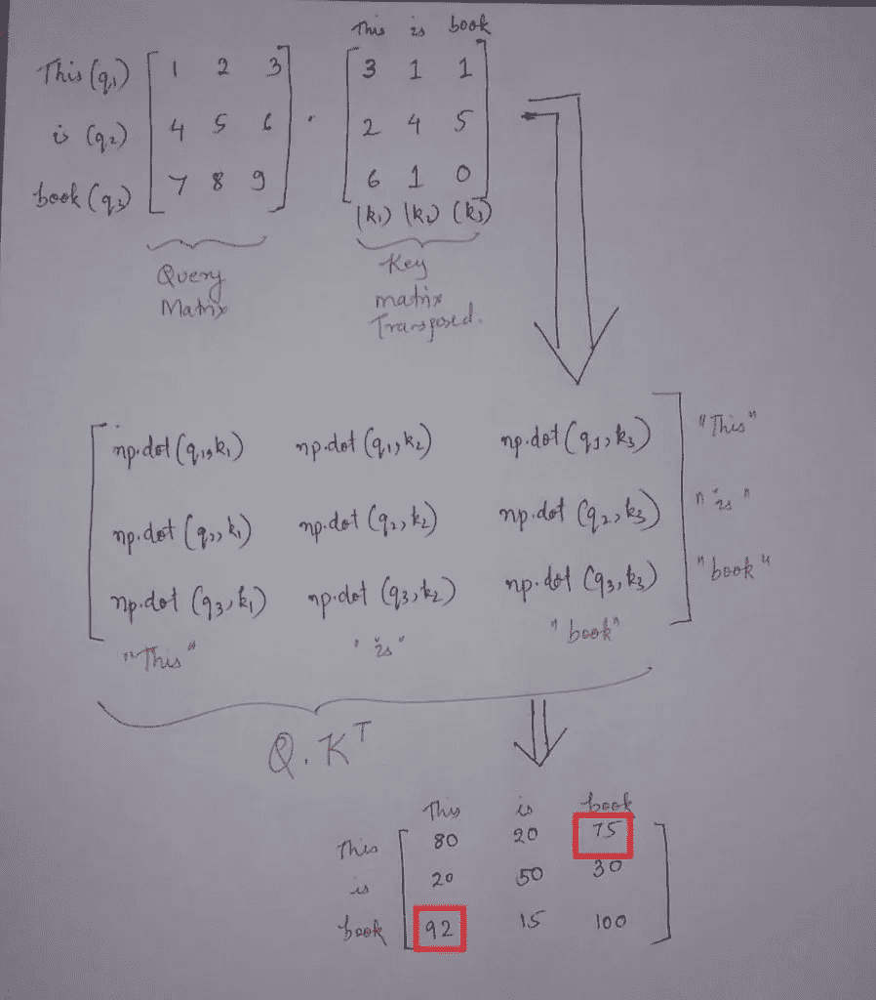

# 变压器自我关注机制背后的直观数学和代码

> 原文：<https://towardsdatascience.com/intuitive-maths-and-code-behind-self-attention-mechanism-of-transformers-for-dummies-7dfc28a30aaa?source=collection_archive---------12----------------------->

## 这篇博文将深入关注机制的本质细节，并使用 python 从头开始创建一个关注机制


罗伯特·卡茨基在 [Unsplash](https://unsplash.com/s/visual/fceccb05-6ab7-4e4e-afa9-bf4fa2cb4427?utm_source=unsplash&utm_medium=referral&utm_content=creditCopyText) 上的照片

在开始这篇博文之前，我强烈推荐你访问我之前关于变形金刚概述的博文。为了充分利用这个博客，请按以下顺序查看我以前的博客。

1.  [**变形金刚——你只需要关注。**](https://machinelearningmarvel.in/transformers-you-just-need-attention/)
2.  [**变形金刚自我关注机制背后的直观数学和代码。**](https://machinelearningmarvel.in/intuitive-maths-and-code-behind-self-attention-mechanism-of-transformers-for-dummies/)
3.  [**关于位置编码的概念你可能不知道。**](https://machinelearningmarvel.in/concepts-about-positional-encoding-you-might-not-know-about/)

这篇博文将深入关注机制的本质细节，并使用 python 从头开始创建一个关注机制。代码和直观的数学解释密不可分。


[变压器编码器部分](https://arxiv.org/abs/1706.03762)

我们要学什么？

1.  注意机制概念
2.  自我注意机制所涉及的步骤(直观的数学理论和代码)

*   输入预处理
*   查询、键和值矩阵的角色
*   标度注意分数的概念

3.多头注意力机制

所以没有任何进一步的拖延，让我们开始吧。

# **注意机制概念**

正如上一篇文章中所讨论的，当一个句子通过注意机制时会发生什么。例如，假设我们有一个句子“**他拿起帽子并仔细检查了它**”，注意机制通过记住每个单词如何与句子中的其他单词相关来创建每个单词的表示(嵌入)。在上面的句子中，注意机制对句子的理解达到了可以将单词“**it”**与“**hat”**联系起来，而不能与“**He”**联系起来。


A

# 自我注意机制涉及的步骤

## 1.以正确的格式获取输入:-

我们现在都知道文本输入不适合被转换器/计算机解释。因此，我们用数字向量来表示文本中的每个单词。让我们为句子创建嵌入，例如:- **“这是本书”**，并且让我们假设嵌入维度为 5。所以对于每个单词，我们有一个长度为 5 的向量，如下所示。

## **输入到变压器**

```
print(f”Shape is :- {np.random.randn(3,5).shape}”)
X=np.random.randn(3,5)
X
```

**输出:-**


**输出(**作者图片)

从上面的输入矩阵，我们将创建一对新的矩阵，即关键，查询和值矩阵。矩阵在注意机制中起着至关重要的作用。让我们看看如何？

## 2.获取查询、键和值矩阵

首先，我们需要查询、键和值权重矩阵。目前，我们已经随机地初始化了它，但是实际上，像神经网络中的任何其他权重一样，这些是参数，并且是在训练过程中学习到的。最终使用最佳权重。假设这些权重是最佳权重，如代码所示。下图总结了我们在代码部分要做的事情


下面的代码片段 **(** 图片由作者提供)将遵循此步骤中涉及的整体操作

## 查询矩阵的优化权重

```
weight_of_query=np.random.randn(5,3)
weight_of_query
```

**输出:-**


**输出(**作者图片)

## 关键矩阵的优化权重

```
weight_of_key=np.random.randn(5,3)
weight_of_key
```

输出:-


**输出(**图片由作者提供)

## 价值矩阵的优化权重

```
weight_of_values=np.random.randn(5,3)
weight_of_values
```

输出:-


**输出(**图片由作者提供)

然后，这些权重将乘以我们的输入矩阵(X ),这将给出我们最终的键、查询和值矩阵

## 关键矩阵的计算

```
Key=np.matmul(X,weight_of_key)
Key
```


**输出(**图片由作者提供)

## 查询矩阵的计算

```
Query=np.matmul(X,weight_of_query)
Query
```


**输出(**图片由作者提供)

## 价值矩阵的计算

```
Values=np.matmul(X,weight_of_values)
Values
```


**输出(**图片由作者提供)

查询、键和值矩阵中的第一行表示单词“ **This** ”的查询、键和值向量，其他单词依此类推。到目前为止，查询、键和值矩阵可能没有多大意义。让我们看看自我关注机制是如何通过使用**查询、键和值**向量来发现每个单词如何与句子中的其他单词相关，从而创建每个单词的表示(嵌入)的。

## 3.标度注意力分数

标度注意力分数的公式


标度注意力公式

```
dimension=5
Scores=np.matmul(Query,Key.T)/np.sqrt(dimension)
Scores
```


**输出(**图片由作者提供)

Q.K(转置)中发生的是查询和键矩阵之间的点积，点积定义了相似性，如下图所示。

**注:——下图中的数字都是为了便于解释而编造的，不相加。**



我们如何用数学方法计算注意力分数？ **(** 图片由作者提供)

所以在查询向量 **q1(This)** 和所有关键向量 **k1(This)，k2(is)，k3(book)** 之间有一个点积。这个计算告诉我们查询向量 **q1(This)** 如何关联/类似于密钥矩阵 **k1(This)、k2(is)、k3(book)中的每个向量。**同样，如果我们关注最终的输出矩阵，我们可以看到，如对角线矩阵所示，句子中的每个单词与其自身的关联度都高于其他任何单词。这是因为点积值更高。其次，单词**“This”**与**“book”**更相关，如上图中用红色突出显示的。如代码的最后一部分所示，我们将 **Q.K(转置)**除以 **sqrt(维度)**。这是一种标准化步骤，目的是使梯度稳定。

下面代码中的 Softmax 有助于将它设置在 0 到 1 的范围内，并分配概率值。

```
from scipy.special import softmax
Softmax_attention_scores=np.array([softmax(x) for x in Scores])
Softmax_attention_scores
```


**输出(**图片由作者提供)

上面的矩阵是中间 softmax 标度的注意力得分矩阵，其中每行对应于序列中每个单词的中间注意力得分/概率得分。它显示了每个单词与其他单词在概率上的关系。为了得到最终的注意力向量，我们将把上面的分数乘以价值矩阵并求和。总结出“这个”这个词对应的三个注意力向量。

在下面的代码片段中，softmax_attention_scores[0][0]是该特定单词的权重，values[0]是对应于单词“ **This** ”的值向量，以此类推。

```
Softmax_attention_scores[0][0]*Values[0]+\
Softmax_attention_scores[0][1]*Values[1]+\
Softmax_attention_scores[0][2]*Values[2]
```


**输出(**图片由作者提供)

类似地，我们可以计算其他单词如 is 和 book 的关注度。这就是自我关注的机制。接下来，我们将研究多头注意机制，它的基本原理来自自我注意机制。

# 多头注意力机制:-

简而言之，多头注意力机制只不过是多个自我注意力机制串联在一起。如果我们将每个自我关注流/过程表示为一个**头**，那么我们将通过将所有自我关注机制串联在一起而得到一个多头关注机制。

当我们在即将到来的博客文章中动手操作时，我们会看到每个编码器的输出都有一个 512 的维度。总共有 8 个头。因此，所发生的是，每个自我注意模块被制作成使得它向(句子中的单词数，64)维矩阵给出输出。当所有这些维度被连接时，我们将看到最终的矩阵将是(句子中的单词数，(64*8)=512)维。最后一步是将连接的头部与权重矩阵相乘(假设权重矩阵已经在该过程中被训练过),这将是我们的多头注意力的输出。

在我们的下一篇博文中，我们将讨论变形金刚的拥抱脸实现，再见。如果你觉得这很有帮助，请随意查看我关于变形金刚的其他博文

1.  [**变形金刚——你只需要关注。**](https://machinelearningmarvel.in/transformers-you-just-need-attention/)
2.  [**变形金刚自我关注机制背后的直观数学和代码。**](https://machinelearningmarvel.in/intuitive-maths-and-code-behind-self-attention-mechanism-of-transformers-for-dummies/)
3.  [**关于位置编码你可能不知道的概念。**](https://machinelearningmarvel.in/concepts-about-positional-encoding-you-might-not-know-about/)