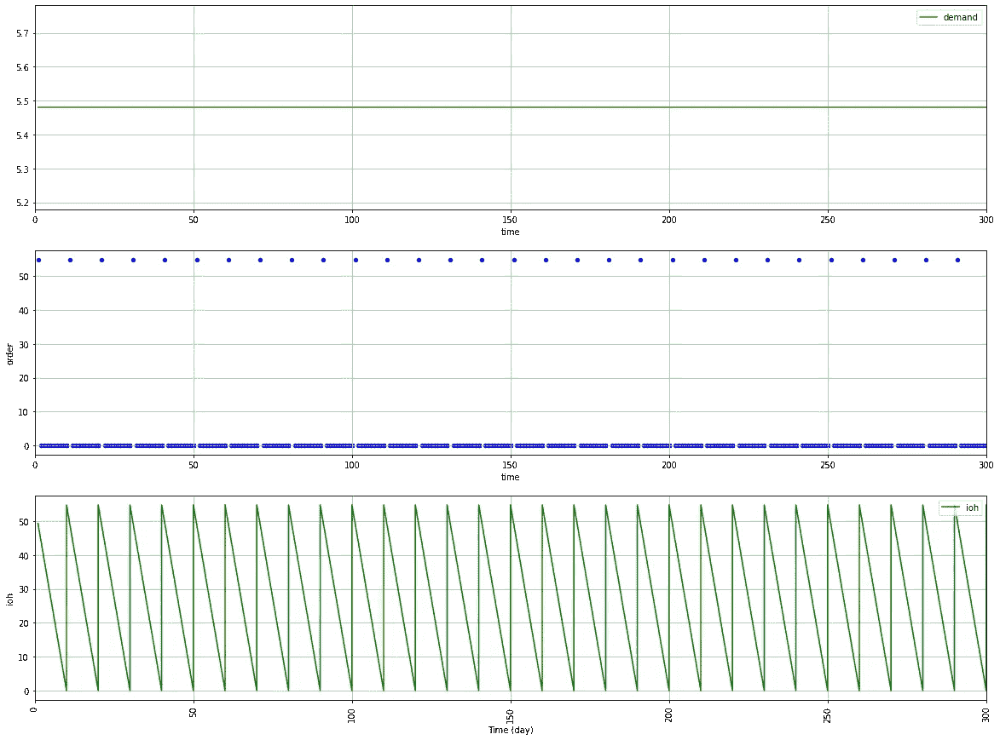

# 零售库存管理——确定性需求

> 原文：<https://towardsdatascience.com/inventory-management-for-retail-deterministic-demand-311682c02518?source=collection_archive---------15----------------------->

## 建立一个简单的模型来模拟几种补货规则(基本、EOQ)对库存成本和订购成本的影响


需求确定的库存管理—(图片由作者提供)

对于大多数零售商来说，库存管理系统采用固定的、基于规则的方法来进行预测和补货订单管理。

考虑到需求的分布，目标是建立一个补货策略，使您的订购、持有和短缺成本最小化。

*   **订购成本**:因管理成本、系统维护或制造成本**而订购的固定成本(欧元/订单)**
*   **持有成本:**持有库存所需的所有成本(储存、保险和资金成本)**(欧元/单位 x 时间)**
*   **短缺/缺货成本:**没有足够库存满足客户需求的成本(销售损失、罚款)**(欧元/单位)**

在本文中，我们将介绍一种简单的方法，使用用 Python 构建的离散模拟模型来测试几个库存管理规则。

*   确定性恒定需求:D **(单位/年)**
*   订购和补货之间的提前期**(天)**
*   短缺和储存成本**(欧元/单位)**

💌新文章直接免费放入你的收件箱:[时事通讯](https://www.samirsaci.com/#/portal/signup)

```
**SUMMARY**
**I. Scenario
Problem Statement** As an Inventory Manager of a mid-size retail chain, you are in charge of setting the replenishment quantity in the ERP.
**Objective
II. Build your Model
Economic Order Quantity (EOQ)** *What is the best compromise between ordering and holding costs?* **1\. Visualize the current rule
2\. Economic Order Quantity: Q = Q*****3\. Include replenishment lead time
4\. Real-Time visualization of Cost of Goods Sold (COGS)**
**III. Conclusion & Next Steps**
```

# 一.情景

## 问题陈述

作为一家中型零售连锁店的库存经理，您负责在 ERP 中设置补货数量。

根据商店经理的反馈，你开始怀疑 ERP 的补货规则是否是最佳的，尤其是对那些跑得快的人，因为你的商店正面临着因缺货而导致的销售损失。

对于每个 SKU，您希望构建一个简单的模拟模型来测试几个库存规则，并估计对以下各项的影响:

*   总成本:接收、储存和销售该产品的成本是多少？
*   缺货:缺货导致的销售损失百分比是多少？

在本文中，我们将构建这个模型，

```
# Total Demand (units/year)
**D = 2000**
# Number of days of sales per year (days)
**T_total = 365**
# Customer demand per day (unit/day)
**D_day = D/T_total**
# Purchase cost of the product (Euros/unit)
**c = 50**
# Cost of placing an order (/order)
**c_t = 500**
# Holding Cost (% unit cost per year)
**h = .25**
c_e = h * c
# Selling Price (Euros/unit)
**p = 75**
# Lead Time between ordering and receiving
**LD**
# Cost of shortage (Euros/unit)
**c_s = 12**
```

为了简化理解，让我们介绍一些符号


方程式—(图片由作者提供)

## 目标

在本文中，我们将

1.  想象商店经理使用的当前规则
2.  计算**经济订货量**并模拟影响
3.  想象订购和接收之间的**交付周期**的影响
4.  每个规则的**齿**的实时可视化

<http://samirsaci.com>  

# 二。建立模型

## 密码

> 你可以在这个 Github 资源库中找到完整的代码:[链接](https://github.com/samirsaci/inventory-deterministic)。
> 我的其他项目组合:[萨米尔萨奇](https://samirsaci.com/)

## 经济订购数量(EOQ)

许多库存优化模型使用的经济订货量(EOQ)背后的理论是找到最优订货量 Q*，它将是订货成本和持有成本之间的最佳折衷。

*   较低的订单数量会增加您的订购成本(增加:D/Q 的补货订单数量)，但会降低您的持有成本(降低平均库存水平:(Q/2))
*   高阶数量的倒数


总相关成本的最小值—(图片由作者提供)

**评论**

在上图中，我们可以看到**总相关成本(TRC)** (不含采购成本 cD 的总成本)在 **Q*=400 单位/订单**时最小。

> TRC(Q *)= 5000 欧元

## 1.可视化当前规则

目前的规则是每 10 天订购一次满足 10 天需求所需的确切数量。

这个量远低于 Q*，我们很容易理解 TRC 将远高于其最佳值:

> TRC(10) = 100，062 欧元

为了理解为什么让我们模拟 365 天的规则:



当前规则模型化-(图片由作者提供)

> ***备注*** *非常短的补货周期，使补货订单数量成倍增加。*

## 2.经济订货量:Q = Q*

对于每个补货周期，您订购 Q* = 400 个订单，并在库存水平为零时再次订购。


经济订货量—(图片由作者提供)

> ***备注*** *更长的补货周期使订单数量减少 7 倍= >更低的 TRC*

<http://samirsaci.com>  

## 3.包括补货提前期

如果我们有一个补货提前期 LD = N 天，缺货水平会是多少？


提前 25 天的经济订购量—(图片由作者提供)

> ***备注*** *订购和收货之间有 25 天的提前期，我们每个补货周期达到 140 单位的缺货量。*

## 4.销货成本(COGS)的实时可视化

如果你想说服你的商业团队和商店经理；你需要说他们的语言。

您可以使用 COGS **(这里我们将排除购买成本 COGS = TRC)** 准备一个简单的潜在营业额可视化，以了解一年中的影响。

**初始规则**


具有初始规则的 COGS(图片由作者提供)

> ***点评***
> 由于补货量少导致的再订货频率高，COGS 主要由订货成本驱动。

**EOQ 法则**


与 Q*的齿轮(EOQ)——(作者图片)

# **三。结论和后续步骤**

***关注我的 medium，了解更多与供应链数据科学相关的见解。***

## **结论**

**这种简单的建模是设计基本模拟模型的机会，该模型显示了客户需求和库存规则对关键绩效指标的影响。**

**它让您可以了解您的订购频率、库存水平以及供应链中交付周期的影响。**

## **后续步骤**

**恒定确定性需求的初始假设非常乐观。在下一篇文章中，我们将研究需求的可变性对总相关成本和销售损失的影响。**

**<https://www.samirsaci.com/inventory-management-for-retail-stochastic-demand-2/> ** 

# **关于我**

**让我们在 [Linkedin](https://www.linkedin.com/in/samir-saci/) 和 [Twitter](https://twitter.com/Samir_Saci_) 上连线，我是一名供应链工程师，正在使用数据分析来改善物流运作和降低成本。**

**如果你对数据分析和供应链感兴趣，可以看看我的网站**

**<https://samirsaci.com> ** 

# **参考**

**[1]供应链科学，华莱士·j·霍普**