# 零售业的库存管理——随机需求

> 原文：<https://towardsdatascience.com/inventory-management-for-retail-stochastic-demand-3020a43d1c14?source=collection_archive---------9----------------------->

## 假设需求呈正态分布，模拟安全库存水平对库存管理绩效指标的影响

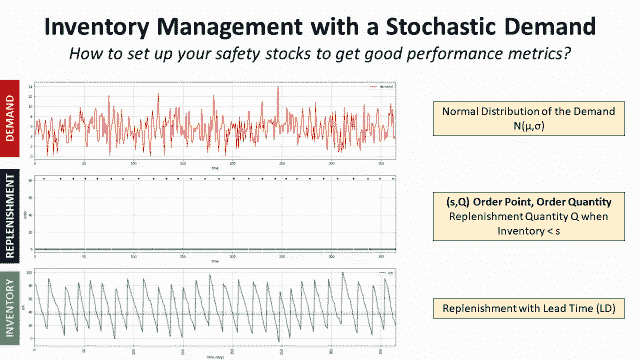

需求随机的库存管理—(图片由作者提供)

对于大多数零售商来说，库存管理系统采用固定的、基于规则的方法来管理预测和补货订单。

考虑到需求的分布，目标是建立一个补货策略，使您的订购、持有和短缺成本最小化。

在上一篇文章中，我们建立了一个模拟模型**，假设确定性恒定需求** *(单位/天)*。

</inventory-management-for-retail-deterministic-demand-311682c02518>  

在本文中，我们将改进这个模型，并向**介绍一种简单的方法，使用 Python 构建的离散模拟** **模型**来测试**几个库存管理规则**，假设客户需求呈正态分布。

💌新文章直接免费放入你的收件箱:[时事通讯](https://www.samirsaci.com/#/portal/signup)

```
**SUMMARY**
**I. Scenario** 1\. Problem StatementAs an Inventory Manager of a mid-size retail chain, you are in charge of setting the replenishment quantity in the ERP.
2\. Limits of the deterministic modelWhat could be the results with a normally distributed demand?
**II. Continuous Review Policy: Order Point, Order Quantity (s, Q)** 1\. Introduction of the Inventory Policy2\. Definition of the Safety Stock3\. How do you define k? **III. Example of replenishment policies**
1\. Target of CSL = 95%
2\. Target of IFR = 99%
**III. Conclusion & Next Steps**
```

# 一.情景

## 1.问题陈述

作为一家中型零售连锁店的库存经理，您负责在 ERP 中设置补货数量。

根据商店经理的反馈，你开始怀疑 ERP 的补货规则是否是最佳的，尤其是对那些跑得快的人，因为你的商店正面临着因缺货而导致的销售损失。

对于每个 SKU，您希望构建一个简单的模拟模型来测试几个库存规则，并估计对以下各项的影响:

**绩效指标**

*   **周期服务水平(CSL)** :每个周期发生缺货的概率 **(%)**
*   **物品填充率(IFR)** :满足顾客需求而不缺货的百分比(%)

在本文中，我们将构建这个模型，

```
# Total Demand (units/year)
**D = 2000**
# Number of days of sales per year (days)
**T_total = 365**
# Customer demand per day (unit/day)
**D_day = D/T_total**
# Purchase cost of the product (Euros/unit)
**c = 50**
# Cost of placing an order (/order)
**c_t = 500**
# Holding Cost (% unit cost per year)
**h = .25**
c_e = h * c
# Selling Price (Euros/unit)
**p = 75**
# Lead Time between ordering and receiving
**LD**
# Cost of shortage (Euros/unit)
**c_s = 12
# Order Quantity** Q = 82 (units/order)
```

为了简化理解，让我们介绍一些符号

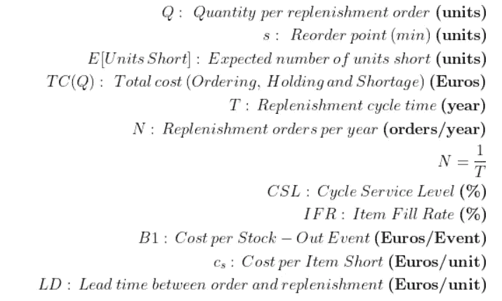

符号—(作者提供的图片)

## 2.确定性模型的局限性

在前一篇文章中，我们假设需求是一个常数确定性的；我们现在将引入随机性以更接近真实需求。

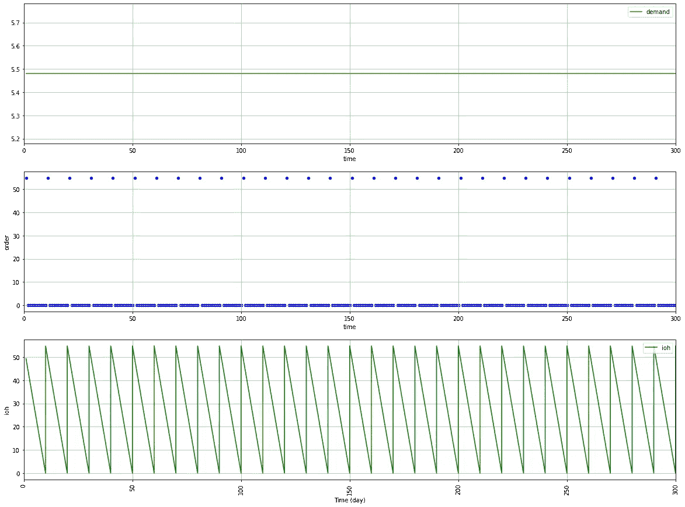

恒定需求 D = 5.4 单位/天的初始模型—(图片由作者提供)

## 需求呈正态分布会有什么结果？

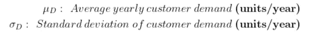

符号—(作者提供的图片)

```
**µ_D = 2000 (items/year)
σ_D = 50(items/year)**
```

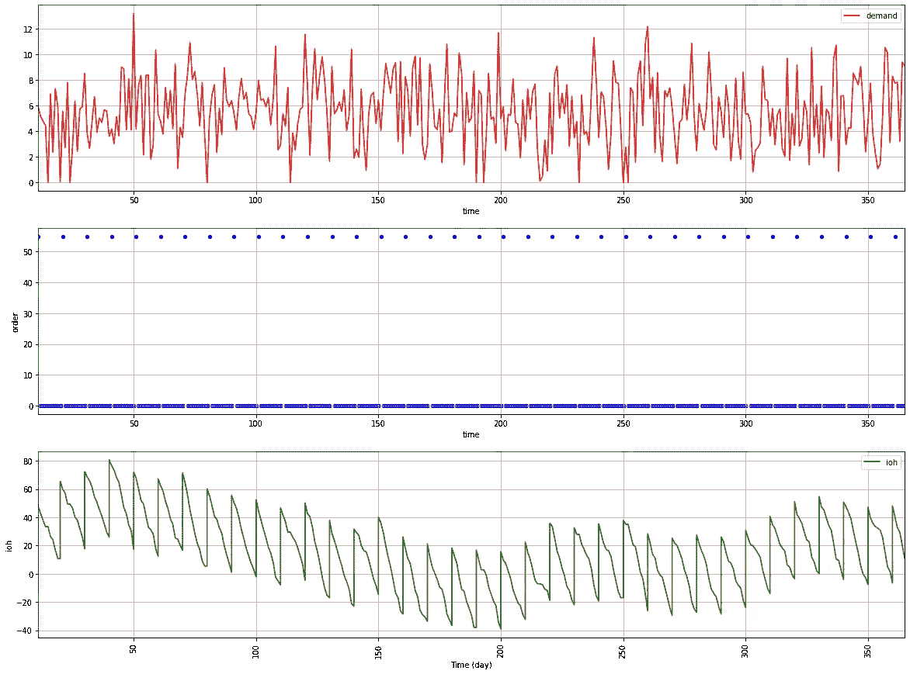

随机年度需求分布 N(2000，50)的初始模型

你需要改进你的补货政策，以弥补需求的波动。

**你听说过库存周转率 KPI 吗？**
在这个短片中了解更多，

<http://samirsaci.com>  

# 二。持续审查政策:订购点、订购数量(s，Q)

## 密码

> *您可以在我的 Github 资源库中找到完整代码:* [*链接*](https://github.com/samirsaci/inventory-stochastic) *(跟随我:D)
> 我的投资组合与其他项目:* [*萨米尔萨奇*](https://samirsaci.com/)

## 1.库存政策介绍

为了解决这个需求波动的问题，我们将引入一个持续的评审策略(s，Q)

*   持续审查=每天都会检查您的库存水平
*   (s，Q) =如果您的库存水平≤ **s** 您的 ERP 将订购 **Q**

为了简化理解，让我们介绍一些符号:

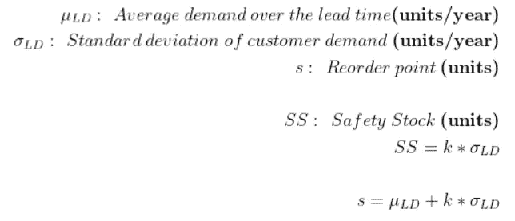

符号—(作者提供的图片)

## 2.安全库存的定义

再订购点可以定义为在订购和接收之间的交付周期内满足客户需求所需的最低库存水平。

安全库存是补偿需求波动的缓冲。

## 3.你怎么定义 k？

您的绩效指标将直接受到安全库存水平的影响；k 值越高，你的表现就越好:

1.  你为这两个指标中的任何一个设定目标(例如:我希望我的 CSL 是 95%)
2.  你计算 k 来达到这个目标
3.  你修正你的再订购点

<http://samirsaci.com>  

# 三。补充政策示例

## 1.CSL 的目标= 95%

根据 CSL 的定义，我们有:

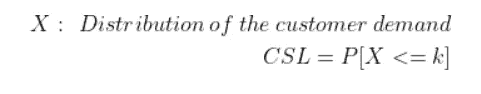

方程式—(图片由作者提供)

```
k = 1.64
Reoder point with CSL: 36 units
```

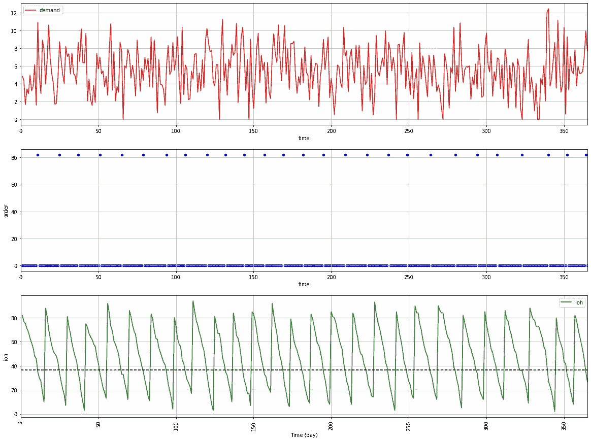

s = 32 个单位的(s，Q)模型—(图片由作者提供)

***评论***

> 在这个例子中，我们可以看到，我们没有面临任何股票，最低库存水平非常接近于零。

**代码**

## 2.IFR 的目标= 99%

在前面的例子中，我们的目标是 95%的补货周期没有缺货。

在这个例子中，我们将更加关注我们以 IFR 为目标全面交付产品的能力。这个公式使用的是单位正常损耗函数(关于这个函数的更多信息可以在这里找到: [**链接**](https://planetmath.org/unitnormallossfunction) )。

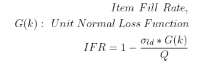

方程式—(图片由作者提供)

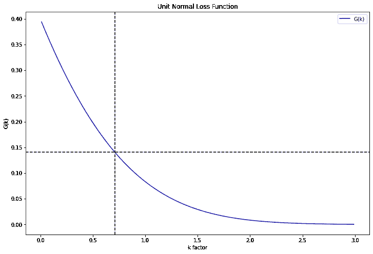

IFR 的最佳 k 值= 99%——(图片由作者提供)

```
# G(k) = Q/sigma_ld * (1 - IFR)
IFR = 0.99
G_k = (Q/sigma_ld) * (1 - IFR) = 0.14# Final value of k
k = 0.71
Reoder point with CSL: **31 units**
```

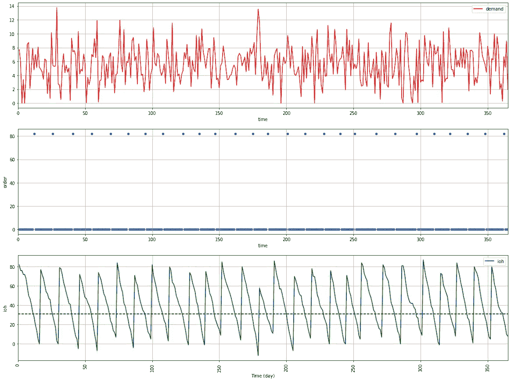

s = 31 个单位的(s，Q)模型—(图片由作者提供)

***评论***

> 要在不缺货的情况下达到 99%的需求单位，您需要一个较低的安全库存。(31 个单位对 32 个单位)

**代码**

<http://samirsaci.com>  

# 四。结论和下一步措施

*关注我的 medium，了解更多与供应链数据科学相关的见解。*

## 结论

这个改进的模型带来了更好的结果，因为它考虑了安全库存大小需求的可变性。

这个过程很简单，首先确定你的绩效指标目标(IRF、CSL)，然后用 k 值计算你的安全库存水平。

## 后续步骤

持续审查政策的主要问题是，如果您的投资组合中有许多 SKU，则需要大量的补货。

作为商店经理(或仓库经理)，你更喜欢固定补货时间(例如:每周两次)。因此，我们将在下一篇文章中介绍定期审查策略。

# 关于我

让我们在 [Linkedin](https://www.linkedin.com/in/samir-saci/) 和 [Twitter](https://twitter.com/Samir_Saci_) 上连线，我是一名供应链工程师，正在使用数据分析来改善物流运营和降低成本。

如果你对数据分析和供应链感兴趣，可以看看我的网站

<https://samirsaci.com>  

# 参考

[1]供应链科学，华莱士·j·霍普

[2]零售库存管理—确定性需求，萨米尔 Samir，[链接](/inventory-management-for-retail-deterministic-demand-311682c02518)