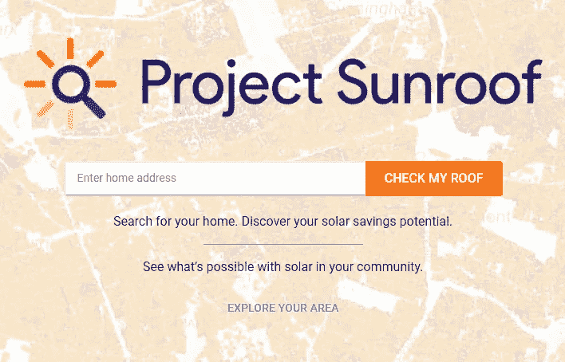
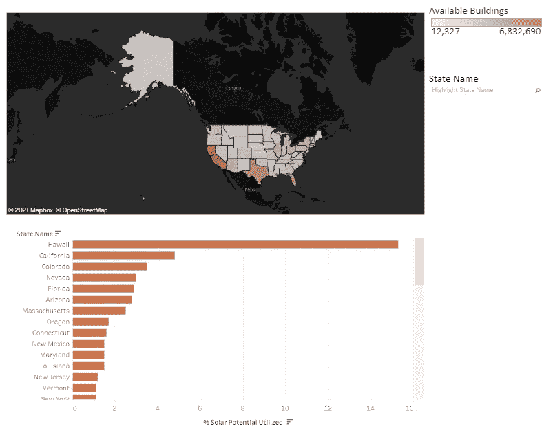
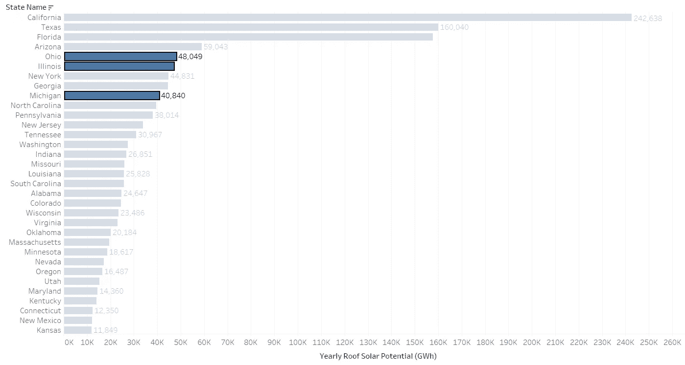
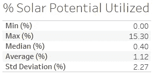

# 调查美国屋顶太阳能数据

> 原文：<https://towardsdatascience.com/investigating-u-s-rooftop-solar-data-aeafa0206237?source=collection_archive---------43----------------------->

## 使用 Tableau 可视化

作者照片

寒假期间，我决定利用一些空闲时间来学习更多关于 Tableau 的知识。这是一个强大的工具，我在学校项目中使用过，但我想探索如何用它来帮助回答关于数据的高层次问题。鉴于我对能源的兴趣，我寻找可以用来学习更多可再生能源知识的数据集。

我偶然发现了谷歌正在做的与太阳能相关的工作，名为“天窗项目”。我想知道我是否可以利用他们的数据来更多地了解美国太阳能投资的多样性。

根据我在东西海岸和中西部生活的时间，我知道每个地区对太阳能有不同的看法。例如，与我在俄亥俄州长大的地方相比，在北加州这里的房子上看到太阳能电池板要常见得多。

虽然美国各地的天气模式明显不同，使得太阳能在一些地方比其他地方更可行，但我不得不相信在我长大的地方仍然有太阳能的潜力。这让我想到了我想回答的问题:

> 哪些州的太阳能潜力最大？

这篇文章的其余部分向你展示了我是如何得到我的结果的，希望你喜欢！

## 项目天窗

项目天窗是谷歌的一项事业，使个人太阳能更容易获得。他们创造了一个工具，用户可以输入他们的地址，并找出他们的房子每年接受多少可用的阳光，他们的屋顶有多少可用于太阳能电池板，以及他们潜在的能源账单节省。

项目天窗用户界面

它还提供了如何获得太阳能电池板的信息，这有助于居民了解他们个人可以采取的步骤，以转移到清洁能源。

## 过程

这个过程的第一步是登录 Google Cloud 控制台，并使用 BigQuery 工具。Google 在 Google 云平台 BigQuery 工具[【2】](https://cloud.google.com/bigquery)上提供了大量来自 Project 天窗的数据，可以使用他们的免费层访问。在公共数据集下，项目天窗有两个数据集，一个按邮政编码分组，另一个按人口普查区域分组。我认为使用邮政编码来汇总州一级的数据是最简单的方法。

查询完所有数据后，我将其下载到一个 csv 文件中，以便在本地工作。我在 PostgreSQL 中创建了一个数据库，并导入了数据。数据集包含大量要素，但并非所有要素都是分析所必需的。下面的 SQL 查询显示了从完整的集合中提取的信息，这些信息在州级别上进行分组。每个要素都有一个注释，更详细地描述正在提取的数据。

项目天窗数据的 SQL 查询

有了这些数据，我就可以创建一个可视化的东西来理解这些信息了。我用 Tableau 创建了一个交互式的美国地图。地图根据太阳能建筑的数量给每个州涂上颜色。可用的建筑越多，橙色越深。此外，还有一个条形图，显示安装了太阳能的建筑在所有可安装太阳能的建筑中所占的百分比。例如，您可以在条形图的顶部看到夏威夷，这表示他们在所有可利用太阳能的建筑上安装了很高比例的太阳能电池板。

用户可以通过一个或多个状态进行过滤，并单击状态或相应的栏来访问更详细的信息。

点击下面的图片，亲自尝试一下吧！

点击上图查看交互式仪表盘

## 回答？

我很惊讶地得知，我的家乡俄亥俄州，以及伊利诺伊州和密歇根州，是一些最大的未充分利用的潜力。

加利福尼亚州、德克萨斯州、佛罗里达州和亚利桑那州每年能够产生的潜在 GWh 最高。俄亥俄州排名第五(48，049 GWh)，伊利诺伊州排名第六(47，048 GWh)，密歇根州排名第九(40，840 GWh)。

有序的年潜在太阳能发电量

就目前屋顶太阳能的利用量而言，这些中西部州都处于光谱的低端。俄亥俄州、伊利诺伊州和密歇根州的利用率都是 0.20，相当于所有州的第 36 个百分点。

已利用太阳能潜力百分比的汇总统计

在俄亥俄州长大的我，不会想到基础设施或天气会允许数据显示的潜力。这一分析很好地提醒了我们，数据可以帮助揭示挑战我们认知的事实。

## 未来的研究

这些数据帮助我量化了屋顶太阳能的潜力。尽管如此，还有很多事情可以做。收集更多与成本相关的数据，以了解不同转型水平所需的投资规模，或许有助于相关政策的实施，这将是令人感兴趣的。

这个 web 应用程序是用 Django 创建的，托管在 Heroku 上。查看 github 仓库以了解更多细节。

 [## jackseagrist/Project _ Rooftop _ Solar

### 此时您不能执行该操作。您已使用另一个标签页或窗口登录。您已在另一个选项卡中注销，或者…

github.com](https://github.com/jackseagrist/Project_Rooftop_Solar) 

Jack Seagrist 目前是斯坦福大学的一名学生，正在攻读环境工程硕士学位。他热衷于使用最新的数据驱动流程来解决气候挑战。通过 [twitter](https://twitter.com/JackSeagrist) 、 [linkedin](https://www.linkedin.com/in/jackson-seagrist/) 联系，或者查看他的[网站](https://www.jackseagrist.com/)来了解更多关于他的工作。

 [## 用数据释放风能的潜力

### 调查加利福尼亚风能的案例研究

towardsdatascience.com](/unlocking-the-potential-of-wind-energy-with-data-9b6c5eedb5a9) 

参考资料:

1-[https://www.google.com/get/sunroof](https://www.google.com/get/sunroof)

2-[https://cloud.google.com/bigquery](https://cloud.google.com/bigquery)