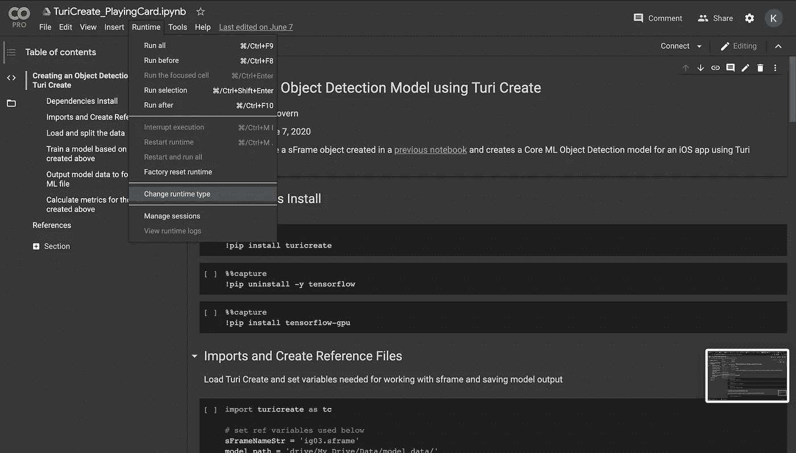

# 使用 Turi Create 的 iOS 计算机视觉对象检测

> 原文：<https://towardsdatascience.com/ios-computer-vision-object-detection-with-turi-create-be109edd4257?source=collection_archive---------31----------------------->

## iOS 计算机视觉项目概述，该项目的构建和部署不到一天时间


卡尔·海尔达尔在 [Unsplash](https://unsplash.com?utm_source=medium&utm_medium=referral) 上拍摄的照片

**计算机视觉项目无处不在。**

不幸的是，训练你的计算机视觉模型并不总是容易的。Keras 中的对象检测需要一些操作，而在 Tensorflow 或 PyTorch 中编写相同的代码需要一些严肃的代码柔术。那么，即使你能够训练你的模型，也要祝你好运把它放到移动设备上。谷歌云的 AutoML 解决了部分问题，但简单的 iOS 部署可能难以实现。

苹果用它的 [Create ML](https://developer.apple.com/documentation/createml) 工具做了一件惊人的工作，让 iOS 的计算机视觉更加平易近人。如果你不关心超参数调整，或者如果你被 Python 或 Keras 吓到了，那么苹果提供了一种快速简单的方法，只需拖放你的标记图像，然后开始训练。训练后，模型可以很容易地放到 iOS 应用程序中，让其他人也能很容易地使用你创造的东西。作为起点，苹果开发者文档提供了一个用于对象检测的[优秀示例应用](https://developer.apple.com/documentation/vision/recognizing_objects_in_live_capture)。

但是，如果您试图训练的模型过于耗费资源，无法在标准 Mac 硬件上构建，该怎么办？如果您想利用 GPU 来加快训练过程，该怎么办？根据这篇文章的标题，你可能会认为这是 Turi Create 的切入点。

[](https://github.com/apple/turicreate) [## 苹果/turicreate

### 快速链接:安装|文档| WWDC 2019 | WWDC 2018 查看我们在 WWDC 2019 和 WWDC 2018 的演讲…

github.com](https://github.com/apple/turicreate) 

为了更好地了解一个端到端的 Turi Create 项目是什么样子的，你可以看看[这个用于计算机视觉扑克牌检测的 repo](https://github.com/mcgovey/compvision-playing-card-detection) ，以及[这个总结项目的论文](https://github.com/mcgovey/compvision-playing-card-detection/raw/master/Kevin%20McGovern%20Project%20Overview.pdf)或[这个视频概述](https://www.youtube.com/watch?v=ZEHn_VSixwI)。

[](https://github.com/mcgovey/compvision-playing-card-detection) [## mcgovey/compvision-扑克牌-检测

### 使用扑克牌的视频，两三张扑克牌在一个随机的…

github.com](https://github.com/mcgovey/compvision-playing-card-detection) 

对于那些不熟悉 Turi Create T1 的人来说，它是一个 Python 库，抽象了 Tensorflow、PyTorch 甚至 Keras 的复杂性。它的 Python API 可以很容易地将数据格式化为所需的预处理图像格式，然后创建一个可以在不同类型的硬件上运行的模型(不仅仅是像 Create ML 这样的 MAC)。

使用笔记本电脑之外的东西最好的一点是，有一个免费的资源可以帮助使用已经可用的 GPU 进行培训，Google Colab。根据你的模型的复杂性，你可能需要升级你的账户，以利用[谷歌 Colab Pro](https://colab.research.google.com/signup) 的高内存和更快的 GPU。

## 项目演练

在使用 Turi Create 做任何事情之前，您必须将数据转换成一种叫做 sFrame 的格式。这意味着您计划用来训练计算机视觉模型的图像必须具有概述图像、标签和边界框尺寸的格式(如果是对象检测模型)。[这本笔记本](https://colab.research.google.com/drive/1IY-XJyvkcc2oKCJK6SyyHtGxv_VIzlmy?usp=sharing)讲述了一个物体探测模型的例子。

一旦你的数据在一个 sFrame 中，你就可以开始使用 Turi Create 构建你的模型了。本笔记本会带你完成这些步骤。如上所述，加速模型训练的方法之一是使用 GPU。如果您使用的是 Google Colab，您可以通过单击运行时>更改运行时类型>然后选择硬件加速器下的下拉菜单并将其更改为 GPU 来实现。



在 Google Colab 中改变运行时类型。

一旦设置被更改，你仍然需要让 Turi Create 来识别你的 GPU。在 linux 系统上(这是 Google Colab 构建的基础)，你可以用下面的代码块来做这件事(注意，在这些命令之间还有其他事情要做，但是我想强调一下特定于 GPU 的命令。

```
!pip install turicreate!pip uninstall -y tensorflow!pip install tensorflow-gpu!export LD_LIBRARY_PATH=/usr/local/cuda/lib64:$LD_LIBRARY_PATHtc.config.set_num_gpus(-1)
```

**要了解更多关于本库实现的细节，请查看** [**Turi 创建文档**](https://apple.github.io/turicreate/docs/userguide/image_classifier/advanced-usage.html#using-gpus) **。**

一旦将数据加载到 sFrame 和环境设置中，就可以开始训练模型了。您可以决定您希望模型运行多少次迭代。对于您的第一次运行，您将希望从少量的迭代开始，以确保一切按预期运行。

```
# Create a modelmodel = tc.object_detector.create(train_data, max_iterations=10)
```

## 训练就是这么简单！

既然您已经训练了您的模型，请确保保存它。如果你想以后再来看它，那么你要确保把它保存为一个*。型号*文件。当你准备把它放到 iOS 应用程序中时，把它存为一个*。mlmodel* 。

```
# Save the model for later use in Turi Createmodel.save(’mymodel.model’)# Export for use in Core MLmodel.export_coreml(’mymodel.mlmodel’)
```

最后一件事！你会想看看你的模型表现如何。您可以使用 model.evaluate(test_data)方法来查看模型在训练数据或样本数据之外的表现。

**这并不难！**所以下一次当你试图建立一个计算机视觉模型，并且你不想担心在 Keras 中训练一个模型和担心转换格式，或者创建 ML 花费太长时间的时候，想想 Turi Create！