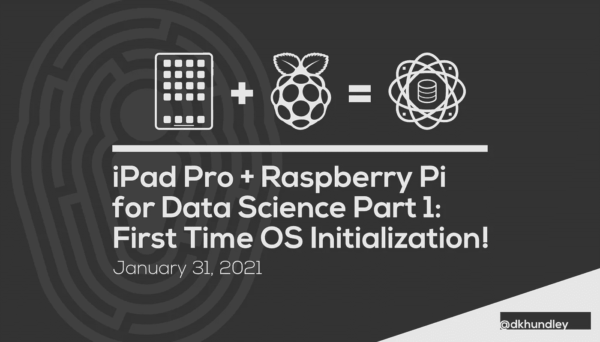
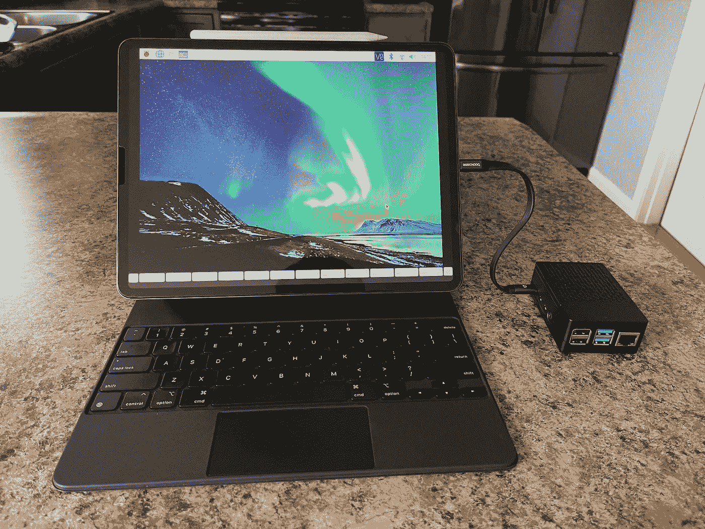
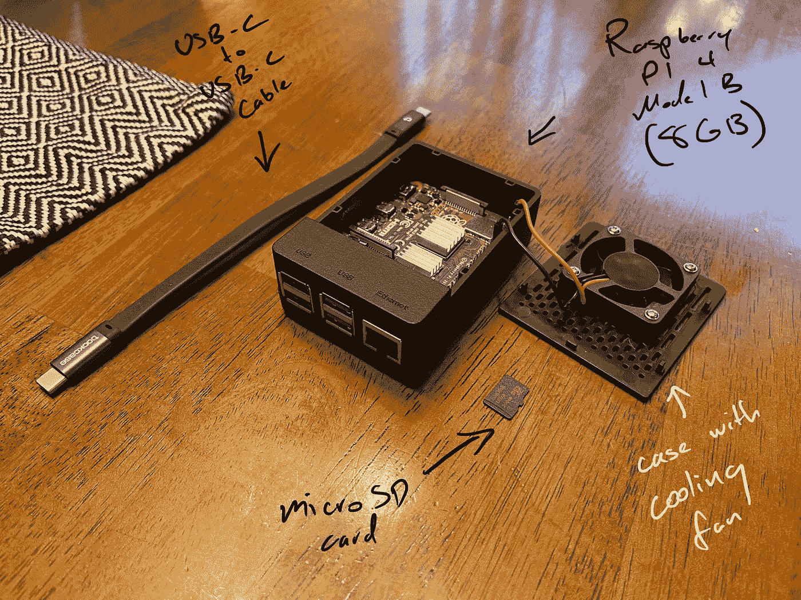
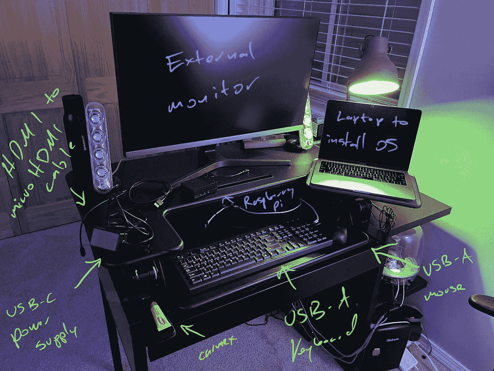
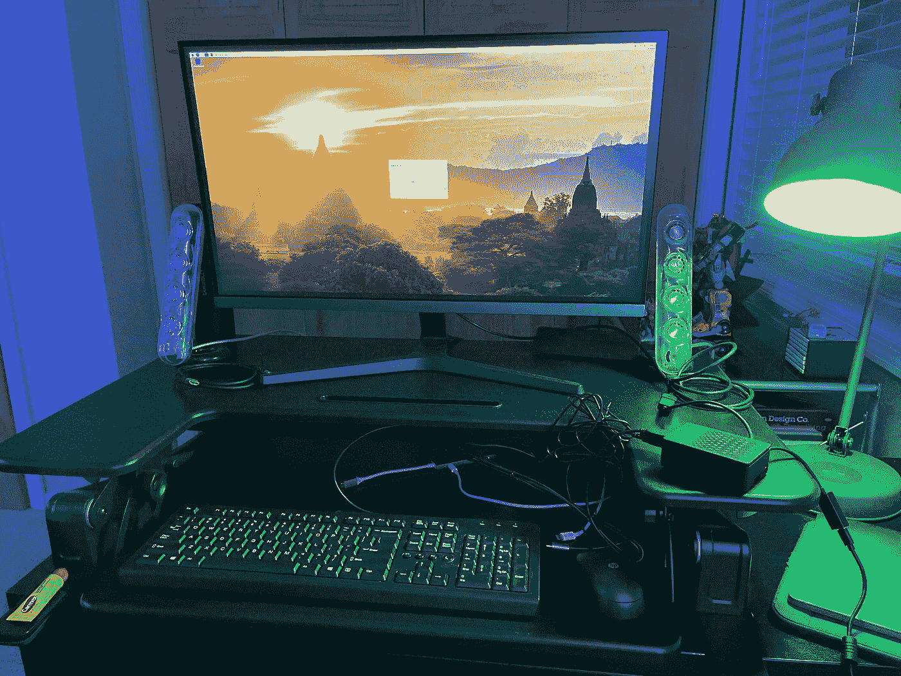

# 用于数据科学的 iPad Pro + Raspberry Pi 第 1 部分:首次操作系统初始化

> 原文：<https://towardsdatascience.com/ipad-pro-raspberry-pi-for-data-science-part-1-first-time-os-initialization-854371dc9201?source=collection_archive---------8----------------------->

## 树莓派+ iPad

## 让您从拆箱到操作系统初始化都可以使用 iPad + Pi！

几周前，我[写了一篇关于能够在 iPad Pro 上执行数据科学活动的状态的文章](/using-an-ipad-for-data-science-in-2021-d6a973dd27ab)。虽然我真的很惊讶看到苹果近年来取得的进步，但我们仍然没有 100%达到有人可以放弃笔记本电脑只在 iPad 上做事情的程度。我个人希望这一切发生，因为我喜欢用我的 iPad 做任何事情，从平面设计到用屏幕播放我的钢琴曲。

正如我在上一篇文章中引用的:

> 因为 iOS 不是传统的操作系统，有许多事情我不能做，因为我依赖命令行工具、Docker 映像等等。我很有兴趣看看苹果是否能够克服这些障碍，但不幸的是，它们在 2021 年 1 月仍然存在。

说实话，我看不到苹果会很快拿出解决这些问题的本土方案。在做了一些关于人们如何使用 iPad 作为通用软件开发机器的互联网研究后，我遇到了一件奇怪的事情:使用树莓 Pi 作为一种“计算附件”。因为 Raspberry Pi 是它自己的电脑，它可以运行 Linux，并从原生 iOS 中带回许多缺失的功能。(不是 100%完美；稍后会详细介绍。)

此外，这些人想出了如何直接连接 Raspberry Pi，并通过命令行以虚拟屏幕和 SSH 的形式与之交互。因此，从理论上讲，你可以在一个没有互联网连接的偏僻地方，做几乎所有的数据科学工作，只要你事先保存数据并预装依赖关系。不错！

听起来很酷，所以我想试试。给刚接触树莓派的你一点鼓励:这是我第一次拥有或设置一个。我很久以前就知道它是什么了，但直到现在我才觉得有必要拥有它。现在，这是我的设置的样子:

作者捕获的图像

在这篇文章中，我们将从头开始讲述一切。我将像几周前第一次打开树莓酱时那样开始。当连接到显示器/键盘/鼠标时，我们将努力实现一个全功能的 Raspberry Pi。在接下来的文章中，我们将关注 iPad 和 Pi 之间的硬连接，安装数据科学工具，甚至安装一个很酷的 JupyterHub 应用程序。

首先，让我们来看看您需要的硬件。

# 数据科学 Pi 的硬件

这个项目实际上需要两类硬件。第一个类别显然是 Raspberry Pi 及其相应的组件，但是为了第一次设置 Pi，第二个类别包含了我们在很短时间内需要的所有东西。

让我们从第一类开始。

作者创建的图像

树莓 Pi 本身就是一款[树莓 Pi 4 型号 B](https://www.raspberrypi.org/products/raspberry-pi-4-model-b/) 。这种型号有三种不同的内存:2GB、4GB 或 8GB。我个人选择了 8GB，但我认为你可以用一个更小的版本。我在亚马逊上以[的名义买了一个小套件，里面还包括一根电源线和散热器。回想起来，我意识到如果没有他们的电源线，我也可以直接购买 Pi。活到老，学到老！](https://www.amazon.com/CanaKit-Raspberry-Basic-Kit-8GB/dp/B08DJ9MLHV)

接下来，你需要一个 microSD 卡来存放操作系统和数据。我个人有一个 200GB 的卡(是的，我有类似的东西)，但我认为你可以用低得多的容量。我在网上看过最低 16GB，更推荐 32GB。鉴于目前 microSD 卡如此便宜，我肯定会选择 32GB 或更高的。

最后需要的是 USB-C 到 USB-C 电缆。它将作为 Pi 的电源和 Pi 与 iPad 之间的网络通道。这里你有很多选择，但是要注意:*它必须符合 PD(功率传输)标准*。令人惊讶的是，iPad 附带的电缆不起作用。如果你喜欢我的电缆，[你可以在这里找到它](https://www.amazon.com/0-72ft-Transfer-Charging-Samsung-MacBook/dp/B07THFJ1J5)。

最后一张图片不是必须的，但绝对推荐。你会注意到我的 Pi 被一个内置冷却风扇的盒子包围着。你可能会感到惊讶，但它出奇地便宜，而且易于安装。([亚马逊](https://www.amazon.com/iUniker-Raspberry-Aluminium-Heatsink-Supply/dp/B07D3S4KBK)上 10 美元左右。)它为 Pi 提供了一些不错的冷却和一些聊胜于无的保护。

现在，让我们来看看我们只在第一次设置时需要的东西。

作者创建的图像

在接下来的安装部分，你会看到我们首先需要使用外部计算机在 microSD 卡上安装 Raspberry Pi 操作系统。不幸的是，我不认为有办法在 iPad 上加载操作系统，所以你需要一台电脑。我将使用我的个人 MacBook，但由于我们只是在很短的时间内使用电脑，你可以很容易地借用朋友的电脑一个小时来完成这一步。

最后，在将 Pi 连接到 iPad 之前，我们必须直接在 Pi 上执行一些初始化步骤。也就是说，你需要以下东西:

*   USB-C 电源
*   用于连接微型 HDMI 插槽的显示器电缆(注:不要将微型 HDMI 误认为微型 HDMI。我自己可能做过，也可能没有…)
*   外部显示器/监视器
*   USB-有线键盘
*   USB-有线鼠标

还是那句话，可以的话可以临时借用那些东西。我自己借用我爸爸的键盘和鼠标，因为我实际上不再拥有有线键盘或鼠标了。

收集好材料后，让我们进入第一步:在 microSD 卡上安装操作系统。

# 在 microSD 卡上安装操作系统

作者创建的图像

好吧，我撒谎了。如果你和我一样，你从其他你不用的设备上拿了一张 microSD 卡。我的 200GB microSD 卡实际上是我的旧任天堂 Switch 卡，所以我首先必须吹掉那里的所有数据，为安装操作系统做准备。为此，我们将正确格式化 microSD 卡，为了确保万无一失，我甚至建议在新卡上使用这种方法。我不打算在这里讨论这个，但是这篇 WikiHow 文章实际上在展示 Windows、Mac 甚至 Android 的步骤方面做得很好。

为了让事情变得简单，我们不打算做任何花哨的事情，而是选择通过官方的 [Raspberry Pi Imager](https://www.raspberrypi.org/software/) 安装标准的 Raspberry Pi 操作系统。将 microSD 卡连接到计算机后，导航到成像仪软件的链接，然后按照屏幕上的说明进行操作。您应该会看到类似于我在上面的截图中显示的 UI。

大约 10 分钟后，成像仪将完成 Raspberry Pi 操作系统的安装，并为您提供“全部清除”信息，以便安全地从您的计算机中移除 microSD 卡。这就是电脑！现在，让我们继续将 microSD 卡放入 Raspberry Pi，将显示器和附件连接到 Pi 本身，并首次启动 Raspberry Pi。

# Raspberry Pi 操作系统初始化

作为帮助自己回忆第一次是如何实现这一切的一部分，我清除了自己的 Raspberry Pi 来重新创建和记录我第一次遵循的相同步骤。在我初始化 Raspberry Pi 操作系统的两次过程中，都花了 3-4 次断开/重新连接 Pi 电源，因为它会随机挂起。老实说，这让我感到不安，但在这两种情况下，操作系统最终加载得很好，没有任何问题。

一旦它最终加载完毕，你应该会看到一个桌面界面，背景是日落前的一些寺庙。操作系统会问你几个问题，包括一个要求更改默认用户密码的问题，所以按照 UI 提示的去做。它可能会提示额外的更新，正如你在下面的截图中看到的那样。否则，恭喜你！你有一个功能齐全的树莓派。🎉

作者创建的图像

# …未完待续！

现在我们已经完全初始化了操作系统，我们准备好进入将 iPad 正确连接到 Raspberry Pi 的步骤。不可否认，这个过程是漫长而艰巨的，因为这篇文章已经够长了，我们将在下一篇文章中专门讨论 Pi 与 iPad 的强硬连接。同时，欢迎您将您的 Pi 与显示器/键盘/鼠标组合一起使用，如果您愿意，甚至可以提前工作。剧透:下一篇文章将建立在互联网上其他资源的基础上。你是个精明的人，不用我帮忙，你大概也能从这里弄清楚！😉

对于那些想等到下一篇文章的人来说，我保证过不了多久我就会发表它。我已经开始写了！如果你继续关注，我会非常感激。一如既往，非常感谢你阅读这篇文章！