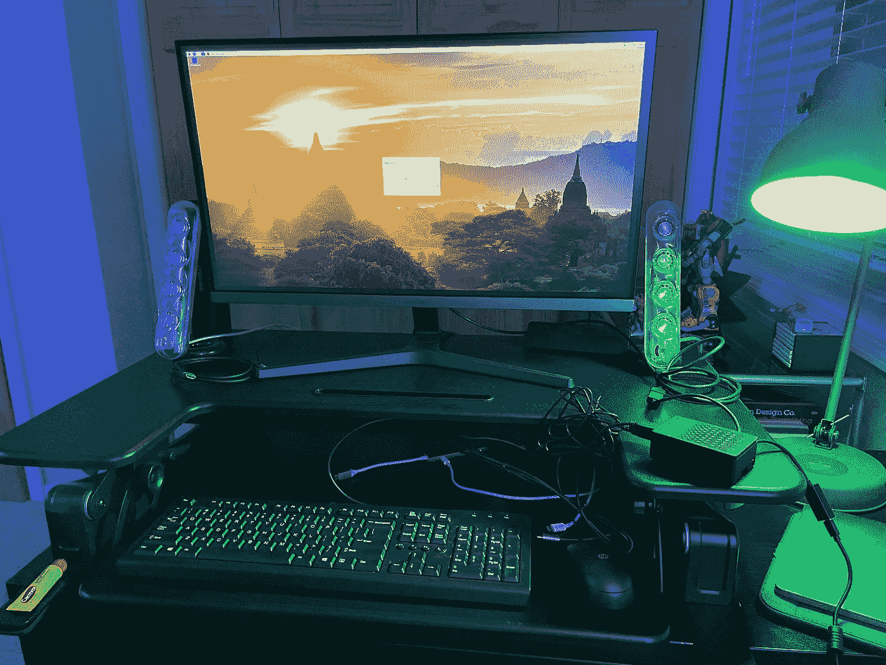
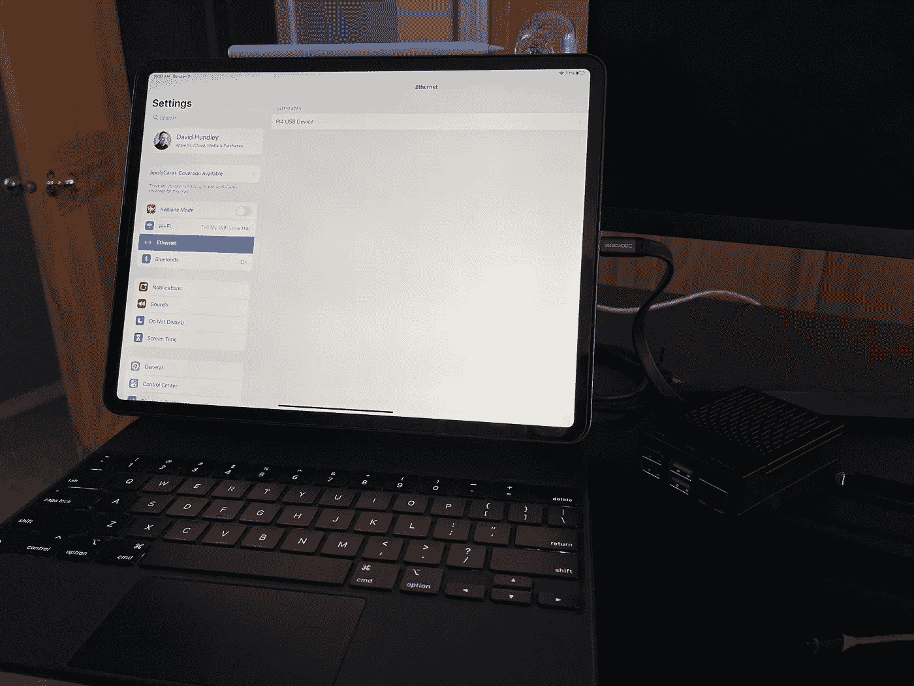
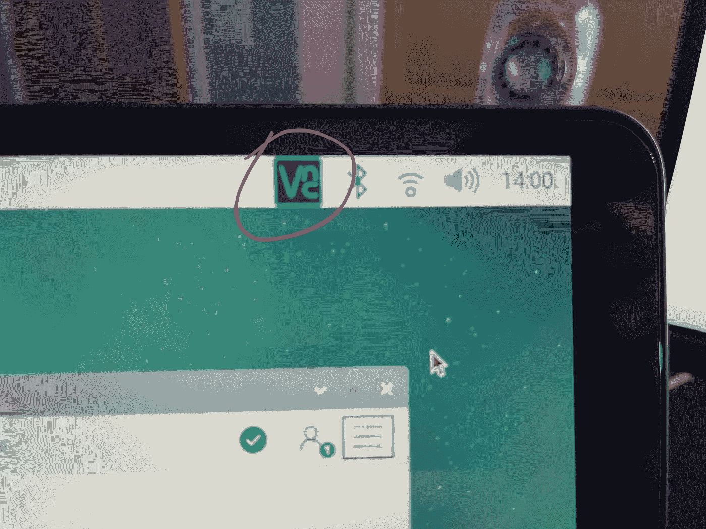
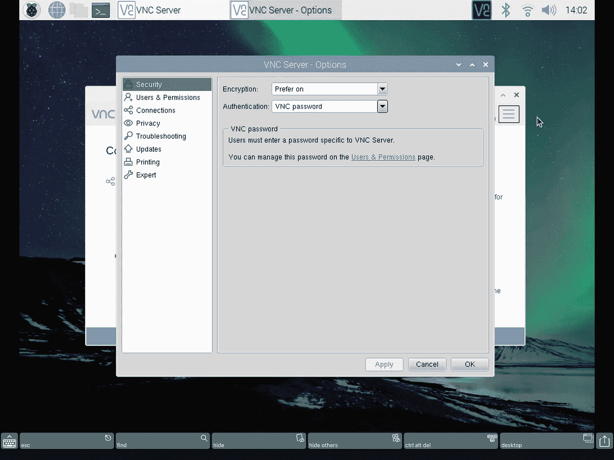
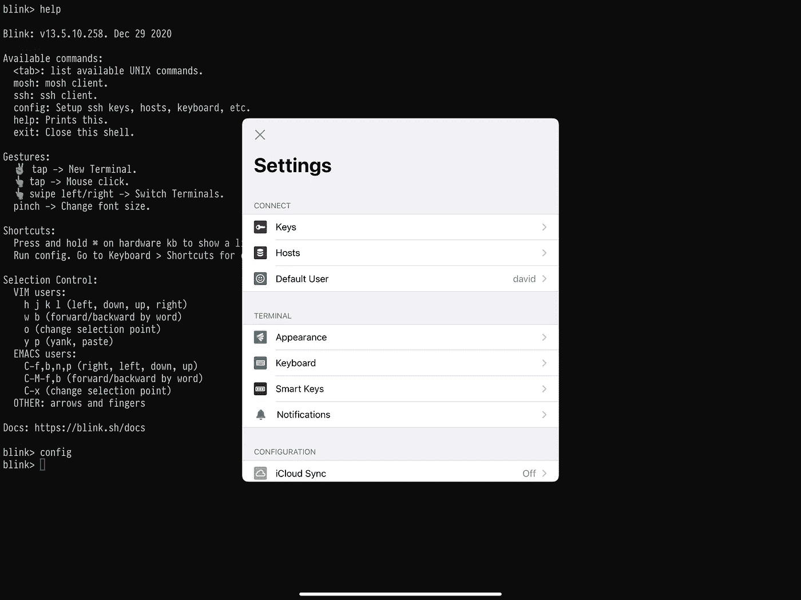
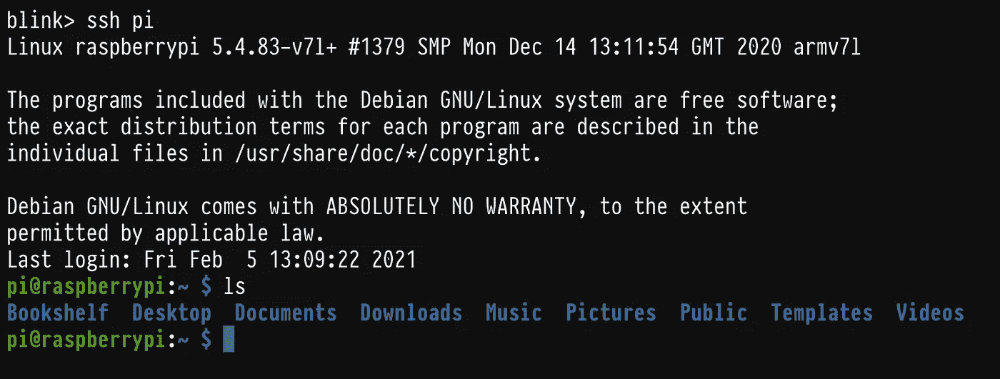
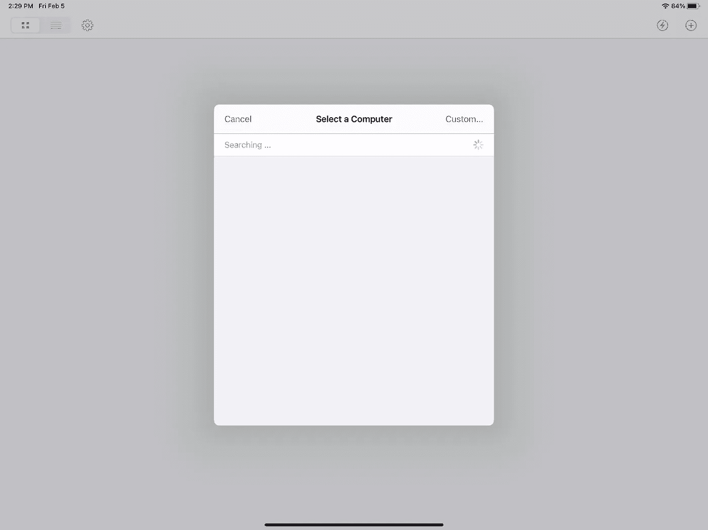
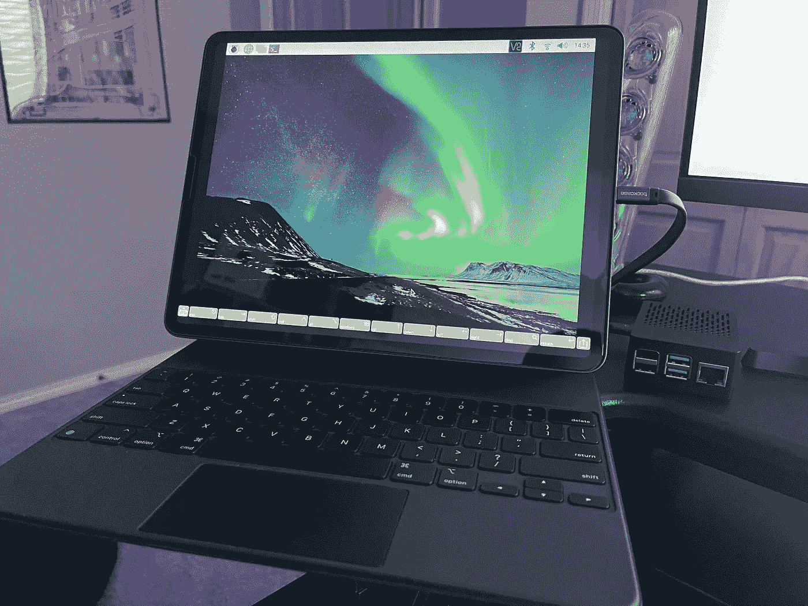

# 用于数据科学的 iPad Pro + Raspberry Pi 第 2 部分:设置硬线连接！

> 原文：<https://towardsdatascience.com/ipad-pro-raspberry-pi-for-data-science-part-2-setting-up-the-hardline-connection-555f939c29c2?source=collection_archive---------9----------------------->


## 树莓派+ iPad

## 带您完成设置，让 iPad Pro 和 Raspberry Pi 通过 USB-C 硬线连接相互对话

朋友们，又见面了！在我们系列的下一篇文章中，我们将把树莓 Pi 用作 iPad Pro 的“计算 DS 附件”。如果你错过了第一篇文章，请通过下面的链接查看，因为这篇文章将建立在第一篇文章的基础上:

*   [第 1 部分:首次操作系统初始化！](https://dkhundley.medium.com/ipad-pro-raspberry-pi-for-data-science-part-1-first-time-os-initialization-854371dc9201)

在我们第一篇文章的结尾，我们刚刚初始化了 Raspberry Pi 的操作系统，并使用了硬连线的显示器/键盘/鼠标。您的设置目前可能如下所示:



作者捕获的图像

在这篇文章的最后，我们将让你的 iPad Pro 通过一根直接的硬线 USB-C 电缆与你的 Raspberry Pi 交谈，你将不再需要硬连线的显示器/键盘/鼠标组合。您将能够以两种不同的方式从 iPad 与 Raspberry Pi 交互:通过命令行的 SSH 连接和作为虚拟显示。

公平的警告:这篇文章将会是最长和最麻烦的。我特意清除了我自己的树莓派，并重新创建了这里的所有步骤，只是为了确保您在这里没有任何问题。请务必仔细阅读每一步，我相信你会做得很好。

好了，让我们开始吧！

# Raspberry Pi 网络配置

在这篇文章的第一部分，我们需要使用我们的显示器/键盘/鼠标组合来直接与 Raspberry Pi 交互，并正确配置文件，以便它可以很好地连接到 iPad。我们在很大程度上是在[这篇文章的基础上发展起来的](https://www.hardill.me.uk/wordpress/2019/11/02/pi4-usb-c-gadget/)，所以要特别感谢本·哈迪尔为我们开辟了这条道路！

(注意:本文假设您知道如何使用基本的 Linux 命令进行必要的调整。如果这是你不熟悉的东西，我可以推荐这个免费的在线课程来帮助你入门。)

这些步骤是直接从本的超级便利的帖子中摘录的。我个人使用`sudo nano`直接从命令行修改文件。欢迎您以您最熟悉的方式进行调整。

*   将`dtoverlay=dwc2`添加到文件`/boot/config.txt`的最后
*   将`modules-load=dwc2`添加到文件`/boot/cmdline.txt`的最后
*   在`/boot`目录中创建一个名为`ssh`的空文件(我是使用命令`sudo touch ssh`完成的)
*   将`libcomposite`添加到文件`/etc/modules`的末尾
*   将`denyinterfaces usb0` (usb zero，而非“O”)添加到文件`/etc/dhcpcd.conf`的最后
*   使用下面的命令安装`dnsmasq`:`sudo apt-get install dnsmasq`(在这个过程中，它会要求你点击“Y”来确认安装。)
*   在目录`/etc/dnsmasq.d`下创建一个名为`usb`的新文件，并填入以下内容:

```
interface=usb0
dhcp-range=10.55.0.2,10.55.0.6,255.255.255.248,1h
dhcp-option=3
leasefile-ro
```

*   在目录`/etc/network/interfaces.d/`下创建一个名为`usb0`的新文件，并填入以下内容:

```
auto usb0
allow-hotplug usb0
iface usb0 inet static
  address 10.55.0.1
  netmask 255.255.255.248
```

*   在`/root/`目录下，创建一个名为`usb.sh`的新文件，并用以下内容填充它:(注意:三次检查你得到的都是正确的。这是我个人因为愚蠢的错误而犯错最多的地方。为了确保万无一失，我可能会推荐从本·哈迪尔的网站上复制/粘贴这个脚本。)

```
#!/bin/bash
cd /sys/kernel/config/usb_gadget
mkdir -p pi4
cd pi4
echo 0x1d6b > idVendor # Linux Foundation
echo 0x0104 > idProduct # Multifunction Composite Gadget
echo 0x0100 > bcdDevice # v1.0.0
echo 0x0200 > bcdUSB # USB2
echo 0xEF > bDeviceClass
echo 0x02 > bDeviceProtocol
mkdir -p strings/0x409
echo "fedcba9876543211" > strings/0x409/serialnumber
echo "David Hundley" > strings/0x409/manufacturer
echo "PI4 USB Device" > strings/0x409/product
mkdir -p configs/c.1/strings/0x409
echo "Config 1: ECM network" > configs/c.1/strings/0x409/configuration
echo 250 > config/c.1/MaxPower
mkdir -p functions/ecm.usb0
HOST="00:dc:c8:f7:75:14" # "HostPC"
SELF="00:dd:dc:eb:6d:a1" # "BadUSB"
echo $HOST > functions/ecm.usb0/host_addr
echo $SELF > functions/ecm.usb0/dev_addr
ln -s functions/ecm.usb0 configs/c.1/
udevadm settle -t 5 || :
ls /sys/class/udc > UDC
ifup usb0
service dnsmasq restart
```

*   使用下面的命令使`/root/usb.sh`成为我们刚刚创建的可执行文件:`sudo chmod +x /root/usb.sh`
*   在文件`/etc/rc.local`中，在显示`exit 0`的行之前添加行`/root/usb.sh`

唷！这无疑是本教程中最难的部分。如果一切顺利，你现在应该可以将 Raspberry Pi 直接插入 iPad，并在设置中将 Raspberry Pi 识别为以太网设备。这是我的 iPad 目前的样子:



作者捕获的图像

好了，我们几乎完成了显示器/键盘/鼠标的组合，但是在我们可以单独使用 iPad 之前，我们还需要做最后一件事。

# Raspberry Pi 虚拟机和显示设置

在本文的最后一部分，我们将在 iPad 上使用一个特定的应用程序来连接 Pi，就像它是一个虚拟机一样，为了正确使用它，我们必须再做一些额外的调整，以便虚拟机显示可以在应用程序中正确显示。

首先，我们需要在 Raspberry Pi 配置设置中手动设置 Pi 的分辨率。这样做的原因是 Pi 应该为您动态地选择它，但是出于一些奇怪的原因，它没有显示在我们将使用的 VM iPad 应用程序中。(你只是得到这个奇怪的“显示器无法显示”的信息。)为了将屏幕分辨率设置为特定设置，您需要遵循以下说明:

*   运行命令`sudo raspi-config`，这将显示一个基本的 UI
*   导航至`Display Options`，然后导航至`Resolution`
*   选择分辨率`DMT Mode 83 1600x900 60Hz 16:9`(老实说，我肯定别人也行；这只是我碰巧选的一款，而且效果很好。)

那件作品到此为止。我们需要配置的另一部分是 VNC 连接设置。你可以在右上角的任务栏中找到它。我的看起来像这样:



作者捕获的图像

在这个小界面中，通过点击右上角的“汉堡”图标并选择“选项”来导航到 VNC 设置在“Security”部分，您会注意到“Authentication”方法自动默认为“UNIX password”。我们将把它更改为“VNC 密码”，所以您现在应该会看到类似这样的内容:



作者捕获的屏幕截图

点击“应用”,你就可以开始了。在离开 VNC 连接用户界面之前，记下它在主屏幕上显示的 IP 地址。我的名字碰巧是`10.0.0.74`，如果你的名字也是，我也不会感到惊讶。仅供参考，我在这里分享的这些说明与我们将要使用的应用程序的支持页面上记录的说明是相同的，所以如果您迷路了或我错过了什么，请参考[链接到此处的它们的文档](https://help.edovia.com/hc/en-us/articles/115005376088-Configuring-a-Raspberry-Pi-for-Remote-Access)。

现在，我们终于准备抛弃显示器、键盘和鼠标了！继续关闭您的 Pi，并用 USB-C 电缆将其连接到 iPad。我们将使用各自的虚拟机和命令行应用程序。

# 用于与您的 Pi 交互的 iPad 应用程序

最后，我们期待已久的部分！如果你做到了这一步，你就可以开始在 iPad Pro 上直接使用你的树莓 Pi 了。在最后一个主要部分，我们将介绍两种不同的方式来与您的 Raspberry Pi 交互:一种方式作为命令行界面，另一种方式作为虚拟机显示。你可能更喜欢其中的一个，但是实际上我发现在某些用例中两者都是必要的。

让我们从命令行界面应用程序开始。

## Blink Shell:与您的 Pi 交互的 CLI

对于我们的命令行界面，我们将使用 [Blink Shell 应用程序(19.99 美元)](https://apps.apple.com/us/app/blink-shell-mosh-ssh-client/id1156707581)。这个应用程序被设计成非常好地与 Mosh 和 SSH 客户端集成，我们将使用它作为 SSH 客户端与我们的 Pi 进行交互。

这个应用程序本身非常简单。当你第一次打开它时，你会看到一个熟悉的黑屏和一个简单的命令行界面。为了 SSH 到您的 Pi，您需要执行以下命令:

```
ssh <your_pi_name>@<your_ip_address>
```

如果您遵循我的指示并保持简单，更精确的语法将如下所示:

```
ssh pi@10.55.0.1
```

然后会提示您输入密码，一旦输入正确，您就可以开始了！现在让事情变得更简单，Blink Shell 允许您保存配置设置，以便更快地进入 Pi。为此，输入`config`命令。然后，您会看到一个类似如下的用户界面:



作者捕获的屏幕截图

这包含了 Blink Shell 应用程序的所有设置。要保存您的 SSH 凭证，请导航到“主机”并点击 UI 右上角的`+`按钮。在这里，您需要输入主机名(pi)、主机名(10.55.0.1)和密码。(您可以保留默认端口，在我的例子中是 22。)点击右上角的`Save`，现在你可以开始了。

现在，你只需要在命令行输入`ssh pi`，它就会自动连接到你的 Raspberry Pi。我看起来是这样的:



作者捕获的屏幕截图

就是这样！命令行界面完成！相对于 VM 显示方法，我个人更喜欢使用这种连接到我的 Pi 的方法，但是正如我之前提到的，VM 显示方法确实有它的用途。现在让我们继续进行配置。

## 屏幕:进入您的 Pi 的虚拟机窗口

伙计们，我们现在到了最后阶段。对于最后一部分，你需要下载名为[Screens(19.99 美元)](https://apps.apple.com/us/app/screens/id655890150)的应用程序。说实话，我们可以在这里使用其他免费选项，但它们不提供屏幕所提供的交互性。使用 Screens 应用程序，您可以使用键盘和鼠标光标直接与 Raspberry Pi UI 进行交互，就像它是您的 iPad 自带的一样。不幸的是，免费选项不提供这种程度的交互性。

当你第一次打开应用程序时，你会看到一个简单的空白屏幕。在用户界面的右上角，你会看到一个`+`图标，这将允许我们输入设置以连接到我们的树莓 Pi。点击图标，然后点击“新屏幕”按钮，你会看到这个小界面:



作者捕获的屏幕截图

如果你想知道，它永远不会自动找到我们的 Pi，所以我们需要通过导航到`Custom...`选项来插入我们自己的设置。看到`Screen Settings`界面后，您需要输入以下信息:

*   **名字**:无论你想它是什么，这都没关系
*   **IP 地址**:不管你的 VNC 服务器 IP 地址是什么(我的是 10.55.0.1)
*   **端口**:保持默认值 5900
*   **操作系统**:改为“树莓派”
*   **认证方式**:保留为“VNC 密码”
*   **密码**:您可以在这里保存您的密码，否则每次您尝试登录时它都会提示您输入密码。你的选择；我个人把密码保存在这里。

保存这些设置，我们就正式完成了！现在，你可以点击屏幕用户界面中的适当项目，就像它直接在你的 iPad 上运行一样，与 Raspberry Pi 操作系统界面打招呼。



作者捕获的图像

唷，那是一篇很长的帖子，但我们终于成功了！你现在应该可以通过硬线连接从你的 iPad Pro 直接与你的 Raspberry Pi 连接了！我们已经完成了显示器/键盘/鼠标组合，所以如果你像我一样借了任何东西，你可以把这些东西还给你的朋友，并对他们说谢谢！

但是我们还没有完成。在下一篇文章中，我们将把我们的设置提升到一个新的水平，开始使用一些你会经常用到的数据科学工具。与普通电脑相比，在树莓派上安装东西可能有点不寻常，所以请继续关注下一篇文章。感谢您的阅读，祝您编码愉快！