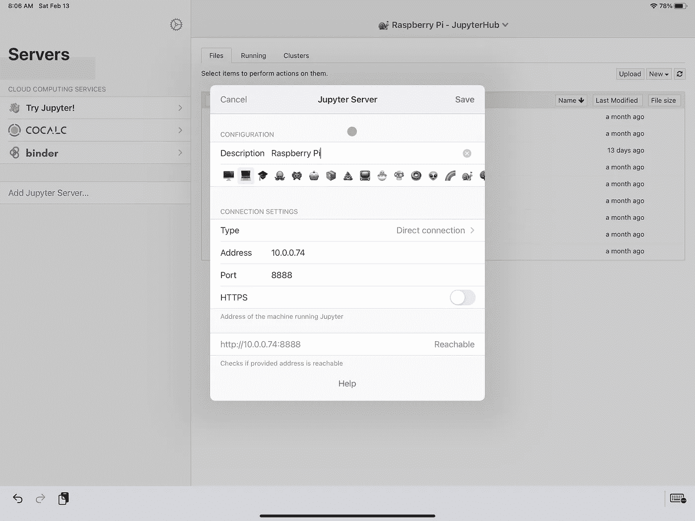

# 用于数据科学的 iPad Pro + Raspberry Pi 第 3 部分:安装我们的数据科学工具

> 原文：<https://towardsdatascience.com/ipad-pro-raspberry-pi-for-data-science-part-3-installing-our-data-science-tools-77d020e485f2?source=collection_archive---------18----------------------->


## 树莓派+ IPAD

## 在你的 Raspberry Pi 上安装从 Docker 到 Git 到 JupyterHub 的工具

欢迎回来，伙计们！我们又回来了，这是我们的第三篇，也可能是最后一篇文章，让树莓 Pi 与 iPad Pro 一起工作，进行数据科学工作。如果到目前为止你一直在跟进，那么你已经能够通过 USB-C 到 USB-C 的直接连接将 Raspberry Pi 连接到你的 iPad Pro。如果你错过了让我们走到这一步的前两个帖子，它们又出现了:

*   [第 1 部分:首次操作系统初始化！](https://dkhundley.medium.com/ipad-pro-raspberry-pi-for-data-science-part-1-first-time-os-initialization-854371dc9201)
*   第 2 部分:设置硬线连接！

在本帖中，我们将介绍如何将所有数据科学工具正确安装到 Pi 上。如果你不知道，树莓派的 CPU 使用 ARM 架构，而其他许多现代计算机使用 x86 架构。不要担心，你不需要知道这些到底是什么意思，但它是说安装一些东西可以有点不寻常。

好了，我们有很多内容要讲，所以让我们开始吧，进入我们的第一个工具:熊猫。

# 熊猫

在大多数情况下，您可能熟悉使用类似`pip install pandas`的命令从 PyPi 下载 Python 库。好消息是`pip`仍然适用于许多 Python 库；坏消息是，奇怪的是，它对其他一些工具不起作用。由于 Pandas 是数据科学家工具箱中最重要的工具之一，我认为提出这种替代的安装方式是很重要的。

为了让我们的熊猫下载到 Pi，我们将使用`apt`。如果你不熟悉的话，这是在基于 Linux 的机器上安装软件的一种常见方式。(APT 代表“高级打包工具”。)为了在您的 Pi 上正确安装 Pandas，您需要做的就是在您的 CLI 中运行以下命令

`sudo apt install python3-pandas`

就是这样！你现在可以用熊猫了。我们的下一个工具！

# Git / GitHub

如果您像我和大多数其他数据科学家一样，那么您很可能正在使用某种形式的 Git 来执行版本控制和与队友的代码集成。在我的日常工作中，我使用 Git 和 GitLab，对于我的个人工作，我使用 Git 和 GitHub。如果你像我一样，你也可能使用 GitHub 来展示你的个人作品。也就是说，我们将安装 git，并“git”您的 Git 与您的个人 GitHub 帐户一起工作。(你喜欢我的双关语吗？)

为了安装 git 本身，`apt`再次拯救了我们。你需要做的就是运行下面的命令:`sudo apt install git`。这就是我们安装 Git 所需要做的一切。在开始将 git 连接到 GitHub 之前，让我们首先设置 Git 配置设置。运行以下命令分别设置您的姓名和电子邮件:

```
git config --global user.name "Your Name"
git config --global user.email "your_email@yourdomain.com"
```

好了，现在我们准备好将 Git 连接到 GitHub。这将比我们到目前为止所做的要复杂一些，所以请小心遵循下面过程中的每一步。实际上，你可以在 GitHub 的官方文档中找到几乎所有这些相同的步骤，但是我将在这里继续讲述，因为官方文档并不完全是线性的。(如果你和我用的是同一个屏幕应用程序，有一件事很特别。)

在下面的步骤中，我们将执行这三个高级操作:生成一个新的 ssh 密钥，将 SSH 密钥添加到 ssh-agent，以及将 SSH 密钥添加到 GitHub。

## 生成新的 SSH 密钥

自从我这么做已经有一段时间了，我真的不记得 SSH 密钥是否已经成为你的 Raspberry Pi 操作系统初始化的标准了。在任何情况下，我们将继续前进，并创建一个新的，使我们自己的东西相似。以下是实现这一目标的步骤:

1.  打开您的 CLI。(如果你遵循了我上一篇文章中的步骤，这将是你的 Blink Shell 应用程序。)
2.  通过运行以下命令创建一个新的 SSH 密钥，替换掉您自己的 GitHub 电子邮件:
    `ssh-keygen -t ed25519 -C "your_email@yourdomain.com"`
3.  当你点击“回车”时，它会要求你“输入一个保存密钥的文件”。如果您不输入任何内容，它将进入默认位置。我们对它转到默认位置没有意见，所以不要输入任何内容，继续操作并再次点击“enter”。
4.  输入两次您希望用于 SSH 的密码，这就完成了这篇文章！

## 向 ssh 代理添加 SSH 密钥

现在已经创建了 SSH 密钥，我们需要将 SSH 密钥添加到 ssh-agent 中。这是一个非常简单的过程，可以分为两步:

1.  使用以下命令在后台启动 ssh-agent:`eval "(ssh-agent -s)"`
2.  通过运行下面的命令，将新的 SSH 私有密钥添加到 ssh-agent 中。请注意，如果您按照上面的建议选择了默认位置，下面的命令将正常运行。如果没有，您可能需要做一些小的调整，以确保您的 ssh-agent 获得正确的密钥。
    `ssh-add ~/.ssh/id_ed25519`

## 将 SSH 密钥添加到 GitHub

我们就快到了！这就是事情变得有点奇怪的地方，因为我们使用 iPad 连接到我们的 Pi。只有在我们上一步安装了 Screens 应用程序的情况下，这些步骤才有意义。遗憾的是，在最后一部分，我们不能只使用 CLI (Blink Shell ),因为我们将使用 iPad 的 web 浏览器来输入这些 SSH 凭证。

1.我们将使用一个名为`xclip`的小工具将 SSH 公钥文件的内容复制到剪贴板。为了安装这个，我们将再次使用我们的老朋友 apt:`sudo apt install xclip`

2.如果你还没有，现在是时候启动屏幕应用程序了。这样做的原因是因为`xclip`工具将 SSH 密钥文件的内容复制到 Raspberry Pi 的剪贴板，而不是 iPad 本身的剪贴板。幸运的是，Screens 应用程序允许我们在 iPad 和 Pi 之间来回传输剪贴板内容。

3.在您的 Raspberry Pi 界面中打开终端。为了确保我们在同一页上，这是我现在看到的:


作者捕获的图像

4.运行以下命令将您的 SSH 密钥复制到 Raspberry Pi 剪贴板:`xclip -selection clipboard < ~/.ssh/id_ed25519.pub`

5.为了继续在 iPad 上直接使用 SSH 密钥，我们需要将 Raspberry Pi 剪贴板的内容转移到 iPad 的剪贴板上。这在屏幕上非常容易做到。在屏幕 UI 的右下角，您会看到一个带有向上箭头的小方块。单击它，然后单击“获取剪贴板”选项。现在你的 SSH 密钥将会出现在你的 iPad 的剪贴板上！


作者捕获的屏幕截图

6.打开您最喜欢的浏览器，导航到您的个人 GitHub 帐户。

7.通过点击用户界面右上角的个人资料照片图标，然后点击“设置”,导航至您的帐户设置


作者捕获的屏幕截图

8.在左侧导航菜单中，点击“SSH 和 GPG 键”

9.单击绿色的“添加新的 SSH 密钥”按钮。

10.你现在应该可以看到下面截图中的用户界面。从你的剪贴板粘贴密钥，并给密钥起一个你喜欢的名字。我刚喝了一杯叫“树莓派”的。


作者捕获的屏幕截图

11.点击绿色的“添加 SSH 密钥”按钮，我们就完成了！

恭喜你。您现在可以从您的 Raspberry Pi 与您的个人 GitHub 进行交互了！

# 码头工人

我个人经常使用 Docker 图像，所以我对在 iPad 上进行数据科学研究的最大抱怨之一是，真的没有办法在本机上构建或使用 Docker 图像。虽然 Pythonista 是一个为直接使用 Python 提供了很好的界面的应用程序，但是没有专门的应用程序来构建 Docker 图像。(而且是的，我明白这是为什么。那不会阻止我对此感到不安。)

像我们的其他工具一样，在 Raspberry Pi 上安装 Docker 是非传统的，但幸运的是它不像其他一些东西那么复杂。再次感谢 Sofija Simic 在本网站[提供这些指导](https://phoenixnap.com/kb/docker-on-raspberry-pi)。

1.  通过运行以下命令，确保我们运行的是最新的版本:`sudo apt-get update && sudo apt-get upgrade`
2.  通过运行以下命令从 Docker 的官方网站下载安装脚本:`curl -fsSL [https://get.docker.com](https://get.docker.com) -o get-docker.sh`
3.  执行你刚刚下载的脚本:`sudo sh get-docker.sh`
4.  通过运行以下命令`sudo usermod -aG docker [user_name]`将您的 Pi 用户添加到 Docker 组(注意:如果您在初始化您的 Raspberry Pi 时保留了默认用户设置，您的用户名将是“Pi”。)

就是这样！如果你想确保一切运行正常，我会运行“hello-world”容器(`sudo docker run hello-world`)，看看你是否得到了正确的输出。我们已经准备好进入我们最后的，也许是最有趣的工具:JupyterHub。

# 朱庇特枢纽

你可能用过 Jupyter 笔记本或者 JupyterLab，但是你可能不熟悉 JupyterHub。JupyterHub 在创建合法的发现环境方面更上一层楼。这是因为 JupyterHub 允许多个用户、多个计算资源和多个数据源聚集在一个屋檐下。它非常棒，我们实际上在我的财富 50 强公司的日常工作中使用 JupyterHub。

所以你可能会想，为什么我们要在小小的树莓派上启用这种“企业级”的东西呢？我有两个原因，你可能不在乎其中一个，但肯定会在乎另一个。您可能不关心的一点是支持多用户。但另一个更重要的原因是，我们将设置 JupyterHub 在 Pi 启动时立即启动，我们将能够从我们的 iPad 立即连接到它，而不必启动任何特殊的启动命令。

再次感谢 Gerold Busch 为我的这一部分提供了基础。让我们开始在您的 Pi 上启用 JupyterHub！(注意:我不会在这篇文章中讨论用户管理，但是如果你对此感兴趣，Gerold 的文章在这方面做得很好。)

我们将在这里讨论两个最重要的话题。第一个是在您的 Raspberry Pi 上启用 JupyterHub 的自动启动，第二个将向您展示如何直接从您的 iPad 上快速使用 JupyterHub。

## 在您的 Pi 上安装 JupyterHub

1.如果您还没有，请确保您已经准备好了所有的 Python 配置设置。如果到目前为止您一直在关注这个系列，那么您可以跳到下一步。否则，您需要运行以下命令:

```
sudo rm /usr/bin/python
sudo ln -s /usr/bin/python3 /usr/bin/python
sudo apt-get update
sudo apt-get install python3-pip
sudo pip3 install --upgrade pip
```

2.为了配置一个允许 JupyterHub 正确接收用户的代理，我们需要安装 NPM(节点包管理器)和另一个叫做`configurable-http-proxy`的工具。我们可以通过运行以下命令来安装它们:

```
sudo apt-get install npm
sudo npm install -g configurable-http-proxy
```

3.我们现在需要安装来自 PyPi 的 Jupyter 笔记本和 JupyterHub。我们可以通过一个简单的命令来实现:

```
sudo -H pip3 install notebook jupyterhub
```

4.JupyterHub 使用基于 Python 的配置文件来存储 JupyterHub 的设置。为了正确使用它，我们需要首先生成它，然后将它移动到`/root`目录中。我们可以使用以下命令来实现这一点:

```
jupyterhub --generate-config
sudo mv jupyterhub_config.py /root
```

5.我们现在需要编辑刚刚创建的配置文件中的`bind_url`。我们将它设置为端口 8888，但不一定非要这样。为此，运行命令`sudo nano /root/jupyterhub_config.py`。然后，我们需要取消注释并使用此信息更新以下行:

```
c.JupyterHub.bind_url = 'http://:8888'
```

6.好了，我们的 JupyterHub 初创企业的基本行为现在可以开始了。现在我们只需要让我们的 Raspberry Pi 在 OS 启动时启动 JupyterHub。为此，我们首先需要在`systemd`中创建一个新文件。为了启动这个过程，运行下面的命令:`sudo nano /lib/systemd/system/jupyterhub.service.`

7.用以下信息填充这个新文件:

```
[Unit]
Description=JupyterHub Service
After=multi-user.target[Service]
User=root
ExecStart=/usr/local/bin/jupyterhub --config=/root/jupyterhub_config.py
Restart=on-failure[Install]
WantedBy=multi-user.target
```

8.运行下面的命令，让一切井然有序，并启动和运行 JupyterHub:

```
sudo systemctl daemon-reload 
sudo systemctl start jupyterhub 
sudo systemctl enable jupyterhub 
sudo systemctl status jupyterhub.service
```

## 在 iPad 上使用 JupyterHub

如果您将我的帖子与 Gerold 的原始帖子进行比较，您会注意到我忽略了将 JupyterLab 作为 JupyterHub 实例的默认接口。这并不是因为我不喜欢 Lab，而是因为它不能与 Juno Connect 一起工作，Juno Connect 是我们用来连接 JupyterHub 的应用程序。

说到 Juno Connect，您可能还记得我在以前的一篇文章中推荐使用 Juno 作为 Jupyter 接口。Juno 和[Juno Connect(9.99 美元)](https://apps.apple.com/us/app/juno-connect/id1315744137)由同一家公司制造，但区别在于 Juno 被设计为在 iPad 上本地工作，而 Juno Connect 仅用于与远程服务器一起工作。我真的很喜欢原生的 Juno，但是它有一点限制，因为您只能使用纯 Python 库。(还是那句话，原生 iPad 的另一个局限。)Juno Connect 将使用 Raspberry Pi 的计算资源，因此我们不会受到本地 Juno 的限制。它们都有自己的用例，所以我个人都安装了。

抱歉，如果最后一段有点风的话。让我们开始设置 Juno 连接您的 Pi。你只需要打开应用程序，点击“添加 Jupyter 服务器”如果到目前为止您已经完成了本系列，您将能够使用这些设置填写服务器信息:



作者捕获的屏幕截图

点击“保存”,你就可以开始了！如果您现在导航到您的任何一台笔记本电脑，您将看到与您熟悉的基本 Juno 应用程序相同的用户界面。我的设置现在看起来是这样的:


作者捕获的图像

这种工作方式最酷的一点是，您不仅限于与 Juno Connect 甚至 iPad 进行交互。如果你喜欢更自然的体验，你可以在普通的浏览器中直接用你的 IP 地址连接到 JupyterHub。我在我的 iPhone 上测试了同一个 IP 地址——它根本没有直接连接到 Pi——你瞧，它工作了！(虽然这将是一个可怕的工作方式！)


作者捕获的图像

这篇文章到此结束！我确信我们还可以添加更多的工具，但我认为这已经足够让您开始使用了。我不确定这个系列是否会有另外一个帖子。我目前正在寻找方法来启用一个小型 Kubernetes 集群，只是为了学习，但是我目前正在努力启用它。如果我能让它工作，我会写另一篇文章。但就算我不再写“树莓 Pi + iPad”的帖子，我也一定会多写一些数据科学的帖子。敬请关注，再次感谢您的阅读！