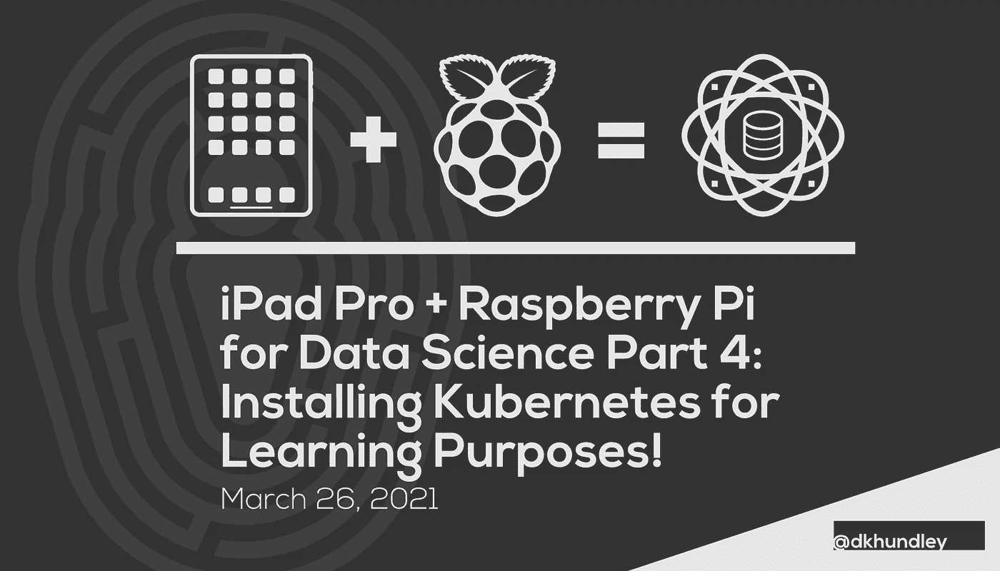

# 用于数据科学的 iPad Pro + Raspberry Pi 第 4 部分:为学习目的安装 Kubernetes

> 原文：<https://towardsdatascience.com/ipad-pro-raspberry-pi-for-data-science-part-4-installing-kubernetes-for-learning-eb7f8ac31198?source=collection_archive---------17----------------------->



## 树莓派+ iPad Pro

## 教你如何在你的树莓派上安装 Kubernetes 来展示新的学习理念

你好，朋友们！我们再次回到我们系列的第四部分，让树莓派直接与 iPad Pro 配合使用。如果你一直在关注，你会记得我不确定我会写第四篇文章。我已经花了几个星期的时间在这个特定的帖子上，因为，老实说，让它工作起来是一场斗争。在我们开始讨论为什么我要写第四篇文章之前，我想鼓励新读者看看之前的三篇文章:

*   第 1 部分:首次操作系统初始化！
*   [第 2 部分:建立硬线连接！](/ipad-pro-raspberry-pi-for-data-science-part-2-setting-up-the-hardline-connection-555f939c29c2)
*   [第 3 部分:安装我们的数据科学工具！](/ipad-pro-raspberry-pi-for-data-science-part-3-installing-our-data-science-tools-77d020e485f2)

作为一名机器学习工程师，我日常工作的主要职责是与我们的数据科学家合作，生产他们构建的机器学习解决方案，以便与我们的其他企业级系统进行适当的交互。当然，执行这项工作的部署环境不止一个，但是最近出现的最流行的一个是 Kubernetes。当谈到我的日常工作时，我要么在内部 Kubernetes 集群上工作，要么使用像 SageMaker 这样的 AWS 服务。

也就是说，我喜欢在沙盒空间中测试我的新实验，以免影响生产中运行的任何东西。说到我的个人设置，我一直在一个名为 Minikube 的工具的帮助下，在我的个人 MacBook Pro 上运行单节点 Kubernetes 集群。Minikube 已经很棒了，但不幸的是它不能与树莓 Pi 一起工作。这是因为 Raspberry Pi 使用基于 ARM 的 CPU 架构，不幸的是，目前还没有一款 Minikube 支持这种架构。

但是不用担心！我发现了一个不同的解决方案，叫做 K3s，我们将在这篇文章中启用它。如果你不知道，Kubernetes 经常被缩写为“k8s”，这是因为在 Kubernetes 的“k”和“s”之间有 8 个字符。我不能肯定地说这一点，但我不得不猜测 K3s 的命名方式，因为它是一个更轻量级版本的 Kubernetes。我不知道我是否会将它推荐给一个完整的企业级生产系统，但作为一个测试新想法的沙盒空间——就像在我们的 Raspberry Pi 上——K3s 肯定能完成任务。

在开始安装 K3s 之前，我应该注意到这篇文章不会涉及任何关于使用 Kubernetes 的“操作方法”。即使你从未使用过 Kubernetes，你也一定可以继续关注这篇文章，但是我们不会在这篇文章中讨论任何类型的机器学习部署模式。但请继续关注，因为我还有一些其他的帖子将在 Kubernetes 上演示，我个人将使用我的 iPad/Raspberry Pi 组合来执行这项工作。

好了，让我们开始安装吧！

# K3s 初始安装

好的，在我们进入实际安装之前，我们需要做一件简单的事情。您需要在`/boot/cmdline.txt`文件中添加一些东西。将这些项目添加到该文件的末尾，与其他项目位于同一行:

```
cgroup_enable=cpuset cgroup_memory=1 cgroup_enable=memory
```

重启你的 Pi，现在我们可以继续了！

K3s 在你的 Raspberry Pi 上的实际安装非常简单，尽管在我最终弄清楚我需要做什么之后才变得简单。您只需运行以下命令:

```
curl -sfL [https://get.k3s.io](https://get.k3s.io) | sh -s - --write-kubeconfig-mode 644
```

这个命令做了几件事。正如你可能从这里的`curl`命令中知道的，我们首先从 K3s 网站下载适当的文件，然后用从下载中得到的 shell 脚本安装组件。我第一次做的时候没有注意到的是`--write-kubeconfig-mode`命令。这个 Kubernetes 部署的独特之处在于，K3s 使用一个特定的`k3s.yaml`文件进行配置设置。如果你不运行带有`644`值的标志，K3s 将不能识别那个文件，你基本上不能使用 Kubernetes。

完成安装需要一点时间，但是一旦完成，您应该能够运行下面的命令并看到某种成功消息:`sudo systemctl status k3s`。除了启动 Kubernetes 集群本身，K3s 安装脚本还会做一些其他的事情。首先，它将创建一个额外的 shell 脚本来轻松卸载 K3s。如果您遇到任何问题，并且需要从头开始，运行以下命令将完全清除您的 Pi 中的 K3s:

```
bash /usr/local/bin/k3s-uninstall.sh
```

K3s 安装做的第二件事是它会为你安装`kubectl`命令行工具，这非常方便。如果你不熟悉那是什么，`kubectl`是我们用来与 Kubernetes 环境交互的主要工具。当在 Kubernetes 集群中安装东西、检查东西的状态等等时，您将使用`kubectl`来执行所有这些命令。

好了，尽管我们已经启动并运行了基线 Kubernetes 集群，但是还需要做一些事情来设置我们的理想配置。让我们继续设置一种方法，将本地存储用于持久性卷。

# 为永久卷设置本地存储

如果您以前没有使用过 Kubernetes，您将会了解到，Kubernetes 计算资源(例如 pods)默认使用临时存储。Kubernetes 的伟大之处在于，如果某个资源由于某种原因而死亡(比如从集群断开电源)，它会在可能的时候重建该资源。坏消息是，由于 pod 存储的短暂性，您将丢失存储后创建的任何新数据。

当然，Kubernetes 有一个机制来保护我们。Kubernetes 允许我们在被称为“持久卷”或简称为 PV 的存储设备中使用广泛的存储设备。有了实例化的 PV，Kubernetes 部署就可以以持久卷声明(简称 PVC)的形式使用 PV 的一小部分。

对于我们的实验目的，我们可以通过我们的 Raspberry Pi 利用我们的 microSD 卡上的存储，只需进行一点额外的配置。当然，这取决于你的 microSD 卡的大小。我个人使用的是 200GB 的 microSD 卡，所以我有足够的空间来使用这种模式。如果您使用的是容量较小的卡，您可能不想为您的 PV 启用本地存储。

注意到这一点，K3s 的制造商——Rancher——创建了一个小脚本，使您能够非常容易地使用您的本地存储。您只需运行以下命令:

```
kubectl apply -f https://raw.githubusercontent.com/rancher/local-path-provisioner/master/deploy/local-path-storage.yaml
```

就是这样！现在，您可以通过 K3s 使用您的本地存储。如果你想进一步测试，Rancher 在他们的 GitHub 页面上提供了一些很棒的说明和演示材料。你可以在这个链接找到那个[。](https://github.com/rancher/local-path-provisioner/blob/master/README.md#usage)

至此，在结束这篇文章之前，我们还有最后一部分要讲，这肯定是你会感兴趣的一部分。让 K3s 列车继续前行吧！

# 利用自定义 Docker 图像

所以我真的不知道这是为什么，但默认情况下，K3s 不能使用自定义的 Docker 图像。如果您找到一个发布到 Docker Hub 的，您就可以使用这些现成的，但是如果您使用自己的本地映像进行本地测试，这确实需要一点额外的步骤。(说实话，我觉得可能有更好的方法来做这件事，但我还没有想出来。如果有，我会回来更新这篇文章。)

为了使用你自己的自定义镜像，你必须压缩你的 Docker 版本并使用 K3s 命令行，以便在你的 K3s 部署中使用它们。以下是实现这一点的步骤:

*   使用标准的`docker build`命令构建您的容器。
*   将构建的 Docker 图像保存为 TAR 文件。Docker 天生就有这种能力，您可以通过运行这个命令来启动它:`docker save --output YOUR_IMAGE.tar NAME_OF_YOUR_DOCKER_IMAGE:latest`。(如果您使用不同的标签，请将其替换为最新的。)
*   使用 K3s CLI 将目标映像复制到 K3s。这里有一个如何做到这一点的例子:`sudo k3s ctr images import YOUR_IMAGE.tar`。

坦率地说，每次更新图像时，这都是一件令人头疼的事情，所以我建议您构建一个小的 shell 脚本来实现自动化。[这里有一个例子](https://github.com/dkhundley/celery-flask-redis/blob/main/build_images.sh)，我是如何在我的另一个个人项目中做到这一点的。

朋友们，这就是我们这篇文章的结尾！如果我找到更好的方法来做上面的任何事情，我一定会用更好的内容更新这篇文章。否则，你应该很乐意在你的树莓派上搭配 K3s！正如我的 Pi 上的其他数据科学工具一样，我发现启用这种模式有很多价值。事实上，整篇文章，从标题图片到正文内容再到代码片段，都是在我的 iPad 上写的。所以你知道，当我说这种模式有效并且很棒的时候，我是认真的。😃