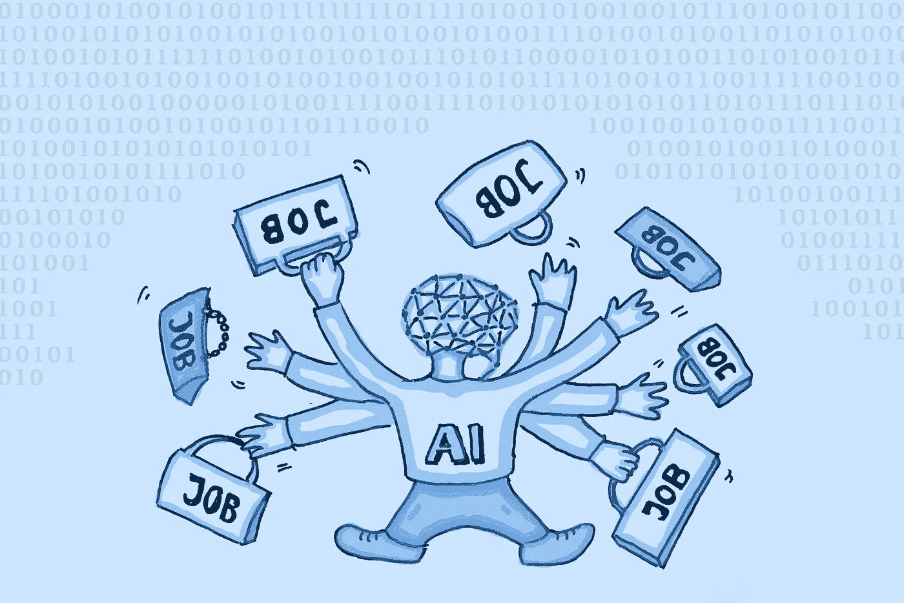
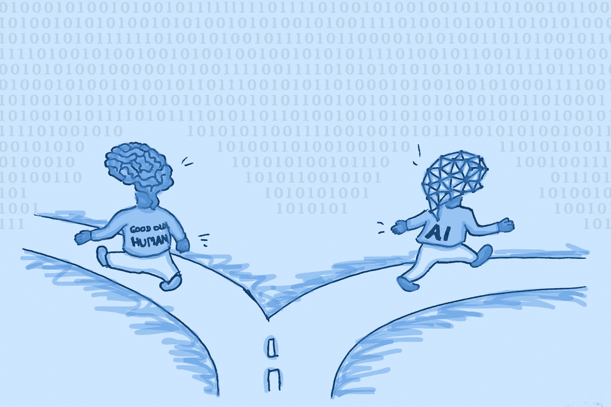

# 艾是来找你工作的吗？

> 原文：<https://towardsdatascience.com/is-ai-coming-for-your-job-2f593ab72b55?source=collection_archive---------22----------------------->

## [意见](https://towardsdatascience.com/tagged/opinion)

## 矛盾的是，用人工智能取代工人创造了对更多工人的需求

AI 正在抢走很多工作。但它也创造了新的。作者图片

自大规模工业化开始以来，自动化导致了大规模、广泛的失业。当汽车工业用机器人取代大量人类时，像 T2、底特律和 T3 这样的城市成了受害者。今天，许多受灾最严重的地方几乎看不到过去繁华和繁荣的影子。

给经济增加机器人会取代工人。[芝加哥大学的一项研究](https://www.journals.uchicago.edu/doi/full/10.1086/705716)发现，每 1000 名工人增加一台机器会导致就业率下降至少 0.18%。这听起来可能不多，但在美国这样大的国家，这相当于大约 50 万人失业。这相当于一个中等城市的工人没有工作。

这些工人面临着直接的危机，因为他们不得不寻找新的工作，甚至可能是全新的领域。他们的失业还会对更广泛的经济产生下游影响，因为他们在失业期间会削减支出。失业影响到每个参与经济的人。

随着第四次[工业革命](https://www.weforum.org/agenda/2016/01/the-fourth-industrial-revolution-what-it-means-and-how-to-respond/)的全面爆发，这种恐惧再次显而易见。人工智能有潜力自动化甚至非常复杂的任务，更不用说简单和重复的任务了。只有在你考虑社会后果之前，这种节省劳动力的潜力听起来才是伟大的。没有一个城市想在破产和衰落中狼狈收场。没有人愿意失去他们的生计，尽管他们工作的某些部分可能是枯燥和重复的。

但是消息并不都是坏的。如果没有汽车工业中的机器人，像通用汽车或特斯拉这样的公司制造的创新产品甚至不会存在于我们最疯狂的梦想中。没有科技工厂里的机器人，你正在阅读这篇文章的设备也不会存在。如果没有基于人工智能的推荐算法，你可能永远不会偶然发现这篇文章。

像底特律衰落这样的故事令人心痛。但有理由相信，在人工智能推动的革命方面，历史不会重演。

 [## 为什么 Python 不是未来的编程语言

### 尽管未来几年对它的需求量会很大

towardsdatascience.com](/why-python-is-not-the-programming-language-of-the-future-30ddc5339b66) 

# 采用机器人的公司雇佣更多的工人

在宏观经济层面，逻辑似乎很简单:如果人工智能让工人过时，那么采用它将导致失业率上升。乍一看，法国的一项研究证实了这种怀疑。作者发现，在一个给定的行业中，机器人增加 20%会导致该行业的就业率下降 1.6%。当然，机器人是一个比人工智能更通用的术语，但我们可以假设人工智能会导致类似的结果。

然而，当把视角从国家经济转移到个体企业时，现实是不同的。有些违反直觉的是，采用机器人的公司[雇佣更多的工人](https://www.aeaweb.org/conference/2020/preliminary/1265?q=eNqrVipOLS7OzM8LqSxIVbKqhnGVrAxrawGlCArI)。诚然，这一数据可能有点误导，因为增长更强劲的公司可以更快地购买更多机器人，这使得它们的规模更快。

然而，有几个令人信服的理由相信机器人有助于公司扩大人力资源。法国的研究表明，如果工人和机器人分担工作量，那么每个工人的附加值就会增加。

例如，假设一家公司雇佣五名工人生产价值 100 美元的产品。平均每个工人为最终产品贡献 20 美元。在经历了一些增长后，这家公司购买了一些机器人，现在每件产品只需要两名工人，因为机器人完成了剩下的工作。结果，剩下的两个工人每人为最终产品贡献了 50 美元。由于这是效率的大幅提高，该公司可能会扩大其活动并雇用更多的工人，由于效率的提高，他们现在也可以贡献 50 美元——相比之下，机器人出现前的阶段是 20 美元。这种机制增加了公司的劳动力需求，因此它可能会决定雇佣更多的工人来扩大其产品和服务的范围。

人类和 AI 走的是不同的路。作者图片

采用机器人的企业也增加了员工人数，因为当它们不是手工制作时，提供产品和服务通常会变得更便宜。当然，购买机器是一项前期投资，一些维护工作是必要的。然而，机器人不会累、生病或需要去度假。从长远来看，这种效率是值得的。成本的降低使这些公司更容易在他们的行业中获得更多的市场份额，因为他们可以以相同的价格提供更高质量的产品，或者保持相同的质量，但提供比竞争对手更低的价格。

来自加拿大、T2、丹麦、T4 和西班牙的研究也得出了相似的结论。尽管美国尚未开展此类研究，但如果公司想保持竞争力，就需要投资机器人，即使该行业的就业率因此下降。

然而，我们应该记住，每个人工智能系统都可以被看作是一个机器人，但不是每个机器人都包含人工智能。投资人工智能可能会像通用机器人一样带来更多的企业增长。幸运的是，与其他机器人不同，人工智能可能不会导致整个行业的就业率下降。

荷兰的一项研究得出了与法国、加拿大、丹麦和西班牙相似的结论，即更多的自动化——意味着更多的机器人——会导致更多的失业。尽管如此，电脑化，我们可以安全地计算人工智能，对失业没有影响。

换句话说，虽然物理机器人确实在一定程度上消除了工作岗位，但计算机和 AI 并没有同样的效果。然而，这项研究没有表明人工智能和经济增长之间的联系。但是其他的研究有。

# 人工智能将推动爆炸式增长

那些见证了互联网崛起的年纪足够大的读者(作者当时还太小)可能还记得它是如何引起人们对失业的类似担忧的。尽管它在仅仅 20 年前变得普遍，但它已经创造了数百万个工作岗位，并占美国国内生产总值的 10%。或许更重要的是，互联网并没有像汽车工业的自动化那样导致城市的衰落。

根据普华永道的数据，目前，63%的首席执行官认为人工智能将比互联网产生更大的影响。在他们的全球人工智能研究中，普华永道估计，到 2030 年，仅人工智能一项，全球 GDP 就将增长 26%。这比中国和印度目前的 GDP 总和还要多。

普华永道不是房间里唯一的乐观主义者。世界经济论坛估计，到 2025 年，人工智能将创造 9700 万个新工作岗位。他们还估计，同期将有大约 8500 万个工作岗位流失，但这仍然是 1200 万个工作岗位的净盈余。

也就是说，这些工作的分配可能是不平等的。在瑞典和美国，由于人工智能，到 2035 年，生产力预计将增加[超过 35%](https://www.weforum.org/agenda/2020/12/ai-productivity-automation-artificial-intelligence-countries/)。然而，对于法国和西班牙来说，增长可能不到 20%。

我们将创造和消费越来越多的人工智能。作者图片

不过，这种影响可能没有听起来那么大。世界经济论坛估计[到 2030 年，只有 40%的人工智能相关的经济增长将来自生产力的提高；另外 60%将来自消费。换句话说，不到一半的增长将来自工人变得更有效率或被人工智能取代。其余的增长将来自于人们将使用人工智能产品，如社交网络或流媒体服务。关于这一点需要注意的是，我们在这里比较两个不同的时间跨度，因为一个预测是 10 年，另一个是 15 年。然而，很明显，生产率只是对整体经济增长做出贡献的等式的一部分。](https://www.weforum.org/agenda/2020/10/dont-fear-ai-it-will-lead-to-long-term-job-growth/)

尽管存在合理的担忧，但似乎人工智能的采用将导致持续的经济增长，从而刺激就业率。重要的是让这种增长对国内和国际上尽可能多的公民公平公正。在一个国家内，这意味着确保边缘化群体，如妇女、LGBTQ+个人、超重者、残疾人和有色人种获得人工智能方面的培训和教育。我们还必须努力根除目前存在的算法偏差。在国际层面上，这意味着让低收入国家能够获得计算资源，并促进不同国家之间的合作和研究。

# 基于人工智能的管理可能是不健康的

然而，在你对世界经济论坛的发现过于热情之前，想想经济增长并不意味着每个人都更富有。冒着听起来过于社会主义和欧洲化的风险(没关系，那是我来自的地方)，让我说工人的权利经常被 AI 压榨致死。

[The Verge](https://www.theverge.com/2020/2/27/21155254/automation-robots-unemployment-jobs-vs-human-google-amazon) 很清楚地报道了这一点:用 AI 来接手枯燥重复的任务是可以的。但是如果你把一个算法提升到一个中层管理人员呢？算法经理专注于 KPI，没有怜悯和人性。这台机器的唯一目标是尽可能高效地达到预期效果。结果是，它减少了休息时间，提高了目标，最终可能会裁员。

我们已经看到人工智能管理的[负面结果](https://www.theverge.com/2019/4/25/18516004/amazon-warehouse-fulfillment-centers-productivity-firing-terminations)。在 AI 经理的管理下，工人们通常会耗尽[的精力。有些人甚至会受到严重的身体伤害。人工智能管理的生产率指标似乎也不太有效。例如，算法被用来衡量软件开发人员的生产力。矛盾的是，这种测量方法似乎并没有提高生产率，而是摧毁了生产率。](https://www.inquirer.com/philly/news/hotel-housekeepers-schedules-app-marriott-union-hotsos-20180702.html)

如果我们不是把算法作为最底层的工人，而是作为管理者来使用，我们至少应该教他们一些人类的礼仪。例如，在算法中包含一些硬边界，指定员工有资格享受多少次休息。此外，即使没有人工智能，激励员工超越团队中最好的人也是常见的做法。但是，让他们稍微高于平均水平，然后用算法实现这个目标怎么样？

这些方法在短期内可能听起来像是浪费资源，但我的直觉是它们最终会有回报。事实上，如果我们不采取一种更温和的方法来提高生产率，我们很可能会以大量没有工作、收入和未来的工人而告终，不是因为他们被解雇，而是因为他们已经超出了极限。

强调人工智能在创造新就业机会方面的能力非常重要。然而，这些必须是人道的，否则就没有意义了。

我们需要创造为工人服务的人工智能，而不是让工人为人工智能服务。作者图片

# 如何防止人工智能末日

我不是在提出社会平等的观点，因为我是一个守护天使。我只是一个普通的，自私的人。但我相信，作为人类，如果我们周围的人过得好，我们就会受益。当失业率下降时，这为政府节省了一大笔钱，并为未来开辟了新的机会。毕竟，在这些保住工作的底层工人中，或许有一两个人有一天会成为未来几十年的史蒂夫·乔布斯(Steve Jobs)或埃隆·马斯克(Elon Musk)。

还有另一个问题:如果像世界经济论坛所建议的那样，通过人工智能创造了 9700 万个工作岗位，而只有 8500 万个工作岗位被摧毁，那么没有人能保证这 8500 万名下岗工人会在 9700 万名幸运儿的行列中。人口增长，人们迁移，因此 9700 万个工作岗位可能终究是一种相当稀缺的资源。

为了给 8500 万下岗工人一个视角，必须对他们进行再培训和技能提升，最好是在他们丢掉原来的工作之前。人工智能可以成为解决方案的一部分，因为学习机器人可以自动完成继续教育的课程。人工智能算法也应该被创造出来，以使工人与新的机会相匹配，并为全新的工人配备必要的技能，最好是在他们离开大学之前。

人工智能创造的就业机会将超过它摧毁的就业机会。但我们需要人工智能来确保这些新工作的公平分配。

 [## C 的起源是一个学校老师和一连串的失败

### 在一些非常慢的计算机的帮助下，它还是成功了

medium.datadriveninvestor.com](https://medium.datadriveninvestor.com/at-the-origin-of-c-were-a-school-teacher-and-a-string-of-failures-efebcb6c91db) 

# 投资于您的员工

幸运的是，政府开始明白发生了什么。例如，法国非常重视人工智能主导的未来世界。在一份来自 2019 年的[报告](https://www.strategie.gouv.fr/english-articles/artificial-intelligence-and-work)中，France Stratégie 提议培养更多真正理解人工智能对技术、法律、经济和整个社会意味着什么的人工智能专家和工作者。

此外，France Stratégie 建议“改进计划，以保障将受到自动化风险严重影响的部门和子部门的职业道路。”换句话说，商界和政府中一些聪明的决策者需要聚在一起，在一个快速变化的环境中，一个行业一个行业地为工人制定计划。我赞成这种做法。

这需要很大的远见，没有人有水晶球。我们会犯错误。但是如果我们，作为一个社会，想要向前发展，我们需要解决对衰落的根本恐惧，对跟不上不断变化的技术的恐惧。人工智能会给许多人带来繁荣，给少数人带来厄运，但我们需要现在就行动起来，遏制这种厄运，让繁荣惠及每一个工人。