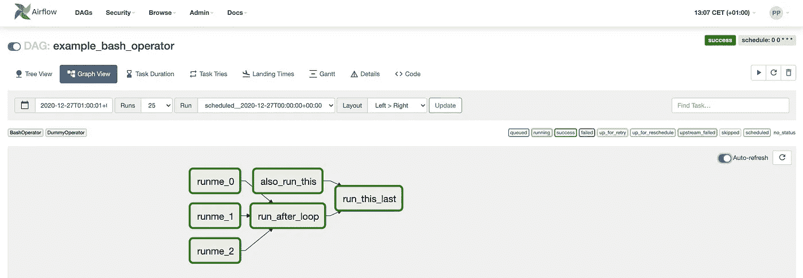
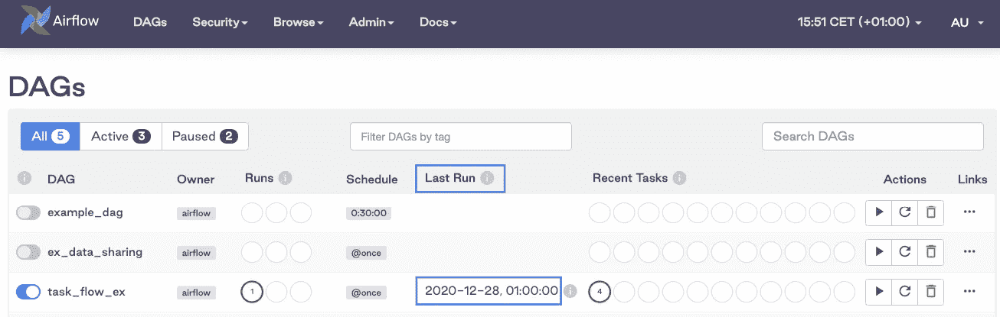

# Apache Airflow 2.0 是否足以满足当前的数据工程需求？

> 原文：<https://towardsdatascience.com/is-apache-airflow-2-0-good-enough-for-current-data-engineering-needs-6e152455775c?source=collection_archive---------6----------------------->

## 新版本中有什么变化:气流 2.0


照片由 [Pexels](https://www.pexels.com/photo/time-for-change-sign-with-led-light-2277784/?utm_content=attributionCopyText&utm_medium=referral&utm_source=pexels) 的 Alexas Fotos 拍摄

几个月前，我写了一篇文章讨论 Apache Airflow 作为 ETL 和数据科学的工作流管理平台的利与弊。由于最近的重大升级，我想更新一下气流 2.0 中的变化。为了全面了解情况，您可能想先看看之前的文章:

[](/is-apache-airflow-good-enough-for-current-data-engineering-needs-c7019b96277d) [## Apache Airflow 是否足以满足当前的数据工程需求？

### Apache Airflow 作为 ETL 和数据科学的工作流管理平台的利与弊，以及由此衍生的…

towardsdatascience.com](/is-apache-airflow-good-enough-for-current-data-engineering-needs-c7019b96277d) 

**目录**

[air flow 2.0 相对于以前版本的优势](#7db5)
∘ [新的 UI 看起来清新而现代](#3742)
∘ [调度程序不再是瓶颈](#cd3c)
∘ [Airflow 终于有了一个成熟的 REST API](#780a)
∘ [智能传感器](#b77c)
∘ [整个项目已经过重组](#0c7a)
[新的特性没有说服我 通过任务流抽象在任务间共享](#6cb5)
[新版本中尚未解决的气流弱点](#85c9)
∘ [令人困惑的调度逻辑](#864e)
∘ [仍然没有对您的数据管道进行版本控制](#d1cd)
∘ [配置过载](#d43b)
∘ [本地开发](#698e)
[结论](#24ce)

# 与以前版本相比，Airflow 2.0 的优势

## 新的用户界面看起来更好

安装 Airflow 2.0 后，您将能够访问比以前版本看起来更好的 UI。新用户界面的主要优势是**自动刷新功能—** 您不再需要不断刷新浏览器来获取工作流程的最新状态。相反，用户界面会自动刷新，您可以通过单击来停用它，如下图所示。



Airflow 2.0 的 UI——图片由作者提供

## 调度程序不再是瓶颈

您不再需要在触发 DAG 运行后休息一会儿来查看工作流程的进度。与以前的任何气流版本相比，这个调度程序似乎快了好几光年。根据天文学家[6]进行的性能基准测试，调度器现在比以前快了 17 倍(*取决于用例*)。

最大的(积极的)惊喜是调度程序在超过 100 秒没有接收到心跳后重新启动。


调度程序日志—作者提供的图像

## 气流终于有了一个成熟的 REST API

到目前为止，Airflow 只有一个功能有限的实验性 API。在 2.0 版本中，您现在可以利用完整的 REST API 来创建、读取、更新或删除 DagRuns、变量、连接或池。

如果本地有 Airflow 运行，可以通过以下网址访问 Swagger UI:[http://localhost:8080/API/v1/UI/](http://localhost:8080/api/v1/ui/)。它为您提供了完整的文档，以便您可以开始在 Airflow 的基础上构建额外的功能，甚至可以使用 Python 之外的编程语言。

## 智能传感器

传感器很棘手，因为它们不断探测状态，可能会消耗大量资源。在新版本中，Airflow 对传感器的逻辑进行了更改，使其更加节省资源和“更加智能”。对于那些希望将所有工作流放在一个地方，而不是依赖于 FaaS(如 AWS Lambda )的事件驱动用例的人来说，这个特性可能会有所帮助。

## 整个项目已经进行了重组

Airflow 有一个受欢迎的社区，到目前为止，它允许对操作符、传感器或钩子的库进行贡献，而无需过多考虑这些贡献模块的结构。随着时间的推移，它导致`airflow.contrib`变得如此之大，以至于依赖性管理，以及下一个版本的计划和测试变得具有挑战性。正如 Jarek Potiuk(气流 PMC 成员)说得好[3]:

> 除了厨房水槽，所有东西都被扔进了一个“阿帕奇气流”包里，不管你想不想用。

在 Airflow 2.0 中，模块已经根据可以与 Airflow 一起使用的外部系统进行了重组。这意味着，如果您想使用与 AWS 相关的操作符，而不是与 GCP 和 Kubernetes 相关的操作符，那么您只能使用 Amazon provider 子包来安装 Airflow:

```
pip install apache-airflow[amazon]
```

这种变化是显著的，因为它允许关注点的分离、特定组件的更快的发布周期，以及可以找到与特定外部系统相关的代码的更清晰的组织结构。从先前版本迁移工作流时，请确保使用正确的导入。例如，代替:

```
from airflow.contrib.operators.aws_athena_operator import AWSAthenaOperator
```

您应该使用[4]:

```
from airflow.providers.amazon.aws.operators.athena import AWSAthenaOperator
```

# 看起来不成熟的新功能

有些新的抽象表面上看起来很棒，但需要谨慎对待。

## 任务组功能

这种新的抽象允许将一组任务视为单个任务。它的动机是许多数据工程师在使用子标记时遇到的低效和错误。尽管这种任务分组在 UI 中似乎很有帮助，但是从设计的角度来看，它并没有解决许多数据工程师试图使用子标记来解决的实际问题，即关注点的分离和分离。

## 通过任务流抽象在任务之间共享数据

这是一个很多人都很好奇的特性，因为它承诺了数据共享功能，并且应该允许编写简单的 Python 函数而不是 Airflow 操作符。在回顾了这个特性之后，它似乎是这个版本的一个弱点，因为任务流抽象留下的问题比它回答的问题要多。

以下是这些功能(任务流和任务组)的详细概述:

[](/taskflow-api-in-apache-airflow-2-0-should-you-use-it-d6cc4913c24c) [## Apache Airflow 2.0 中的任务流 API 您应该使用它吗？

### 在重新设计气流数据管道之前，请三思

towardsdatascience.com](/taskflow-api-in-apache-airflow-2-0-should-you-use-it-d6cc4913c24c) 

# 新版本中尚未解决的气流的弱点

## 令人困惑的调度逻辑

调度逻辑没有任何变化。Airflow 仍然在调度间隔的*结束*时开始调度工作流，这意味着您的 DAG 不会在调度周期的时间立即启动，而只会在`execution_date`达到`start_date` + `schedule_interval`时启动。

作为最终用户，这对您意味着什么？这意味着，当您看到计划作业的最后一次运行“2020–12–28”是在凌晨 1 点整，如下图所示，这并不一定意味着工作流实际上是在当天凌晨 1 点整运行的，而是作业的**执行日期**，它是工作流计划周期的开始时间戳。在这段时间结束时触发作业的执行。在本例中，作业实际上是在一天后触发的。仅对于手动触发的作业，上次运行字段将指示作业运行的实际时间戳。



计划作业的上次运行时间=执行日期，而不是作业实际运行时间的时间戳-按作者排序的图像

如果您想更多地了解整个调度逻辑，本文提供了一个很好的解释:

[](/apache-airflow-tips-and-best-practices-ff64ce92ef8) [## Apache 气流技巧和最佳实践

### 利用气流构建可靠数据管道的中级指南。

towardsdatascience.com](/apache-airflow-tips-and-best-practices-ff64ce92ef8) 

## 仍然没有数据管道的版本控制

存储关于工作流的元数据更改有助于分析随着时间的推移发生了什么变化。使用 Airflow 2.0，您仍然无法跟踪工作流程的版本历史。如果你感兴趣的话，[这里有一个关于计划如何实施的提议](https://cwiki.apache.org/confluence/display/AIRFLOW/AIP-36+DAG+Versioning)。

## **配置过载**

气流是为了满足许多不同人群的需求而建造的。它可以作为一种工具来协调 Kubernetes 上的容器化工作负载，使用几种不同的技术作为您选择的消息代理，它试图在一个产品中以半灵活的方式完成所有这些工作。这种方法的缺点是增加了复杂性和您需要配置的东西的数量，以便根据您的需要定制工具。作为新用户，您需要学习许多组件和广泛的 Airflow 词汇，以便以正确的方式利用该工具。

例如，您需要了解与前面提到的调度逻辑相关的所有细微差别(*包括带有 catchup 的潜在陷阱*)、如何编写气流代码的语法、执行器的逻辑、消息代理和芹菜队列、操作符、钩子、XComs、元数据数据库，以及如何将所有这些不同的组件放在一起并维护它们。

你可以说这适用于任何工具。但是气流只是有如此多的特定的(不直观的)词汇和成分，它可能导致一个重要的进入壁垒。除非你学会了这个工具的所有组件和词汇，否则你不可能成为一个有效的用户。这样做可能需要大量昂贵的培训，而使用具有更直观抽象的平台可以避免这些培训。事实上，令人头痛的气流管理可能是工作流编排空间目前出现新的更用户友好的解决方案的原因。

气流如何解决这个问题？如今，抽象出一些与最终用户无关的内部组件可能是有益的。举个例子:作为最终用户，你为什么要关心开始和执行日期？定义您的时间表和部署您的 DAG，并让调度平台处理其余的事情还不够吗？

## 如果您自己动手，为生产设置气流架构是很困难的

维护气流及其所有组件只需要管理平台和底层基础架构的全职资源。有几家供应商提供商业气流产品。财务上参与这个开源项目的公司要么提供全面管理的气流服务、咨询、培训服务，要么提供所有这些服务的组合。

*   **天文学家** —提供托管服务，在开源版本、企业支持、培训和咨询的基础上提供一些额外的功能，并有几名 PMC 气流成员作为员工为开源项目做出贡献。
*   **Polidea** —与天文学家类似，它也有几名 PMC 成员，但他们似乎主要专注于维护代码库和提供咨询服务。
*   谷歌(Google)——提供全面管理的服务:GCP 上的云作曲家服务
*   **Amazon** —提供完全托管的服务，具有弹性(*即自动扩展*)工作节点容量的额外优势:Apache Airflow 的托管工作流。本文提供了更多相关信息:

[](/managed-apache-airflow-on-aws-new-aws-service-for-data-pipelines-91908ee9e5fc) [## AWS 上的托管 Apache 气流—针对数据管道的新 AWS 服务

### 面向 Apache Airflow (MWAA)的 AWS 托管工作流现已推出，值得一试吗？

towardsdatascience.com](/managed-apache-airflow-on-aws-new-aws-service-for-data-pipelines-91908ee9e5fc) 

## 地方发展

使用开源版本的 Airflow 进行本地开发很困难，因为您的本地环境通常与生产中使用的环境完全不同。当使用默认的本地安装时，您可能会遇到许多奇怪的错误。为了使这一过程不那么痛苦，来自天文学家的`astro` CLI 有助于本地开发[1]。他们的 CLI 允许您初始化一个本地气流环境，该环境旋转包括 Postgres 数据库在内的 Docker 容器。如果您使用他们的商业产品，您可以利用另一个 CLI 命令将 Dag 部署到生产环境中。借助码头化环境，您可以确保开发和生产环境的对等性，这有助于在将 Dag 从开发环境转移到生产环境时避免任何意外。

# 结论

总的来说，借助 Airflow 2.0，该项目已经达到了允许其用于生产工作负载的成熟水平。与以前的版本相比，该调度程序快了几个数量级，也更可靠。由于将不同提供者的代码分离到子包中，您还可以期待更快的发布周期。

**感谢您的阅读！**

**参考资料&附加资源**

[1] [使用 astro CLI 开始指南—天文学家 io](https://www.astronomer.io/guides/get-started-airflow-2)

[2] [Airflow 2.0: DAG 创作重新设计的](https://www.polidea.com/blog/airflow-20-dag-authoring-redesigned/) — Polidea

[3] [气流 2.0 提供商——Polidea](https://www.polidea.com/blog/airflow-2-providers/)

[4] [一个新的提供商包的例子](https://github.com/apache/airflow/blob/master/airflow/providers/amazon/aws/operators/athena.py)—Github 上的气流

[5] [Apache Airflow 2.0 在此](https://airflow.apache.org/blog/airflow-two-point-oh-is-here/) —文档

[6] [Airflow 的调度程序基准—天文学家 io](https://www.astronomer.io/blog/airflow-2-scheduler)

[7] [发行说明](https://github.com/apache/airflow/releases) —显示了 Airflow 2.0 版本中添加的完整功能列表。