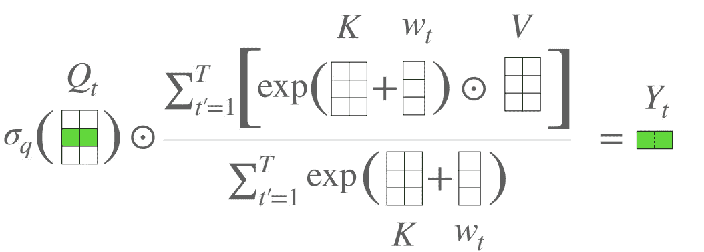
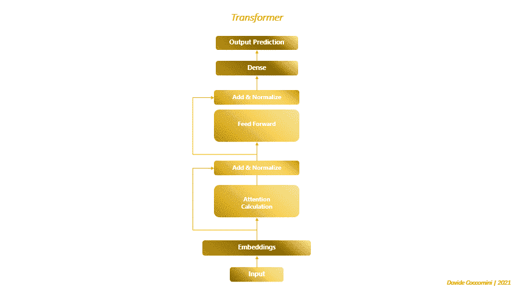

# 《变形金刚》中你真正需要的是关注吗？

> 原文：<https://towardsdatascience.com/is-attention-what-you-really-need-in-transformers-6c161c2fca83?source=collection_archive---------20----------------------->

## [实践教程](https://towardsdatascience.com/tagged/hands-on-tutorials)

## 探索变形金刚模型中自我注意机制的有希望的替代和改进。

近年来，基于自我关注的方法，尤其是变形金刚，出现了爆炸式增长，首先出现在自然语言处理领域，最近也出现在计算机视觉领域。

[如果你不知道什么是变形金刚，或者你想了解更多关于自我关注的机制，我建议你看看我关于这个话题的第一篇文章。](/transformers-an-exciting-revolution-from-text-to-videos-dc70a15e617b)

与以前的架构(如自然语言处理中的 RNNs 或计算机视觉中的卷积网络)相比，变压器的成功与它们以更好的方式解决重要问题的极端效率和能力有关。在变形金刚的基础上，有而且一直都有注意力的机制，被认为是“你所需要的一切”，是这个建筑不可或缺的和真正跳动的心脏。但并非所有闪光的都是金子，事实上，自我注意力的计算带来了巨大的计算和存储成本，例如需要非常大量的视频存储器并导致很高的训练时间。

苹果和谷歌等大公司并没有忽视这一点，它们一直在努力制造不仅能够实现最先进效果，而且效率也很高的变压器。

# 高效变压器

最近，《变形金刚》的联合创作者之一、谷歌的研究员卢卡斯·凯泽(Lukasz Kaiser)提出了一系列改进，让变形金刚在保持自我关注机制的情况下更加高效，而他关注的第一个、可能也是最重要的一个方面就是内存效率。

基于[高效变压器](https://www.youtube.com/watch?v=xNZ5eiGLS2U)

变形金刚使用大量内存，因为在它们执行期间会创建和维护多个中间张量，并且随着它们的累积，它们会在缺少大量资源的情况下很快使视频内存饱和。

Google Brain 提出的解决这个问题的方法是避免将所有张量保存在内存中，而是使这个过程的每一步都是可逆的。

基于[高效变压器](https://www.youtube.com/watch?v=xNZ5eiGLS2U)

为此，每一步都要维护两个张量，一个来自层的应用，另一个是前一个张量的副本。这允许过程继续，而不必维护整个中间张量链，而只维护最后一步的那些。

基于[高效变压器](https://www.youtube.com/watch?v=xNZ5eiGLS2U)

通过这种策略，我们可以显著降低内存成本，同时仍能获得与普通变压器相同的效果。这可能是目前已知的最聪明的方法之一，以保持变压器架构完全基于传统的自我关注，但成本较低。

# AFT:无注意变压器

但是在什么情况下，自我关注的计算变得如此复杂而难以管理呢？有没有消除二次复杂度的方法？我们现在真的需要注意力计算吗？这些是苹果公司的研究人员问自己的问题，也是注意力自由变形金刚的基础。

问题在于点积，点积用于组合查询、键和值，它是通过将每个输入向量都视为一个查询来完成的。意识到这一点，注意力自由变压器的目的是永远不会点产品，同时保留的好处。

与最初的转换器一样，AFT 最初创建 Q、K 和 V，作为输入与查询、键和值的矩阵的线性转换的结果。

独特之处在于，在这一点上，不是执行点积来创建关注矩阵，而是对每个目标位置执行值的加权平均。这样做的结果通过逐元素乘法与查询相结合。

来源:[一个注意力不集中的变形金刚](https://arxiv.org/abs/2105.14103)

通过这种机制，可以获得依赖于输出特征数量和所考虑序列长度的线性计算和空间复杂度。从概念上讲，这只是一种不同的使信息在序列中流动的方式，但成本要低得多。

通过使用原始变压器在文献中先前测试的许多任务上测试注意力自由变压器，可以看到，例如在图(左)所示的视觉变压器的情况下，从 AFT(右)获得的特征(在这种情况下，是 AFT-Conv 版本)即使被近似也似乎仍然是有意义的。

来源:[一个注意力不集中的变压器](https://arxiv.org/abs/2105.14103)

通过这种机制，不仅可以降低计算注意力的成本，而且在所有考虑的任务中都获得了优异的结果，这表明该解决方案能够保持点积的所有优点，而不需要计算成本。

# FNet:傅立叶网络

但也有人考虑完全放弃注意力的计算，转而寻求一种与注意力同样有效但计算成本却不那么高的机制。

看起来傅立叶变换是这项任务的一个很好的候选者。傅立叶变换只不过是在一个域(如时间域)中取一个函数，并将其带入另一个域(如频率域)中。

谷歌提出的基于该机制的傅立叶网络与普通变压器完全相同，但注意力计算模块被一个处理傅立叶变换的层所取代。

具有由 T 个记号组成的 N 个输入向量，傅立叶变换首先应用于所谓的“隐藏域”，然后应用于“序列域”。所有这些都是在没有任何类型的参数的情况下完成的，这带来了巨大的优势，因为其他层中存在的参数是唯一可以训练的参数，从而减少了模型参数的数量。

因此，转换是线性的，首先按列，然后按行应用于输入。除了通过应用傅立叶变换获得的简单性之外，还有它是可逆的优点。

与 AFT 的情况完全一样，这一系列转换使得序列的各个部分能够相互影响，并且结果是包含从输入序列的各个部分导出的信息的转换表示。

显然，这似乎是一个非常有趣的方法，能够显著降低注意力计算的成本，并获得离散的结果。事实上，FNet 似乎并不比经典变压器更好，可能有其他更好的方法以更低的成本获得类似的结果，但在缺乏大量计算资源的情况下，FNet 可能是一个真正有效的选择。

# 未来等待我们的是什么？

现在很清楚，Transformer 是一个非常强大的架构，能够以我们从未见过的结果解决最多样化的问题，从翻译到分割到分类。然而，这些问题长期以来一直与它们对资源的过度消耗联系在一起，它们在计算机视觉领域的出现更加突出了这个问题，并促使许多研究人员寻求解决方案。在未来，我们可能会看到基于注意力的变形金刚，但经过优化后变得更轻，或者变形金刚失去了注意力机制，为更近似的技术腾出空间，或者全新的网络，类似于变形金刚，但采用不同的输入变换策略，如傅立叶变换。如果你想做好准备并了解更多，我建议你读一下我写的关于变形金刚 T2 和恐龙 T4 的文章。

有一件事是肯定的，如果目前大多数人还不可能充分利用这种架构，它很快就会为每个人所用，其巨大的潜力加上可访问性将使变形金刚比现在更加普遍和重要。

# 参考文献和见解

[1]《卢卡什·凯泽》。"[高效变压器](https://www.youtube.com/watch?v=xNZ5eiGLS2U)

[2]《双飞斋等人》。"[无注意力变压器](https://arxiv.org/pdf/2105.14103.pdf)"

[3]《李中清-索普等人》。" [FNet:用傅立叶变换混合令牌](https://arxiv.org/abs/2105.03824)"

[4]《扬尼克·基尔彻》。" [FNet:混合令牌与傅立叶变换(机器学习研究论文讲解)](https://www.youtube.com/watch?v=JJR3pBl78zw)"

[5]《大卫·柯考米尼》。"[关于变压器、定时器和注意事项](/transformers-an-exciting-revolution-from-text-to-videos-dc70a15e617b)"

[6]《大卫·柯考米尼》。[在迪诺上，无标签自蒸馏](/on-dino-self-distillation-with-no-labels-c29e9365e382)