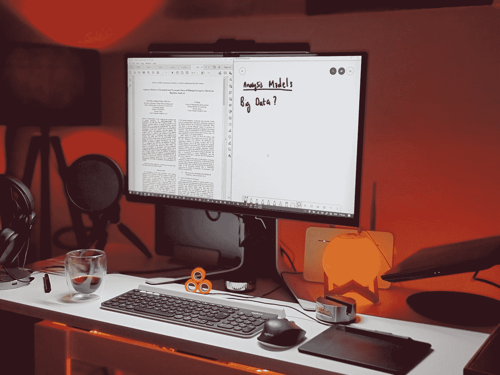

# 数据科学是科学吗？

> 原文：<https://towardsdatascience.com/is-data-science-a-science-a43cfbd7b227?source=collection_archive---------16----------------------->

## 主张数据科学领域确实应该被视为基础科学的论点

罗马法师在 [Unsplash](https://unsplash.com?utm_source=medium&utm_medium=referral) 上拍摄的照片

# 什么是科学？

从本质上来说，所有基础科学都是关于以实验的形式做出预测:*精确*，*可量化*，*可证伪* **预测**。正如理查德·p·费曼所说:

> 科学的基本原则，几乎是这样定义的:任何想法有效性的唯一检验就是实验

那么，如果科学是关于预测的，那么它与占星家的预测有什么不同呢？核心区别在于各自做出的预测种类。例如，大多数星象会给你大致的预测。这些星座通常会说这样的话，“你今天会有美好的一天。”另一方面，科学预测是*精确的*、*定量的*预测；他们没有说你会有美好的一天，而是说你会在下午 3:07 准时走出家门，然后被流星击中！

诚然，大多数预测并不那么可怕，而且通常在本质上更加平淡无奇。但是**预测**本身，我们也可以称之为**实验**，是**基础科学**的核心。我们可以认为基础科学关注宇宙最基本的方面，物质和能量。对基础科学的考察揭示了这种基础科学与计算之间的密切关系。

事实上，我们可以将**计算**视为将世界的一种表示(即我们的输入)转换为世界的另一种表示(即我们的输出)的过程，如这里的[所示](http://research.sethi.org/ricky/book/)。例如，输入可能是早上 6 点校园内分布的每个传感器的温度列表，输出可能是所有传感器温度值的平均值。将输入转换为输出的过程或方法是平均值本身的计算。因此，我们可以说*计算*所有传感器在早上 6 点的平均温度的问题是一个*可计算的问题*。

碰巧的是，基础科学的一个重要组成部分处理宇宙中那些**可计算**的问题。正如 David Deutsch 在[Zenil 2012]中所说，“物理定律只适用于可计算的函数。”这意味着，在非常现实的意义上，所有的物理定律都属于这组**可计算函数**，即使可计算函数本身只是所有可能的*数学*函数的一个很小的子集！

# 那么这和数据科学有什么关系呢？

由 [Boitumelo Phetla](https://unsplash.com/@writecodenow?utm_source=medium&utm_medium=referral) 在 [Unsplash](https://unsplash.com?utm_source=medium&utm_medium=referral) 上拍摄的照片

在我们讨论数据科学是否是一门科学这个似乎没有明确答案的问题之前，让我们后退一步，看看*证明*的概念。这是一个经常被滥用的词，因为有许多不同种类的**证明**:例如，有*科学*证明、*法律*证明和*数学*证明。

在数学中，证明是一种推理论证,表明一个陈述在公理、定义、定理和假设的支持下是正确的。数学家通常使用演绎推理来证明前提(也称为陈述)为真。直接证明是表明给定的陈述总是正确的证明，证明通常用符号语言写成。在*间接证明*中，数学家通常使用矛盾证明，他们假设相反的陈述是正确的，并最终得出一个矛盾，表明假设是错误的。

在科学领域，我们无法证明任何假设是正确的，因为这需要无数次的观察，所以我们所能希望做的最好的事情就是使用归纳推理作为我们归纳的基础，并认为它暂时是正确的。正如李·洛文杰(Lee Loevinger)在谈到卡尔·波普尔(Karl Popper)时所指出的那样，“在这种被广泛接受的观点中，假设可以被证伪或推翻，但不能被证实或证明。”一旦*被*广泛且一致地验证，并且我们认为它被充分证实，我们就称它为*理论*。

在法律上，*法律证明*是运用证据确立一个事实的过程。在科学上，我们可以称之为对某个理论的验证，因为这通常也是以论证的形式出现，你提出一系列前提来支持某个结论。与法律中的证明类似，科学中的证明通常仅限于使用数据来证明事实的有效性。D.H. Kaye 在[Kaye 1991]中详细讨论了这一点，表明使用定量观察陈述提供了证明事实的证据，或者如我们在科学中所说，显示事实的有效性。因此，在某种意义上，我们可以说，法律论证使用证据来证明理论的有效性，而科学使用数据来证伪理论。

例如，继[Kaye 1991]之后，从指向蟹状星云的射电望远镜中收集各种频率的辐射强度和偏振的可量化的**数据**是显示(在法律上，证明)蟹状星云方向的某些东西是射电源的**证据**，即**事实**。这些事实可以从观察陈述和证据中推断出来。因此，事实是基于一些可重复的观察或测量，这些观察或测量通常被认为在相同的情况下以相同的值或相同的方式重复出现。

然后，这些事实被用于归纳推理被研究系统的*假设*或*模型*。由该模型做出的*预测*被进一步*验证*，并且当足够的预测被独立验证时，该假设或假设集被认为是充分有效的，被称为*理论*。

# 如果它看起来像科学，听起来也像科学…

照片由 [Kai Alyssa Bossom](https://unsplash.com/@enbaeshoots?utm_source=medium&utm_medium=referral) 在 [Unsplash](https://unsplash.com?utm_source=medium&utm_medium=referral) 拍摄

这个过程，这个*科学方法*，正是我们在数据科学框架内利用我们的机器学习模型，如假设测试或决策树，并使用*数据*来迭代测试和改进我们的模型时所采用的方法。根据费曼的公式，我可能会进一步争辩说，只要你使用**系统模型**来做出**预测**，然后**用数据测试**这些预测，并使用这些结果*验证或改进*你的模型**迭代**，你就在*做* ***科学*** 。

将这些科学模型应用于具体问题，而无需反复改变或进一步开发这些模型，这就产生了*工程*和*技术*原则。因此，我可能倾向于将数据分析归类为工程学科，将探索性数据分析归类为技术应用。

阅读更多关于数据科学与数据分析的内容。我的新书[中的 10 本](http://research.sethi.org/ricky/book/)，也可以在 [ResearchGate](https://bit.ly/research-gate-ect) 上公开查看。

[1] H. Zenil，*一个可计算的宇宙:理解和探索作为计算的自然*。美国新泽西州 River Edge:世界科学出版公司，2012 年

[2]归纳至少在某种程度上像理查德·费曼和卡尔·波普尔这样的思想家会这样认为，费曼在他关于科学的钥匙的论述中以及波普尔在他的猜想和批判的表述中也是如此。

[3] D. H. Kaye，*法律和科学中的证明*，《法学杂志》，第 32 卷，第 313 页，1991 年