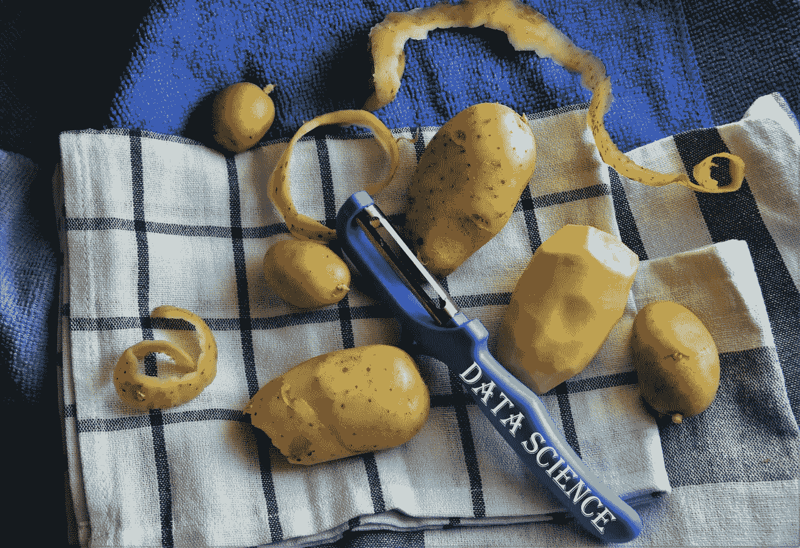
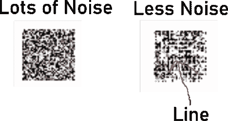

# 数据科学实际有用吗？

> 原文：<https://towardsdatascience.com/is-data-science-practically-useful-1effdce39bf1?source=collection_archive---------27----------------------->

## 我在日常生活中使用数据科学的 3 种方式

图片由 [pasja1000](https://pixabay.com/users/pasja1000-6355831/?utm_source=link-attribution&utm_medium=referral&utm_campaign=image&utm_content=3675267) 来自 [Pixabay](https://pixabay.com/?utm_source=link-attribution&utm_medium=referral&utm_campaign=image&utm_content=3675267)

总的来说，数据科学名声不好。

大多数人认为 it 是一个只对拥有大量数据的大企业实用的职业。在我为一些小公司做顾问的早期，他们经常解释数据科学并不是他们所需要的。他们只是没有足够的规模来证明昂贵且过度设计的数据科学解决方案的合理性。所以，我坚持做小规模的分析。

他们没有错。我的意思是，数据科学家很昂贵，模型需要时间来建立和训练，数据需要被标记。此外，为了在面对大量数据变化时保持准确，模型需要尽可能多地暴露在这些变化中。换句话说，你需要大量的数据。

当你试图考虑数据科学对个人的实用性时，这个问题只会加剧。个人没有很多标记数据，他们不知道他们在某些任务上花了多少时间，日常任务需要更多的如果-那么思考，而不是可能性和概率。

但事情是这样的。

我要和你直说了。

这一直困扰着我。我一直很欣赏那些能用自己的技能做实事的人。我是《孤独的 T4》和《裸体与恐惧》等节目的狂热观众。生存技能是实用的。生存技能很酷。

数据科学不是生存技能。我不能用数据科学来放火。数据科学并不能保护我免受大型饥饿动物的伤害。我知道这个。

尽管如此，困扰我仍然存在。但不会太久。

在某个时候，不管是出于需要还是好奇，还是纯粹的固执，我终于不再陷入一天的惰性，真正把这个问题抛在脑后。

我的日常生活需要一次数据科学的碰撞。

在这里，我描述了我在日常生活中应用数据科学技能时收集到的三个实际用途。

# **数据科学就像数据科学一样**

尽管从事该行业多年，但我花了一些时间来摆脱日常生活中的“如果-那么”思维模式，并开始分析数据科学如何对我有用(不仅仅是我帮助应用它的公司)。

这一切都始于我一天中的一次暂停，以评估占据我大部分时间的任务。

# **解决家庭纠纷**

我对实用数据科学的探索始于花大量时间与家人和脸书的朋友讨论政治。我发现自己在寻找比较极右和极左政治的数据，以指出这两者根本不一样。

但我的轶事和难以找到的研究文章似乎只被当作耳边风。所以，为了节省我自己的时间，减少挫折，用数据武装自己，我把时间花在了数据科学上。

我建立了一个生态系统，从极右和极左组织的时事通讯中收集数据。我写了一个网络抓取脚本，使用“右翼[左翼]媒体的当前趋势”这样的短语抓取前 50 个搜索链接，从这些网站中提取文本，并添加一些高级元数据(例如，它是. com 还是. org 网站？).

然后，我在一些主题分析、实体提取和情感分析上进行分层。最后一步，把所有东西打包，制作一些直观的图表，展示两种极端意识形态之间的差异。

那个图茨阿姨是什么？你认为极右翼使用不那么极端的语言？哇，这里有一张图表显示右翼分子比左翼分子更经常使用“继续战争”这个短语。问题解决了，时间恢复了。

这个解决方案现在做两件事:1.它给了我一个快速的、由数据驱动的政治脉搏，我可以与我喜欢争论的社交圈分享。这有助于进一步分化我和我的家庭😊

你知道他们说什么。节省下来的时间是值得花的钱。继续下一个！

# **给学生作业评分**

另一个占用我大量时间的领域是教学。我已经当了多年的助教。对我来说，不幸的是，有时我的教学负担成了我时间的倍增器，严重影响了我完成其他事情的能力。

必须做些什么来使我的教学时间更有效率。对我来说很糟糕？批改试卷。即使我已经建立了一个注释字典来处理我在过去的论文中看到的 90%的问题，我在每篇论文上花费了 5-15 分钟。

尽管我有组织好的评论字典，我仍然发现花时间去关注正确的评论。为了解决这个问题，我需要一种方法来根据每篇论文的内容向自己推荐评论。

我首先创建了一个文件夹，里面放有我为一个特定作业评分的所有过去的论文。接下来，我从每篇论文中提取文本、评论和评分。我在段落层次上组织了所有的信息，用论文、论文摘录的段落、评论和分数创建了一个简单的数据框架。

评论和分数都被用作我建立模型的目标。该段落表示将用于预测评论或分数的特征工程的来源。

为了让事情变得更加简单，我使用 spaCy 的文档分类管道来训练一个模型，该模型将推荐给定段落的评论。我使用了一个简单的回归模型来预测从论文中提取的关键词作为特征的得分。

最终的解决方案将消耗新的论文，分解段落(超过特定字符长度的任何段落)，并为该段落提供具有置信度得分的推荐评论。我的模型还根据对所有段落的整体观察预测了论文的分数。

有了这两个工具，我把每篇论文的评分时间减少到了不到 5 分钟。我仍然手动审阅每篇论文，但我的模型提供了快速获取每段所需的最可能的反馈。

# **提出创意内容**

前两个例子属于智能自动化的范畴。采取一些重复的，但不容易描述为一系列如果-那么规则，并开发统计模型来帮助自动化这些任务，而不必编写一百万个如果-那么语句。

最后一个例子更多的是创造性的灵感，而不是智能自动化，尽管它最终帮助我节省了时间。

几年前，我和儿子开了一家 t 恤公司。他真的很擅长画画，我真的很擅长把他的画廉价地转换成数字图像。一旦转换，他可以着色，增强，并进一步完善他的艺术内容。

起初，我们很兴奋，创意源源不断。t 恤满天飞，机器人被画了出来(他对机器人有特殊的定位)，能量上升了。但是，在家里所有的爸爸和奶奶都买了他们的限量版之后，销售额急剧下降。新鲜感已经消失，我们遭遇了一些重大的创作障碍。

> “我:儿子，我们的 t 恤产量正在下滑。你必须回去画画。业务全靠你了。你未来的命运悬而未决。
> 
> 儿子:爸爸，别这么戏剧化。还有，我也不知道还能画什么。我已经没有新机器人的灵感了。"

就在那时，我发现了 GANs，或者更正式地称为的生成性对抗网络。GAN 是两个神经网络，一个从随机输入生成输出，另一个试图将来自生成模型的输出(以及一堆其他训练数据)分类为真实的或生成的。这些网络相互对抗，因此生成模型试图学习如何生成输出，以欺骗分类器将其标记为真实。

随着我对 GAN 的了解和对它们的一些实现的启发，比如来自 OpenAI 的 [DALL-E](https://openai.com/blog/dall-e/) ，我决定尝试构建一个 GAN，它可以绘制像我儿子一样的机器人。

好吧，所以我不想说我如何在几分钟内成功地建立了一个 GAN 来像我儿子一样绘制，从而使最后一个解决方案失败。恰恰相反，事实上，在我写这篇文章的时候，我还在努力。

是啊，甘很难训练。它们需要很长的时间来训练，对调谐参数非常敏感，并且需要很长的时间来训练…等等，我已经说过了吗？…作为强调。

冒着让你失望的风险，这一个将不得不继续工作。但是潜力将是巨大的…相信我这一点😉

在我看来，我的 GAN 很快就能生成新奇的图像，我们可以把这些图像印在衬衫上，大大提高我们的产量。此外，这些输出还可以用来进一步激励我的儿子，并在他感到缺乏灵感时充当创造性的拐杖。

随着 OpenAI 最新的 GPT-3 模型可以通过一些简单的提示生成新颖的内容，内容作者甚至开始玩弄这些生成性[应用](https://medium.com/divedeepai/auto-generate-your-content-using-gpt-3-d7e34526a9fb)。

有争议，但如果负责任地使用，这些工具可能是任何创意工具包的有用补充。

现在，我把我的生成模型的最新输出留给你。经过几天的训练，我的模特可以画一条线。我保证，这是一条线😊

作者图片

# **闭幕词**

希望你自己的实用性——汁液现在正常流动。数据科学是有用的，有很多工具我还没有提到，它们可以用来帮助你解决很多其他的实际问题。

我希望你找到它们，用它们做实验，也许你会发现自己获得了一些价值。至少，你会在这个过程中学到一些东西。

比如参与学习更多关于数据科学、职业发展或糟糕的商业决策的知识？[加入我](https://www.facebook.com/groups/thinkdatascience)。