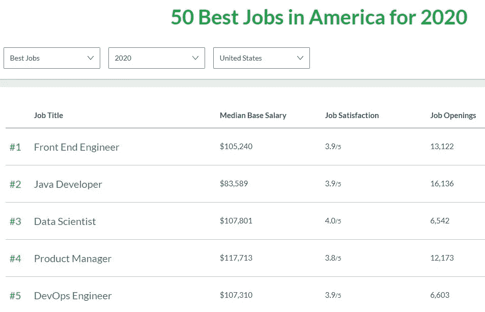

# 2021 年数据科学还是一个上升的职业吗

> 原文：<https://towardsdatascience.com/is-data-science-still-a-rising-career-in-2021-722281f7074c?source=collection_archive---------2----------------------->

## 检查数据科学行业的需求、供应和增长，看看它在 2021 年是否仍然是一个上升的职业

照片来自 Unsplash，作者是[绍洛·莫哈纳](https://unsplash.com/photos/wNz7_5EvUWU)

根据 Glassdoor 的年度排名，2020 年是自 2016 年以来的第一年，数据科学家不是美国的头号工作。这个头衔属于前端工程师，然后是 Java 开发人员，最后是数据科学家。

2020 年美国最佳工作，通过[玻璃门](https://www.glassdoor.com/List/Best-Jobs-in-America-LST_KQ0,20.htm)

现在获得第三名一点也不坏，事实上你还在领奖台上。但数据科学家这个闪亮的头衔终于要掉下来了，还是只是成为了 2020 年的又一个受害者？

为了确定这一点，我们来看看影响职位排名的 3 个经济因素:

*   **需求**
*   **供应**
*   **成长**

如果数据科学在 2021 年仍然是一个上升的职业，检查这些因素将会给我们答案。

# 需求

如果你回到几年前，2010 年代初最耀眼的头衔是程序员和网页设计师。当时两人的工资都很高，但随着供给赶上需求，工资一直处于平稳状态。

对于数据科学家来说还不是这样，因为需求仍然很高。

数据科学家在工作排名中名列前三是有原因的，因为他们的需求绝对是荒谬的，而且看不到放缓的迹象。

## 这种需求从何而来？

数据驱动的决策。这是这个问题的简单答案。要想在 21 世纪成为一家成功的公司，你必须利用数据。

以前，许多人通过使用 excel 来分析数据，但现在任何人都可以访问和使用数据处理工具，如:

*   谷歌分析——基于云的数字营销服务
*   Tableau，Power Bi —用于商业智能的数据可视化工具
*   Python，R——用于用几行代码执行复杂分析的编程语言

全世界最大的公司都是由数据科学推动的企业。看看谷歌、亚马逊和脸书。每个公司都使用数据科学来创建算法，以提高客户满意度并实现利润最大化。

*   谷歌——对网页进行排名，以确保顶部链接能够回答任何问题。
*   亚马逊——根据消费者过去的行为和兴趣推荐产品。
*   脸书——有针对性的广告(他们知道你喜欢的运动、偏好的价格区间、食物等)增加了市场成功。

最后，需求仍然很高的主要原因是，如果你的竞争对手依赖于数据驱动的决策，而你没有，他们将超过你，偷走你的市场份额。

因此，公司必须适应并采用数据科学工具和技术，否则他们就会被挤出市场。

意思是… **数据科学家在 2021 年是必须的**。

# 供应

数据科学家的供应**低**，这是因为即使在 2021 年，数据科学领域仍然相对较新。

你看，20 年前，由于互联网连接速度慢，计算能力低的原始编程语言，学习数据科学是不可能的。然而，随着时间的推移，计算机的能力开始呈指数增长，数据科学成为可能。

这种指数式的增长和对该领域的兴趣是无法预测的，传统教育无法满足那些想要学习这一不断增长的领域的人的需求。

很少有项目是为培养有抱负的数据科学家而创建的。研究表明，进入这一领域的人通常是从商业、心理学和生命科学等其他领域转行过来的。

大多数转型者通过阅读书籍和参加在线课程的自我准备来学习技能…

**没有通过传统的教育体系**。

来自 Unsplash 的照片由 [Changbok Ko](https://unsplash.com/photos/F8t2VGnI47I)

## 就业率统计

那些进入数据科学领域的人有一个优势，那就是开始一条职业道路，在这条道路上，空缺的职位比合格的候选人更多。

事实上，数据科学工作的空缺时间比所有其他工作的平均时间长 5 天。这表明竞争减少，导致招聘人员需要额外的时间来寻找合适的候选人。

这些正确的候选人是幸运的，因为大多数人只需要一个学士学位就能被录用。低供给导致 61%的数据科学家职位提供给拥有学士学位的人，而只有 39%的数据科学家职位需要硕士学位或博士学位。

# 增长

如果您一直在关注这篇文章，那么您可能对数据科学工作的增长轨迹有一个很好的假设。

根据 LinkedIn 的数据，自 2012 年以来，数据科学的工作岗位增加了 650%。Glassdoor 为这一说法提供了证据，因为他们在 2016 年有大约 1700 个职位空缺，数据科学是主要角色。这个数字在 2018 年上升到 4500，在 2020 年持平在 6500 左右。

新冠肺炎是 2020 年的大事件，大概也是这一趋势变平的原因。尽管总体而言，科技行业的工作在疫情期间被证明是有弹性的，现在已经是第十个月了。

照片来自 Unsplash，由 Elena Mozhvilo 拍摄

## 不要押注于增长

对数据科学家的需求仍然很高，而供应却很低。据 IBM 称，这种趋势在未来几年将继续保持强劲。同意这一说法的另一个可信来源是美国劳工统计局。

美国劳工统计局看到了数据科学领域的强劲增长，并预测到 2026 年就业数量将增加约 28%。给那 28%一个数字，那大概是**1150 万**该领域的新工作岗位。

从长远来看，不把数据科学作为职业发展的赌注可能是不明智的，特别是当你把这个领域扩大到包括研究工程师和机器学习工程师等相关职位时。

# 最终想法

那么数据科学在 2021 年还是一个上升的职业吗？答案是响亮的**是的！**世界各地对数据科学家的需求丝毫没有减少，这些工作缺乏竞争使得数据科学成为一个非常有利可图的职业选择。

# 参考

[1] A. Woodie，[为什么数据科学仍然是一份顶级工作(2020)](https://www.datanami.com/2020/11/16/why-data-science-is-still-a-top-job/) ，https://www . datanami . com/2020/11/16/Why-Data-Science-Is-Still-a-Top-Job/

[2]加州大学宾夕法尼亚分校，[数据科学职业、工作、薪水|数据科学家](https://www.calu.edu/academics/undergraduate/bachelors/data-science/jobs-career-salaries.aspx#:~:text=Data%20science%20was%20named%20the,engineer%2C%20and%20business%20analyst.%E2%80%9D) (2019)，https://www . calu . edu/academics/本科生/学士/Data-Science/Jobs-career-Salaries . aspx #:~:text = Data % 20 Science % 20 was % 20 named % 20 the，engineer % 2C % 20 和%20business%20analyst。"

[3] 365 数据科学，[数据科学真的是一个上升的职业吗](https://www.youtube.com/watch?v=PXLVLS1vJHY) (2020)，https://www.youtube.com/watch?v=PXLVLS1vJHY