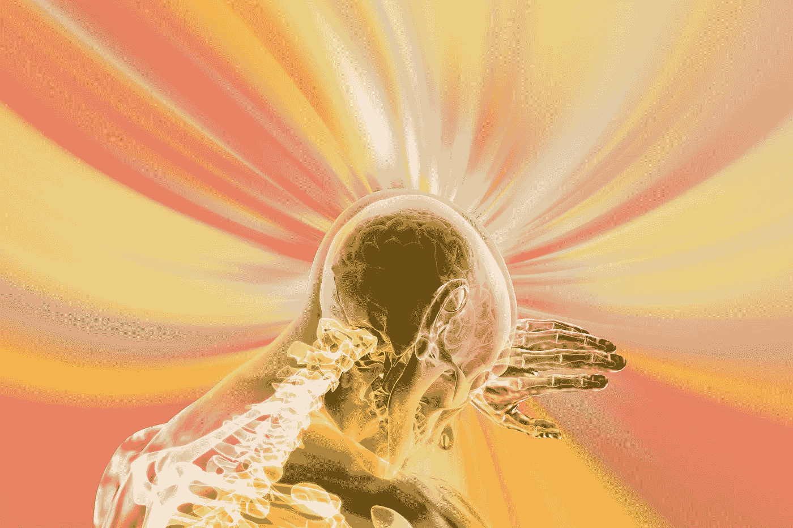

# 数据科学真的死了吗？

> 原文：<https://towardsdatascience.com/is-data-science-truly-dead-b11cd76eafc8?source=collection_archive---------0----------------------->

## 意见

## 从数据科学家到 AI 实践者

图片由来自 [Pixabay](https://pixabay.com/?utm_source=link-attribution&utm_medium=referral&utm_campaign=image&utm_content=438398) 的 [Steve Bidmead](https://pixabay.com/users/stevebidmead-249424/?utm_source=link-attribution&utm_medium=referral&utm_campaign=image&utm_content=438398) 提供

也许你已经听说过，或者读到过，或者两者兼而有之。数据科学家正在死去，我们几乎无法保住我们的高薪、摇滚明星般的形象和膨胀的自我。显然，我在这里夸大了事情的戏剧性效果，但对于许多数据科学专业人士来说，这一信息仍然令人焦虑，他们已经开始在他们的工业水域中闻到血液的味道，因为越来越多的高管团队正在四处扔像“公民数据科学家”、“分析民主化”和“自动化机器学习”这样的概念。几年前，当马特·塔克的文章“[数据科学家之死](https://www.datasciencecentral.com/profiles/blogs/the-death-of-the-data-scientist)”发表在*数据科学中心*上时，这种担忧被点燃，尽管这并不是第一个做出[这种断言的文章](https://insights.dice.com/2014/03/05/data-science-is-dead/)。但是，我们今天所知的数据科学家真的是注定要灭绝的物种吗？在这篇文章的剩余部分，我将探讨这一观点，同时为当前的数据科学专业人员提供一个未来可能会是什么样子的替代视角。

## 机器的崛起

在最基本的层面上，争论是这样的:数据科学家的许多活动本质上是可量化的或统计的，因此是可自动化的。因此，我们能够以自动化的方式更好地协调统计模型，数据科学家就越不需要拉动那些杠杆来选择、优化和部署他们的数据驱动的洞察力。事实上，DataRobot、谷歌的 AutoML 等公司和产品，以及对预先训练的、基于服务的数据科学模型(Azure Cognitive Services、谷歌人工智能服务、AWS、Watson)的不断扩展的访问，已经在实现这一目标方面取得了重大进展，人工数据科学家。

来自 [Pixabay](https://pixabay.com/?utm_source=link-attribution&utm_medium=referral&utm_campaign=image&utm_content=5174342) 的[斯蒂芬·凯勒](https://pixabay.com/users/kellepics-4893063/?utm_source=link-attribution&utm_medium=referral&utm_campaign=image&utm_content=5174342)的图片

## 从流行到必需

尽管这是一个总是定义不清的领域的可怕预测，但那些声称拥有数据科学家头衔的人仍然发展了足够的技能，以适应即将到来的人工数据科学浪潮。因此，我们必须用探险者驾驭人工智能技术炒作浪潮的图像来取代我们虚构的世界天网正在崛起以推翻人类数据科学家最后剩下的据点的图像，这些人工智能技术从根本上嵌入了只有人类数据科学家真正理解的技能。为了实现这种发展，有三个领域是实践数据科学家必须关注的，也是未来雇主必须启发的:不断发展/扩展的工具包，用户体验的重要性，以及行业的福音。

## 不断发展/扩展的工具包

如果有一件事是数据科学家擅长的，那就是引起轰动(以及一些新工具的出现)。数据科学的概念本身是一个时髦的术语，许多对商业有统计知识的专业人士都把它与自己联系在一起，以提高他们的市场竞争力，并取得良好的效果。为什么我们应该期待人工智能的建筑浪潮会有所不同？随着数据科学家概念的发展，与之相关的工具也在发展，因此该领域的专业人员一直在不断地通过接触最新的可用工具来保持相关性。尽管变化的速度已经接近压倒性，但那些幸存下来并能够展示这些数据科学技术核心功能的能力的人，已经准备好利用人工智能工具。因此，学习进化的数据科学家将学习如何将自己重塑为人工智能的实践者。但是为了能够让其他人相信这个品牌重塑，这些专业人士需要继续扩展他们的工具包。虽然 21 世纪初为我们带来了 Hadoop、NoSQL、物联网、Python 的 scikit-learn、Tensorflow 和 Spark，但下一代将利用人工智能即服务、云计算、智能自动化和容器化进行分析。这意味着数据科学家必须继续学习如何利用 API 调用，构建支持数据科学的云环境，以及部署分析来公开 API 端点。

图片由 [Pixabay](https://pixabay.com/?utm_source=link-attribution&utm_medium=referral&utm_campaign=image&utm_content=6329926) 的 [Ed Zilch](https://pixabay.com/users/squarefrog-9690118/?utm_source=link-attribution&utm_medium=referral&utm_campaign=image&utm_content=6329926) 提供

## 用户体验的重要性

如上所述，统计工具并不是帮助数据科学家在快速变化的环境中生存的唯一工具。人工智能不仅仅是统计技术，而是将这些统计技术嵌入到用户体验中。因此，精明的数据科学生存论者将发现使用嵌入式统计分析解决问题的机会。这些工作需要对软件编程概念有更深的理解，数据科学家已经通过获得开源脚本工具和与应用程序开发团队更紧密合作的能力做好了准备。从技术和理论的角度来看，有许多方法可以解决用户体验问题(例如，参见我们之前的博客文章),并且什么有效总是取决于用户的满意度，但关键是要确定统计模型改善用户体验的策略。这样，数据科学家将需要继续发展他们解决问题的方法。我们曾经关注使用尖端建模技术从数据中提取洞察力，现在我们需要关注它们在应用程序中的效用。

图片由[皮克斯拜](https://pixabay.com/?utm_source=link-attribution&utm_medium=referral&utm_campaign=image&utm_content=4490831)的 Gerd Altmann 提供

## 宣传某一行业

最后，因为我们的数据科学产品的真正测试取决于用户从这些产品中获取价值的能力，所以我们必须准备好利用我们对这些支持人工智能的技术的专业理解，并赋予公民数据科学家权力，而不是武断地认为我们的特殊知识是神圣的。尽管自动化数据科学产品的冲击承诺了明显的易用性，但公民数据科学家仍然缺乏对其应用的理解。正如一位 Reddit 用户如此优雅地描述的那样，“大多数人几乎不会使用 Excel，甚至大多数数据/业务分析师也很难理解基本的聚合和统计之外的任何东西。”因此，企业将依靠数据科学家来培训未来的公民数据科学家，以便在用例允许的情况下使用这些工具。之所以需要数据科学家，是因为数据科学不是一种工具，而是一种思考和解决问题的方式。工具当然会带来新的思考方式，但是人们需要接受如何思考工具的培训，以便工具能够改变他们解决问题的方式。简而言之，我们必须向人工数据科学家传播工具。在这种情况下，数据科学家成为组织内人工和人类数据科学产品的中心，而公民数据科学家成为代言人。

图片来自[com break](https://pixabay.com/users/comfreak-51581/?utm_source=link-attribution&utm_medium=referral&utm_campaign=image&utm_content=3010309)来自 [Pixabay](https://pixabay.com/?utm_source=link-attribution&utm_medium=referral&utm_campaign=image&utm_content=3010309)

## 从数据科学家到 AI 实践者

总之，数据科学家并没有死，或者正在死去，而是需要一场即将到来的进化。那些最成功地继续扩展其工具包以利用人工智能服务、向应用程序公开结果并与之交互，以及传授他们的思维方式以支持他人的人，将最有信心满足人工智能从业者对未来数字企业的需求。

比如参与学习更多关于数据科学的知识？加入我吧。