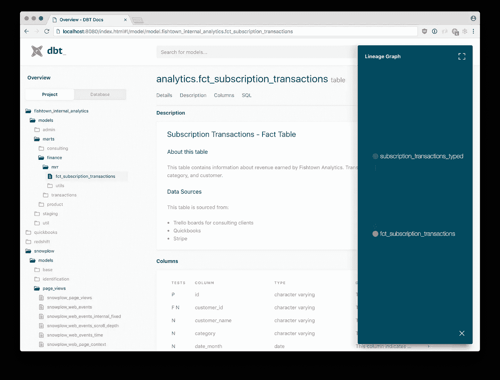

# dbt 是分析的未来吗？

> 原文：<https://towardsdatascience.com/is-dbt-the-future-of-analytics-d6ff93cbb20c?source=collection_archive---------5----------------------->

## 该工具如何改变数据分析师的工作方式

[汤姆·帕克斯](https://unsplash.com/@tomparkes?utm_source=unsplash&utm_medium=referral&utm_content=creditCopyText)在 [Unsplash](https://unsplash.com/s/photos/future?utm_source=unsplash&utm_medium=referral&utm_content=creditCopyText) 上拍照

如果你听说过一个分析工程师或者了解数据建模，那么你可能对 [dbt](https://www.getdbt.com/) 很熟悉(如果你不熟悉，在这里阅读什么是)。它现在是非常热门的工具，因为它让数据团队的生活变得更加轻松！这不正是我们都希望在工具中实现的吗？

我第一次接触 dbt 是在两年前，当时我是一名数据工程师。我不知道它是什么，也不知道如何正确使用它。我阅读了大量的文档，老实说，我仍然很困惑。直到我把这个工具付诸行动，我才真正看到它的价值。

由于我在一个工程团队，我们实际上根本不关注分析。这是一个支持我们业务财务方面的工程团队。我们使用 dbt 来编译和测试我们的 SQL 代码，使得它比我们期望使用的内部平台运行起来要快得多。

因此，虽然我已经使用 dbt 很多年了，但我从未将它用于分析目的，直到我最近的角色。我们选择将其实现到由其他新工具组成的数据堆栈中，如 [Fivetran](https://fivetran.com/) 、[雪花](https://www.snowflake.com/)和[提督](https://www.prefect.io/)。

在新的数据堆栈中一起使用这些工具，我们的数据文化已经开始转变。我们已经看到了数据质量、模型运行速度和使用文档的巨大改进。Dbt 将在分析领域长期存在，原因如下。

## 数据质量

dbt 最棒的地方在于，它消除了反复重写相同代码的需要。您可以编写一个模型，然后在其他模型中引用它。这创建了更可靠的代码，因为您在所有模型中使用了相同的逻辑。

这在分析中派上用场的方法之一是通过您公司的关键绩效指标。我们有一种方法来定义和计算它。通常，如果这个 KPI 在许多不同的模型中被不同地计算，就有很多事情出错的空间。

Dbt 通过使我们的代码模块化来提供帮助。我们可以简单地重用而不是重新编码！这不仅提高了数据质量，还为我们分析师节省了大量宝贵的时间。

dbt 提高数据质量的另一种方式是鼓励直接在源代码中进行转换和重命名。你可以在他们的文档[这里](https://discourse.getdbt.com/t/how-we-structure-our-dbt-projects/355)了解更多。但是，本质上，您在基本模型中完成了所有较小的数据“管理”任务。这些是直接从原始源表中选择的模型。

然后，您的其他模型只引用这些基础模型，而不是任何原始数据。这可以防止错误，比如意外地将日期转换为两种不同类型的时间戳(是的，我以前也遇到过这种情况)，或者给同一列取两个不同的名称。

这些类型的问题很简单，但当您深入编写数据模型时，可能是最难弄清楚的。两种不同的时间戳转换导致所有的日期在下游被不正确地连接，将模型变成了一场巨大的灾难。幸运的是，我们能够在投入生产之前发现并修复这个问题。

## 速度

如果您正在使用 dbt 之外的另一种转换工具，那么您可能理解对速度的需求。我见过运行时间超过 8 小时的数据模型！很抱歉，如果您的数据模型需要那么长时间才能运行，那么您就不可能拥有高效的分析工作流。

Dbt 使您能够将代码组织成基本数据模型和中间数据模型，从而大大加快核心数据模型的运行速度。因为您的模型也是模块化的，所以您运行它们一次，并在您的其他模型中引用它们。您不会浪费时间和资源一遍又一遍地运行相同的代码块。

Dbt 模型在使用`dbt run`命令执行时也是并行运行的。有依赖关系的模型在它们的上游模型完成之前不会运行，但是相互不依赖的模型会同时运行。这增加了吞吐量，并最大限度地减少了运行时间。

模型通过使用一种叫做“多线程”的技术并行运行。不同的模型在不同的线程上处理，允许它们一起执行。当你在你的`dbt_project.yml`文件中看到`thread: 300`时，那只是指你允许同时运行多少个模型。

## 证明文件

在分析和数据建模领域，文档是最被低估的优势之一。你的数据的有用程度取决于它被记录的程度。它不仅使新团队成员成功入职的速度提高了三倍，还让团队中的每个人对数据有了更深入的理解。

如果你正确地进行分析，你会不断地问关于你的数据的问题。当提出问题时，dbt 文档可以提供答案。即使已经在公司工作多年的人也不得不偶尔参考数据定义。数据上的数据永远不嫌多。美国数据迷喜欢一些好的元数据。

Dbt [允许](https://docs.getdbt.com/docs/building-a-dbt-project/documentation)你将模型的描述直接添加到代码中。这也使得跟踪列名和描述变得容易。这个文档被写在一个与你的模型存储目录相对应的`.yml`中。

然后，这些`.yml`文件可以用来围绕所有 dbt 文档生成一个网站。Dbt 通过向用户提供`dbt docs`命令使这变得非常容易。您只需在命令行上运行以下命令:

1.  `dbt docs generate`
2.  `dbt docs serve`

运行这两个命令后，将会填充一个本地网站供您查看。通常，您只需导航到 localhost:8080，就可以看到易读格式的文档。

dbt 实验室在 [dbt](https://docs.getdbt.com/docs/building-a-dbt-project/documentation) 上拍摄的照片

这是一个网站看起来像什么的例子。您可以在左侧看到您的项目和数据库，它们的组织方式与您在代码环境中看到的类似。当您单击一个模型时，您可以阅读描述并查看该模型中各列的信息。

dbt 文档中我最喜欢的特性可能是谱系图(也称为 [DAG](https://medium.com/geekculture/what-is-a-dag-4dc24bcf14fa) )。这类似于您在编排网站上看到的内容。它提供了一个模型之间相互依赖的很好的视觉效果。通过查看这里，您可以很容易地看到您所有的核心模型都使用了哪些基础模型和中间模型。

如果您想在您的公司内部使用该文档，我建议您将该网站托管在公司内部网站上，或者使用像 [Netlify](https://www.netlify.com/?utm_source=google&utm_medium=paid_search&utm_campaign=12755510784&adgroup=118788138897&utm_term=netlify&utm_content=kwd-371509120223&creative=516906172749&device=c&matchtype=e&location=9007390&gclid=Cj0KCQjwtrSLBhCLARIsACh6RmjoG9BdTmxFP7TTt40bg-ukkCbZzyu-h6ca7B5ZKyw5HzW-Th7m_-gaAh3tEALw_wcB) 这样的解决方案。您每月为每个用户支付 19 美元，并且您的所有数据模型都有一个很好的真实来源。

## 结论

Dbt 正在帮助公司采取下一步措施，成为数据驱动的文化。它正在改变现代数据堆栈的理念，将所有其他的转换工具打得落花流水。Dbt 将继续成为公司提高数据质量、速度和文档化的重要手段。

Dbt 不会很快消失。它是一种工具，将一直存在。我强烈建议学习它，并将其融入到您团队的数据文化中。你越早开始整合它，你就能从它身上学到越多，并允许它对你如何使用数据做出不可思议的改变。

[通过订阅我的电子邮件列表，了解更多关于 dbt 和其他流行的现代数据堆栈工具的信息](https://mailchi.mp/e04817c8e57e/learn-analytics-engineering)。