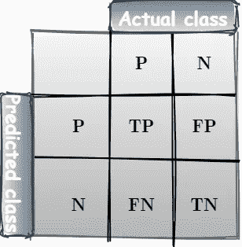
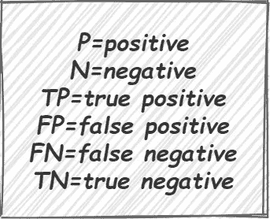
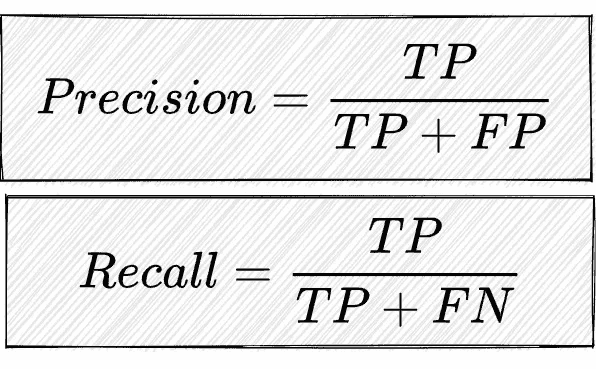
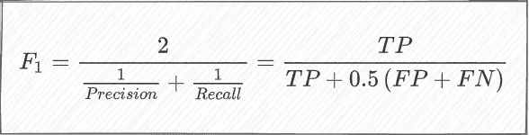
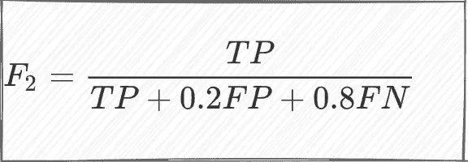
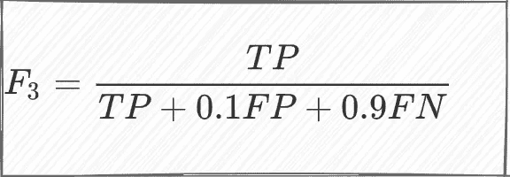
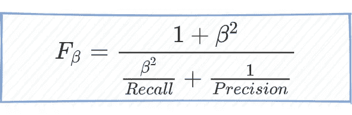

# F1 是使用的合适标准吗？F2，F3，…，Fβ呢？

> 原文：<https://towardsdatascience.com/is-f1-the-appropriate-criterion-to-use-what-about-f2-f3-f-beta-4bd8ef17e285?source=collection_archive---------6----------------------->

## 使用 F1 度量进行二元分类是非常常见的。这就是众所周知的调和平均数。然而，更通用的 F_beta 评分标准可能更好地评估模型性能。那么，F2，F3，和 F_beta 呢？在本帖中，我们将回顾 F 值。

# 介绍

许多数据科学家认为，最可靠的模型性能衡量标准是准确性。它不仅是权威的模型度量，还有许多其他的度量。周期性地，准确性可能很高，但是假阴性(将在后续中定义)也很高。另一个关键指标是目前机器学习中常见的 F-measure，用于评估模型性能。它成比例地结合了精度和召回措施。在这篇文章中，我们探索了两者不平衡的不同方法。

# 初步:混淆矩阵、精确度和回忆



困惑矩阵(图片由作者提供)

混淆矩阵总结了 ML 中监督学习算法的性能。它更有益，因为它提供了比普通精度测量更详细的分析。在混淆矩阵中，每行代表预测类中的实例，每列代表实际类中的实例。如上所述，简化的混淆矩阵包含两行和两列，其中:



缩写(图片由作者提供)

为了进一步讨论，我们还得定义两个重要的度量: **Precision** :所有 *P* 样本除以 *TP* 样本的数量(真与假)，以及 **Recall** :除以( *TP* + *FN* )的 *TP* 的数量。



精确度和召回率(图片由作者提供)

由于这两种方法都非常重要，因此需要一种方法将两者结合起来。因此，提出了精确度和召回率的调和平均值，也称为 F1 分数。

# F1 分数

该度量由下式给出:



F1 分数的主要优点(同时也是缺点)是召回率和精确度同等重要。在许多应用中，情况并非如此，应该施加一些重量来打破这种平衡假设。这种平衡假设可能适用于数据分布不均匀的情况，如大量正负数据。

# **F2 和 F3 分数**

利用加权平均，我们可以很容易地得到测度***【F2】***:


F2(图片由作者提供)



F2(图片由作者提供)

以同样的方式，获得 F3 分数:



F3(图片由作者提供)

# F_beta 分数

概括加权平均法可得出 Fβ测量值，由下式提供:



F beta(图片由作者提供)

这种方法允许我们定义召回比精确度重要多少。在 sklearn 中使用 Fβ测量非常简单，只需遵循以下示例:

[](https://scikit-learn.org/stable/modules/generated/sklearn.metrics.fbeta_score.html?highlight=f%20beta#sklearn.metrics.fbeta_score) [## sk learn . metrics . fbeta _ score-sci kit-learn 0 . 24 . 1 文档

### 编辑描述

scikit-learn.org](https://scikit-learn.org/stable/modules/generated/sklearn.metrics.fbeta_score.html?highlight=f%20beta#sklearn.metrics.fbeta_score) 

```
**>>> from** **sklearn.metrics** **import** fbeta_score
**>>>** y_true = [0, 1, 2, 0, 1, 2]
**>>>** y_pred = [0, 2, 1, 0, 0, 1]
**>>>** fbeta_score(y_true, y_pred, average='macro', beta=0.5)
0.23...
**>>>** fbeta_score(y_true, y_pred, average='micro', beta=0.5)
0.33...
**>>>** fbeta_score(y_true, y_pred, average='weighted', beta=0.5)
0.23...
**>>>** fbeta_score(y_true, y_pred, average=**None**, beta=0.5)
array([0.71..., 0\.        , 0\.        ])
```

# 摘要

在这篇文章中，我回顾了 F 值。我希望所提供的数据将帮助那些处理分类任务的人，并激励他们使用 F 值和准确度。

# 关于作者

Barak 获得了以色列理工学院的航空工程学士学位(2016 年)、硕士学位(2018 年)以及经济和管理学士学位(2016 年，成绩优异)。他曾在高通工作(2019-2020)，在那里他主要研究机器学习和信号处理算法。巴拉克目前正在海法大学攻读博士学位。他的研究兴趣包括传感器融合、导航、机器学习和估计理论。

[https://www.researchgate.net/profile/Barak-Or](https://www.researchgate.net/profile/Barak-Or)

www.barakor.com

# **延伸阅读**

[1] C.J .范·里斯贝根:[https://en.wikipedia.org/wiki/C._J._van_Rijsbergen](https://en.wikipedia.org/wiki/C._J._van_Rijsbergen)

[2] [马修斯相关系数是你从未听说过的最佳分类指标](/the-best-classification-metric-youve-never-heard-of-the-matthews-correlation-coefficient-3bf50a2f3e9a)