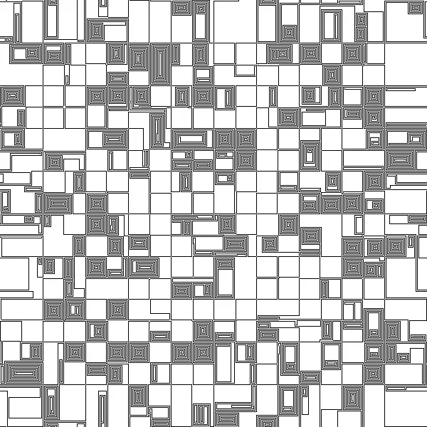

# 生成艺术适合你吗？

> 原文：<https://towardsdatascience.com/is-generative-art-for-you-b1e1499945e6?source=collection_archive---------20----------------------->

## 关于视觉生成艺术创作的起伏

作者图片

[视觉生成艺术](https://en.wikipedia.org/wiki/Generative_art#Visual_art)是视觉艺术中一个有趣的领域，它利用一个通常通过代码定义的自治系统来生成艺术作品。虽然它至少可以追溯到 20 世纪 50 年代的，但生成艺术是随着过去几十年的技术进步而获得发展的。在业余爱好艺术家中，有创造力的黑客可能对生成艺术特别感兴趣，他们想用结构化的方式艺术地表达自己，或者只是想利用他们擅长的技能创造令人愉快的图像。

我自己知道一些编程，我终于在 2020 年锁定期间开始涉足生成艺术。通过代码和迭代改进，将必要的概念阶段与实验相结合无疑是有趣的。尽管如此，生成艺术的某些方面可能会令人不快。

在这篇短文中，我将介绍生成艺术与传统艺术在创作过程中的不同之处。我希望它可以为其他考虑进入生成艺术的创意者提供指导。其中一些特征对一些艺术家来说更具吸引力。每个工具都擅长做某些事情，而不擅长做其他事情。这种“[没有免费的午餐](https://en.wikipedia.org/wiki/No_free_lunch_theorem)”式的效果当然也适用于艺术艺术媒体。我认为选择艺术媒介有两个标准:

1.  *它能让你创造你想创造的东西吗？这个问题的含义是本文的主要部分，但是当然在任何媒介中能做什么也取决于艺术家。*
2.  *你用起来好玩吗？我会涵盖我自己的观点，但也许你可以对你自己的观点做出推论。*

所以让我们直接进入生成艺术的起伏！

## 需要编码技能

对于我和这篇文章的大多数读者来说，这不是问题。如果你不知道如何编码，你可以[学习基础知识](https://designingprograms.bitbucket.io/index.html)或者尝试跟随[处理教程](https://processing.org/tutorials/)，但是要注意的是，无论哪种情况，你都将是一个缓慢的开始。

## 没有素描

对我来说，一个很大的缺点是，在进入实际编程的本质之前，你不能真正勾画出你的作品。当然，你可以在纸上草草记下一些想法，然后加以发挥，但由于你可能会将大量的复杂性和随机性打包到你的作品中，它可能根本不会与最终作品相似。

对于生殖艺术，在你能看到某些东西之前，总会有一些前期投资。你越了解你的工具，它会变得越小，但它永远不会像一个快速的铅笔素描那么小，这肯定是一个骗局。

## 以后有更多的探索空间

在构思和素描的早期阶段缺失的探索能力在生成过程的后期出现。由于您的作品是由代码定义的，并且您可以随时更改和重新运行它，因此稍后进行更改(即使是大的更改)和尝试多个版本变得非常容易。你想看看你的抽象树是否用紫色菱形而不是绿色椭圆形作为树叶的基础会更好看？没有比这更简单的了！这种混合、匹配和尝试改变而不永久删除以前版本的绝对自由，是我欣赏用代码定义艺术品的过程的一点。

## 局限于抽象

既然我们已经在谈论树了:生成艺术通常局限于抽象艺术。你可以通过使用[生成机器学习模型](https://aiartists.org/ai-generated-art-tools)来试图绕过这一点，但没有它们，生成艺术很可能无法表现真实世界，因为真实世界太复杂和多样，无法通过合理数量的代码来捕捉。(也是图像识别在深度学习之前效果不好的一个原因。)

许多艺术家喜欢抽象艺术，如果你也是其中一员，那么生成艺术可能正适合你。具体的物体、人物、故事，也许还有模仿古典艺术的方面，在生成媒介中更难实现，这可能会使它对一些人来说不那么有吸引力。

## 开发和重用工具

这一个是混合的袋子。开发自己的工具(着色器、几何对象、细分算法等)可能会很有趣，也很有挑战性，为乐趣而编码的人会喜欢开发工具，只是为了好玩。此外，在后续的部分中重用您创建的工具确实是值得的，并且它肯定会增强您的过程。(也许你甚至可以通过工具箱来构建自己独特的风格？)

不利的一面是，如果你只是想继续创作你脑海中的东西，或者尝试一些特定的着色或绘图方式，那么开发或找到超越基础的工具的需求可能会是一种令人沮丧的体验。

## 复杂性、随机性和惊喜

这就是生成艺术大放异彩的地方。通过编程，我们可以在几分之一秒内创造出手工无法想象的复杂图案。只看[分形](https://en.wikipedia.org/wiki/Fractal)！借助随机数生成器这个强大的工具，我们可以创造出这种图案的几乎无限的变化，还可以给纹理和几何图形添加一些噪声，让作品[看起来更“自然”](https://tylerxhobbs.com/essays/2015/creating-soft-textures-generatively)，如果我们愿意的话。

最棒的是，你永远无法确定结果，更多的时候，你会感到惊讶。(除了随机性带来的惊喜之外，您自己的编码错误也会产生有趣的结果。)使用随机性的一个缺点是失去完全的控制，而对于许多创作型艺术家来说，随机性是不可替代的。你无法精确定义你的作品，也无法享受随机性的好处。

如果你想创造错综复杂的作品，并喜欢通过任意数量的变化，找到一个真正脱颖而出，那么不要再等了！

## 不直接

对我来说，这可能是最大的挫折:在你的工作和结果之间总是有延迟。这个相位并不限制*你能创造什么*，但是它很大程度上影响了*创造的感觉*。当你用更传统的媒介绘画时，你会得到即时的反馈。一旦你的铅笔接触到纸，你就会看到正在发生的事情，你知道你要去哪里，这本身就使这个过程变得愉快，有时几乎是冥想。如果你为你的作品编程，你只有在实现了改变并运行了代码之后才能看到结果——众所周知，这有时会比预期的要长。

就我个人而言，我喜欢我在生成艺术方面的尝试，尽管有时传统媒体对我来说可能更有趣。我试图写下生成艺术的特质是如何影响创作过程的，但请不要将此解读为这种媒介的绝对限制——艺术总是会找到自己的路。

我希望这篇文章能帮助你评估创造艺术是否适合你。如果还不确定，就试试吧！也许最简单的方法是从[处理](https://processing.org/)开始，即使你不是一个有经验的程序员，也能很快上手。

希望你学到了有用的东西！