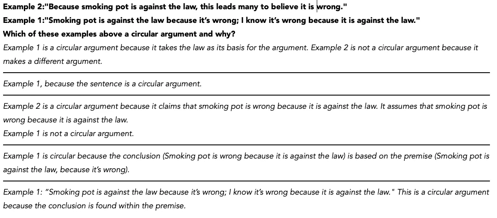
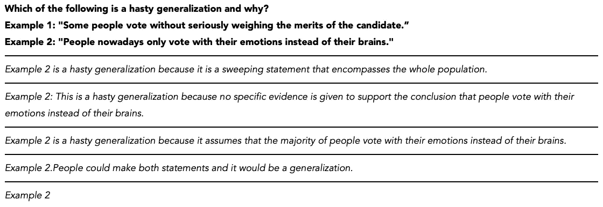
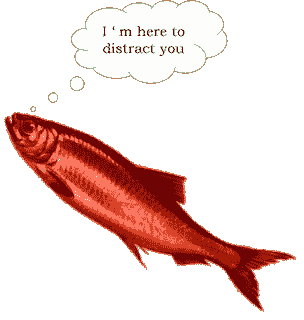
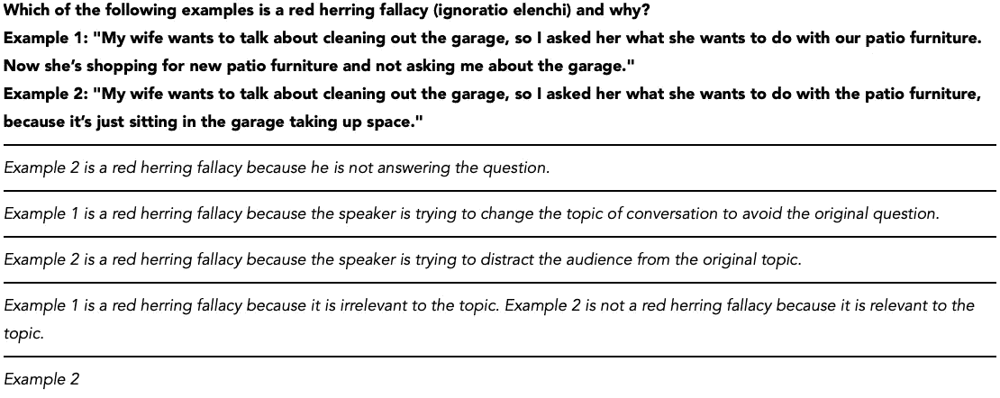
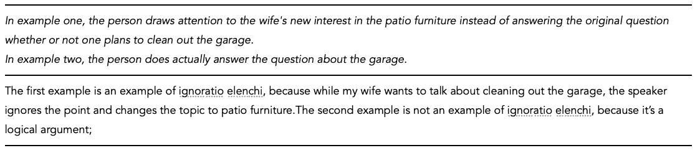

# GPT-3 足够“合理”来检测逻辑谬误吗？

> 原文：<https://towardsdatascience.com/is-gpt-3-reasonable-enough-to-detect-logical-fallacies-3c3dc4b7fda1?source=collection_archive---------22----------------------->

## 通过常见的逻辑谬误探索 GPT-3 的推理能力

2020 年 5 月，OpenAI 研究团队在[论文](https://arxiv.org/abs/2005.14165)“语言模型是很少出手的学习者”中介绍了他们名为 GPT-3 的新语言模型。2020 年 6 月 11 日，OpenAI 发布了一个 [API](https://beta.openai.com/) ，供一些 beta 用户测试和开发基于 GPT 3 的应用。从那以后，在 GPT-3 演示上有数百条带有#gpt3 标签的推文和许多关于用户体验的博客帖子。使用 GPT-3 可以生成各种类型的应用程序，其中一些是[上下文分析](https://delian.substack.com/p/quick-thoughts-on-gpt3)，写[诗](https://arr.am/2020/07/14/elon-musk-by-dr-seuss-gpt-3/)，[博文](https://maraoz.com/2020/07/18/openai-gpt3/)，[创意小说](https://www.gwern.net/GPT-3)，[代码](https://twitter.com/sharifshameem/status/1282676454690451457)，[总结文本](https://openai.com/blog/learning-to-summarize-with-human-feedback/)等。你可以查看[链接](https://machinelearningknowledge.ai/openai-gpt-3-demos-to-convince-you-that-ai-threat-is-real-or-is-it)找到不同的 GPT-3 演示。

图片来自 [Pixabay](https://pixabay.com/?utm_source=link-attribution&utm_medium=referral&utm_campaign=image&utm_content=4430786) 的 [Gerd Altmann](https://pixabay.com/users/geralt-9301/?utm_source=link-attribution&utm_medium=referral&utm_campaign=image&utm_content=4430786)

我有机会接触 GPT-3 API 并探索它的能力。在其他的 GPT-3 演示中，我还没有遇到任何演示涉及到 GPT-3 检测逻辑谬误的能力。逻辑谬误是推理中的错误，它会损害论点的逻辑性。

> 谬误通常分为正式的和非正式的。一个[形式谬误](https://en.wikipedia.org/wiki/Formal_fallacy)可以在一个标准的逻辑系统中简洁地表达出来，比如[命题逻辑](https://en.wikipedia.org/wiki/Propositional_calculus)，而一个[非形式谬误](https://en.wikipedia.org/wiki/Informal_fallacy)来源于推理中的一个错误，而不是一个不恰当的[逻辑形式](https://en.wikipedia.org/wiki/Logical_form)。包含非正式谬误的论点可能在形式上[有效](https://en.wikipedia.org/wiki/Validity_(logic))，但仍然是谬误的[ [wiki](https://en.wikipedia.org/wiki/Fallacy#Informal_fallacy) ]。

在这篇文章中，我们将探索 GPT-3 的有效性，以识别一些常见的非正式谬误，这些谬误迎合了对 GPT-3 推理能力的理解。在下文中，我将尝试阐明 GPT-3 模型的关键细节，然后我将通过 OpenAI API 的操场向 GPT-3 询问一些关于常见逻辑谬误的例子。

## **什么是 GPT-3？**

GPT-3 代表第三代生成式预训练变压器，有八种尺寸[ [纸张](https://arxiv.org/abs/2005.14165) ]。最大的模型包括 1750 亿个参数，将 GPT-3 的前身 GPT-2 的能力扩大了两个数量级。所有 GPT-3 模型都使用基于变压器的神经网络，正如它们的前身(流行的 NLP 模型 [BERT](https://arxiv.org/pdf/1810.04805.pdf) 也使用变压器)，但具有更多、更宽的层和更多的数据(最大的模型有 96 个注意力层，每个都有 96×128 维的头)。GPT-3 175B 在一个未标记的文本数据集上进行训练，该数据集几乎包含了互联网上存在的所有内容，具有来自多个来源的 4990 亿个标记，包括维基百科(3%)、书籍(16%)和[普通爬行](https://commoncrawl.org/) (60%)等。GPT-3 的巨大体积使得它的训练过于昂贵。使用 Tesla V100 云实例(使用 Lambda GPU 实例)，预计成本超过 460 万美元。

GPT-3 是一种具有深度神经网络的语言模型，它只是试图从以前给定的单词中预测下一个单词。语言模型选择使句子在文献中更有可能出现的下一个单词。比如说；“我为鳄梨酱买了鳄梨”这句话比“我为鳄梨酱买了巧克力”更有可能在网络上存在。

> [***普通爬虫***](https://commoncrawl.org/) 语料库包含了 8 年来收集的数 Pb 的网络爬虫数据。该语料库包含原始网页数据、元数据摘录和经过轻度过滤的文本摘录。

GPT-3 不同于其他语言模型的神奇之处在于，它可以在不需要任何微调的情况下完成特定的任务。其他流行的语言模型，如 BERT，需要大量特定于任务的数据集来进行训练，如翻译或摘要任务。这些要求使得获取数据很麻烦，并导致在其他任务中表现不佳。相反，我们可以用语言模型的方式，简单地提示，通过任务的公式化来指导 GPT-3。您可以在以下参考资料中找到有关 GPT-3 的更多详细信息。

[OpenAI 的 GPT-3 语言模型:技术概述](https://lambdalabs.com/blog/demystifying-gpt-3/#3)

[GPT-2 的建筑细节](https://openai.com/blog/better-language-models/)

[Yannic kil cher 对论文的详细检查](https://www.youtube.com/watch?v=SY5PvZrJhLE)

## GPT 3 号游乐场

如上所述，GPT-3 不需要任何微调，我们只是告诉模型我们想做什么，模型尽最大努力遵循我们的指示。GPT-3 是一个随机模型(并不总是返回相同的响应)，然而，我们可以通过操场上定义的一些参数来控制随机性。比如说；介于 0 和 1 之间的称为温度的参数控制随机性，低值导致确定性结果。另一个是频率惩罚，控制模型谈论新话题的可能性。我在实验中使用了 OpenAI 提供的操场上的默认值，即温度为 0.7。

我提供了 5 次相同的提示来处理随机性。在下一节中，我们将检查 GPT-3 对一些常见谬误的回应。

我相信逻辑谬误代表了一个非常有趣的框架来理解 GPT-3 的推理能力。我参考了 TBS 工作人员的[文章](https://thebestschools.org/magazine/15-logical-fallacies-know/)“进入辩论前你应该知道的 15 个逻辑谬误”，找到了我为实验挑选的 4 个常见谬误。你可以在这篇文章中找到更多关于谬误的信息。

[***雅典学派***](https://en.wikipedia.org/wiki/The_School_of_Athens) 意大利文艺复兴[艺术家](https://en.wikipedia.org/wiki/Italian_Renaissance)[拉斐尔](https://en.wikipedia.org/wiki/Raphael)

**实验 1:Ad homine 谬论**

> Ad hominem 是一种侮辱，好像它是支持一个结论的论据或证据。

粗体句子是提示性的，每个斜体句子由一条线隔开，以表示不同的尝试是 GPT-3 的响应

人身攻击谬误和 GPT 三号协议的回应

在所有的 5 次尝试中，GPT-3 都找到了正确的例子，认为是针对个人的谬误，我认为 GPT-3 的解释也是令人满意的。

Ad Hominem 谬误演示

值得一提的是，我并没有在提示中提供任何例子来引导 GPT-3 的话题，而是我直接问了 GPT-3。在他们的论文中，作者提到，如果用户在询问或请求某事之前在提示中提供一些任务示例，结果的准确性会增加。

**实验二:循环论证(小原理)**

如果一个主张是用它自己的结论作为它的建议，反之亦然，以“如果 A 是真的，因为 B 是真的；b 为真是因为 A 为真”，那么就叫循环论证。我想说这很容易察觉。让我们看看 GPT 3 号表现如何。这一次，我改变了示例的顺序以混淆模型。

GPT-3 的循环自变量检测

GPT-3 在 80%的尝试中找到了正确答案。出于好奇，我将温度降至 0.2(减少响应的随机性)，GPT-3 这次找到了 100%正确的选项。所以，温度真的会影响 GPT 3 号的反应以及最终结果的正确性。

**实验三:草率概括**

草率概括谬误可能是最常见的谬误之一，它依赖于一个很少证据支持的主张。

**GPT-3 的草率概括表现**

这一次，GPT 3 号在所有五次尝试中都找到了正确答案。我不得不承认，草率的概括可能是 GPT-3 最容易发现的，因为它可以区分限定词，如“一些”、“可能”、“经常”等。避免草率概括。

**实验四:红鲱鱼谬误(ignore ratio elenchi)**

> “红鲱鱼谬误”是一种转移注意力的论点，通常带有一些看似相关但实际上不切题的情绪。当有人不喜欢当前的话题，想转到其他更容易或更安全的话题时，这种策略很常见。

我认为红鲱鱼谬误是对 GPT-3 最具挑战性的谬误(我猜对其他人也是如此)，因为不同的主题如何介入可能并不明显。

GPT-3 的红鲱鱼谬误(温度=0.7)

正确答案应该是第一个例子，一个人试图改变话题(转移对方的注意力)以逃避清理车库。GPT-3 在这项任务中表现更差，它只能在两次尝试中找到正确答案。有趣的是，当我将温度提高到 1.0 时，我能够收到相当合理的响应。不是在所有的尝试，但 GPT-3 能够找到正确的结果，并解释“合理”。

GPT-3 的红鲱鱼谬误(温度=1.0)

**结论**

在前三个实验中，GPT-3 的反应是很容易理解的。最后一个实验对 GPT 3 号来说是具有挑战性的，反应并不令人满意，然而，当我提高温度时，GPT 3 号仍然能够产生“合理的”输出。

很难回答这种“合理性”从何而来。它是基于 175B 参数(如模糊查找表)压缩的互联网上的所有数据生成的，还是基于语言中语义结构的解释或除此之外的其他东西生成的？有一点是肯定的，在接下来的几年里，算法、计算能力甚至数据方面的增强将继续让我们感到惊讶。

检测逻辑谬误的一个可能应用是将其用作辨别假新闻的过滤器。例如，应用程序可以识别给定新闻中有缺陷的推理、不合逻辑的论点或缺乏证据，并对它们进行过滤。