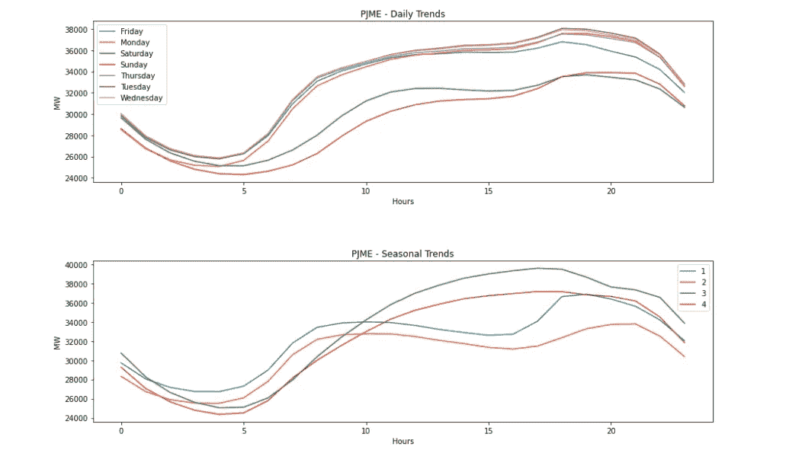
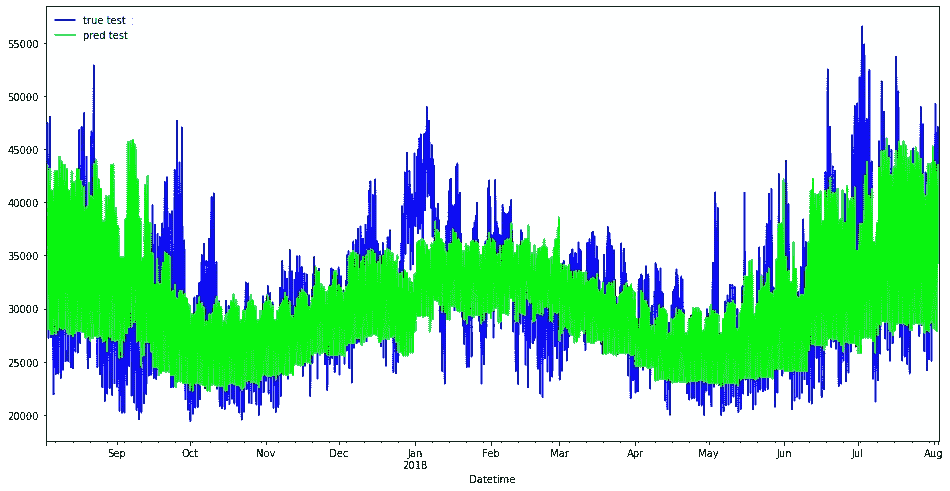
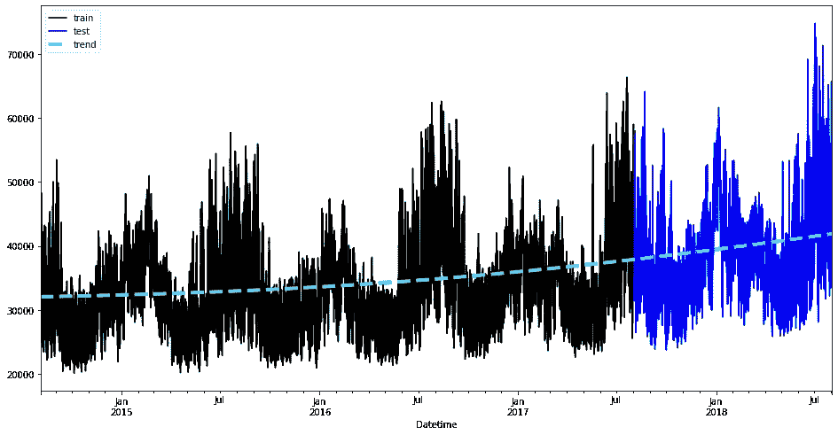
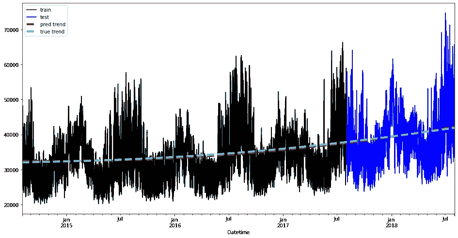
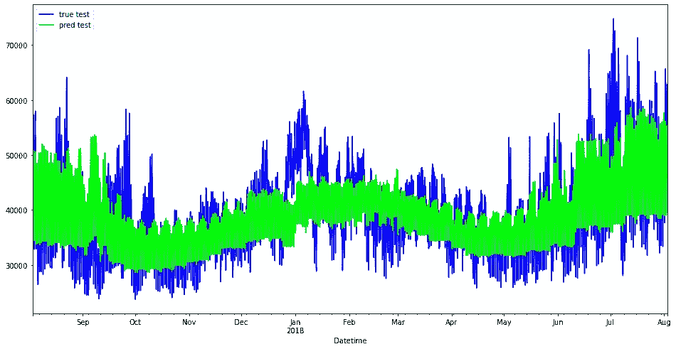

# 梯度推进作为时间序列预测的预言者好吗？

> 原文：<https://towardsdatascience.com/is-gradient-boosting-good-as-prophet-for-time-series-forecasting-3dcbfd03775e?source=collection_archive---------6----------------------->

## 如何使用 Sklearn 模型进行多季节长期预测

马克·巴萨拉布在 [Unsplash](https://unsplash.com?utm_source=medium&utm_medium=referral) 上的照片

近年来，我们协助提出各种时间序列预测架构。最著名的是 Prophet，这是一种由脸书发布的算法，基于加法方法预测具有多重复杂季节性的时间序列。随着它的发布，时间序列预测的新时代开始了。由于其可用性和对各种情况的适应性，Prophet 最近成为更经典的 SARIMA 的一个有价值的替代品，以提供长期预测。

随着 Prophet 在数据科学界的成功，**大型科技公司开始发布用于时间序列预测的开源工具**。所有这些类型的框架都宣称使用可伸缩的和直观的 API 以快速有效的方式(包括自动调整)提供准确的预测。考虑到这些前提，如今执行时间序列预测任务似乎比以往任何时候都容易。

我们知道所有这些开源库的力量。然而，我们意识到，它们的有效性因研究案例而异。**测试一个更标准的预测管道在很多情况下可能是有益的**，以评估提供最准确预测的最佳工具。

在这篇文章中，我们执行了一个简单的时间序列预测任务。我们的目标是对具有多种季节性模式的系列进行长期的每小时预测。**我们尝试将 Prophet 与简单特征工程制作的标准管道和梯度推进模型**进行比较。当预测非平稳序列时，我们重复实验，在原始序列上引入趋势分量来评估该过程。

# 数据

我们从 Kaggle 收集了一个数据集。[每小时能耗](https://www.kaggle.com/robikscube/hourly-energy-consumption)顾名思义，以兆瓦为单位存储美国不同地区不同年份的每小时能耗。

对于我们的分析，我们选择了一个单一地区的消费，在此基础上我们开发了我们的预测模型。所有 KPI 都是固定的，并根据日常和季节性行为显示多个季节性模式。

数据中呈现的季节模式(图片由作者提供)

# 模拟多重季节性

作为第一阶段，我们用 Prophet 和梯度推进对原始时间序列进行建模。我们使用最近一年的可用数据来测试性能，并从剩余的数据中连续 3 年进行训练。

原始时间序列被分割成训练和测试(图片由作者提供)

拟合先知很简单。不需要预处理，因为它声明对异常值、缺失数据和变化点是健壮的。它不需要任何手动操作，因为默认情况下会自动检测季节性模式。鉴于这些前提，为我们的时间序列提前一年提供预测对 Prophet 来说似乎是一件容易的事情。

预言家对测试数据的预测(图片由作者提供)

预测显示了强烈的每日和每周季节性。Prophet 还可以检测到以夏季和冬季能源消耗增加为特征的长期季节性。通过 Prophet 获得的预测似乎是合理的。它们概述了能源消耗的基本行为，肯定会产生重大影响。

我们要测试的下一个模型是 sklearn 库中的梯度增强。我们习惯于将梯度推进视为表格数据的算法。将它应用于时间序列预测是非常容易的。我们只需要提供足够的功能。我们的预测器必须在未来的任何时候都可以访问，因为我们正在进行长期预测，我们希望不要造成泄漏。

为此，我们创建了一些对时间变量进行循环编码的基本特性。这种方法非常灵活，允许我们简单地应用傅立叶变换，以数字格式合并多个时间回归量。此外，我们意识到，在任何未来的上下文中，同样的特征是容易检索的。在我们的例子中，我们对小时、星期、月份、星期和季节进行循环编码。参数的调整总是可以用标准技术来实现。

正如预言家所说，梯度推进充分再现了季节模式。最大的区别在于预测误差。与 Prophet 相比，梯度增强在测试数据上达到非常低的误差(计算为均方根误差)。

对测试数据的梯度推进预测(图片由作者提供)

# 用趋势模拟多重季节性

梯度增强只需使用正弦特征就能很好地处理这类数据。为了使事情更准确，我们在原始时间序列上引入一个增长趋势，并尝试再次预测。

原始时间序列加趋势(图片由作者提供)

处理非平稳时间序列是现实应用中的常见做法。默认情况下，Prophet 声明处理输入序列中的趋势行为。和以前一样，我们需要做的只是提供一个时间序列，以适合适当的格式。

预言家对测试数据的预测(图片由作者提供)

对测试数据的预测与没有趋势的情况非常相似，但是测试数据的误差急剧增加。

在梯度推进的情况下，目标的不稳定特性可能会造成困难。因此，作为第一步，我们建立一个简单的线性回归(总是基于训练数据)来模拟趋势模式。从训练数据中减去预测的趋势(以使它们稳定)，然后在预测时再次相加。

关于培训和测试的趋势预测(图片由作者提供)

在从训练中减去预测的趋势之后，如前所述进行具有梯度增强的建模。最终预测遵循再现季节性模式的趋势。与 Prophet 相比，测试误差再次非常低。

对测试数据的梯度推进预测(图片由作者提供)

# 摘要

在这篇文章中，我们进行了一项长期预测的时间序列预测任务。我们测试了 Prophet 对更经典的管道的预测能力，该管道由时间变量的循环编码和梯度推进建模组成。我们发现，**对于我们的用例，梯度提升在测试误差方面压倒性地优于 Prophet】。由于拟建管道的适应性，它可能被视为一个良好的基线。可以使用每个标准的机器学习算法来代替梯度提升，并且可以集成每个其他的预测器。同时，我们知道 Prophet 是一个很好的框架，有效性取决于研究的案例。**

[查看我的 GITHUB 回购 ](https://github.com/cerlymarco/MEDIUM_NoteBook)

保持联系: [Linkedin](https://www.linkedin.com/in/marco-cerliani-b0bba714b/)