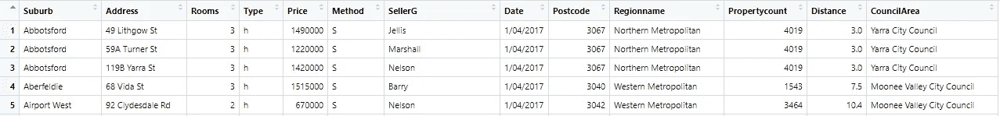
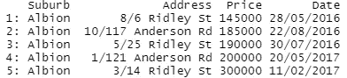
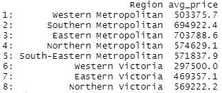
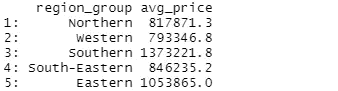

# 在数据角力上是只有我还是 R 打败了 Python？

> 原文：<https://towardsdatascience.com/is-it-just-me-or-r-beats-python-in-data-wrangling-86e5ac54c18a?source=collection_archive---------16----------------------->

## R 如何简化数据争论操作


拉尔夫·卡蒂布在 [Unsplash](https://unsplash.com/s/photos/superior?utm_source=unsplash&utm_medium=referral&utm_content=creditCopyText) 上的照片

我是一名自学成才的数据科学家，花了近两年时间改变职业，在数据科学领域找到了一份工作。我用 Python 开始了我的旅程，对此我很高兴。

Python 有许多吸引有抱负的数据科学家的优势。加速和简化数据争论任务的丰富的第三方库只是其中之一。

我一直是 Python 数据科学生态系统的忠实粉丝。除了 Python，前阵子开始用 R 包。现在，我感觉 R 在数据角力上打败了 Python。

在本文中，我们将通过几个例子来演示 R 包如何简单无缝地执行典型的数据争论任务。我们将使用的包是数据表和字符串。

我们从导入包开始。如果您是第一次使用这些库，您需要先安装它们。值得一提的是，我使用 RStudio 作为 IDE。

```
# install
install.packages("data.table")
install.packages("stringr")# import
library(data.table)
library(stringr)
```

这里的“节拍”是什么意思，取决于你的预期。作为一个一直专门使用 Python 库的人，切换到 R 感觉更简洁地执行任务。

事不宜迟，让我们从例子开始。我们将使用 Kaggle 上的墨尔本房产[数据集](https://www.kaggle.com/dansbecker/melbourne-housing-snapshot)作为例子。fread 函数可用于通过读取 csv 文件来创建数据表。

```
melb <- fread(file_path)
```

文件路径取决于数据集在计算机中的位置。



前 5 行(作者图片)

对于每个例子，我将首先定义一个任务，然后提供解决方案。

任务:找到阿尔比恩房屋的地址、价格和日期。然后，按价格升序和日期降序对结果进行排序。

```
melb[Suburb == "Albion", 
     .(Suburb, Address, Price, Date)][order(Price, -Date)]
```



(图片由作者提供)

我们首先应用过滤器，然后指定要选择的列。对结果进行排序非常简单。order 函数与列名一起使用。减号表示按降序排序。

**任务**:根据指示更改以下各列的名称:

*   区域名称到区域
*   SellerG 至卖方

```
setnames(melb, c("Regionname", "SellerG"), c("Region", "Seller"))
```

我们传递给 setnames 函数的第一个参数是表的名称。第二个和第三个参数分别是保存当前名称和新名称的因子。

**任务**:删除价格列中缺少值的行。

处理缺失值是数据争论过程中经常进行的操作。数据表包允许通过“is.na”功能消除缺失值。

```
melb <- melb[!is.na(Price)]
```

我们使用 is.na 函数的输出作为过滤的条件。“！”意思是“不”。因此，我们只取价格不为空的行。

**任务**:计算“u”类房屋在各区域的平均房价。

```
melb[Type == "u", .(avg_price = mean(Price)), by = "Region"]
```



(图片由作者提供)

第一部分是我们之前做过的过滤。第二部分是我们做列操作的地方。我们取价格列的平均值，并指定一个新的名称。最后一部分用于对行进行分组。

数据表包提供了操作顺序，用逗号分隔在方括号中。这样的标准更容易学习和执行复杂的操作。

**任务:**在前面的例子中，我们已经计算了每个地区的平均价格。假设我们想在更一般的层面上比较房价。例如，我们可以比较西部、北部和东部。

我们可以通过提取 region 列中的第一个单词来创建一个新列，并将其命名为 region group。然后，我们可以很容易地计算出每个群体的平均房价。

```
melb[, region_group := str_split_fixed(Region, " ", 2)[,1]][, .(avg_price = mean(Price)), by = "region_group"]
```



(图片由作者提供)

我们已经使用了 stringr 包中的 str_split_fixed 函数。拆分后的“[，1]”表达式表示我们想得到拆分后的第一部分。这个提取的部分被分配给一个名为“region_group”的新列。剩下的部分计算每组的平均价格。

## 结论

我们已经做了几个例子来演示如何用 R 包完成典型的数据争论任务。当然，R 提供了更复杂的操作。

我最喜欢 R 包的地方是它如何将多个小操作合并成一个简洁标准的操作。只用一行代码，我们就可以用 R 包完成很多事情。

本文的目标不是宣称 R 在数据科学库方面优于 Python。我只是想强调，对于数据争论任务，我更喜欢 R 而不是 Python。

感谢您的阅读。如果您有任何反馈，请告诉我。